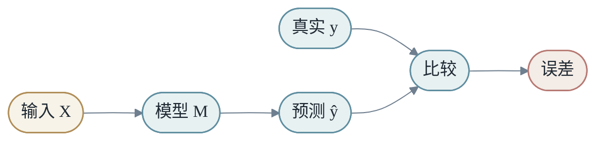
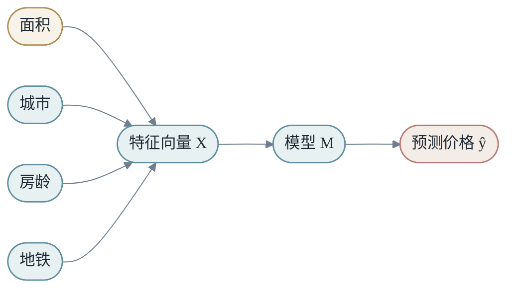
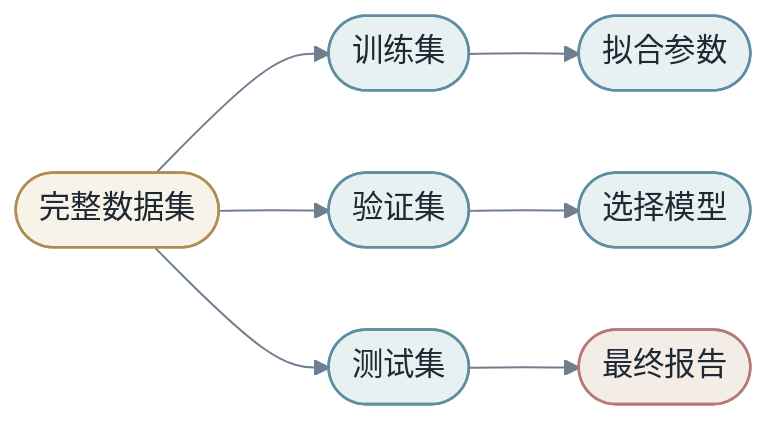
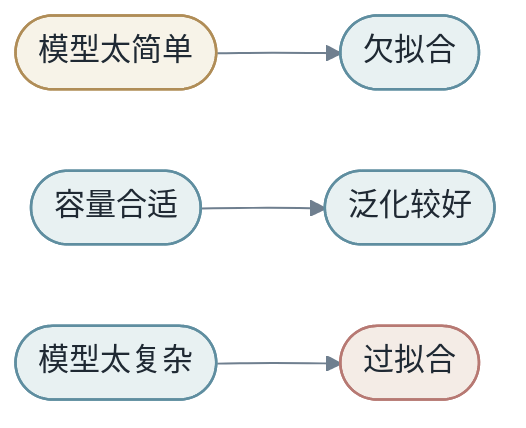
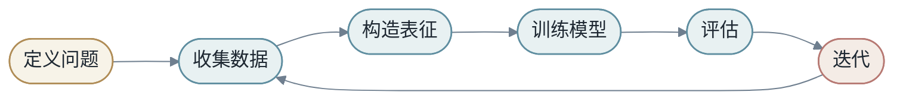
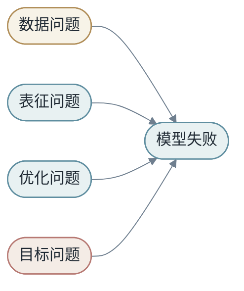

<h1 align="center">第一章：学习的本质</h1>

本章的目标，是让读者先拥有一个统一的世界观：机器学习不是一堆算法名字，而是在有限数据中寻找一个能够泛化的变换。

全书的最小表达是：

$$
X \xrightarrow{M} Y
$$

这里的 `X` 是输入，`Y` 是目标，`M` 是模型。机器学习的核心问题，是如何从样本中找到一个足够好的 `M`。后面 7 章会反复回到这条主线：第 2 章问 `M` 是什么，第 3 章问 `X` 怎么构造，第 4 章问 `M_θ` 怎么被学习出来，第 5、6 章问当 `M` 变得很深很大时会发生什么，第 7 章问怎么把它放进真实计算系统，第 8 章再把所有这些重新接回 `X → Y by M`。

<h2 align="center">第1节：从 X 到 Y</h2>

如果把机器学习压缩成一句话，它不是"让机器像人一样思考"，而是：

> 从数据中学习一个变换，使输入 X 能够产生目标 Y。

房价预测是一个变换：

```text
房屋特征 -> 价格
```

图像分类是一个变换：

```text
图片像素 -> 类别
```

语言模型也是一个变换：

```text
历史 token -> 下一个 token 的概率分布
```

它们的表面形式不同，但都可以写成：

$$
ŷ = M(x)
$$

真实答案是 `y`，模型预测是 `ŷ`。训练的目标，是让 `ŷ` 尽可能接近 `y`。



### 1.1 学习不是记忆答案表

假设训练集中有很多样本：

$$
D = \{(x_1,y_1),(x_2,y_2),\dots,(x_N,y_N)\}
$$

最笨的模型可以把每个 $x_i$ 和 $y_i$ 记下来。训练集上它可能完美，但遇到新样本就不知道怎么办。

真正的学习要求模型能处理没见过的输入：

$$
x_{new} \notin \{x_1,x_2,\dots,x_N\}
$$

这叫泛化。泛化是机器学习中最重要也最困难的问题，整本书都会围绕它展开。

### 1.2 传统编程和机器学习

传统编程里，人写规则：

```text
输入 + 人写的规则 -> 输出
```

机器学习里，人提供样本和学习方式：

```text
输入 + 输出样本 -> 学到规则
```

学到规则之后，再用于新输入：

```text
新输入 + 学到的模型 -> 新输出
```

这不是"机器突然自己懂了"，而是规则的来源发生了改变。规则不再完全由人手写，而是由模型在数据中拟合出来。

需要强调的是：传统编程和机器学习不是二选一。真实系统经常把两者混合。规则适合那些边界清楚、错误代价高的部分（例如权限校验、金额计算）；机器学习适合那些规则难以穷举但有数据反馈的部分（例如意图识别、推荐排序）。第 8 章会回到这条边界。

### 1.3 一个完整小例子：预测房价

假设我们要预测房价。输入 `X` 可以包含：

```text
面积、城市、地段、房龄、楼层、是否靠近地铁
```

输出 `Y` 是价格。模型 `M` 是从这些特征到价格的映射。



如果我们手写规则，可能写成：

```text
价格 = 面积 * 每平米均价 + 地铁加成 - 房龄折扣
```

这是一种人工模型。机器学习则让模型从历史成交数据中自己找到权重。

这个例子看似简单，却包含机器学习的全部要素：输入、输出、模型、数据、损失、优化、泛化。

### 1.4 什么叫"学到了"

如果模型只是记住某套房子的成交价，它没有真正学到房价规律。只有当它遇到一套没见过的房子，仍然能给出合理估价，我们才说它学到了某种结构。

这个结构不一定是人能完全说清楚的规则。它可能是许多弱信号的组合：地段、面积、交通、楼龄、周边学校、市场周期。机器学习擅长从大量样本中拟合这些组合关系。后面会看到，深度学习的中间层就是在自动构造这种"组合关系"的几何空间。

<h2 align="center">第2节：数据、样本和分布</h2>

训练集只是现实世界的一个采样。

我们真正关心的是一个未知分布：

$$
(x,y) \sim P_{data}
$$

但我们手里只有有限样本：

$$
D = \{(x_i,y_i)\}_{i=1}^{N}
$$

机器学习的根本张力在这里：我们用有限样本训练，却希望模型在整个分布上有效。


### 2.1 经验风险和真实风险

训练时我们能计算的是经验风险：

$$
R_{emp}(M)=\frac{1}{N}\sum_{i=1}^{N}L(M(x_i),y_i)
$$

真正想降低的是真实风险：

$$
R(M)=E_{(x,y)\sim P_{data}}[L(M(x),y)]
$$

经验风险可以直接算，真实风险不能直接算。训练集表现好，只说明经验风险低；模型是否真的好，还要看它在新数据上的表现。

后面我们会看到，整个学习理论都在研究"经验风险低能不能保证真实风险低"，以及在什么条件下能保证。

### 2.2 训练集不是世界本身

如果训练集只包含白天的道路图像，自动驾驶模型可能在夜晚表现很差。如果语音识别训练集中缺少某种口音，它就可能对那类用户不公平。如果语言模型的训练数据偏向某些领域，它的知识和表达也会偏向那些领域。

数据不是中性的。数据决定模型看见什么，也决定模型没看见什么。这一点对后面所有章节都成立：feature 设计不到位，模型再大也看不见关键信号；评估集不全面，再高的离线指标也可能在线翻车。

### 2.3 训练集、验证集和测试集

为了估计泛化能力，我们通常把数据拆成三部分：

- 训练集：用于更新模型参数。
- 验证集：用于选择模型和调超参数。
- 测试集：用于最终评估，尽量模拟未见数据。



如果测试集被反复用于调参，它就不再是干净测试集，而会逐渐变成另一个验证集。很多看似优秀的结果，其实是对 benchmark 的过拟合。这条规则看似洁癖，但它是机器学习"科学方法"的底线——没有不被污染的评估面，就无法判断模型是否真的泛化。

### 2.4 数据分布会变化

现实世界不是静止的。用户行为会变，市场会变，语言会变，攻击方式会变，设备会变。

训练时的数据分布和上线后的数据分布不同，叫 distribution shift。它会让原本表现良好的模型变差。

比如疫情前训练的出行需求模型，可能无法直接适应疫情期间的行为模式。一个只在英文数据上训练的模型，也不一定能自然处理低资源语言。

distribution shift 不一定是坏事——世界本来会变化。关键是系统能否发现变化，并决定是重训、调阈值、改特征还是改产品策略。第 7 章会展开"数据漂移监控"，第 8 章会展开"反馈闭环"。

<h2 align="center">第3节：泛化，机器学习的核心承诺</h2>

泛化可以理解为：模型没有停留在样本表面，而是学到了某种可迁移结构。

一个只记住训练样本的模型，是把世界看成一张表。一个能泛化的模型，是把世界看成有规律的空间。

### 3.1 偏差与方差

模型太简单，可能欠拟合。它连训练集都学不好，这通常是偏差太高。

模型太灵活，可能过拟合。它把训练集里的偶然噪声也学进去，这通常是方差太高。



深度学习有趣的地方在于，它经常使用非常大的模型，却仍然可以在足够数据、正则化和优化条件下泛化。这个现象超出了许多传统直觉，也是现代学习理论仍在研究的问题。第 5 章 §13 会回到"过参数化下的泛化"，给出更精细的讨论。

### 3.2 欠拟合与过拟合的可观察信号

如果训练集和验证集表现都差，通常是欠拟合。模型太弱、feature 不足、训练不够、优化有问题，都可能造成欠拟合。

如果训练集表现很好，验证集表现差，通常是过拟合。模型记住了训练集细节，却没有学到可迁移结构。

```text
训练差 + 验证差 -> 欠拟合
训练好 + 验证差 -> 过拟合
训练好 + 验证好 -> 泛化较好
```

第 4 章 §9 会把这条诊断扩展成完整的训练调试清单。

### 3.3 泛化来自哪里

泛化可能来自多个来源：

- 数据覆盖了真实世界中的关键变化。
- 模型结构和任务结构匹配。
- Loss 引导模型学习有用规律。
- 优化过程偏向更简单或更稳定的解。
- 正则化限制模型过度记忆。

这也是为什么机器学习不是只换一个更大的模型就结束。数据、结构、目标和优化共同决定泛化。这五个来源贯穿后续章节：第 3 章讲数据和表征，第 5 章讲模型结构，第 4 章讲 loss 和优化与正则化。

### 3.4 泛化失败的几种形态

值得在这里就把泛化失败的几种形态摆出来，后面遇到具体技术时就能对号入座。

第一，**模型学到了噪声**。训练集中偶然出现的模式，被模型当成规律。

第二，**模型学到了捷径**。例如图像分类模型不是识别动物，而是识别背景水印；文本分类模型不是理解语义，而是记住某些模板词。第 3 章 §15 和第 5 章末会回到"捷径学习"。

第三，**训练分布和测试分布不同**。过去的数据不能代表未来，某个地区的数据不能代表另一个地区，某类用户的数据不能代表所有用户。

第四，**评估集被污染**。测试集被反复使用后，模型和研究者都会逐渐适应它，最终测试集不再代表未知数据。

这四种形态在第 4 章错误分析、第 8 章端到端复盘里会反复出现。

<h2 align="center">第4节：端到端学习的第一层含义</h2>

端到端学习不是说系统没有中间过程，而是说中间过程可以被共同学习。

传统系统可能是：

```text
图片 -> 手工边缘 -> 手工纹理 -> 手工形状 -> 分类器 -> 类别
```

端到端模型更像是：

```text
图片 -> 可学习的多层变换 -> 类别
```

中间层仍然存在，只是它们不再完全由人手工定义，而是在训练目标下自动形成。


### 4.1 端到端的收益

端到端学习最大的收益，是减少人工中间目标和最终目标之间的错位。

如果我们手工设计"边缘""纹理""形状"，这些中间特征未必正好服务于最终分类。端到端训练让模型直接围绕最终 loss 调整中间表示。

举一个反面例子：早期语音识别系统会把"声学特征提取""音素识别""语言模型"分成几个独立训练的模块。每个模块都在它自己的子目标上达到很好，但拼起来不一定就让最终词错率最低。深度学习时代的端到端语音识别让声学特征和语言模型在同一个 loss 下共同优化，错误率显著下降。

### 4.2 端到端的风险

端到端也有风险。

第一，**需要更多数据**。因为模型要自己学习中间表示。如果数据有限而中间表示又很难学，端到端可能反而不如传统模块化方案。

第二，**可解释性下降**。中间表示不再是人手写的概念，调试需要新的工具。

第三，**调试更困难**。系统出错时，不一定能直接定位是哪一步规则错了。

所以端到端不是万能答案。很多真实系统会把可学习模块和手写规则结合起来。第 6 章 RAG 系统就是一个典型：检索是显式规则化的工具调用，生成是端到端学习的语言模型，两者拼接共同完成任务。

### 4.3 端到端不等于无结构

这一点足够重要，需要在入门章就强调一次（第 8 章 §1 还会再展开）：端到端学习不是把所有东西丢给一个大网络。CNN 有卷积先验，Transformer 有 attention 结构，RAG 有检索模块，Agent 有工具和状态。结构本身就是一种归纳偏置——它把人对问题的理解编码进模型架构，让数据更高效地塑造参数。

端到端真正改变的，是**让目标信号能穿过这些结构影响所有关键参数**，而不是把中间环节冻死。

<h2 align="center">第5节：机器学习项目的最小闭环</h2>

一个最小机器学习项目可以分成六步：



### 5.1 定义问题

先明确 `X` 和 `Y`。很多项目失败，不是因为模型不够强，而是问题定义模糊。

例如"提升用户体验"不是直接可训练目标。需要进一步定义为点击、停留、满意度评分、投诉率、任务完成率，或者这些指标的组合。

### 5.2 收集数据

数据要覆盖目标场景。训练数据越接近真实使用场景，模型越可能泛化。冷启动场景里，"数据覆盖"本身就是产品设计的一部分——你要主动创造数据反馈渠道。

### 5.3 构造表征

决定模型能看到什么。对于表格任务是 feature engineering；对于文本任务是 tokenizer 和 embedding；对于图像任务是像素、patch 或视觉特征。第 3 章会专门展开。

### 5.4 训练和评估

训练让模型拟合数据，评估检查模型是否泛化。没有可靠评估，训练只是让数字下降，不一定让系统变好。

### 5.5 迭代

机器学习项目很少一次成功。常见迭代方向包括：加数据、清洗标签、改特征、换模型、调 loss、改评估、优化系统。

### 5.6 一个完整故事：文章推荐

把上面六步落到一个具体项目。假设我们要做一个文章推荐模型。

**第一步：定义问题。** 不要直接说"用户喜欢什么文章"。要说清楚：

```text
X = 用户、文章、上下文的表征
Y = 用户是否会认真阅读
M = 推荐打分模型
```

"认真阅读"需要进一步定义。可以用停留时长超过阈值，也可以用阅读完成率，也可以用点赞、收藏、分享的组合。不同定义会训练出不同行为的模型。

**第二步：数据闭环。** 推荐系统的数据不是静态的。模型推荐什么，用户就更可能看到什么；用户看到什么，又决定未来训练数据中有什么。


这个反馈回路很强。如果模型一开始偏向某类内容，那类内容会获得更多曝光，未来数据会进一步强化偏向。推荐系统因此需要探索、去偏、分群评估和长期指标。

**第三步：从 baseline 到深度模型。** 第一版可以是热门文章。第二版按用户历史类目推荐。第三版用 logistic regression 把用户、文章、上下文特征组合起来。第四版引入 embedding 和深度模型。

| 版本 | 方法 | 学到什么 | 风险 |
|------|------|----------|------|
| V0 | 热门文章 | 群体偏好 | 个性化弱 |
| V1 | 类目匹配 | 粗粒度兴趣 | 类目过粗 |
| V2 | 线性模型 | feature 权重 | 交叉关系弱 |
| V3 | embedding 模型 | 用户/文章相似性 | 冷启动和解释性 |
| V4 | 深度排序模型 | 复杂交互 | 调试和偏差更难 |

每一步都应该回答：相比上一版，增加复杂性带来了什么？

这个故事说明：端到端学习不是一步跳到最大模型，而是在可靠闭环上逐步增加可学习能力。

<h2 align="center">第6节：为什么机器学习问题难</h2>

如果机器学习只是把 `X` 映射到 `Y`，听起来并不复杂。真正困难在于：我们永远只看到世界的一小部分。

训练数据有限，标签可能有噪声，未来分布可能变化，目标本身可能含糊，模型容量和计算资源也有限。机器学习不是在理想世界里寻找完美函数，而是在不完整信息中做可用近似。

可以把困难分成四类。

第一，**数据困难**。数据可能少、偏、脏、旧，甚至标签定义前后不一致。

第二，**表征困难**。现实对象中真正有用的信息，未必被输入 `X` 捕获。

第三，**优化困难**。即使存在好模型，训练过程也未必能稳定找到它。

第四，**目标困难**。loss 可以下降，但它未必等于最终想要的真实价值。



这四类困难会互相伪装。验证集表现差，可能是模型太弱，也可能是训练数据和验证数据分布不同；线上效果差，可能是模型问题，也可能是 feature 在推理时缺失。

因此机器学习工程的第一原则是：不要急着换模型。先把问题拆清楚。第 4 章 §9 和第 8 章 §6 会给出更具体的拆解工具。

<h2 align="center">第7节：Baseline 与保守主义</h2>

Baseline 是最简单、最可信的参考模型。它不一定强，但它告诉我们：复杂模型至少应该超过什么。

房价预测中，baseline 可以是"预测训练集平均价格"。文本分类中，baseline 可以是"总是预测多数类"。推荐系统中，baseline 可以是"推荐最热门商品"。

一个好 baseline 有三个作用。

第一，**它暴露任务难度**。如果简单规则已经很强，说明任务可能有明显信号；如果简单规则很差，说明需要更复杂表征或模型。

第二，**它防止复杂模型自欺欺人**。如果深度模型只比平均值预测好一点，就要怀疑数据、目标或训练过程。

第三，**它帮助定位收益来源**。每次改动都应该能回答：相比 baseline，提升来自哪里？

```text
没有 baseline -> 不知道模型好不好
有 baseline -> 至少知道复杂性是否值得
```

Baseline 不是初学者工具，而是专业工程习惯。越复杂的系统，越需要简单参考点。

### 7.1 保守主义路径

初学者常常想直接使用最强模型。工程上更稳的路径是保守主义：先用最简单方法证明任务可学，再逐步增加复杂度。

保守不是不追求性能，而是控制不确定性。每增加一个复杂组件，就增加一个可能失败的地方。深度模型、复杂特征、在线服务、分布式训练、自动调参，每一项都可能带来收益，也可能带来不可解释的问题。

一个成熟项目通常遵循：

```text
规则 baseline -> 简单模型 -> 强表征 -> 深度模型 -> 系统优化
```

这条路径的好处是，每一步都能和上一版本比较。如果最后模型表现好，我们知道大概是什么带来了提升；如果表现差，也能退回到可工作的版本。

机器学习不是炫技比赛。真正的目标是构建可靠、可解释、可迭代的学习系统。

### 7.2 Baseline 的反面：什么时候它会误导

Baseline 也有局限。如果 baseline 自身在某个 segment 上表现极差（例如热门推荐对新用户毫无用处），它就不能代表"任务难度的下限"——只是代表"那个具体策略的下限"。

合理做法是为不同场景选不同 baseline：

- 全局表现：多数类 / 平均值 / 热门项。
- 个性化能力：用户历史最近行为。
- 上下文敏感度：基于当前时间、设备、地点的规则。
- 强 baseline：一个经过认真训练的简单模型（例如 logistic regression 加好的 feature）。

后两类 baseline 经常被忽略，但它们才是真正暴露"复杂模型增量价值"的尺子。

<h2 align="center">第8节：任务定义和反馈信号</h2>

机器学习项目最容易被低估的部分，是任务定义。很多团队以为自己在训练模型，实际上还没有把问题说清楚。

"预测用户兴趣"听起来像一个任务，但它还不是可训练任务。兴趣是什么？点击算兴趣吗？停留算兴趣吗？收藏、购买、分享、评论分别代表什么？如果用户点击了标题但马上退出，这算正样本还是负样本？

任务定义要把模糊目标变成可观测目标。

```text
模糊目标：提升用户体验
可训练目标：预测用户是否会在 7 天内再次打开应用
可评估目标：7 日留存、会话时长、投诉率、满意度评分
```

这里有一个重要区别：可训练目标不一定等于最终目标。模型可以训练点击率，但产品真正关心长期满意度。点击率只是代理指标。**代理指标越偏离真实目标，模型越可能学会"钻空子"。**

例如标题党推荐系统可能提高点击率，但降低用户信任。广告系统可能提高短期收益，但损害用户体验。客服机器人可能减少人工转接，但让用户更沮丧。

所以任务定义必须同时包含三层：

| 层次 | 问题 | 例子 |
|------|------|------|
| 业务目标 | 我们真正想改善什么？ | 用户长期满意度 |
| 机器学习目标 | 可以用什么标签训练？ | 是否点击、是否购买 |
| 评估目标 | 用什么指标判断上线效果？ | 留存、转化、投诉、成本 |

如果这三层没有对齐，模型越强，偏离可能越大。

### 8.1 标签不是事实本身

标签经常被当作事实，但它只是某种观测或标注过程的结果。

用户点击不一定代表喜欢，可能只是误触。用户没有点击不一定代表不喜欢，可能是没有看到。人工标注也不一定绝对正确，标注员会有疲劳、偏见和理解差异。

在医学影像中，标签可能来自医生诊断，但不同医生之间也可能有分歧。在内容审核中，标签可能受政策变化影响。在搜索排序中，点击标签受到展示位置影响，排在第一的结果更容易被点击。

这说明标签也有生成机制。理解标签如何产生，是理解模型学到了什么的前提。第 3 章 §15（缺失值）和第 4 章 §13（loss 设计）会再次回到这条线索。

### 8.2 负样本也需要设计

很多任务中，正样本容易定义，负样本更难定义。

推荐系统中，用户没有点击一个商品，可能是不喜欢，也可能是没有看到。广告系统中，没有转化可能是广告不好，也可能是用户需要更长决策周期。问答系统中，一个回答没有被采纳，可能是错了，也可能是用户没有继续操作。

负样本如果定义粗糙，模型会学到错误边界。它可能把"未曝光"当作"不喜欢"，把"暂时没有行为"当作"负反馈"。

所以数据集构建不是简单收集正负样本，而是要理解样本背后的曝光、选择和反馈过程。

### 8.3 反馈信号的质量与层级

学习依赖反馈。反馈越接近真实目标，模型越容易学对；反馈越噪声、越延迟、越偏，模型越容易学歪。

点击是快速反馈，但不一定代表满意。购买是强反馈，但更稀疏。退款、投诉、留存是更长期信号，但延迟更大。

不同反馈可以组成多层目标：

```text
短期：点击、打开、停留
中期：收藏、购买、复访
长期：留存、信任、满意度
负向：投诉、退款、拉黑、卸载
```

成熟系统不会只看一个反馈。它会同时监控短期收益和长期伤害。

### 8.4 反馈会被模型改变

上线后的模型会改变用户看到什么，也就改变未来反馈。推荐系统、搜索排序、广告排序尤其明显。

这意味着训练数据不是自然产生的，而是被过去模型塑造的。理解这一点，是理解线上学习系统的关键。第 8 章 §3 会再回到"数据闭环"的偏差放大现象。

<h2 align="center">第9节：数据的结构：时间和样本依赖</h2>

教材里常假设样本独立同分布（i.i.d.）。但真实系统中，样本之间常常相关，而且大多数任务都藏着时间结构。这一节专门把这两件事讲清楚，因为切分数据时一旦忽略它们，所有后续指标都会失真。

### 9.1 时间藏在每个任务里

很多机器学习任务看起来是静态映射，实际上都藏着时间。

预测用户是否会取消订阅，需要规定观察窗口和预测窗口：用过去多少天行为，预测未来多少天结果。预测房价，需要知道训练数据来自哪个市场周期。检测欺诈，需要考虑标签多久之后才确认。

如果时间定义不清楚，数据很容易泄漏未来信息。

```text
错误做法：用用户取消订阅后的行为预测是否会取消订阅
正确做法：只使用预测时刻之前可见的信息
```

时间还影响评估。随机切分数据可能让未来样本进入训练集，从而高估效果。很多真实项目应该使用时间切分：用过去训练，用未来验证。

### 9.2 Observation Window 和 Prediction Window

一个严谨任务常写成：

```text
用 T0 之前 30 天行为，预测 T0 之后 7 天是否发生 Y
```

这样 `X` 和 `Y` 的边界清楚，训练和上线才能一致。要注意：

- **Observation Window** 不能包含 T0 时刻本身（除非那个事件确实在预测时可见）。
- **Prediction Window** 不能太短（信号不足）也不能太长（标签延迟、目标漂移）。
- **Gap** 有时是必须的：T0 到事件确认之间还有标签确认延迟。

### 9.3 样本不是独立小岛

真实数据里，样本之间常常相关：

- 同一个用户产生多条样本。
- 同一个商品出现在多个请求中。
- 同一场营销活动影响一批行为。
- 同一时间段的流量受外部事件影响。

如果切分数据时不考虑这些相关性，训练集和测试集可能共享太多信息，评估结果虚高。

例如用户级推荐任务中，如果同一个用户的历史出现在训练集，而这个用户的未来行为出现在测试集，模型可能看起来泛化很好。但如果上线目标是服务新用户，这种评估就不可靠。

因此要根据目标选择切分方式：

- 预测未来：按时间切。
- 泛化到新用户：按用户切。
- 泛化到新商品：按商品切。
- 泛化到新地区：按地区切。

**数据切分不是格式操作，而是实验假设。** 这句话值得划重点。一个项目的可信度，很大程度上由它的切分方式决定。

<h2 align="center">第10节：学习的边界：相关、因果和不可学习</h2>

机器学习从样本中学习，但我们希望它学到的不只是样本，而是某种机制。然而机器学习中的"机制"不一定是因果机制——很多模型学到的是统计规律，而不是因果关系。

### 10.1 记忆、相关、因果三个层次

例如模型看到许多房屋成交记录。它可以记住"某小区某户型卖多少钱"，也可以学到"地段、面积、楼龄、市场周期共同影响价格"。前者是样本记忆，后者更接近机制。

看到冰淇淋销量和溺水事故同时上升，模型可能学到相关性，但真正原因可能是天气炎热。

这提醒我们区分三个层次：

| 层次 | 例子 | 风险 |
|------|------|------|
| 记忆 | 记住训练样本 | 无法泛化 |
| 相关 | 学到统计共现 | 分布变化时失效 |
| 因果 | 理解干预关系 | 难以从观察数据直接获得 |

大多数监督学习模型主要学习相关性。它们可以非常有用，但不应该被误认为自动理解因果。

### 10.2 为什么因果重要

机器学习擅长发现相关性，但产品决策常常需要因果判断。

模型发现"买过高端商品的用户更可能购买会员"，这不代表给用户展示高端商品就会提高会员购买率。相关性可能来自收入、兴趣或平台推荐策略。

因果问题问的是：如果我们改变某个行动，结果会怎样？

```text
预测问题：谁更可能购买？
因果问题：给谁发优惠券会真正增加购买？
```

很多业务决策需要第二个问题。仅靠监督学习预测倾向，可能把资源花在本来就会购买的人身上。

因此机器学习项目要区分：我们是在预测、排序、分类，还是在评估一个行动的影响？后者通常需要随机实验或 uplift modeling。

### 10.3 不可学习：什么不该交给模型

机器学习强大，但不是所有问题都应该交给学习系统。

有些规则非常明确，例如税率计算、权限校验、协议解析。用模型学习这些规则不仅没必要，还可能引入不确定性。

有些任务缺少反馈信号。没有可靠 `Y`，模型很难学习。还有些任务错误代价极高，需要确定性验证、人工审核或形式化方法。

学习系统适合处理复杂、模糊、难以手写规则但有足够数据反馈的问题。不适合替代所有逻辑。

```text
规则清楚 -> 写规则
模式复杂且有数据 -> 学模型
高风险 -> 模型 + 验证 + 人类责任
```

成熟的 AI 系统往往不是纯模型，而是规则、模型、工具、验证和人类流程的组合。

<h2 align="center">第11节：本章工具箱：四个问题和第一性思考</h2>

把本章浓缩成两组工具：四个项目级问题，和一组面对新任务的第一性问题。

### 11.1 学习系统的四个问题

看到任何机器学习项目，都可以先问四个问题。

第一，**数据从哪里来？** 这决定了模型看到的世界。

第二，**标签如何产生？** 这决定了模型追随的目标。

第三，**模型在哪里使用？** 这决定了训练分布和推理分布是否一致。

第四，**错误代价是什么？** 这决定了指标和阈值应该如何设计。

同样是分类任务，医疗误诊、垃圾邮件过滤、电影推荐和广告点击预测的错误代价完全不同。一个 false positive 在某个场景只是小烦恼，在另一个场景可能是严重风险。

因此机器学习不是抽象地追求 accuracy，而是要在具体场景中定义"好"。

### 11.2 第一性问题：这个任务适合学习吗？

面对新任务，可以先问一组第一性问题：

1. 如果不用机器学习，人会怎么解决？
2. 人解决时依赖哪些信息？
3. 这些信息在数据中是否可见？
4. 输出错误时会造成什么损失？
5. 模型做出的结果谁会使用？
6. 使用者能否纠正模型？
7. 失败是否可逆？

这些问题帮助我们判断任务是否适合学习系统。

如果人也无法根据输入判断 `Y`，模型通常也很难。如果关键证据不在数据里，模型只能猜。如果错误不可逆，就需要更强验证和人类责任。

这两组问题——"四个项目问题"和"七个第一性问题"——会在第 8 章作为本书的最终检查表再次出现。

### 本章在 X → Y by M 中的位置

第一章建立了全书的主线：

- 学习是寻找 `X -> Y` 的变换 `M`。
- 训练集是现实分布的有限采样。
- 泛化是机器学习的核心承诺。
- 端到端学习的关键，是让中间表示也参与共同优化。
- 机器学习项目需要问题、数据、表征、训练、评估和迭代的闭环。
- Baseline、数据来源、标签定义和错误代价，是所有项目开始前必须确认的基础。

接下来的章节会沿着 `X → Y by M` 逐项展开：

- 第 2 章：`M` 可以是什么——线性、矩阵、张量、非线性、查表、核方法。
- 第 3 章：`X` 怎么构造——feature、embedding、表征学习。
- 第 4 章：`M_θ` 怎么被学出来——loss、梯度、优化、评估、调试。
- 第 5、6 章：当 `M` 变深变大——深度学习与大模型。
- 第 7 章：把 `M` 放进真实计算系统。
- 第 8 章：回到 `X → Y by M`，端到端的最终含义。

### 思考题

1. 如果一个模型训练集准确率 100%，测试集准确率很低，它到底学到了什么？请用本章 §3.4 的四种失败形态分别给一个可能解释。
2. 为什么"更多数据"通常有助于泛化？有没有可能更多数据反而带来问题？（提示：考虑数据质量、分布、和标签噪声。）
3. 传统编程和机器学习的边界是否绝对？规则系统和学习系统能否结合？举一个你熟悉的例子。
4. 为什么测试集不能被反复用于调参？如果一定要做超参数搜索，你会怎么设计实验集？
5. 对"预测用户是否会取消订阅"这个任务，分别定义可能的 X、Y、M 和 loss。注意写清楚 observation window 和 prediction window。
6. 端到端系统中如果出现错误，你会从数据、表征、模型、loss、系统哪几个方向排查？给出你的排查顺序并说明理由。
7. 给一个任务设计两个 baseline：一个极简规则 baseline，一个简单机器学习 baseline。说明它们各自能暴露哪类问题。
8. 举一个相关性不等于因果的机器学习例子。如果产品决策依赖这个模型，你会建议什么样的额外实验？
9. 对一个医疗分类系统，false positive 和 false negative 的代价分别是什么？阈值应该偏向哪一侧？
