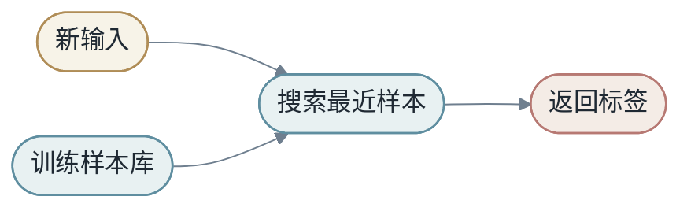

<h1 align="center">第二章：变换的语言</h1>

第一章说学习是寻找 `X -> Y` 的变换 `M`。第二章开始问：`M` 到底可以是什么？

模型不是神秘对象。它可以是一条直线、一个矩阵、一个非线性函数、一个查表系统、一个核方法，也可以是很多层神经网络的复合。这一章用尽量统一的"变换"语言把它们串起来，方便后面第 5 章的深度学习直接接上。

<h2 align="center">第1节：线性函数，最简单的 M</h2>

最简单的模型是线性函数：

$$
ŷ = wx + b
$$

如果 `x` 是房屋面积，`ŷ` 是房价预测，`w` 表示面积每增加一个单位，价格平均增加多少，`b` 是基础价格。

当输入是向量时：

$$
x = [x_1,x_2,\dots,x_d]
$$

线性模型写成：

$$
ŷ = w^Tx + b = \sum_{j=1}^{d}w_jx_j+b
$$

每个 $x_j$ 是一个 feature，每个 $w_j$ 是对应权重。

### 1.1 线性模型为什么重要

线性模型看似简单，却有三个优点。

第一，**容易解释**。权重可以近似理解为 feature 的贡献（前提是 feature 之间不太相关）。

第二，**容易优化**。很多线性模型有凸优化性质，训练相对稳定。

第三，**它是复杂模型的基本组件**。神经网络中的线性层本质上仍然是矩阵乘法。

### 1.2 线性模型的代码直觉

```python
import torch

B, D = 8, 4
x = torch.randn(B, D)
w = torch.randn(D, 1)
b = torch.randn(1)

y_hat = x @ w + b
```

这里 `x @ w` 对应公式中的 $w^T x$，只是 batch 版本。矩阵乘法让 8 个样本一次性完成预测。

### 1.3 线性不等于弱

线性模型在很多场景仍然很强，尤其是 feature 已经很好时。

如果 `x` 已经是一个强 embedding，简单线性分类器就可能表现很好。深度学习中常见的 **linear probe**（线性探针）就是冻结表征模型，只训练一个线性层，用来测试表征本身的质量。第 5 章末和第 6 章末会再回到 linear probe。

<h2 align="center">第2节：矩阵变换</h2>

当输出也是向量时，模型变成：

$$
ŷ = Wx+b
$$

矩阵 `W` 不是数字表格，而是空间变换。它可以旋转、缩放、投影、剪切，也可以把多个输入维度混合成新的输出维度。


### 2.1 点的变换还是坐标系的变换

矩阵有两个互补视角。

第一，把向量看成空间中的点，矩阵就是移动这些点。

第二，把向量看成某个对象在坐标系中的坐标，矩阵就是换一个坐标系重新描述对象。

这两个视角都对。机器学习中我们常常在两者之间切换：一方面说模型改变了数据点的位置，另一方面也说模型学到了新的表征空间。

### 2.2 基向量视角

矩阵的列可以看成新基向量。二维矩阵：

$$
W=\begin{bmatrix}a & b \\ c & d\end{bmatrix}
$$

会把标准基向量 $e_1=[1,0]$ 和 $e_2=[0,1]$ 分别映射到矩阵的两列。

理解矩阵变换，一个实用方法是看它把基向量送到哪里。整个空间随后被这些新基向量拉伸和重排。

### 2.3 投影与压缩

如果 `W` 把高维向量映射到低维空间，它就是一种压缩：

$$
W \in R^{k \times d}, \quad k < d
$$

如果 `W` 把低维向量映射到高维空间，它就是一种展开：

$$
W \in R^{k \times d}, \quad k > d
$$

Embedding、特征投影、降维、注意力中的 Q/K/V 投影，都可以放在这个框架里理解。

### 2.4 PCA 的直觉

PCA（主成分分析）可以看成寻找一组新坐标轴，让数据在前几个方向上保留最多变化。


PCA 是无监督的线性方法，神经网络中的投影矩阵通常由任务 loss 监督学习。但它们都体现了同一个思想：**换一个空间，数据结构可能更清楚**。第 5 章我们会看到深度网络如何把"换空间"做成可学习过程。

### 2.5 矩阵作为特征混合器

矩阵乘法可以看成重新混合 feature。

如果输入 `x` 有 100 个维度，输出 `h` 有 256 个维度，那么矩阵 `W` 学到的是 256 种新的 feature 组合。每个输出维度都是输入维度的加权组合。

```text
h_1 = w_11 x_1 + w_12 x_2 + ... + w_1d x_d
h_2 = w_21 x_1 + w_22 x_2 + ... + w_2d x_d
```

深度网络一层层做这种混合，再通过非线性选择和重组。最终的高层表示，不是原始 feature 的简单加权，而是多次混合和弯曲后的结果。

<h2 align="center">第3节：张量，高维数据的坐标系统</h2>

向量是一阶张量，矩阵是二阶张量。深度学习中的 tensor 可以有更多维度。

语言模型中的 hidden states 常常是：

```text
[batch, sequence, hidden]
```

图像模型中的输入常常是：

```text
[batch, channel, height, width]
```

张量的每个维度都有语义。理解模型，常常就是理解这些维度如何被变换。


### 3.1 张量变换的三类操作

第一类是改变数值但不改变 shape，例如 ReLU：

```text
[B, H] -> [B, H]
```

第二类是改变最后一维，例如线性层：

```text
[B, T, H] -> [B, T, 4H]
```

第三类是重排维度，例如 transpose、reshape、view：

```text
[B, T, H] -> [B, heads, T, head_dim]
```

Transformer 实现中大量 bug 都来自第三类操作。数学上它们看起来只是换个写法，程序中却会影响内存布局和后续矩阵乘法。第 7 章 §1 会展开"逻辑 shape vs 物理布局"的差异。

### 3.2 Broadcasting

Broadcasting 让不同 shape 的 tensor 自动对齐。例如 bias `b: [H]` 可以加到 `X: [B, H]` 上，因为 `b` 会被看作每个 batch 样本共享。

这是一种非常方便的语法，也是一种常见 bug 来源。一个典型陷阱：如果你想给每个样本加一个偏置（不同样本不同值），bias 应该是 `[B]` 然后 reshape 成 `[B, 1]` 再加到 `[B, H]`；如果直接写 `[B]` 加到 `[B, H]`，框架会按 `[1, B]` 广播到列方向上去，得到完全错误的结果。

写公式时要清楚哪些维度在共享，哪些维度在独立。一个小习惯：每写一个 tensor 操作，在注释里写下 in/out shape，能避免大量调试时间。

<h2 align="center">第4节：非线性，让空间弯曲</h2>

线性模型只能表达线性边界。很多真实问题不是线性可分的。

非线性模型允许：

$$
M(x)=f(Wx+b)
$$

这里的 `f` 让模型可以弯曲空间。


### 4.1 激活函数

神经网络中的非线性通常来自激活函数。

ReLU 是：

$$
ReLU(x)=\max(0,x)
$$

它只是一个折线函数，但大量 ReLU 组合起来，可以表达复杂的分段线性函数。

GELU、SiLU、tanh 是 ReLU 的近亲，平滑了 ReLU 在 0 处的拐点。第 5 章会再回到激活函数选择。

### 4.2 XOR 问题

XOR 是理解非线性的经典例子。

```text
0 xor 0 = 0
0 xor 1 = 1
1 xor 0 = 1
1 xor 1 = 0
```

在二维平面上，两个正例位于对角线，两个负例位于另一条对角线。没有一条直线能把它们分开。

但如果增加非线性变换，例如加入特征 `x1 * x2`，问题就能变得线性可分。

这说明非线性不是装饰，而是表达某些结构的必要条件。

### 4.3 分段线性直觉

ReLU 网络虽然整体非线性，但在每个激活模式固定的区域内，它仍然是线性的。复杂性来自很多区域拼接在一起。

这给了我们一个很好的中间理解：神经网络不是完全不可理解的任意曲面，它是由大量局部简单片段组成的全局复杂变换。

<h2 align="center">第5节：查表函数，记忆的模型</h2>

查表函数是另一种极端。对于每个输入 ID，直接找到对应向量或答案。

Embedding table 就是一种查表：

$$
e_i = E[i]
$$

其中 `E` 是参数表。


查表不是低级方法。现代模型大量使用 embedding、KV Cache、检索库和外部记忆。关键问题不是能不能记，而是记忆如何参与泛化。

### 5.1 最近邻模型

最近邻是一种非常直观的查表式模型。新样本来了，找到训练集中最相似的样本，返回它的标签。



最近邻的关键是距离函数。如果距离函数好，它可以表现不错；如果距离函数不能表达任务相关相似性，结果会很差。

### 5.2 参数记忆和外部记忆

神经网络的参数可以看成压缩记忆。这种压缩有多种形式：

| 类型 | 保存什么 | 何时更新 | 例子 |
|------|----------|----------|------|
| 参数 | 长期统计规律 | 训练时 | MLP 权重、attention 投影矩阵 |
| Embedding table | 离散对象向量 | 训练时 | token embedding、user embedding |
| KV Cache | 当前上下文状态 | 推理时 | Transformer 自回归 decode |
| 向量数据库 | 外部文档/知识 | 数据更新时 | RAG 检索索引 |

这四种记忆服务于不同目的。后面第 6 章会详细讨论它们如何在大模型系统中协同。

<h2 align="center">第6节：SVM 与核方法</h2>

SVM（支持向量机）的基本分类边界是：

$$
w^Tx+b=0
$$

分类规则是：

$$
ŷ = +1 \text{ 若 } w^Tx+b>0，\quad \text{否则 } ŷ=-1
$$

当原空间不可线性分时，可以先做特征映射：

$$
φ:x \mapsto φ(x)
$$

然后在新空间做线性分类。

核函数直接计算新空间内积：

$$
K(x_i,x_j)=φ(x_i)^Tφ(x_j)
$$


SVM 和核方法告诉我们：改变空间，问题就会改变。深度学习继承了这个思想，只是把特征映射也变成了可学习对象。

### 6.1 Margin 的直觉

SVM 不只想分对样本，还想让分类边界离最近样本尽量远。这个距离叫 margin。

大 margin 的直觉是：边界更稳。如果新样本有一点噪声或扰动，仍然不容易跨过边界。


### 6.2 Kernel Trick 为什么巧妙

如果显式构造高维 φ(x)，计算可能很贵。Kernel trick 只计算内积 $K(x_i,x_j)$，避免真正写出高维向量。

这在历史上非常漂亮：它说明有时我们可以在高维空间中工作，却不显式进入高维空间。

深度学习后来选择另一条路：直接学习一个多层 φ(x)，并用大规模数据和算力训练它。两条路径各有所长——核方法在中小数据和清晰相似度下很强，深度学习在大数据和复杂结构上更灵活。

<h2 align="center">第7节：从手工空间到可学习空间</h2>

这一章前半段在讨论"换空间"的多种方式。可以这样收束：

```text
线性模型：在原空间里找简单边界
核方法：手工或隐式换到高维空间
深度学习：学习一个适合任务的空间
```

神经网络的中间层可以看作一系列学到的坐标变换。每层都把数据放到一个新空间里，让最终任务更容易。


### 7.1 坐标系视角

同一个对象，在不同坐标系中可以有不同表示。机器学习中的表征，本质上也是坐标系选择。

二维平面里的一个点可以用标准坐标表示，也可以用旋转后的坐标表示。点没有变，但描述方式变了。某些任务在一个坐标系中复杂，在另一个坐标系中简单。

深度学习做的很多事，就是学习一系列新的坐标系。每一层把数据重新表示，让最终任务更容易。

```text
原始坐标 -> 中间坐标 1 -> 中间坐标 2 -> 任务坐标
```

如果在任务坐标中，同类样本聚集、异类样本分开，分类就变简单。

这就是从传统机器学习走向深度学习的桥梁：不只是学习分类器，而是学习表示问题的空间。

<h2 align="center">第8节：概率视角与决策边界</h2>

前面我们把模型看成函数：

$$
ŷ=M(x)
$$

但很多任务中，模型输出的不是一个确定答案，而是一个概率分布。

分类模型输出：

$$
P(Y=c \mid X=x)
$$

语言模型输出：

$$
P(x_{t+1} \mid x_{≤t})
$$

这时 `M` 的作用不是直接给答案，而是把输入变成一个分布。预测只是从分布中选择或采样。


概率视角非常重要，因为现实中很多问题本来就不确定。同一段用户行为可能对应多种未来，同一句话可能有多个合理续写，同一张医学影像也可能需要表达诊断置信度。

### 8.1 Logits 到概率

神经网络分类器通常先输出 logits：

```text
z = [2.1, -0.3, 0.7]
```

logits 不是概率，可以为负，也不要求和为 1。Softmax 把它们变成概率分布：

$$
p_i=\frac{exp(z_i)}{\sum_j exp(z_j)}
$$

这一步把任意实数向量变成非负、和为 1 的分布。

Logit 差值很重要。两个类别 logits 差距越大，softmax 后概率越偏向其中一个：

```text
logits: [10, 9, 1]  -> 前两个类别竞争
logits: [10, 1, 0]  -> 第一个类别明显胜出
```

温度缩放可以调整概率分布的尖锐程度：

$$
p_i=softmax(z_i/τ)
$$

低温度让分布更尖（更"自信"），高温度让分布更平（更"保守"）。温度也常用于校准。

### 8.2 决策边界

分类模型最终会在输入空间中形成决策边界。二分类线性模型的边界是：

$$
w^Tx+b=0
$$

边界一侧预测为正类，另一侧预测为负类。

非线性模型可以形成弯曲边界。神经网络通过多层非线性，把复杂边界拼出来。


理解边界有助于理解模型错误。如果两个类别在表征空间中高度重叠，再复杂的边界也难以稳定分开。如果某些训练点是噪声，过度弯曲边界去包住它们，就会导致过拟合。

### 8.3 不确定性和熵

分类模型输出概率分布，但这个分布可以很尖，也可以很平。

如果模型认为三个类别概率是 `[0.98, 0.01, 0.01]`，它非常确定。如果输出是 `[0.36, 0.33, 0.31]`，它几乎不确定。

熵可以衡量分布的不确定性：分布越平均，熵越高；分布越集中，熵越低。

不确定性在产品中非常重要。模型不确定时，可以选择让人审核、请求更多信息、调用工具、返回保守答案或拒绝自动决策。

### 8.4 校准

一个模型说"我有 90% 把握"时，真的应该在类似样本上大约 90% 正确。这叫校准。

准确率高的模型不一定校准好。它可能经常给出过度自信的概率。对搜索、推荐、医疗、金融这类系统，概率本身会进入决策，校准就很重要。

例如两个模型 accuracy 都是 90%。一个模型在正确时给 0.9，错误时给 0.6；另一个模型无论对错都给 0.99。后者虽然 accuracy 相同，但更危险，因为它误导下游系统相信错误预测。

第 4 章 §11 会回到 logit、阈值和概率校准如何影响产品决策。

<h2 align="center">第9节：组合性</h2>

深度学习强大的一个原因，是组合性。简单变换可以组合成复杂变换：

$$
M=f_4 \circ f_3 \circ f_2 \circ f_1
$$

组合性让模型逐层构造抽象。低层处理局部和简单模式，高层处理全局和语义结构。

组合性也是人类工程的基本方式。我们不会把整个操作系统写成一个巨大函数，而是拆成模块。神经网络类似，只是许多模块的内部参数由数据学习。

```text
简单函数 + 简单函数 + 简单函数 -> 复杂系统行为
```

这为后面的深度学习部分做铺垫：深度不是层数数字，而是可组合变换的表达方式。

<h2 align="center">第10节：距离、相似度和度量</h2>

模型经常需要判断两个对象是否相似。相似度不是客观唯一的，而是由任务定义。

两篇文章可以因为主题相似，也可以因为写作风格相似，还可以因为读者群相似。哪一种相似重要，取决于任务。

常见相似度包括：

- **欧氏距离**：关注绝对坐标差异，对尺度敏感。
- **余弦相似度**：关注方向，对尺度不敏感（先做 normalize）。
- **点积**：同时受方向和长度影响，attention 中用得最多。
- **学习到的距离**：由模型根据任务塑造。

Embedding 空间中的"近"不是自然事实，而是训练目标塑造的结果。推荐模型中的近，可能表示行为相似；语言模型中的近，可能表示语义或上下文相似。

### 10.1 向量的方向和长度

向量不仅是一串数字。它有方向和长度。

在 embedding 空间中，方向常常比长度更重要。两个向量方向相近，说明它们在模型学到的空间中相似。余弦相似度正是在比较方向。

长度也有意义。某些模型中，向量范数可能和置信度、频率或激活强度相关。但在很多检索任务中，我们会 normalize 向量，让相似度主要由方向决定。

### 10.2 Attention 中的距离

Attention 中的 $QK^T$ 是一种点积相似度，再除以 $\sqrt{d_k}$ 做尺度归一化。第 5 章会展开为什么要除以 $\sqrt{d_k}$，以及为什么这种"动态相似度"是 Transformer 的核心。

<h2 align="center">第11节：表征的取舍：信息瓶颈与不变性</h2>

变换语言不只描述模型如何映射，也描述模型应该保留什么、丢什么。

### 11.1 信息瓶颈

模型的中间表示不可能保留输入的所有细节，也不应该保留所有细节。好的表示会压缩无关信息，保留任务相关信息。

这可以用信息瓶颈的直觉理解：

```text
X 中有大量信息 -> h 保留与 Y 相关的信息 -> 输出 Y
```

如果压缩太强，任务需要的信息丢失，模型欠拟合。如果压缩太弱，噪声和偶然模式被保留，模型可能过拟合。

深度网络、embedding、pooling、attention、regularization 都可以从信息保留和信息压缩的角度理解。

### 11.2 对称性和不变性

很多任务中，某些变化不应该改变输出。

图片平移一点，类别通常不变。句子中某些同义表达变化，意图可能不变。推荐系统中，用户 ID 的内部编号变化，不应该影响预测。

这种"不该变"的性质叫不变性。模型架构可以显式利用不变性。CNN 利用平移局部性，数据增强让模型学会对旋转、裁剪、噪声更稳健。

同时，有些变化必须被保留。医学图像中的小阴影可能很重要，代码中的一个符号变化可能改变语义。

因此表征设计要区分：**哪些变化应该忽略，哪些变化必须敏感**。这条原则会贯穿第 3 章（表征）和第 5 章（深度学习中的归纳偏置）。

### 11.3 信息瓶颈和不变性的统一视角

这两件事其实是同一件事的两面：

- 信息瓶颈说的是"压缩"——把和任务无关的信息去掉。
- 不变性说的是"压缩谁"——具体哪类无关变化应该被压掉。

设计模型时，你不只是在选层数和维度，你也在隐式定义"哪些信息可以丢"。CNN 隐式说"绝对位置可以丢"，Transformer 隐式说"绝对位置可以由 position encoding 局部恢复"，对比学习显式说"同一对象的两种增强版本应该有同样的表征"。

<h2 align="center">第12节：从几何到优化</h2>

变换语言不只描述模型表达什么，也影响模型如何学习。

Loss surface（在第 4 章会正式定义 loss）可以看成参数空间中的地形。梯度下降在这个地形上行走。线性模型的地形可能像一个碗，比较容易优化。深度网络的地形更复杂，有平坦区域、陡峭区域、鞍点和局部结构。


这说明"模型能表达"与"模型能学到"不是同一件事。一个模型也许存在好参数，但优化过程未必找到。模型结构越复杂，训练技巧越重要。

因此后面的第 4 章会继续这个问题：当 `M` 足够复杂时，如何找到好的 θ？这条线索一直延伸到第 5 章末（初始化、归一化、残差为什么让深层可训练）和第 6 章末（大模型怎么训练得稳）。

### 本章在 X → Y by M 中的位置

第二章建立了模型 `M` 的基本语言：

- **线性函数**是最简单的可学习变换。
- **矩阵**可以被看成空间变换或坐标系变换，也是 feature 混合器。
- **张量**是程序中承载高维数据的基本结构。
- **非线性**让模型可以弯曲空间。
- **查表函数**展示了记忆与泛化的张力。
- **核方法**说明换空间可以让问题变简单。
- **深度学习**把"换空间"也变成了可学习过程。
- **概率输出、决策边界、组合性、距离、信息瓶颈和不变性**——这些都是变换语言的不同侧面，共同构成 `M` 的描述工具。

线性代数为什么是深度学习的语言？因为深度学习模型最终都被组织成大规模矩阵乘法：embedding lookup 是查表，linear layer 是矩阵乘法，attention score 是矩阵乘法，vocab projection 也是矩阵乘法。线性代数既描述空间变换的几何意义，也正好符合 GPU 擅长执行的计算结构。这让数学和系统在同一个地方相遇——这条线在第 7 章会再展开。

### 思考题

1. 为什么多层线性变换叠在一起仍然是线性变换？用公式证明并解释其几何意义。
2. 如果 embedding 是查表，为什么它仍然能产生语义相似性？关键在于什么？
3. 核方法和深度学习都在学习或使用特征空间，它们最大的区别是什么？哪种方法更依赖手工设计？
4. 用二维图形直觉解释 XOR 为什么不能被线性模型分开。如果允许加一个特征，最少加几个就能让它线性可分？
5. 什么情况下线性模型依然可能很强？给出三个具体场景。
6. 举例说明参数记忆、外部记忆和运行时记忆的区别。它们各自适合存什么样的信息？
7. Logits 和概率有什么区别？什么情况下温度缩放有用？
8. 什么情况下准确率高但概率校准很差？这种模型在医疗或金融场景中为什么危险？
9. 用组合性的视角解释一个 Transformer block——它由哪几个简单变换组合而成？
10. 一个模型在某个 segment 上表现差，从"决策边界"的角度可能有哪几种原因？
