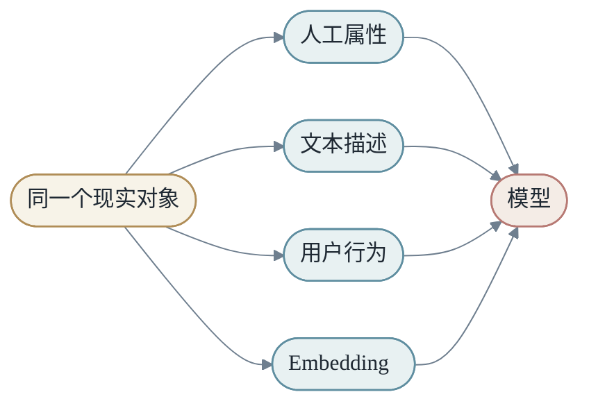
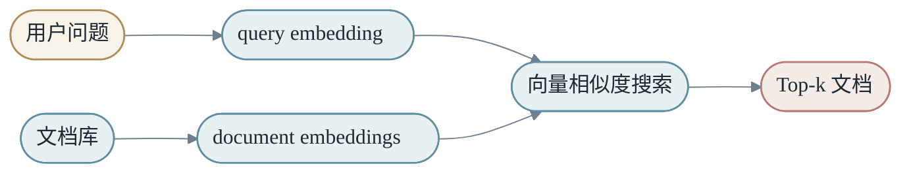
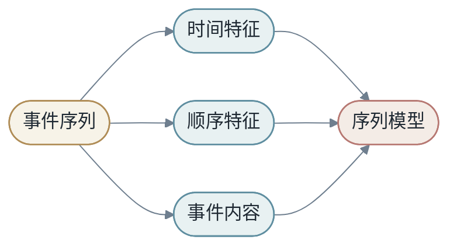
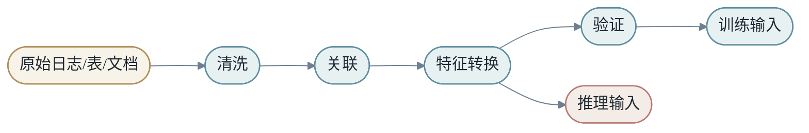
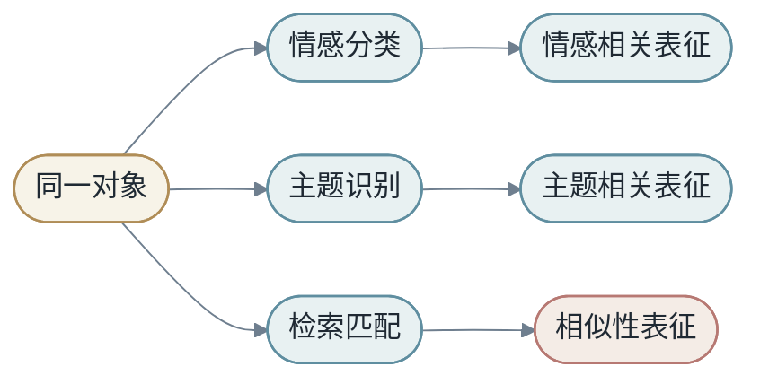

<h1 align="center">第三章：表征 X</h1>

模型不能直接处理现实世界。它处理的是数字、向量和张量。因此在 `X -> Y by M` 中，`X` 不是自然出现的，它需要被构造。

现实对象到模型输入之间，有一个表征函数：

$$
object \xrightarrow{φ} x
$$

传统机器学习中，φ 常常由人设计。深度学习中，φ 的大部分被放进模型里一起学习。

本章按三个层次组织：

- **A 部分（§1–§7）：表征理念** — feature 是什么，表征如何决定模型能看见什么。
- **B 部分（§8–§13）：具体表征类型** — 文本、表格、图像、时间、ID、缺失值。
- **C 部分（§14–§15）：表征的工程** — 治理、版本化、流水线、公平性。

---

## A 部分：表征理念

<h2 align="center">第1节：Feature，现实进入模型的入口</h2>

Feature 是现实对象的可计算描述。

房价预测中，feature 可以是面积、位置、楼层、房龄。广告系统中，feature 可以是查询词、用户画像、广告出价、历史点击率。语言模型中，最初的 feature 是 token id，随后变成高维 embedding。

一个完整预测过程可以拆成：

$$
ŷ = g(φ(x))
$$

其中 φ 负责表征，`g` 负责预测。

这个拆分非常有用。很多时候模型表现不好，不是 `g` 不够强，而是 φ 没有把关键内容带进来。比如预测房价时，如果输入只有面积，没有城市、地段、年份，再强的模型也很难做出好预测。

### 1.1 表征不是中立的

同一个对象可以有很多表征。一本书可以表示成标题、作者、目录、全文、主题标签、销售记录，也可以表示成 embedding 向量。不同表征会让模型看到不同世界。



所以 feature 不是纯技术细节，它决定了问题被怎样呈现给模型。

### 1.2 好 feature 的三个标准

第一，**保留任务相关信息**。预测房价时，面积重要；识别猫狗时，形状和纹理重要。

第二，**压缩无关变化**。同一只猫在不同光照下仍然是猫，好的表征应该对无关变化稳定。

第三，**让后续模型更容易**。好的表征空间中，相似对象靠近，不同对象分开。


这三个标准呼应第 2 章 §11 的信息瓶颈和不变性：好的 feature 已经做了一部分"压缩无关、保留相关"的工作。

<h2 align="center">第2节：手工特征到表征学习</h2>

传统机器学习时代，很多性能来自 feature engineering。人类专家把领域知识编码成特征，再交给相对简单的模型。

深度学习改变了这个分工。它不是完全不需要人类设计，而是把大量 feature construction 放进可学习模型中。

```text
传统方式：人设计 feature -> 模型学习预测器
深度学习：模型同时学习 feature 和预测器
```

这就是深度学习的核心能力之一：表征学习（representation learning）。

### 2.1 表征学习的代价

让模型自己学习 feature 带来了能力，也带来了成本。

第一，**需要更多数据**。手工 feature 把专家知识直接写进去，模型不必从零发现；表征学习则需要通过大量样本慢慢形成结构。

第二，**需要更多算力**。表征层本身也有参数，也要参与训练。

第三，**可解释性下降**。手工 feature 常常有明确含义，神经网络中的 hidden dimension 不一定能直接解释。

因此，传统 feature engineering 并没有完全消失。在工业系统中，手工特征、规则、embedding、深度网络常常混合存在。

### 2.2 混合范式

一个常见的工业模式是"统计特征 + 深度表征"：

- 统计特征（点击率、转化率、CTR、CVR）提供稳定的强先验。
- 深度表征处理稀疏 ID、文本、图像、多模态信号。
- 两者在模型最后阶段融合。

这种混合不是"过渡形态"，而是经过反复验证的工程最优。深度学习不是要取代手工特征，而是要让它们在恰当的位置发挥各自长处。

<h2 align="center">第3节：离散对象、连续对象和结构对象</h2>

不同类型的输入需要不同表征方式。

- **离散对象**：词、用户 ID、商品 ID、类别。常用 one-hot 或 embedding。
- **连续对象**：价格、年龄、时间间隔、传感器数值。常用归一化后的数值特征。
- **结构对象**：图像、文本、图、表格、程序。通常需要专门架构处理，例如 CNN、Transformer、GNN。

```text
离散对象 -> embedding
连续对象 -> normalization / scaling
序列对象 -> positional encoding + sequence model
图像对象 -> patch / convolution / vision transformer
图对象 -> graph neural network
```

表征设计要尊重数据结构。如果把序列打乱成无序集合，就会丢失顺序信息；如果把图像完全展开成一维向量，就会弱化局部结构。

这条原则贯穿第 5 章——CNN、RNN、Transformer 都是"把某种数据结构编码进模型架构"的不同方案。

<h2 align="center">第4节：One-hot 与稀疏表示</h2>

离散对象需要先变成数字。最直接的方法是 one-hot。

如果词表大小是 `V`，每个 token 是一个 `V` 维向量，只有一个位置是 1，其余为 0。

```text
cat = [0, 0, 1, 0, 0]
dog = [0, 1, 0, 0, 0]
```

One-hot 简单、明确，但有两个缺点：维度大，且不表达相似性。`cat` 和 `dog` 都是动物，但在 one-hot 空间中，它们的距离和 `cat`、`airplane` 的距离一样。

### 4.1 稀疏特征的工业价值

虽然 one-hot 看起来笨，但稀疏特征在很多工业系统中非常有用。广告、推荐、搜索系统里，经常有大量离散 ID 和类别特征。

稀疏特征的优点是**精确记忆**。例如某个广告 ID、某个用户群、某个查询词可能有稳定统计信号。缺点是**冷启动和泛化困难**。新 ID 没有历史数据，模型就很难判断。

工业实践中，one-hot 通常不是终点，而是 embedding 之前的中间表示。还有一些技术（feature hashing、feature crossing、Factorization Machines）在 one-hot 和 embedding 之间提供折中方案，但本书不展开。

<h2 align="center">第5节：Embedding，把符号放进几何空间</h2>

Embedding 给每个离散对象学习一个稠密向量：

$$
e_i=E[i]
$$

其中：

$$
E \in R^{V \times d}
$$

`V` 是对象数量，`d` 是向量维度。


Embedding 的语义来自训练任务。如果两个词经常出现在相似上下文中，模型会倾向于把它们放到相似位置。语义不是手工写进去的，而是为了完成预测任务自组织出来的。

### 5.1 Embedding 的代码直觉

```python
import torch
import torch.nn as nn

embedding = nn.Embedding(num_embeddings=10000, embedding_dim=128)
token_ids = torch.tensor([12, 98, 305])
vectors = embedding(token_ids)  # shape: [3, 128]
```

这个 `Embedding` 层本质上是一个参数表。输入 ID，输出对应行向量。训练时，反向传播会更新被访问到的行。

**常见 bug**：`num_embeddings` 必须 ≥ 实际 token id 的最大值 + 1，否则会触发 `IndexError`（CPU）或 silently corrupt（某些 GPU 实现）。在 tokenizer 切换、词表扩充、加入特殊 token 时尤其要检查。

### 5.2 位置也是表征

序列模型不仅要知道 token 是什么，还要知道 token 在哪里。

Transformer 本身没有 RNN 那样的顺序递推，因此需要位置编码或位置嵌入。可以把输入表示成：

$$
h_i = token\_embedding_i + position\_embedding_i
$$

这说明表征不仅包含对象身份，也可以包含位置、时间、来源、角色等上下文信息。

近年还有 RoPE（rotary position embedding）、ALiBi 等"相对位置"方案，它们让模型对长上下文外推更稳。第 6 章长上下文部分会回到这条线索。

<h2 align="center">第6节：相似性，向量空间的基本操作</h2>

一旦对象变成向量，相似性就可以用几何计算。

点积：

$$
s(x,y)=x^Ty
$$

余弦相似度：

$$
cos(x,y)=\frac{x^Ty}{\|x\|\|y\|}
$$

Attention 中的 $QK^T$、推荐系统中的 user/item matching、向量数据库中的检索，都依赖相似度计算。

### 6.1 向量检索

如果我们有很多文档 embedding，用户问题也被编码成 embedding，就可以通过相似度找到最相关文档。



这就是许多 RAG 系统的基础。语言模型负责生成，向量检索负责把外部知识带入上下文。第 6 章会详细展开 RAG。

### 6.2 相似度的任务依赖性

需要强调：相似性不是客观存在的属性，而是由训练目标定义的。同一个 query embedding 模型，在不同任务上训练，会形成完全不同的"近邻关系"。RAG 系统中常见的 retrieval 失败，根因常常是 embedding 模型的"相似性"和任务需要的"相似性"不匹配——例如领域术语没有覆盖、跨语言对齐弱、否定句被当作肯定句。

<h2 align="center">第7节：表征的失败模式</h2>

表征可能失败。

第一，**信息缺失**。输入里没有任务需要的信息。

第二，**噪声太多**。无关特征干扰学习。

第三，**分布漂移**。训练时的表征规律，到线上环境不再成立。

第四，**泄漏（label leakage）**。feature 中包含了不该在预测时可见的信息，导致离线效果虚高。

例如预测用户明天是否会购买商品时，如果 feature 中包含"明天的订单状态"，模型会看似很准，但上线时这个 feature 不存在。

### 7.1 表征检查清单

- 这个 feature 在推理时真的可用吗？
- 它是否泄漏了标签？
- 它是否对新样本稳定？
- 它是否对不同群体公平？
- 它是否帮助模型泛化，而不是只记住训练集？

### 7.2 捷径学习

捷径学习（shortcut learning）是表征失败的一种特别隐蔽的形态：模型表面上很好，实际上学到的是与任务无关但训练集中和标签相关的伪线索。

典型例子：

- 图像分类模型不是识别动物，而是识别背景（雪地 → 狼，草地 → 狗）。
- 医学影像模型不是识别病灶，而是识别医院水印或扫描仪型号。
- 文本分类模型不是理解语义，而是记住某些模板词。

发现捷径学习的方法包括：跨域评估、对照样本、人工抽查高置信预测、特征敏感性分析。

---

## B 部分：具体表征类型

<h2 align="center">第8节：文本表征</h2>

我们用一个具体任务把文本表征讲透：判断一段用户评论是正面还是负面。现实对象是一段自然语言文本，模型不能直接处理"文本本身"，必须先把它变成 `X`。

最朴素的方案是 **bag-of-words**。我们统计每个词是否出现，或者出现了几次：

```text
"this movie is great" -> {this:1, movie:1, is:1, great:1}
```

这种表征忽略顺序，但对很多简单任务已经有效。如果评论里出现 `great`、`excellent`、`boring`、`terrible`，线性模型就能从词频中学到情感方向。

第二种方案是 **n-gram**。它不仅记录单词，也记录相邻词组：

```text
"not good" -> not, good, not_good
```

这能解决一部分否定问题。单独看到 `good` 可能是正面，但 `not good` 往往是负面。

第三种方案是 **embedding**。每个 token 先变成向量，再由模型组合：


这三种方案不是简单的"旧"和"新"。它们代表三种不同 trade-off：

| 表征 | 优点 | 缺点 |
|------|------|------|
| Bag-of-words | 简单、可解释、数据需求低 | 忽略顺序和语义 |
| N-gram | 捕获局部短语 | 维度膨胀，泛化有限 |
| Embedding | 能学习语义相似性 | 需要更多数据和训练成本 |

一个工程师真正要做的，不是盲目选择最复杂方法，而是判断任务需要哪种信息。如果情感主要由少量关键词决定，简单表征可能足够。如果需要理解讽刺、长距离指代和上下文，embedding 和 Transformer 就更自然。

<h2 align="center">第9节：表格表征</h2>

很多真实机器学习任务不是图像或文本，而是表格：用户、订单、商品、广告、交易、设备、日志。

表格数据混合了多种 feature：

- **数值特征**：年龄、价格、点击次数、停留时长。
- **类别特征**：城市、设备类型、商品类目。
- **ID 特征**：用户 ID、广告 ID、商家 ID。
- **时间特征**：小时、星期、节假日、距离上次行为的时间。

数值特征常需要 normalization。比如收入、价格这类值可能跨度很大，直接输入会让优化变难。常见方法包括标准化、log transform、clip 极端值。

类别特征可以 one-hot，也可以 embedding。高基数类别，例如用户 ID 或商品 ID，通常不适合直接 one-hot 给 dense model，而是用 embedding table。

时间特征尤其容易被低估。许多行为有强烈周期性：工作日和周末不同，白天和夜晚不同，节假日和平日不同。可以把时间拆成多个 feature：

```text
timestamp -> hour_of_day, day_of_week, is_holiday, recency
```

表格任务的一个核心挑战是：feature 看似简单，但泄漏风险很高。比如预测贷款是否违约时，如果某个 feature 是"催收状态"，而催收状态只有违约后才出现，那么模型会在离线评估中虚高。

<h2 align="center">第10节：图像表征，从像素到 patch</h2>

图像最原始的表征是像素。一个彩色图像可以表示成：

```text
[height, width, channel]
```

每个像素只是颜色数值，但图像语义不在单个像素里，而在空间结构中。猫的眼睛、耳朵、轮廓、纹理，都是局部和全局模式的组合。

CNN 使用卷积核处理局部区域。Vision Transformer 则把图像切成 patch，每个 patch 像一个 token：


Patch 表征有一个重要含义：模型不再直接看单个像素，而是看局部块。patch size 决定了最早的信息粒度。patch 太大，细节丢失；patch 太小，序列太长，计算变贵。

图像表征也会遇到数据增强。随机裁剪、翻转、颜色扰动，不只是让数据变多，而是在告诉模型：这些变化不应该改变标签。**数据增强本质上是在向模型注入不变性**（呼应第 2 章 §11）。

需要注意：数据增强假设有边界。医学影像或交通标志中，方向和颜色可能有真实含义，随意翻转会破坏标签。

<h2 align="center">第11节：时间和序列表征</h2>

很多数据有时间结构：用户行为、金融交易、传感器、日志、医疗记录、对话历史。

时间数据不只包含"发生了什么"，还包含"什么时候发生""间隔多久""顺序如何"。

例如用户行为序列：

```text
搜索 -> 点击 -> 浏览 -> 加购 -> 离开 -> 次日购买
```

如果把它当成无序集合，就会丢失行为路径。如果只看最后一次行为，也会丢失长期兴趣。

时间表征常见方法包括：

- **位置编码**：表示第几个事件。
- **时间间隔**：表示距离上一次事件多久。
- **周期特征**：小时、星期、月份、节假日。
- **衰减权重**：近期行为更重要。
- **序列模型**：RNN、Transformer、Temporal CNN。



时间表征的最大风险是未来泄漏。例如预测用户明天是否购买时，如果 feature 包含明天之后的行为，离线效果会非常好，上线必然失败。第 1 章 §9 已经强调过这一点。

<h2 align="center">第12节：ID 特征和长尾问题</h2>

工业系统里有大量 ID：用户 ID、商品 ID、广告 ID、商家 ID、查询 ID。ID 特征很强，因为它能记住对象历史；也很危险，因为它容易过拟合。

热门商品有大量数据，embedding 可以学得很好。长尾商品数据很少，embedding 可能几乎没有训练。新商品没有历史，embedding 甚至不存在。

这就是**冷启动**问题。

解决冷启动通常需要把 ID 记忆和内容表征结合起来：

```text
商品 ID embedding + 商品标题 embedding + 类目 + 价格 + 图像特征
```

当 ID 有历史时，模型可以使用 ID 记忆；当 ID 新出现时，模型仍然能依赖内容特征泛化。

### 12.1 频率和置信度

同样是点击率 10%，一个商品曝光 10 次点击 1 次，和曝光 10000 次点击 1000 次，置信度完全不同。

表征中经常需要加入频率、样本数、时间衰减统计。模型不仅要知道"历史表现是多少"，还要知道"这个历史表现有多可靠"。

这也是为什么统计特征常常和深度表征一起使用。深度模型负责表达复杂关系，统计特征提供强先验和稳定记忆。

<h2 align="center">第13节：缺失值与特征交叉</h2>

### 13.1 缺失值不是空白

真实数据经常缺失。用户没有填写年龄，商品没有图片，日志没有记录来源，传感器某一分钟断流。缺失值看起来像"没有信息"，但它本身也可能是一种信息。

例如某些用户不填写年龄，可能和隐私敏感度有关；某些商品没有图片，可能是新上架或低质量商家；某条日志缺少来源，可能来自异常流量。

处理缺失值有几种常见方式：

- 填充默认值。
- 增加 missing indicator。
- 用模型预测缺失值。
- 在序列模型中保留"未知" token。
- 对缺失模式单独建模。

简单填 0 很危险。0 可能是真实数值，也可能是缺失标记。如果模型无法区分"真实 0"和"未知"，它可能学到错误规律。

```python
# value + missing indicator 是工业界常见的双特征设计
feature_value = row.get("user_age", 0)
is_missing = 1 if row.get("user_age") is None else 0
```

这种双特征设计很常见：一个值特征，一个缺失指示。它让模型既知道数值，也知道这个数值是否来自真实观测。

### 13.2 特征交叉

很多信号不是单个 feature 决定的，而是 feature 之间的组合。

例如广告点击率可能取决于"查询词 + 广告类目 + 用户设备"。单独看查询词不够，单独看广告类目也不够，二者交叉才有意义。

传统机器学习中，特征交叉常常手工构造：

```text
city = Beijing
device = mobile
cross = Beijing_mobile
```

深度学习中，模型可以通过 embedding、MLP、attention 自动学习交叉。但自动学习需要数据。如果某些组合很稀疏，手工交叉或统计特征仍然有价值。

特征交叉的风险是**维度爆炸**。两个各有 10000 种取值的类别特征，交叉后理论上有 1 亿种组合。大部分组合很少出现，容易过拟合。

因此要问：这个交叉是否有足够样本？是否能泛化到新组合？是否可以用 embedding 表达，而不是显式枚举？

---

## C 部分：表征的工程

<h2 align="center">第14节：表征治理、版本化与流水线</h2>

表征不是写完就结束。真实系统需要治理 feature。

Feature 可能下线、含义变化、计算延迟、线上缺失、训练和推理不一致。一个字段如果训练时来自离线表，推理时来自实时服务，两边逻辑不同，就会产生 **training-serving skew**。

### 14.1 表征治理的基本字段

表征治理需要记录：

- feature 名称和定义
- 数据来源
- 更新时间
- 是否训练和推理都可用
- 缺失值如何处理
- 是否可能泄漏标签
- 哪些模型正在使用
- owner（谁负责维护）

这听起来像工程管理，但它直接影响模型质量。很多线上问题不是神经网络结构错了，而是 feature 管道变了。

### 14.2 表征版本化

如果模型版本需要管理，feature 版本更需要管理。

想象一个模型训练时使用 `user_click_count_7d`。后来数据团队把它从"过去 7 天点击次数"改成"过去 7 个自然日点击次数"，或者过滤了某类点击。字段名没变，含义变了，模型表现可能悄悄变化。

表征版本化需要回答：

- 这个 feature 的定义是什么？
- 计算代码是哪一版？
- 训练数据使用哪个时间窗口？
- 推理服务使用哪个实现？
- 历史回放能否复现？

Feature store 的价值不只是复用 feature，更是让 feature 有定义、有 lineage、有监控、有 owner。

在 End to End Learning 中，`X` 是学习路径的入口。入口不稳定，后面的 `M` 再强也会摇晃。

### 14.3 从原始数据到模型输入的流水线

实际项目中，`X` 通常不是一个文件，而是一条 pipeline。



注意训练和推理的转换逻辑必须共享一致语义。如果训练用 Python 离线脚本，推理用 C++ 在线实现，两者就可能产生细微差异。这种差异很难从模型代码中发现。

因此，构造 `X` 是一等工程问题。它不是模型之前的小准备，而是学习系统的一部分。第 7 章 §12 会再展开这个话题。

<h2 align="center">第15节：任务边界与公平性</h2>

### 15.1 表征服务于任务

表征永远服务于任务。同一段文本，如果任务不同，好的 `X` 也不同。

如果任务是情感分类，表征需要突出态度词、否定、语气。如果任务是主题分类，表征需要突出实体、领域词和话题。如果任务是抄袭检测，表征需要保留更细的句法和语义相似性。

这说明 `X` 不是单纯的数据格式，而是任务视角下的世界切片。



当模型表现不好时，不要只问"模型够不够大"。还要问：**我们给它的 `X` 是否真的是这个任务需要的 `X`？**

### 15.2 表征中的公平性

表征会影响公平性。如果某些群体在训练数据中样本少，模型在这些群体上的表征可能更差。如果某些 feature 间接编码了敏感属性，模型可能产生偏差。

例如邮编可能间接代表收入、种族或教育资源。设备型号可能间接代表经济水平。语言风格可能间接代表地区或年龄。

这不是说所有相关 feature 都不能用，而是要意识到 **feature 不只是技术变量，也可能携带社会结构**。

公平性评估不能只看总体指标。需要分群看：

- 不同性别、年龄、地区、语言的指标。
- 少数群体上的 false positive / false negative。
- 模型置信度是否对不同群体校准一致。
- 错误是否集中在某类用户。

表征公平性没有简单答案，但有一个基本原则：**不要让平均指标掩盖分群伤害**。第 4 章错误分析、第 8 章端到端复盘都会回到这一点。

### 本章在 X → Y by M 中的位置

第三章把 `X` 从"自然出现的对象"变成"被构造的张量"：

- `X` 不是现实本身，而是现实的可计算表征。
- 表征不是中立的：它决定模型能看见什么，也决定模型看不见什么。
- 离散对象进入几何空间靠 embedding；连续对象靠归一化；结构对象靠专门架构。
- 表征学习把传统 feature engineering 的大部分工作搬进模型，但人类设计没有消失，只是上移到 tokenizer、增强、缺失值、特征版本化等环节。
- 表征工程问题（治理、版本、流水线、公平性）和模型本身同等重要。

接下来第 4 章会问：给定一组 `X` 和一个模型结构 `M`，怎么把 `M` 的参数 `θ` 学出来？

### 思考题

1. 对"预测一篇文章是否会被用户点击"这个任务，列出 10 个可能 feature，并说明哪些可能有泄漏风险。
2. 为什么 one-hot 不能表达"cat"和"dog"比"cat"和"airplane"更相似？给出几何上的解释。
3. Embedding table 是查表，为什么它仍然能泛化？关键的训练机制是什么？
4. 对一个 RAG 系统，query embedding 和 document embedding 分别扮演什么角色？它们必须用同一个模型生成吗？
5. 举一个表征分布漂移的例子。如果你是这个系统的 owner，会用什么 metric 来检测它？
6. 给一个有缺失值的 feature，设计 value + missing indicator 的双特征表示。它和"直接填默认值"相比有什么优势？
7. 给一个对抗捷径学习的实验设计：如何确认你的图像分类器不是靠背景识别动物？
8. 表征公平性问题里，"间接编码敏感属性"指什么？给一个具体例子并讨论可能的缓解措施。
