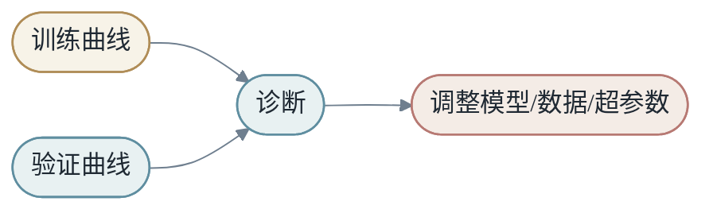
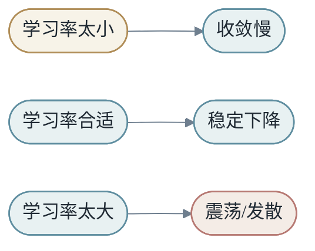
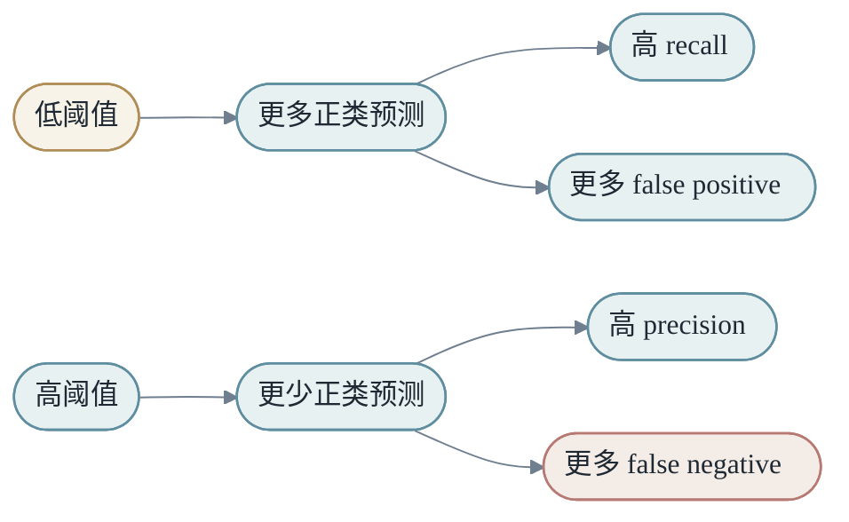

<h1 align="center">第四章：怎么学习模型</h1>

前面我们讨论了 `M` 可以是什么，也讨论了 `X` 如何被表示。现在的问题是：模型如何被学习出来？

学习需要三个要素：数据、损失函数、优化器。


本章按训练流程展开：先讲参数和 loss（要优化什么），再讲梯度和反向传播（怎么算梯度），再讲训练循环和正则化（怎么跑训练），最后讲调试、错误分析和上线门槛（怎么把训练变成可靠工程）。

<h2 align="center">第1节：参数与超参数</h2>

模型通常写作：

$$
ŷ=M_θ(x)
$$

θ 表示模型参数。线性模型中的 `w` 和 `b` 是参数，神经网络中的矩阵和 bias 是参数，embedding table 中的每一行也是参数。

训练的目标是找到一组好参数：

$$
θ^*=argmin_θ J(θ)
$$

参数不是手工指定的规则，而是模型从数据中调整出来的数字。

参数是训练中被优化器更新的量，例如权重矩阵、bias、embedding table。**超参数**是训练前由人设定或通过搜索选择的量，例如学习率、batch size、层数、hidden size、dropout rate。

```text
参数：模型自己学
超参数：人或外部搜索过程决定
```

这个区别很重要。模型不会自动学习所有东西。我们仍然要决定模型规模、数据配方、训练策略和评估目标。后面会看到，很多看似"训练失败"的问题，根因是超参数选错了，而不是模型容量不够。

<h2 align="center">第2节：Loss，错误必须被写成数字</h2>

模型要学习，必须知道自己错了多少。Loss function 把错误变成数字。

回归任务常用均方误差：

$$
L(ŷ,y)=(ŷ-y)^2
$$

分类任务常用交叉熵。若正确类别概率是 $p_c$：

$$
L=-log(p_c)
$$

Loss 的设计非常重要。模型会努力优化你给它的 loss，但这个 loss 不一定完美等于真实业务目标或人类意图。

### 2.1 回归、分类和排序

不同任务需要不同 loss。

- **回归任务**预测连续值，常用 MSE 或 MAE。MSE 对大误差敏感（被平方放大），MAE 对异常值更鲁棒。
- **分类任务**预测类别，常用交叉熵。它鼓励模型把概率质量放到正确类别上。
- **排序任务**关心相对顺序，常用 pairwise 或 listwise loss。

推荐和广告系统里，经常不是只预测一个标签，而是优化点击率、转化率、收益、用户体验之间的组合目标。Loss 设计会直接影响系统行为。

### 2.2 Loss 是模型的价值观

这一点足够重要，需要专门讲一遍。

Loss 不是一个随便选的公式。它告诉模型什么叫错，错多少，以及哪种错更严重。模型会忠实优化你给它的 loss，然后在真实目标上失败或成功。

如果 loss 是点击预测，模型就会追求点击。如果 loss 是停留时长，模型就会追求停留。如果 loss 是人工偏好，模型就会追求人类标注者偏好的答案模式。

这句话有点尖锐，但非常重要：**loss 是模型训练时真正接收的价值观。**

很多产品问题都来自**代理目标错位**。点击不等于满意，停留不等于价值，转化不等于长期信任，拒答率低不等于回答可靠。代理目标可以帮助训练，但不能被误认为真实目标本身。

广告系统中，如果只优化短期点击，可能伤害长期转化和用户信任。内容推荐中，如果只优化停留时长，可能推高低质量沉迷内容。客服机器人中，如果只优化"减少人工转接"，可能让用户问题得不到解决。

### 2.3 Loss 设计的三个层面

Loss 设计需要考虑三个层面：

第一，**数学层**。这个 loss 是否可导、稳定、适合优化？

第二，**统计层**。这个 loss 是否能从数据中可靠估计？标签噪声是否会严重影响？

第三，**产品层**。优化这个 loss 会不会诱导模型做出不希望的行为？

当一个模型"学坏了"，很多时候不是模型突然有了坏意图，而是目标设计让某种坏行为成为优化捷径。

### 2.4 多目标 Loss

真实系统经常有多个目标。推荐系统可能同时关心点击、阅读完成、收藏、负反馈和多样性。广告系统可能同时关心点击率、转化率、收益和用户体验。

最简单做法是加权求和：

$$
L = αL_1 + βL_2 + γL_3
$$

但权重选择不是纯数学问题。不同权重代表不同产品价值取舍。

多目标系统还要防止某个目标支配训练。如果点击信号很多、满意度信号很少，模型可能主要学习点击，而忽略满意度。

### 2.5 训练 loss 和最终指标的错位

训练 loss 下降，不代表最终指标一定变好。比如模型在交叉熵上变好，但产品真正关心的是长期留存或用户满意度。

这就是机器学习系统常见难点：**可优化的目标不一定等于真正目标**。第 8 章会再回到这条线索。

<h2 align="center">第3节：梯度下降与优化器</h2>

如果 loss 是一座山，梯度指向上坡最快的方向。为了降低 loss，我们向负梯度方向走：

$$
θ_{t+1}=θ_t-η∇_θJ(θ_t)
$$

η 是学习率。太小会慢，太大可能发散。


### 3.1 SGD、Momentum 和 Adam

SGD、Momentum、Adam 常被当成黑盒选项。其实它们代表不同更新直觉。

**SGD** 只看当前 mini-batch 的梯度：

$$
θ_{t+1}=θ_t-ηg_t
$$

它简单，但梯度噪声大时会抖动。

**Momentum** 像给参数更新加了惯性。如果连续很多步都指向类似方向，速度会积累；如果方向来回震荡，惯性会平滑更新：

$$
v_t=βv_{t-1}+g_t
$$

$$
θ_{t+1}=θ_t-ηv_t
$$

不同框架的 momentum 实现细节略有差异（有的写成 $v_t = \beta v_{t-1} + (1-\beta)g_t$），但核心思路相同。

**Adam** 为每个参数维护两个统计量：梯度的指数加权移动平均（EWMA）和梯度平方的 EWMA。它会对不同参数使用不同尺度的更新。稀疏特征、embedding、大模型训练中，Adam 往往更容易稳定起步。

但 Adam 不是永远最好。它需要更多优化器状态（每个参数额外两份），占用更多显存。某些任务中，SGD 加 momentum 可能泛化更好。优化器选择也是模型、数据和系统约束的折中。

### 3.2 学习率调度

训练过程中学习率通常不是常数。常见策略包括 warmup、cosine decay、step decay。

**Warmup** 的直觉是：训练初期模型还不稳定，先用小学习率；稳定后再进入较大学习率阶段。深度模型尤其需要 warmup，因为初始参数下 loss surface 可能特别陡峭。

**Cosine decay** 让学习率随时间余弦衰减，训练末期接近 0。这种"先大后小"的曲线在大模型预训练中非常常见。

<h2 align="center">第4节：反向传播</h2>

神经网络是复合函数：

$$
M(x)=f_3(f_2(f_1(x)))
$$

训练需要计算 loss 对每一层参数的梯度。反向传播（backpropagation）就是链式法则的高效实现。

前向传播：

```text
x -> h1 -> h2 -> h3 -> loss
```

反向传播：

```text
loss -> h3 -> h2 -> h1 -> parameters
```

BP 的价值在于复用中间结果。它不是魔法，而是把链式法则组织成适合大规模计算的算法。

### 4.1 一个标量例子

假设：

$$
z=wx+b
$$

$$
L=(z-y)^2
$$

那么：

$$
\frac{dL}{dw}=2(z-y)x
$$

$$
\frac{dL}{db}=2(z-y)
$$

BP 在大网络中做的事情也是这个，只是把所有中间变量组织成计算图，自动复用局部导数。完整的反向传播就是把这个标量例子推广到张量形式，并按计算图的拓扑顺序逐层应用链式法则。

### 4.2 为什么需要保存激活

反向计算梯度时，经常需要前向中的中间值。例如 ReLU 反向需要知道前向输入是否大于 0，矩阵乘法反向需要输入矩阵。

这就是训练显存比推理显存高的原因之一。第 7 章会展开"Gradient Checkpointing"，那是一种"用计算换显存"的技术：不保存所有激活，只保存一部分，反向时重新计算缺失的。

<h2 align="center">第5节：自动微分与训练循环</h2>

现代框架让我们写前向代码，然后自动计算梯度：

```python
y_hat = model(x)
loss = loss_fn(y_hat, y)
loss.backward()
optimizer.step()
```

框架记录计算图，在 `backward()` 时反向传播梯度。

自动微分降低了写模型的门槛，但没有取消数学。理解梯度，仍然是调试训练、理解模型和设计新结构的基础。

### 5.1 最小训练循环

```python
for x, y in dataloader:
    optimizer.zero_grad()
    y_hat = model(x)
    loss = loss_fn(y_hat, y)
    loss.backward()
    optimizer.step()
```

这五行就是现代深度学习训练的最小骨架：清梯度、前向、算 loss、反向、更新。

### 5.2 一个完整二分类示例

假设我们做二分类，输入 `x` 是若干 feature，标签 `y` 是 0 或 1。模型输出一个 logit，再经过 sigmoid 得到概率。

```python
import torch
import torch.nn as nn

model = nn.Sequential(
    nn.Linear(10, 32),
    nn.ReLU(),
    nn.Linear(32, 1),
)

loss_fn = nn.BCEWithLogitsLoss()
optimizer = torch.optim.Adam(model.parameters(), lr=1e-3)

for epoch in range(10):
    for x, y in train_loader:
        optimizer.zero_grad()
        logits = model(x).squeeze(-1)
        loss = loss_fn(logits, y.float())
        loss.backward()
        optimizer.step()
```

这段代码中每一行都对应一个概念：

| 代码 | 概念 |
|------|------|
| `model(x)` | 前向变换 `M_θ(X)` |
| `loss_fn(logits, y)` | 把错误变成数字 |
| `loss.backward()` | 反向传播求梯度 |
| `optimizer.step()` | 用梯度更新参数 θ |

训练代码短，是因为框架隐藏了大量细节。但短不代表简单。数据加载、数值稳定、loss 选择、学习率、batch size、评估和 checkpoint，每一项都会影响最后结果。

### 5.3 常见训练问题

训练中常见问题包括：

- **Loss 不下降**：学习率、数据、标签、模型容量或实现可能有问题。
- **Loss 变成 NaN**：数值溢出、学习率过大、除零、log 输入非法。
- **训练集好但验证集差**：可能过拟合。
- **训练很慢**：数据加载、GPU 利用率、batch size、kernel 性能都可能是瓶颈。

§9 会展开训练调试清单。

<h2 align="center">第6节：验证集如何指导学习</h2>

训练集告诉模型怎么更新参数，验证集告诉人类什么时候该停、该调、该怀疑。

如果训练 loss 下降，验证 loss 也下降，说明模型仍在学到可泛化规律。

如果训练 loss 下降，验证 loss 上升，说明模型开始记住训练集细节。



验证集不是形式主义。它是我们避免自我欺骗的工具。没有验证集，模型可能只是把训练样本背熟；有验证集，我们才能观察模型是否在未见样本上保持能力。

### 6.1 早停

Early stopping 是最常见也最有效的正则化方法之一。当验证指标长时间不再提升，就停止训练，并回到验证集最好的一次 checkpoint。

```text
训练继续 -> 训练 loss 更低
验证变差 -> 泛化更差
早停 -> 保留泛化更好的参数
```

这提醒我们：**最小训练 loss 不一定对应最好模型**。

<h2 align="center">第7节：正则化与泛化</h2>

优化训练 loss 并不等于获得好模型。我们还希望模型泛化。

常见正则化方法包括：

- **Weight decay**：在 loss 中加入 `λ‖θ‖²`，惩罚过大权重。
- **Dropout**：训练时随机屏蔽部分激活，迫使模型不要过度依赖某几个神经元。
- **Data augmentation**：增加输入变化，向模型注入不变性。
- **Early stopping**：验证集不再改善时停止训练。
- **Label smoothing**：把硬标签变成软标签，避免模型对自己过度自信。

正则化的本质，是限制模型不要过度依赖训练集中的偶然细节。

### 7.1 Dropout 的集成直觉

可以把 dropout 粗略理解为训练许多子网络的集成。每次前向都使用略微不同的网络，最终共享参数形成更稳健的模型。

测试时 dropout 关闭，但所有神经元被使用，相当于这些子网络的隐式平均。

### 7.2 数据增强是表征级正则化

数据增强从表面看是"加数据"，从本质上看是"告诉模型这些变化不应该改变标签"。

图像分类中，随机裁剪、翻转、颜色扰动是常见增强。但要注意场景边界——医学影像中的方向、颜色可能本身就是诊断信号，随意翻转会破坏标签。文本任务中，简单删词或改写可能改变语义。

### 7.3 Ablation：检验提升来自哪里

Ablation 是把系统中的某一部分拿掉或替换，观察结果变化。它是正则化和模型设计实验中最有效的工具。

比如一个模型使用了三类 feature：文本、用户画像、历史行为。我们可以分别去掉它们：

| 实验 | 输入 | 指标变化 |
|------|------|----------|
| full | 文本 + 用户 + 历史 | baseline |
| no text | 用户 + 历史 | 看文本贡献 |
| no user | 文本 + 历史 | 看用户画像贡献 |
| no history | 文本 + 用户 | 看历史行为贡献 |

Ablation 帮助我们区分"系统变复杂了"和"系统真的变好了"。要注意：feature 之间可能互相替代，单独移除一个看似无影响不代表它无用——多个 feature 一起移除可能才会显示影响。

<h2 align="center">第8节：学习率与训练稳定性</h2>

学习率 `η` 控制每一步参数走多远。它小到像耐心，也大到像冲动。

学习率太小，loss 下降很慢，训练像在平地上挪动。学习率太大，参数会越过好区域，loss 震荡甚至发散。



学习率不是孤立超参数。它和 batch size、优化器、模型规模、初始化、warmup、梯度裁剪都有关。大 batch 往往可以使用更大学习率，但也可能需要 warmup。Adam 对学习率更宽容，但不代表可以随便设。

一个实用训练流程是：

1. 先用很小数据确认代码能过拟合（见 §9）。
2. 做学习率扫描，找到 loss 能稳定快速下降的区间。
3. 用合适的 warmup 和 schedule 跑完整训练。

### 8.1 梯度裁剪

训练深层网络或序列模型时，梯度可能突然变得很大。一次过大的更新就可能破坏已经学到的参数，让 loss 变成 NaN。

Gradient clipping 的做法是限制梯度范数。如果梯度太大，就按比例缩小。

```text
如果 ||g|| > threshold:
    g = g * threshold / ||g||
```

这不是改变优化目标，而是给优化过程加安全护栏。它尤其常用于 RNN、Transformer、大模型预训练和强化学习。

梯度裁剪也提醒我们：训练不是纯粹数学最优化，还是数值系统。浮点精度、batch 构成、异常样本、loss scaling 都会影响稳定性。

### 8.2 初始化的重要性

深度网络训练开始时，参数通常是随机初始化。随机不代表随便。初始化尺度会影响信号在网络中的传播。

如果权重太大，激活和梯度可能逐层放大，最终爆炸。如果权重太小，信号可能逐层衰减，梯度接近 0。

好的初始化（Xavier、Kaiming、Glorot）让前向信号和反向梯度在深层网络中保持合理尺度。第 5 章会展开"为什么残差、归一化、合适初始化共同让深层网络可训练"。

<h2 align="center">第9节：训练调试清单</h2>

训练失败时，不要一上来改模型结构。先做系统排查。

**第一，检查数据。**

- 输入是否有 NaN 或异常值？
- 标签是否对齐？
- train/validation 是否意外重叠？
- 类别分布是否极端不平衡？

**第二，检查模型。**

- 输出 shape 是否正确？
- 最后一层和 loss 是否匹配？（例如 BCE 配 sigmoid 输出，cross entropy 配 logits）
- 参数是否真的传给 optimizer？
- 是否忘记 `model.train()` 或 `model.eval()`？

**第三，检查优化。**

- 学习率是否过大或过小？
- 梯度是否为 0、NaN 或爆炸？
- batch size 是否太小导致噪声过大？
- 是否需要 warmup 或 gradient clipping？

**第四，检查评估。**

- 指标计算是否和任务一致？
- 阈值是否固定合理？
- 是否只看平均值，忽略了关键分群？

### 9.1 小数据过拟合是第一块试金石

一个实用原则是：**先让模型在一个很小的数据集上过拟合**。如果它连 100 个样本都学不住，通常说明代码、标签或优化存在基本问题。

能过拟合小数据不代表能泛化，但不能过拟合小数据通常说明系统有问题。这是深度学习调试的第一步。

<h2 align="center">第10节：错误分析</h2>

平均指标只能告诉你模型整体如何，错误案例告诉你模型为什么失败。

错误分析可以按几个维度切分：

- **输入类型**：短文本、长文本、噪声文本、低资源语言。
- **用户群体**：新用户、老用户、不同地区。
- **时间**：工作日、周末、节假日、模型上线前后。
- **置信度**：高置信错误和低置信错误。
- **业务代价**：严重错误和轻微错误。

**高置信错误**尤其值得看。模型非常确定但错了，往往说明训练数据、标签定义或表征存在系统性问题。


错误分析把模型训练重新连接回数据和任务。它让我们不只是追逐一个数字，而是理解模型的行为边界。

### 10.1 错误案例库

错误分析的产出应该结构化保存。每个错误样本至少记录：输入摘要、真实标签、预测标签、置信度、场景、用户群体、时间、可能根因。

平均分告诉你总体表现，错误案例告诉你系统如何失败。一个模型从 90 分提升到 91 分，可能听起来很好。但如果新增错误集中在高价值用户、医疗高风险样本或安全场景，这个提升可能不可接受。反过来，总体分数不变，但关键错误类型减少，也可能是重要进步。

每次线上事故都应该留下测试。每次人工审核发现系统性问题，都应该进入案例库。久而久之，案例库成为系统记忆。

<h2 align="center">第11节：从模型输出到产品决策</h2>

模型输出是分数或概率，但产品需要决策。把分数变成决策，涉及类别不平衡和阈值两个问题。

### 11.1 类别不平衡

很多任务中，正负样本极不平衡。欺诈检测中，欺诈样本很少；医疗筛查中，阳性样本可能很少；广告转化中，转化率也常常很低。

如果 99% 样本是负类，一个总是预测负类的模型 accuracy 就有 99%。但它完全没用。

这时需要看 precision、recall、F1、AUC、PR-AUC，以及不同阈值下的业务代价。

```text
Accuracy 高，不代表模型对少数类有用。
```

处理类别不平衡的方法包括：

- **重采样**：过采样少数类或欠采样多数类。
- **class weight**：在 loss 中对少数类加大权重。
- **focal loss**：动态降低易分样本权重，让模型聚焦难样本。
- **调整阈值**：在 inference 时根据成本曲线选阈值。
- **分层评估**：按类别和子群体分别报告指标。

关键不是机械套方法，而是理解错误代价。如果漏掉欺诈代价很高，就要提高 recall；如果误报成本很高，就要控制 precision。

### 11.2 阈值不是小事

二分类模型通常输出概率，但产品需要决策。例如概率超过多少就拦截、推荐、报警或转人工。

阈值决定 precision 和 recall 的取舍。

阈值低，模型更容易预测正类，recall 提高，但 false positive 增加。阈值高，precision 可能提高，但漏掉更多正例。



阈值应该根据场景选择，而不是默认 0.5。医疗、风控、内容审核、推荐系统都有不同错误代价。

阈值还可能随时间失效。数据分布变化、模型校准变化、业务容量变化都会让旧阈值不再合适。把阈值纳入监控和定期重校准，是成熟系统的标志。

<h2 align="center">第12节：实验管理与可复现</h2>

训练模型不是一次性脚本，而是一系列实验。没有实验管理，很快就会忘记哪次改动带来了提升。

### 12.1 实验记录的最少字段

一次实验至少应该记录：

- 数据版本
- 代码版本
- 模型配置
- 超参数
- 随机种子
- 训练指标
- 验证指标
- 最终 checkpoint
- 关键错误案例

```text
不可复现实验 = 无法积累知识
```

实验管理的目标不是形式主义，而是让每次尝试都能回答一个问题：**这次变化到底改善了什么？它是否稳定？代价是什么？**

### 12.2 Checkpoint 和恢复

长时间训练必须保存 checkpoint。Checkpoint 不只是模型权重，还应该包括优化器状态、学习率调度器状态、随机数状态、训练步数和配置。

如果只保存权重，恢复训练时 Adam 的动量状态丢失，训练轨迹会改变。学习率调度器状态丢失，也可能导致恢复后学习率错误。

一个完整 checkpoint 应包含：

- model state
- optimizer state
- scheduler state
- random seed / RNG state
- step / epoch
- config
- tokenizer 或 feature 版本

Checkpoint 的另一个作用是模型选择。训练结束后未必使用最后一步，而是使用验证集最好的一步。

### 12.3 可复现性

可复现性不是绝对的。GPU 并行、非确定性 kernel、数据加载顺序、随机初始化都会影响结果。但我们仍然要尽量记录和控制。

最低限度需要记录：代码版本、数据版本、配置、随机种子、环境、硬件、依赖库版本。

可复现性不是为了形式，而是为了**比较**。如果一个实验提升了 1%，但无法复现，我们不知道它是方法有效还是随机波动。

在研究中，不可复现会让结论不可靠。在生产中，不可复现会让线上事故难以定位。

<h2 align="center">第13节：从训练到上线的门槛</h2>

一个模型训练完成，不代表可以上线。上线前至少要过几道门。

第一，**离线指标是否超过 baseline**。

第二，**关键分群是否没有退化**。

第三，**错误案例是否可接受**。

第四，**延迟和成本是否满足要求**。

第五，**监控和回滚是否准备好**。

第六，**线上灰度计划是否清楚**。


机器学习工程中，很多风险不是"模型不够聪明"，而是"上线流程不够谨慎"。

### 13.1 模型选择不是排行榜选择

模型选择不是看哪个模型在公开榜单最高，而是看哪个模型最适合当前约束。

约束包括：

- 数据规模。
- 标签质量。
- 推理延迟。
- 解释性要求。
- 部署环境。
- 维护成本。
- 失败代价。

一个小线性模型可能比大模型更适合高频低延迟场景。一个可解释树模型可能比黑盒网络更适合合规场景。一个强大 LLM 可能适合开放问答，但不适合毫秒级广告排序。

模型选择的成熟问题不是"哪个最强"，而是"**哪个在约束下最好**"。

### 本章在 X → Y by M 中的位置

第四章把训练过程作为完整工程展开：

- **参数 θ** 是模型可学习的部分；**超参数**由人决定。
- **Loss** 把错误变成可优化的数字，也是模型真正听从的"价值观"。
- **梯度下降**沿着 loss 降低的方向更新参数，**优化器**（SGD、Momentum、Adam）是不同的更新直觉。
- **反向传播**高效计算复合函数梯度；**自动微分**把它工程化。
- **正则化**让模型不要过度依赖训练集偶然细节。
- **学习率、初始化、梯度裁剪**等技巧决定训练是否稳定。
- **验证集、错误分析、阈值、实验管理**让训练变成可积累、可复现的工程过程。
- **上线门槛**让训练好的模型真正进入产品。

接下来的第 5 章会问：当 `M` 变得很深，许多层可学习变换复合起来，会发生什么？

### 思考题

1. 参数和超参数有什么区别？各举三个例子。如果有"自动调超参"的工具，它的"自动"是怎么定义的？
2. 为什么训练 loss 下降不一定代表产品指标变好？给出三个具体场景。
3. 手推 $L=(wx+b-y)^2$ 对 `w` 和 `b` 的梯度，并解释这两个梯度的几何意义。
4. 为什么训练时需要保存中间激活？这和推理时显存占用为什么不同有什么关系？
5. 如果模型过拟合，你会优先尝试哪些方法？按代价和效果排序。
6. 为什么学习率过大可能导致 loss 发散？如果你想知道哪个学习率合适，你会怎么实验？
7. 设计一个 ablation 表，分析一个推荐模型中三类 feature（用户、物品、上下文）的贡献。如果某个 feature 单独移除影响小，你能立即得出它无用的结论吗？
8. 为什么高置信错误比低置信错误更值得优先分析？
9. 一个二分类模型在医疗筛查上 accuracy 99%，但 recall 只有 50%。这种模型可以上线吗？如果不能，你会怎么改？
10. 一个训练好的模型，怎么判断它"可以上线"？写一份 checklist。
