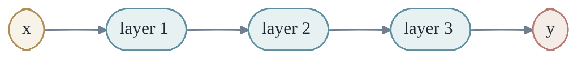
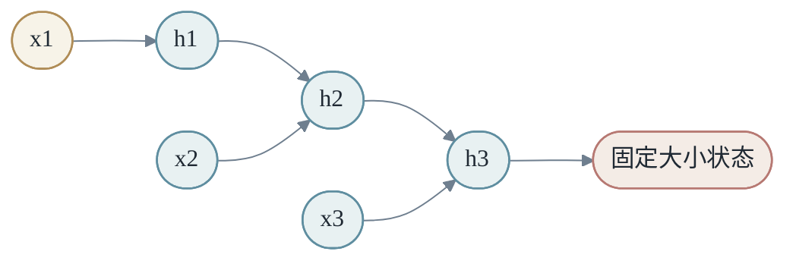
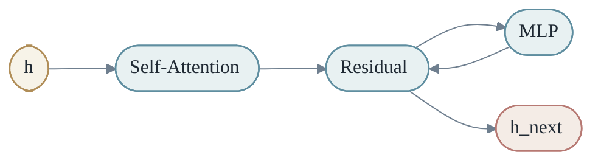
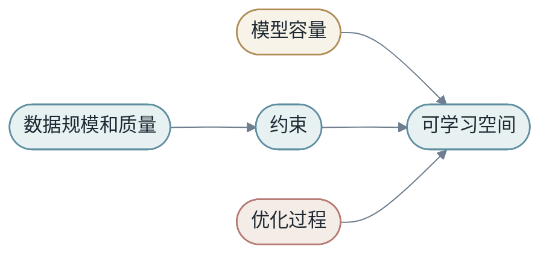

<h1 align="center">第五章：深度学习</h1>

深度学习的核心不是某一个单独算法，而是一个思想：把许多可学习变换复合起来，让模型自己形成中间表征。

第 2 章建立了变换语言，第 3 章构造了 `X`，第 4 章解释了 θ 如何被优化。本章把这三条线接到一起：当 `M` 被做成 N 层可学习函数复合，每层都改变一点表征，会发生什么？

<h2 align="center">第1节：神经网络是复合变换</h2>

一层神经网络可以写成：

$$
h_{l+1}=σ(W_lh_l+b_l)
$$

多层网络就是函数复合：

$$
M(x)=f_L(f_{L-1}(...f_1(x)))
$$

每层都做一个相对简单的变换，许多层组合后形成复杂函数。



这条链路里最重要的词是"复合"。深度学习不是找到一个巨大但扁平的公式，而是把很多小函数排成流水线。每个函数都改变一点表征，最后整体形成从输入到输出的复杂变换。

如果输入是一张图片，第一层可能只学到边缘、颜色变化和局部纹理；中间层把这些局部模式组合成眼睛、耳朵、轮廓；更高层再组合成"猫"或"狗"这样的语义概念。这种层级抽象在 Transformer 中也部分成立，只是具体形式更难直接看出。

如果输入是一句话，早期层可能处理词形和局部搭配，中间层处理短语关系，高层处理语义、指代和任务意图。

### 1.1 Shape 追踪

深度学习代码里，shape 是最朴素的真相。很多模型错误不是理论错了，而是某个 tensor 的维度没有按你以为的方式流动。

假设一个 batch 有 `B` 个样本，每个样本维度是 `D`。线性层把它变成 `H` 维：

```text
X: [B, D]
W: [D, H]
b: [H]
Y: [B, H]
```

在程序中就是：

```python
Y = X @ W + b
```

养成习惯：每写一个 tensor 操作，在注释里写下 in/out shape。后面 Transformer 部分会看到，光是把 shape 链路写清楚，就能解决一半的 attention bug。

### 1.2 完整路径的最小示例

最小语言模型可以写成：

```text
token ids
  -> token embedding
  -> position embedding
  -> Transformer blocks
  -> final norm
  -> vocab projection
  -> logits
```

对应到 `X -> Y by M`：

- `X` 是 token id 序列。
- `M` 是 embedding、Transformer blocks 和输出投影的复合。
- `Y` 是每个位置的 next-token logits。


理解这条路径之后，大模型只是把同样结构扩展到更多层、更大 hidden size、更多 head、更大数据和更复杂系统。

<h2 align="center">第2节：为什么需要非线性</h2>

如果每一层都是线性变换，那么多层叠加仍然等价于一个线性变换。

更形式化地说，两层线性网络是：

$$
y=W_2(W_1x+b_1)+b_2 = (W_2W_1)x+(W_2b_1+b_2)
$$

也就是说，叠再多层，本质上还是一个线性层。**深度只有在非线性存在时才真正有意义。**

非线性激活让模型可以弯曲空间。ReLU、GELU、tanh 都是让模型摆脱纯线性限制的入口。

ReLU 把空间切成许多区域：

$$
ReLU(x)=max(0,x)
$$

每个区域内模型近似线性，但整体可以由许多线性片段拼成复杂形状。这是理解神经网络表达能力的一个好入口：它不是处处神秘，而是许多简单片段的组合。

<h2 align="center">第3节：MLP 与表达能力</h2>

MLP（多层感知机）是最基本的深度网络。它看起来只是线性层和激活函数交替出现，但这种简单结构已经可以表达非常复杂的函数。

一个两层 MLP 可以写成：

$$
h=σ(W_1x+b_1)
$$

$$
y=W_2h+b_2
$$

第一层把输入投影到 hidden space，并用非线性切分空间。第二层把 hidden features 组合成输出。

```python
import torch
import torch.nn as nn

model = nn.Sequential(
    nn.Linear(4, 16),
    nn.ReLU(),
    nn.Linear(16, 1),
)

x = torch.randn(8, 4)   # 8 samples, 4 features each
y = model(x)            # shape: [8, 1]
```

这个模型虽然很小，但已经包含深度学习的基本结构：线性变换、非线性激活、函数复合、batch 计算。

### 3.1 Hidden Unit 的几何直觉

可以把 hidden units 想成一组可学习探测器。每个 hidden unit 对输入空间中的某些方向敏感。ReLU 决定它是否激活。很多 hidden units 共同把空间切成许多区域。


### 3.2 MLP 的局限：忽略数据结构

MLP 的问题不是表达能力不够，而是没有利用数据结构。图像有局部结构，文本有顺序结构，图有邻接结构。MLP 把所有输入维度一视同仁，往往需要更多数据才能学到结构。

这解释了为什么 CNN、RNN、Transformer 不是取代 MLP 的"更复杂玩具"，而是**把结构先验放进模型，让学习更高效**。后面三节正是讲这些归纳偏置。

<h2 align="center">第4节：CNN 与图像</h2>

CNN 利用图像的局部性和平移共享。卷积核在图像上滑动，对不同位置使用同一组参数。

$$
y_{i,j}=\sum_{u,v}K_{u,v}x_{i+u,j+v}
$$

CNN 的两个关键先验是：

- **局部性**：相邻像素之间关系更强。模型先看小区域，而不是一开始就把整张图全部混合。
- **权重共享**：同一种局部模式可以出现在图像不同位置。同一个"竖直边缘检测器"不应该只在左上角有效，也应该在右下角有效。

```text
同一卷积核 + 不同位置 -> 检测同一种局部模式
```

如果用全连接层处理一张 `224 x 224 x 3` 的图像，参数量会非常大，而且完全不利用图像结构。卷积层通过小窗口和共享参数，把"寻找局部模式"这件事变得高效。

### 4.1 从变换观理解 CNN

CNN 不是只做分类。它在每一层把图像从一种空间变换到另一种空间：

```text
像素空间 -> 边缘/纹理空间 -> 局部部件空间 -> 对象语义空间
```

每个 feature map 都是对原图的一种重新描述。深层 CNN 的本质，是逐步把低级视觉信号变成高级语义表征。

深层 CNN 逐步扩大感受野。早期层看小区域，后期层通过多层叠加看到更大区域。这样模型从局部纹理走向全局对象。

### 4.2 池化和不变性

Pooling 曾经是 CNN 中非常常见的操作。它把局部区域压缩成一个值，例如 max pooling 取局部最大激活。

Pooling 的直觉是：我们不需要精确知道某个边缘出现在局部区域的哪个像素，只需要知道它大概存在。这提供了一点平移不变性。

现代架构中，stride convolution、attention 和 patch merging 也承担类似角色：逐步压缩空间分辨率，同时保留对任务有用的信息。

<h2 align="center">第5节：RNN 与序列</h2>

RNN 逐步读取序列，用隐藏状态保存历史：

$$
h_t=f(h_{t-1},x_t)
$$

它的直觉自然——读到第 `t` 个 token 时，隐藏状态 $h_t$ 应该概括此前内容。



### 5.1 状态瓶颈

问题在于，这个状态向量必须承载所有历史信息。

如果序列很短，隐藏状态足以携带历史。如果序列很长，所有历史都必须挤进一个固定维度向量。早期信息可能被覆盖，梯度也要沿时间链条一步步传回去，容易出现梯度消失或爆炸。

LSTM 和 GRU 用门控（gate）缓解这个问题。门决定哪些信息写入、保留或遗忘。但它们仍然是顺序计算，很难像 Transformer 那样一次性并行处理整个序列。

Transformer 的突破之一，是不再把历史压缩进单一状态，而是让每个 token 直接访问其他 token 的表示。**Attention 把"记忆"从一个隐藏向量扩展成一组可寻址的 token states。**

<h2 align="center">第6节：Attention 是动态变换</h2>

Attention 让模型根据内容动态选择信息：

$$
Attention(Q,K,V)=softmax\left(\frac{QK^T}{\sqrt{d_k}}\right)V
$$

从变换观来看，attention 是一种**输入相关的动态变换**。普通线性层用固定矩阵 `W` 混合信息；attention 则先根据当前输入生成权重矩阵 `A`，再用 `A` 混合 value：

$$
A=softmax(QK^T/\sqrt{d_k})
$$

$$
O=AV
$$

这意味着同一个模型在不同句子上会采用不同的信息流路径。一个 token 可以关注前面的主语，也可以关注很远处的定义、条件或代码变量。

### 6.1 Q、K、V 的角色

每个 token 生成 query、key、value。

- **Query** 问"我需要什么信息"。
- **Key** 表示"我有什么特征可被匹配"。
- **Value** 是"如果被关注，我提供什么内容"。

```text
当前位置的问题：我需要什么信息？ -> Query
其他位置的标签：我提供什么信息？ -> Key
其他位置的内容：真正被搬运的信息 -> Value
```

这三个角色很重要。Query 和 Key 决定路由，Value 决定内容。Attention score 高，不代表某个 token "重要"于全部任务，只表示在当前 head、当前层、当前 token 的计算中，它被更多使用。

### 6.2 为什么除以 √d_k

如果不除以 $\sqrt{d_k}$，当 $d_k$ 很大时，$QK^T$ 的方差会随 $d_k$ 线性增长。这会让 softmax 输入的尺度过大，softmax 后大部分概率质量集中到极少数位置，梯度变得极小。除以 $\sqrt{d_k}$ 把方差控制在 O(1)，让 softmax 工作在合理范围内。

### 6.3 Multi-Head Attention

单个 attention head 只能用一种相似性方式匹配 token。Multi-head attention 同时使用多个 head：

```text
head 1: 语法关系
head 2: 指代关系
head 3: 局部搭配
head 4: 任务相关线索
```

这只是直觉描述，不是每个 head 都一定这么清晰。但多个 head 的确给模型提供了多种并行的信息选择通道。

### 6.4 多层 Attention：反复通信

第一层 attention 可能更多处理局部搭配，后面层可能处理更抽象关系。但这不是绝对规律。模型会根据任务和数据自组织。

多层 attention 的关键是**反复通信**。一个 token 第一层拿到邻近信息，第二层可以基于更新后的表示再访问更远信息。多层叠加后，信息可以沿序列传播和重组。

<h2 align="center">第7节：Transformer Block：结构与 shape</h2>

Transformer block 交替执行两类变换：

- **token 之间的信息交换**：self-attention
- **token 内部的非线性加工**：MLP



更完整的 Transformer block 通常还包含 LayerNorm 和残差连接：

$$
h'=h+Attention(Norm(h))
$$

$$
h_{next}=h'+MLP(Norm(h'))
$$

残差连接让信息可以绕过复杂变换直接传递，缓解深层训练困难。LayerNorm 稳定每层输入尺度。MLP 则负责对每个 token 的内部表征进行非线性加工。

### 7.1 Transformer 的最小伪代码

```python
def transformer_block(h):
    h = h + self_attention(layer_norm(h))
    h = h + mlp(layer_norm(h))
    return h
```

这个伪代码没有展示所有工程细节，但抓住了结构本质：**残差路径上串联 attention 和 MLP**。

### 7.2 Shape 链路

Transformer 最容易让初学者迷路的地方，不是公式，而是 shape。

假设输入 hidden state 是：

```text
h: [B, T, H]
```

其中 `B` 是 batch size，`T` 是序列长度，`H` 是 hidden size。Q/K/V 投影后：

```text
Q: [B, T, H]
K: [B, T, H]
V: [B, T, H]
```

如果有 $n_{\text{heads}}$ 个 head，每个 head 维度是 $D = H / n_{\text{heads}}$，通常会 reshape 成：

```text
Q: [B, n_heads, T, D]
K: [B, n_heads, T, D]
V: [B, n_heads, T, D]
```

Attention score 的 shape 是：

```text
Q @ K^T -> [B, n_heads, T, T]
```

最后乘以 V：

```text
Attn @ V -> [B, n_heads, T, D]
```

再合并 head：

```text
output -> [B, T, H]
```

这条 shape 链路就是 Transformer 的"骨架"。**如果你能在纸上写清每一步 shape，Transformer 就不再是黑箱。**

<h2 align="center">第8节：Attention Mask</h2>

Attention 并不是所有 token 都可以看所有 token。语言模型训练中，第 `t` 个位置不能看到未来 token，否则 next-token prediction 就泄漏答案。

**Causal mask** 的作用是遮住未来位置：

```text
位置 i 只能看 j <= i 的 token
```

矩阵形式大致是（本书约定：1 表示可见，0 表示不可见）：

```text
1 0 0 0
1 1 0 0
1 1 1 0
1 1 1 1
```

实现中通常会把不可见位置的 score 加上一个极小值（例如 -1e9），让 softmax 后概率接近 0。

Mask 还有其他用途：

- **Padding mask** 避免模型关注 padding token。
- **Segment mask** 控制不同片段之间是否可见。
- **Retrieval mask** 控制模型只访问特定外部记忆。

从变换观来看，mask 是对信息流的**结构约束**。它决定了 `M` 在序列内部允许哪些路径存在。

<h2 align="center">第9节：残差连接</h2>

深层网络难训练，一个原因是信息和梯度要穿过太多非线性变换。残差连接提供了一条近似"直通路径"：

$$
h_{next}=h+F(h)
$$

如果某一层暂时没学好，模型至少可以通过 `h` 保留原信息。训练中，层可以学习"在原表示上做小修改"，而不是每层都重新构造全部表示。

这让很深的网络变得可训练。Transformer 中几乎所有主要子层都包在残差结构里：attention、MLP、甚至某些扩展模块。

可以把残差理解为一种**保守更新**：

```text
新表示 = 旧表示 + 本层建议的修改
```

这个视角和梯度下降很像。模型不是每层完全推翻前一层，而是逐步重写表征。

残差连接也让梯度更容易沿一条短路径回传到早期层，避免梯度消失。可以把每一条残差路径看成一条 highway。

<h2 align="center">第10节：MLP 在 Transformer 中的角色</h2>

很多解释把 Transformer 的重点全放在 attention 上，但 MLP 同样重要。

Attention 负责 token 之间的信息交换。MLP 负责每个 token 内部的非线性变换。没有 MLP，模型只是不断线性混合 value，表达能力会受限。

Transformer MLP 通常先把 hidden dimension 扩大，再压回去：

```text
[B, T, H] -> [B, T, 4H] -> [B, T, H]
```

扩大的中间维度给模型更多非线性组合空间。GELU 或 ReLU 选择哪些中间特征激活，第二个线性层再把它们合成回 hidden space。

可以把 MLP 看成 **token-wise computation**，把 attention 看成 **cross-token communication**。Transformer 的力量来自两者交替。

近年研究还发现，Transformer 参数的相当一部分集中在 MLP 中。MoE（第 6 章会讲）就是把 MLP 拆成多个 expert，按 token 路由——它改变的正是 Transformer 中"内部加工"这一部分。

<h2 align="center">第11节：初始化、归一化与训练稳定性</h2>

深层网络的训练稳定性不靠运气。它依赖三件事一起工作：合适初始化、归一化层、残差结构。

### 11.1 初始化

深度网络训练开始时，参数通常是随机初始化。随机不代表随便。初始化尺度会影响信号在网络中的传播。

如果权重太大，激活和梯度可能逐层放大，最终爆炸。如果权重太小，信号可能逐层衰减，梯度接近 0。

```text
太小：信息消失
太大：数值爆炸
合适：信号可传播
```

好的初始化让前向信号和反向梯度在深层网络中保持合理尺度。常见方案有 Xavier/Glorot 初始化（适合 tanh）和 Kaiming/He 初始化（适合 ReLU），它们都基于"保持每层输入输出方差不变"的原则。本书不展开具体公式，但读者应知道：**初始化是有专门理论的，不应随手设**。

### 11.2 LayerNorm 和归一化

深层网络训练时，每层输入分布会随着参数更新不断变化。Normalization 的作用，是让每层看到的数值尺度更稳定。

**LayerNorm** 对每个 token 的 hidden dimension 做归一化。它不依赖 batch 内其他样本，因此非常适合序列模型和语言模型。

```python
# pseudocode
mean = h.mean(dim=-1, keepdim=True)
var  = h.var(dim=-1, keepdim=True)
h_norm = (h - mean) / sqrt(var + eps) * gamma + beta
```

**BatchNorm** 是另一种归一化，按 batch 维度做。它在 CNN 中很常见，但在序列模型中由于 batch 内不同样本长度不同、推理时 batch 形态变化大，不如 LayerNorm 稳。

**RMSNorm** 是 LayerNorm 的简化版本（不减均值，只除以 root mean square），在大语言模型中越来越常用，因为它便宜又稳定。

归一化让后续层看到更可控的输入。对优化器来说，这相当于让地形更平滑，减少某些方向过陡、某些方向过平的问题。归一化看起来只是工程细节，实际是让大模型可训练的关键结构之一。

### 11.3 Pre-Norm 和 Post-Norm

Transformer block 中，LayerNorm 可以放在子层前或子层后。

**Pre-Norm**：

```text
h = h + sublayer(norm(h))
h = h + mlp(norm(h))
```

**Post-Norm**：

```text
h = norm(h + sublayer(h))
h = norm(h + mlp(h))
```

大模型训练常偏向 Pre-Norm，因为残差路径更直接，梯度更容易穿过许多层。Post-Norm 在早期 Transformer 中常见，但深层训练可能更难，需要更小心的初始化和 warmup。

### 11.4 三件事的协作

初始化、归一化、残差结构在深度模型中互相支撑。

- 初始化给训练一个好起点。
- 归一化让每层数值尺度可控。
- 残差让梯度有短路径回传。

少了任何一个，深层网络都难以训练。这就是为什么"把模型做深"在 2010 年代以前长期是研究难题——这三件事还没被组合起来。

<h2 align="center">第12节：Dropout 与正则化</h2>

Dropout 训练时随机屏蔽一部分激活。它迫使模型不要过度依赖某几个神经元。

可以把 dropout 粗略理解为训练许多子网络的集成。每次前向都使用略微不同的网络，最终共享参数形成更稳健的模型。

Dropout 不是任务本身的一部分，却深刻影响模型是否泛化。注意：**推理时应该关闭 dropout**（PyTorch 中通过 `model.eval()` 切换）。这是初学者最常见的 bug 之一。

其他正则化方法（weight decay、early stopping、数据增强）已经在第 4 章 §7 讨论过。这里强调一点：深度学习的成功不是单个公式，而是**一整套结构、优化和系统技巧共同作用**。

<h2 align="center">第13节：深度与容量</h2>

层数代表多轮变换。每一层都可以交换信息、重写表示、提取结构。

浅层模型可能只能处理局部或简单关系。深层模型可以逐步构造抽象：从 token 到短语，从短语到句子，从句子到任务意图，从局部事实到多步推理。

当然，更多层不自动更好。深层训练需要残差、归一化、合适初始化、优化器和数据规模。没有这些支撑，深层网络可能训练不动。

层数还影响推理延迟。每层都要计算 attention 和 MLP。模型越深，单 token decode 越慢。因此生产系统常常在质量和延迟之间做选择（第 7 章会展开）。

### 13.1 模型容量和数据规模

模型容量太小，会欠拟合。容量太大而数据不足，会过拟合或记忆。现代大模型成功的关键之一，是容量和数据规模同时增长。

但"更多数据"也不是越多越好。低质量数据、重复数据、错误数据会消耗训练计算，甚至伤害模型。数据质量、去重、配比、课程顺序都会影响结果。

模型容量可以理解为能表达多少复杂函数。数据规模提供约束，让模型在巨大函数空间中找到有用规律。优化过程则是在这个空间中导航。



### 13.2 过参数化与泛化之谜

第 1 章 §3 提到，深度学习有趣的地方是：模型参数往往远超训练样本数，但仍然能泛化。这违反传统统计学习理论的直觉。

可能的解释包括：

- 优化过程（特别是 SGD）有隐式正则化，倾向于找简单解。
- 神经网络的"有效自由度"远小于参数总数。
- 数据本身在一个低维流形上，模型只需在这个流形上稳定即可。

这仍然是开放问题。但作为实践指引：**大模型加大数据 + 合理正则化 + 优化技巧**，通常能避免过拟合。

<h2 align="center">第14节：训练中表征如何变化</h2>

训练深度网络不是一次性找到答案，而是在高维参数空间中不断调整。每一步都很小，但累积起来改变了模型内部的表征。

从外部看，我们只看到 loss 下降。从内部看，模型在重新组织空间：原来混在一起的样本逐渐分开，原来不稳定的方向逐渐被压平，原来无意义的维度逐渐承载任务信息。

### 14.1 表征逐层变得更有任务性

一个未训练网络的中间层只是随机投影。训练后，中间层开始形成结构。

- 在图像任务里，同类图片的表示可能更接近。
- 在文本任务里，语义相近的句子可能更接近。
- 在推荐任务里，偏好相近的用户和商品可能在 embedding 空间中靠近。

这说明训练不只是调整最后分类头，而是在塑造整条变换链。

```text
原始 X -> 随机中间空间 -> 任务相关中间空间 -> Y
```

linear probe（在冻结的中间层上加一个线性分类器）可以衡量"这一层是否包含任务相关信息"，常用于评估表征质量。

### 14.2 Loss 曲线只是投影

Loss 曲线是一维数字，它把复杂训练过程压缩成一条线。它有用，但不完整。

训练 loss 下降，可能代表模型真正学到规律，也可能代表模型记住训练集。验证 loss 上升，可能代表过拟合，也可能代表验证集分布不同。生成样例变好，可能和 loss 一致，也可能只是局部改善。

所以训练观察应该包含多层信号：loss、metric、样例、分群、梯度范数、激活分布、学习率、吞吐和显存。

<h2 align="center">第15节：Embedding 层与模型记忆</h2>

Embedding 层常被初学者看作输入预处理。实际上，它是可学习参数，是模型记忆的一部分（第 3 章 §5 已讨论 embedding 的几何意义，这里强调它在模型训练中的角色）。

Token embedding 记录词或子词的初始表示。Position embedding 或 RoPE 记录位置信息。推荐系统中的 user embedding、item embedding 记录实体历史行为的压缩表示。

**Embedding 是参数，参与梯度更新**。每次反向传播只更新被访问到的行。这给训练带来了几个含义：

- 高频 token 或高频实体的 embedding 被频繁更新，表示稳定。
- 低频 token 的 embedding 更新少，表示可能噪声大。
- 新对象没有历史，embedding 不存在或随机初始化——这是冷启动问题（已在第 3 章讨论）。

Embedding 也是 `X` 进入 `M` 的第一道可学习门。这也是为什么表征和模型不能分开看。

<h2 align="center">第16节：深度学习的调试顺序</h2>

训练出问题时，不要先换大模型。更稳的调试顺序是从简单到复杂。

第一，**确认数据能被读对**。打印样本、标签、shape 和 mask。

第二，**在很小数据集上过拟合**。如果模型连 100 条样本都记不住，说明代码、loss 或优化过程有问题。

第三，**检查 loss 是否按预期下降**。随机标签时不应有真实泛化，真实标签时应明显优于 baseline。

第四，**逐步增加复杂度**：数据量、模型大小、正则化、增强、调度器。

第五，**看错误样例，而不是只看平均指标**。


这个顺序避免把简单 bug 伪装成深奥研究问题。

### 16.1 小模型是理解大模型的入口

初学者有时直接从大模型开始，容易把所有现象都归因于规模。其实很多大模型问题在小模型中都有缩影。

小模型也会过拟合，也会欠拟合，也需要 feature，也有 loss，也有优化器，也有 train/test gap。小 Transformer 也有 embedding、attention、MLP、LayerNorm、残差和输出头。

在小模型中，你可以打印每个 tensor 的 shape，可以观察梯度，可以快速跑实验，可以故意制造错误，看系统如何失败。这些经验迁移到大模型时非常有价值。

大模型的特殊性在于规模带来的 emergent behavior、系统复杂度和数据广度。但它没有脱离基本学习框架。

所以学习顺序应该是：**先用小模型建立可解释的心智模型，再用大模型理解规模如何改变边界**。

### 本章在 X → Y by M 中的位置

第五章把深度学习作为"可学习变换的复合"展开：

- **神经网络是函数复合**——每层都改变一点表征。
- **非线性**让深度有意义。
- **MLP** 是最基本的深度网络；**CNN** 利用图像结构；**RNN** 利用序列状态；**Transformer** 用 attention 实现动态信息路由。
- **Attention** 是输入相关的动态变换，QK 决定路由，V 决定内容。
- **Transformer block** 由 attention 和 MLP 交替，加上残差和归一化。
- **初始化、归一化、残差**共同让深层网络可训练。
- **训练中模型在塑造表征空间**，让任务相关结构在高层凸显。
- **小模型是理解大模型的入口**——所有现象在小尺度先看清。

接下来的第 6 章会问：当 `M` 不只是几十层 Transformer，而是包含上下文、工具、检索、Agent 循环的完整系统时，会发生什么？

### 思考题

1. 证明两层线性网络如果没有激活函数，等价于一层线性网络。如果加上 ReLU，是否还等价？为什么？
2. 对一个形状为 `[B, T, H]` 的 hidden state，写出经过 Q/K/V 投影、reshape 成多 head、做 attention、最后输出后每一步的 shape。
3. 用自己的话解释：attention 为什么是一种"动态变换"？它和普通的线性层有什么本质不同？
4. CNN 和 Transformer 分别利用了什么结构先验？它们在哪些场景下各自更自然？
5. 为什么 Attention 中要除以 $\sqrt{d_k}$？如果不除会发生什么？
6. 残差连接是怎么让深层网络变得可训练的？从信息流和梯度流两个角度解释。
7. 为什么 Transformer 中 MLP 通常先扩大维度再压回去？这种"扩展-压缩"的模式有什么意义？
8. 初始化、归一化和残差结构是怎么协同的？如果只去掉其中一个，深度模型还能训练吗？
9. 一个 24 层 Transformer 的中间层（第 12 层）的 hidden state 最可能包含什么类型的信息？设计一个 linear probe 实验来验证你的猜想。
