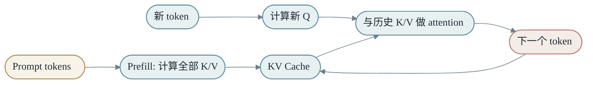
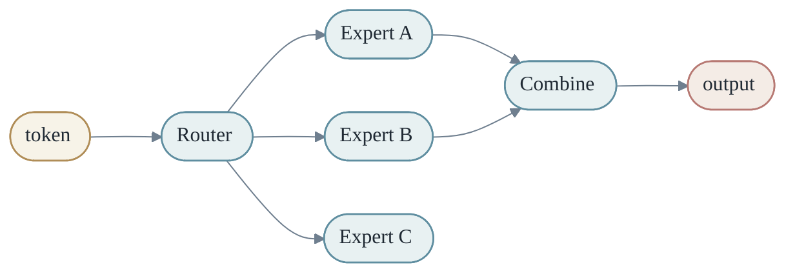
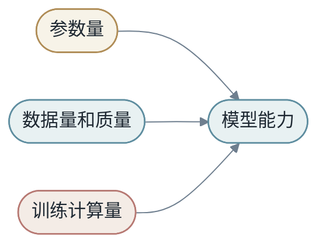
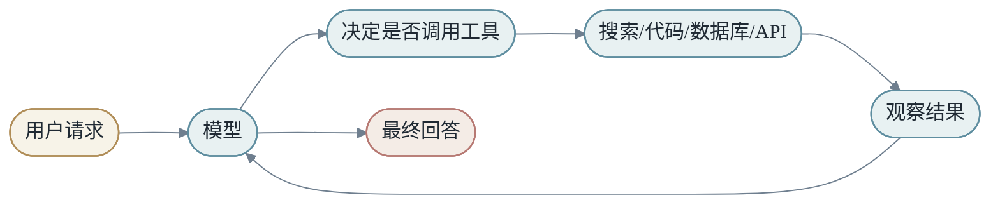
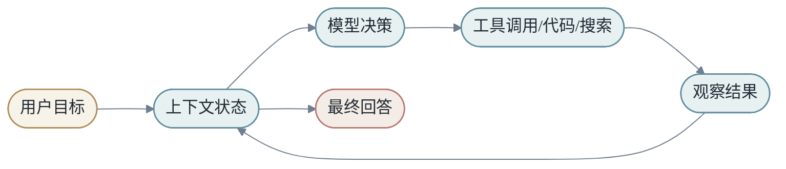
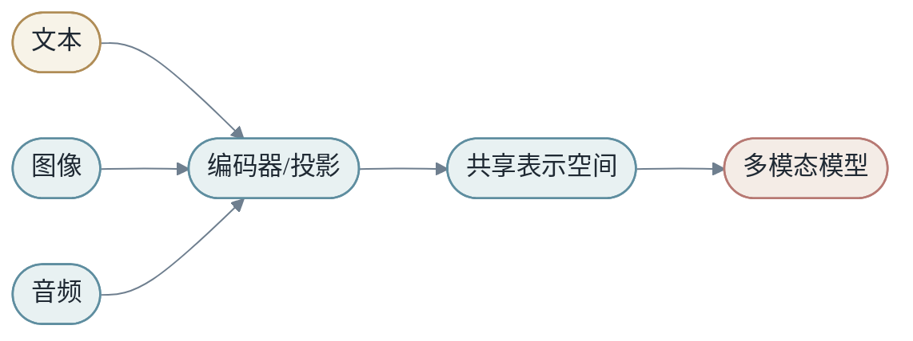
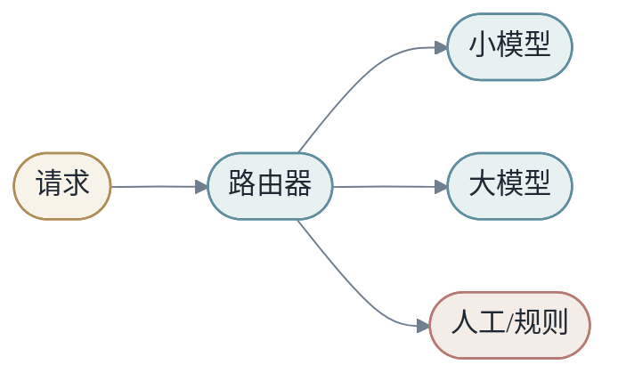

<h1 align="center">第六章：大模型时代的变换</h1>

大模型时代并没有改变 `X -> Y by M` 的主线，而是把 `M` 放大到前所未有的规模，并让它具备上下文、记忆、工具和系统行为。

本章按四个主题展开：

- **A 部分（§1–§3）：语言模型的基础形态** — 训练目标、生成机制、推理缓存。
- **B 部分（§4–§7）：扩展模型** — 长上下文、MoE、Scaling Law、预训练数据。
- **C 部分（§8–§9）：把模型变得"有用"** — 对齐、幻觉。
- **D 部分（§10–§16）：模型作为系统** — 上下文、RAG、工具、Agent、多模态、评估、反馈。

原稿第 6 章末尾的"整合补充：深度讲解"已经迁移到第 9 章作为附录扩展阅读。本章正文聚焦主线。

---

## A 部分：语言模型的基础形态

<h2 align="center">第1节：语言模型——从分类到生成</h2>

语言模型预测下一个 token：

$$
P(x_{t+1}\mid x_1,...,x_t)
$$

训练损失是所有位置上正确 token 的负对数似然，在 token 级展开就是 token-level cross entropy：

$$
L=-\sum_t \log P(x_{t+1}\mid x_{\le t})
$$

简单目标迫使模型学习语言、事实、风格和推理模式。

下一个 token 预测看起来很窄，但它实际连接了大量能力。为了预测一句话的下一个词，模型需要理解语法；为了补全一段代码，模型需要理解变量、作用域和 API；为了继续一段推理，模型需要保留前文假设和中间结论。

所以语言模型的训练目标虽然简单，但数据分布极其丰富。模型被迫在参数中压缩世界的大量统计结构。

### 1.1 分类是生成的基本单位

每一步 next-token prediction 本质上是一个分类问题：在词表 `V` 中选择下一个 token。

模型输出 logits：

$$
z \in R^V
$$

经过 softmax 得到概率：

$$
p_i=\frac{\exp(z_i)}{\sum_j \exp(z_j)}
$$

训练时最大化正确 token 的概率；推理时可以选择概率最高的 token，也可以按分布采样。


### 1.2 自回归生成

生成文本时，模型每次产生一个 token，再把它放回上下文。我们把这种方式称为**自回归（autoregressive）**：

```text
context -> next token -> longer context -> next token
```

形式化写成：

$$
x_{t+1}\sim P(\cdot\mid x_{\le t})
$$

然后把 $x_{t+1}$ 追加进上下文，继续下一步。

一个静态模型通过循环调用，形成长文本和多步推理。这也解释了为什么早期错误可能影响后续输出——模型生成的 token 会变成自己的输入，错误会进入上下文，被后续步骤继续条件化。

<h2 align="center">第2节：温度、采样和解码</h2>

如果总是选择最高概率 token（贪婪解码），输出更稳定，但可能单调。如果按概率采样，输出更多样，但也更不确定。

**温度 `τ`** 调整分布尖锐程度：

$$
p_i=\text{softmax}(z_i/\tau)
$$

低温度让模型更保守（接近贪婪），高温度让模型更发散。常用的几种解码策略：

- **Greedy**：每步选概率最大 token。稳定但容易重复。
- **Sampling with temperature**：按温度调整后的概率采样。
- **Top-k**：只从概率前 k 个 token 中采样。
- **Top-p (nucleus)**：从累积概率达到 p 的最小集合中采样。
- **Beam search**：保留多条候选路径，最后选总概率最高的。常用于翻译，不常用于开放生成。

理解这一点对调试 LLM 应用非常重要：**有些"模型不会"其实是"解码策略不合适"**。同一个模型用不同温度，输出可以从机械重复变成天马行空。

<h2 align="center">第3节：KV Cache</h2>

自回归推理中，历史 token 的 key/value 可以缓存：

$$
K_{cache}=[K_1,K_2,...,K_t]
$$

$$
V_{cache}=[V_1,V_2,...,V_t]
$$

KV Cache 用显存换计算，是大模型推理的核心机制。

没有 KV Cache 时，生成第 `t+1` 个 token 需要重新计算整个前缀。使用 cache 后，历史 token 的 K/V 只算一次，后续复用。



KV Cache 的代价是显存。上下文越长、层数越多、hidden 维度越大，cache 越大。长上下文模型不仅要解决 attention 计算量，也要解决 KV 存储量。

### 3.1 Prefill 和 Decode

大模型推理通常分成两个阶段：

- **Prefill**：一次性处理 prompt，建立 KV Cache。
- **Decode**：每次生成一个 token，并追加 cache。

Prefill 更像大矩阵并行计算（compute-bound），Decode 更容易被显存带宽和调度开销限制（memory-bound）。

这两个阶段对系统的要求完全不同：Prefill 关心吞吐和首 token 延迟（TTFT），Decode 关心每 token 延迟（TPOT）。第 7 章会展开。

---

## B 部分：扩展模型

<h2 align="center">第4节：长上下文——压缩、选择、窗口</h2>

标准 attention 复杂度是：

$$
O(T^2 \cdot d)
$$

（每层、每个 head 的复杂度，`T` 是序列长度，`d` 是 head 维度）

长上下文需要压缩、稀疏选择、滑动窗口或检索机制。CSA/HCA 这类方法可以看成是在回答：当 `X` 很长时，如何让 `M(X)` 仍然可计算？


长上下文并不是简单把 `T` 变大。它会同时放大三个压力：

- **Attention 计算压力**：标准 attention 是 $O(T^2)$。
- **KV Cache 存储压力**：cache 随 `T` 线性增长。
- **信息选择压力**：上下文越长，相关信息越稀疏。

### 4.1 压缩、索引和选择

可以把长上下文方法分成三类直觉：

第一，**压缩**。把多个 token 的信息合并成更少的摘要，例如 HCA/CSA 中的 compressed KV。

第二，**索引**。为历史片段建立轻量索引，先估计哪些片段重要，再进入核心 attention。

第三，**窗口**。保留最近 token 的精细信息，因为局部依赖通常很强。

CSA 的思路可以概括为：压缩历史，再用 indexer 选择 top-k compressed entries，最后与局部窗口一起参与 attention。

### 4.2 长上下文不是无限记忆

长上下文让模型能看到更多 token，但这不等于它能稳定使用所有信息。

长上下文面临三个问题：

第一，**成本**。prefill 计算和 KV Cache 随长度增长。

第二，**注意力稀释**。相关信息可能被大量无关内容淹没。

第三，**位置偏差**。模型可能更关注开头或结尾，对中间信息使用不稳定（"lost in the middle"现象）。

因此长上下文系统仍然需要结构：摘要、索引、检索、分块、引用、层级记忆。**把所有东西塞进 prompt，通常不是最稳方案**。


<h2 align="center">第5节：MoE 与条件计算</h2>

MoE（Mixture of Experts）让不同 token 激活不同专家：

$$
y=\sum_{i\in S(x)}g_i(x)E_i(x)
$$

它用条件计算扩大参数容量，同时控制每个 token 的实际计算量。

Dense 模型中，每个 token 使用同一组参数。MoE 中，每个 token 只经过少数 expert。这样模型总参数可以很大，但单 token 计算量不按总参数线性增长。



MoE 的难点在 router。它不仅要把 token 分给合适 expert，还要避免某些 expert 过载、某些 expert 闲置。训练中常需要负载均衡损失。

### 5.1 MoE 的变换观

MoE 不是一个固定 `M`，而是一个条件选择的函数族：

```text
输入 x -> router 选择路径 -> 激活部分专家 -> 合成输出
```

这让模型可以对不同输入使用不同子变换。

MoE 不只是算法问题，也是系统问题。专家分布在不同设备上时，路由会引入通信。某些专家过热会拖慢整个 batch。模型看起来稀疏，系统却可能因为通信变复杂——第 7 章会展开 expert 并行。

### 5.2 DeepSeekMOE：把 expert 切得更细

DeepSeek 系列对标准 MoE 做了三处改造：

**1. 细粒度专家切分（Fine-Grained Expert Segmentation）**：传统 MoE 用 8/16 个大 expert，DeepSeekMoE 切到 64 甚至 256 个小 expert，但每个 token 仍只激活其中少数（如 8 个）。直觉：细粒度让每个 expert 专注于更小的能力区域，组合空间更大。

**2. 共享专家隔离（Shared Expert Isolation）**：把一部分 expert 永远激活（"共享专家"）承接通用知识，剩余 expert 走稀疏 routing 承接差异化能力。这样稀疏 expert 不需要重复学习通用语言知识，能更专注。

**3. 辅助损失无关均衡（Auxiliary-Loss-Free Load Balancing）**：传统做法是把负载均衡写进 loss：

$$
L_{total} = L_{main} + \lambda \cdot L_{balance}
$$

但 `λ` 不好调，太大伤主任务，太小不起作用。DeepSeek 改用 **序列级 balance loss**（约束粒度更细）加 **router 的偏置项调整**，避免在主 loss 里塞约束。

这些改造让 DeepSeek-V3 的 671B 总参数 / 37B 激活 MoE 训得动、训得稳。完整 V2/V3/R1/V4 演进参见 [[part-9-appendix#第6节]] DeepSeek 案例研究。

<h2 align="center">第6节：Scaling Law</h2>

模型能力通常随参数、数据和计算量增加而改善。Scaling Law 改变了研究范式：**规模本身成为能力来源之一**。

但 scaling 不只是堆参数，还需要数据质量、优化稳定性、并行系统和推理成本共同成立。

Scaling Law 的工程含义是：**模型、数据、算力要匹配**。如果参数很多但数据太少，模型可能记忆噪声。如果数据很多但模型太小，容量不足。如果模型和数据都大但算力不足，训练不充分。



大模型的能力来自多个因素叠加：

- 大规模参数提供容量。
- 大规模数据提供世界统计。
- 稳定优化让模型真正吸收数据。
- 指令微调和偏好学习让模型更符合人类交互方式。
- 工具和检索让模型连接外部世界。

### 6.1 Chinchilla：N 和 D 的最优配比

Scaling Law 不只是"loss 随 N、D 增加而下降"。Chinchilla 在此基础上指出：给定计算预算 `C ≈ 6·N·D`（每个参数每次梯度更新约消耗 6 FLOPs），**最优配比大约是 D ≈ 20·N**（每个参数 20 个 token）。

这给出工程上的实际指引：

- 70B 模型最佳数据规模约 1.4T tokens。再多数据用不上，再少则容量浪费。
- 671B MoE 模型（如 DeepSeek-V3，激活 37B）按激活参数算最优数据约 740B；按总参数算需更多。
- 训练计算预算决定了"应该训多大模型，配多少数据"，而不是反过来。

工程含义：

- **N 太大、D 太小** → 模型记忆训练集偶然模式。
- **N 太小、D 太大** → 容量不足，多余数据浪费。
- **C 不足** → 还在欠拟合区。

DeepSeek-V3 用约 14.8T tokens 训练 671B MoE 模型；V4 用 32T tokens——都在 Chinchilla-optimal 附近，但通过 MoE 把"激活参数"压低，让推理成本可控。详见 [[part-9-appendix#第6节]] DeepSeek 案例研究。

<h2 align="center">第7节：规模带来什么——涌现能力</h2>

Scaling Law 描述的是 loss 的连续下降，但**模型的"能力"在某些规模阈值上会出现相变**。

```text
小模型: 在某个任务上准确率 ≈ 随机
中等模型: 仍接近随机
大模型: 准确率突然跳到 60–80%
```

这种"相变"在 zero-shot 算术、多步推理、code generation、跨语言推理等任务上尤其明显。常见的几种涌现能力：

### 7.1 Zero-shot 和 Few-shot

**Zero-shot**：不给示例直接让模型完成任务。

```text
"把下面句子翻译成法语：The cat sat on the mat."
```

小模型基本无法 zero-shot，大模型可以。

**Few-shot**：在 prompt 里给几个示例。

```text
英文 -> 法文:
hello -> bonjour
goodbye -> au revoir
thank you -> ?
```

GPT-3 论文最早系统展示了 few-shot 的规模相变——175B 模型在很多任务上 few-shot 接近甚至超过同期专门微调的小模型。这是大模型时代的一个关键转折点。

### 7.2 In-Context Learning (ICL)

更广义地说，模型可以在 **不更新参数** 的前提下，从 prompt 中的示例学会一个新任务。这种"上下文学习"是大模型最反直觉的能力之一——传统机器学习里"学习"必然伴随参数更新。

ICL 的工程意义：很多原本需要微调的任务，现在只需要好的 prompt 设计。这把"如何用 LLM"从训练问题转成了上下文工程问题（详见 §10）。

### 7.3 CoT 涌现

要求模型 "let's think step by step"，大模型的推理准确率显著上升，小模型几乎没变化。CoT 不是被显式训练出来的，而是规模和数据共同诱发的能力。

这导致一个重要的工程模式：**对于推理任务，提示词工程的杠杆比模型尺寸更大**。一个能用 CoT 的中等模型，往往胜过不会用 CoT 的更大模型。

### 7.4 涌现的几种解释

涌现能力的存在性目前仍有争议，但几种主流解释：

1. **评估指标的离散性**：能力是连续提升的，但答对/答错是离散的，所以表现成阶跃。
2. **组合性**：一个多步推理任务需要 N 个子能力同时具备。每个子能力随规模缓慢提升，但联合概率随 N 指数变化。
3. **结构性门槛**：模型必须有足够容量维持长 reasoning 链路、保存多步中间结果。

无论哪种解释，对工程的指导一致：

- **不要在小尺度做 ablation 后断言"这种方法没用"**——它可能要到某个规模才出现。
- **不要假设小模型能力线性外推**——基础大模型的能力分布是非平凡的。
- **CoT、ICL 这些是免费红利**——只要模型够大，prompt 设计能解锁大量原本以为需要微调的任务。

<h2 align="center">第8节：训练范式——怎么把模型变大</h2>

把模型做大不是简单"加层数"或"加 hidden size"。三种主流路径，各有取舍：

| 路径 | 直觉 | 代价 |
|------|------|------|
| 加深度（更多层）| 每个 token 经过更多次重写 | 训练不稳定、推理延迟 |
| 加宽度（更大 H）| 每层携带更多信息 | 显存平方级、KV cache 大 |
| 加 head 数 | 并行更多种相似性匹配 | 通信和 reshape 开销 |
| MoE（条件计算）| 总参数大但激活参数小 | router 不稳、通信复杂 |
| MTP（多 token 预测）| 训练信号更密集 | 推理流水线复杂 |

实际大模型系统几乎都同时使用多条路径。

### 8.1 深度 vs 宽度的权衡

加深度让信息能在模型内反复重写。Transformer 的每一层都是一次"通信 + 加工"的循环，深度越大，token 之间能反复交换信息的轮数越多。但深度也有代价：

- **训练稳定性**：梯度要穿过更多非线性，容易消失/爆炸。残差、归一化、合适初始化（第 5 章 §11）就是为了让深度可训。
- **推理延迟**：每个 token decode 必须串行经过所有层。100 层模型的单 token 延迟天然是 50 层的两倍。

加宽度让每层能携带更多信息。但：

- **KV cache 内存随宽度线性增长**（见 §3）。
- **FFN 计算量随宽度平方增长**（典型 FFN 是 H → 4H → H）。

### 8.2 MoE 作为"加大不加贵"的路径

MoE 让模型在**总参数**上可以做得非常大，但**每个 token 的实际计算量**只取决于激活的少数 expert。

DeepSeek-V3 总参数 671B，每个 token 只激活 37B。推理成本接近 37B dense 模型，但模型容量接近 671B。这是 MoE 最直接的工程价值。

### 8.3 Multi-Token Prediction（MTP）

标准 LM 训练每步只预测下一个 token。MTP 让模型同时预测未来 K 个 token：

```text
输入: [t1, t2, ..., t_n]
输出: 
  head_1: t_{n+1}
  head_2: t_{n+2}  
  head_3: t_{n+3}
```

每个位置给模型 K 倍的训练信号。DeepSeek-V3 用 MTP 加速预训练收敛，推理时也可以做 speculative decoding（用模型自己的早期 head 提议未来 token，主路径验证）。

### 8.4 训练范式对收敛的影响

不同 scaling 路径对训练收敛影响不同：

- **加宽度**：梯度信号被稀释（每个参数收到的更新变小），需要更大 batch 或更长训练。
- **加深度**：梯度路径变长，容易消失/爆炸，对初始化和归一化更敏感。
- **MoE**：router 的离散选择不可微分（实际用 soft routing + straight-through），训练曲线 noisier。负载均衡是大问题——某些 expert 过热会拖慢训练，某些 expert 不被使用就浪费了参数。
- **MTP**：每个位置训练信号更密，loss 曲线更稳，但实现复杂。

DeepSeek 系列做了大量工程工作来稳定这些路径，包括：

- **mHC（Manifold-Constrained Hyper-Connections）**：把残差升级成多层加权融合，让深度可以推得更远。
- **DeepSeekMoE 的负载均衡**：用 auxiliary-loss-free 策略，避免把约束塞进主 loss。
- **Muon optimizer**：让训练收敛更快，节省训练 token 数。

详见 [[part-9-appendix#第6节]] DeepSeek 案例研究。

<h2 align="center">第9节：预训练数据</h2>

大模型能力很大程度来自预训练数据。数据不只是越多越好，还要覆盖足够多的领域、语言、风格、任务和知识结构。

语言模型通过 next-token prediction 学习数据中的统计规律。如果数据中有代码，它会学到代码模式；如果数据中有数学推理，它会学到部分推理格式；如果数据中有对话，它会学到交互风格。

但数据也会带来偏差、错误和过时知识。模型不会自动知道哪些文本可信，哪些文本是玩笑，哪些文本已经过时。**预训练数据的质量控制因此非常重要**。

数据治理包括：

- 去重（避免模型记忆同一段内容）。
- 过滤低质量内容（语法错误、自动生成的垃圾文本）。
- 平衡领域和语言（避免模型只擅长某一类内容）。
- 移除敏感或不应训练的内容。
- 控制 benchmark contamination（避免训练集污染评估集）。
- 记录数据来源和版本。

预训练数据是模型世界观的底色。**后训练可以调整行为，但很难完全弥补预训练中的大缺口。**

---

## C 部分：把模型变得"有用"

<h2 align="center">第10节：对齐——SFT、偏好学习与后训练</h2>

预训练语言模型学会的是"预测文本"。但用户想要的是"有帮助、可靠、符合意图的回答"。这中间需要后训练。

### 8.1 SFT：指令微调

预训练模型学会续写文本，但用户需要模型遵循指令。指令微调把输入格式从"任意文本续写"转向"根据任务给出回答"。

```text
预训练：给定前文，预测下一个 token
指令微调：给定任务指令，生成符合意图的回答
```

SFT 数据通常包含问题和高质量答案。模型从中学习回答格式、语气、步骤、拒绝方式和任务边界。

指令微调的效果说明：**同一个基础模型，可以通过相对少量高质量数据显著改变交互行为**。它不是重新学习世界知识，而是学习如何把已有能力组织成有帮助的输出。

### 8.2 偏好学习

很多回答没有唯一标准答案。哪个更有帮助、更清楚、更安全，需要偏好判断。

偏好学习通常给模型展示多个候选回答，让标注者选择更好的一个。模型学习这些偏好，调整生成行为。

这让训练目标更接近人类主观判断，但也引入新问题：

- 标注者是谁？
- 偏好标准是什么？
- 不同文化和场景下偏好是否一致？
- 模型是否只是在迎合标注风格？

偏好学习不是把"人类价值"简单塞进模型，而是把一组具体标注过程形成的偏好信号加入训练。

### 8.3 RL 与更复杂的后训练

进一步可以用强化学习或类似方法优化复杂行为目标，例如多轮工具使用、长推理链、安全行为。

从变换观来看，后训练不是重新发明模型，而是在同一个 `M_θ` 上继续调整，让输入到输出的变换更符合交互目标。预训练塑造世界观，后训练塑造行为方式。

### 8.4 案例：DeepSeek-R1 的四阶段训练

R1 的训练流程是当前理解"推理能力如何训出来"的最清晰范例：

```mermaid
%%{init: {"theme":"base","themeVariables":{"fontFamily":"Microsoft YaHei, Segoe UI, sans-serif","primaryColor":"#f7f3e8","primaryTextColor":"#1f2933","primaryBorderColor":"#b08d57","lineColor":"#6f7f8f","secondaryColor":"#e8f1f2","tertiaryColor":"#f4ece6"},"flowchart":{"curve":"basis","nodeSpacing":42,"rankSpacing":56,"padding":14}}}%%
flowchart LR
    n1(["Base Model"])
    n2(["Stage 1: Cold-Start SFT<br/>千级 CoT 样本"])
    n3(["Stage 2: Reasoning RL<br/>数学/代码/逻辑"])
    n4(["Stage 3: Rejection Sampling + SFT<br/>600k 推理 + 200k 非推理"])
    n5(["Stage 4: 全场景 RL"])
    n6(["R1"])

    n1 --> n2
    n2 --> n3
    n3 --> n4
    n4 --> n5
    n5 --> n6

    classDef source fill:#f7f3e8,stroke:#b08d57,color:#1f2933,stroke-width:1.3px;
    classDef transform fill:#e8f1f2,stroke:#5f8ea0,color:#1f2933,stroke-width:1.3px;
    classDef outcome fill:#f4ece6,stroke:#b77973,color:#1f2933,stroke-width:1.3px;
    class n1 source;
    class n2,n3,n4,n5 transform;
    class n6 outcome;
```



- **Stage 1（Cold-Start SFT）**：用几千条高质量 CoT 数据微调。目的不是教会推理本身，而是**教会可读性和格式**——让模型用人类能看懂的方式输出思考过程。
- **Stage 2（Reasoning RL）**：用 rule-based reward（数学题答对/答错、代码能不能跑通）做大规模 RL。这一步是真正的能力训练——模型在 RL 中自己发现长 reasoning 链路、自我反思、回溯等模式。
- **Stage 3（Rejection Sampling + SFT）**：用上一步模型采样 600k 条推理数据 + 加入 200k 条非推理数据，再做一次 SFT，让模型同时保留通用能力。避免"RL 训成推理专家，其他任务忘了"。
- **Stage 4（全场景 RL）**：在所有任务上做 RL，包括 helpfulness、harmlessness 等行为目标。

核心洞见：**RL 不是简单地把"对的答案"奖励一下，而是要先让模型有可读的输出格式（Stage 1），再让 RL 在这个格式上探索（Stage 2），最后用 RL 生成的数据反哺 SFT（Stage 3），形成正反馈循环**。

### 8.5 GRPO：去掉价值网络的 RL

GRPO（Group Relative Policy Optimization）是 DeepSeek 提出的 RL 算法，作为 PPO 的替代：

- **PPO**：需要训练一个价值网络（critic）估计每一步预期回报，再用它计算 advantage。两个网络一起训，显存翻倍。
- **GRPO**：去掉 critic。对同一个 prompt 采样 N 个 response，用 **group 内的相对优势**做 advantage：

$$
A_i = \frac{r_i - \text{mean}(r)}{\text{std}(r)}
$$

工程收益：

- 显存少一半。
- 不需要训练 critic，简单稳定。
- 对 reward 噪声更鲁棒（group 内归一化）。

适合 reward 是规则化、可靠信号的场景（如数学答对/答错），正好是 reasoning RL 的特点。

完整 DeepSeek 演进（V2 → V3 → R1 → V4）参见 [[part-9-appendix#第6节]]。

<h2 align="center">第11节：幻觉</h2>

幻觉是大模型生成看似合理但不真实内容的现象。

从 next-token prediction 看，幻觉并不神秘。模型擅长生成高概率文本，而高概率文本不一定是真实文本。如果上下文缺少证据，模型可能用参数中的统计模式补全。

减少幻觉有几类方法：

- **提供检索证据**（RAG，§11）。
- **要求引用来源**，并在后处理验证引用真实存在。
- **让模型承认不知道**，调教拒答行为。
- **使用工具验证**（计算、查询、代码执行）。
- **对高风险场景加入人工审核或 schema-validated 工具调用**。
- **训练模型区分有证据和无证据回答**。

幻觉不是单纯靠"更大模型"就完全解决的问题。它和任务设计、上下文、工具、评估和产品约束都有关系。

---

## D 部分：模型作为系统

<h2 align="center">第12节：上下文工程与上下文协议</h2>

大模型时代，输入 `X` 不只是用户一句话。它可能包括 system instruction、开发者指令、用户问题、历史对话、检索文档、工具结果、格式约束和安全策略。

**上下文工程**就是设计这些信息如何进入模型：

```text
X = instruction + user query + history + retrieved evidence + tool observations
```

同一个模型，看到不同上下文，会表现出完全不同的能力。一个好的 prompt 不是神秘咒语，而是清晰地定义任务、约束、资料和输出格式。

### 10.1 上下文协议

prompt 不再只是几句话，而是一个**上下文协议**。它规定哪些信息进入模型，按什么顺序进入，以什么格式进入，哪些部分是用户输入，哪些部分是系统规则，哪些部分是工具返回。

上下文协议影响模型行为。相同事实，如果放在系统消息、用户消息、检索片段或工具结果中，模型对它的信任和使用方式可能不同。

一个稳健上下文通常包含：

- 系统目标。
- 当前用户请求。
- 必要背景。
- 可用工具说明。
- 检索证据。
- 输出格式约束。
- 安全和边界规则。

上下文协议的目标不是写得越多越好，而是**让模型看到完成任务所需的最小充分信息**。

### 10.2 上下文污染

上下文越长，污染风险越高。检索结果可能包含无关内容，历史对话可能包含过期假设，工具输出可能失败但被模型当作事实。

模型通常不会自动知道哪段上下文更可靠。我们需要通过排序、引用、分隔符、元数据和明确指令帮助模型区分信息来源。

**Prompt injection** 是上下文污染的特别形态：外部文档可能包含恶意指令，试图覆盖系统规则。系统不能把所有文本都当同等级指令。第 7 章会再回到安全话题。

<h2 align="center">第13节：RAG——把外部知识接入 M</h2>

RAG（Retrieval-Augmented Generation）的核心思想是：**不要把所有知识都压进参数**。面对需要事实、私有文档或最新信息的问题，先检索相关资料，再让模型基于资料生成答案。

典型流程是：


从 `X -> Y by M` 看，RAG 改变了 `X`。原来的输入只是用户问题，现在输入变成：

```text
用户问题 + 检索到的证据 + 指令模板
```

模型本身不一定变，但它看到的信息变了。**很多事实性问题的提升，不来自模型参数更新，而来自更好的上下文构造**。

### 11.1 RAG 的三类失败

RAG 的难点在三个地方：

1. **检索失败**：相关文档没被找出来（embedding 模型不适合领域、chunk 切得不好、top-k 太小）。
2. **阅读失败**：文档在上下文中但模型没用对（prompt 没要求只用证据、证据位置不显著）。
3. **生成失败**：编造或过度概括（模型用预训练知识覆盖了私有文档）。

调试 RAG 时要把这三步拆开看，而不是只看最终回答。第 9 章附录的"RAG 调试 Playbook"会详细展开。

<h2 align="center">第14节：工具调用——能力、可靠性与失败模式</h2>

大模型参数中有很多知识，但参数不是数据库。对于实时信息、私有资料、精确计算和外部动作，模型需要工具。



这时 `M` 不再只是一个纯函数，而是一个能读取上下文、调用工具、吸收观察结果的运行时系统。

### 12.1 工具调用的失败模式

工具让模型连接外部世界，也带来新的失败模式：

第一，**工具选择错误**。模型本该查数据库，却调用搜索；本该读文件，却直接回答。

第二，**参数错误**。字段名、时间范围、过滤条件、单位都可能错。

第三，**工具返回错误或不完整**。模型需要识别失败，而不是把错误结果当事实。

第四，**工具结果解释错误**。检索到证据不等于理解证据。

第五，**副作用风险**。发消息、下单、删除文件、修改配置都需要更严格确认。

### 12.2 可靠工具调用的工程

可靠工具调用需要：

- **清晰 tool schema**：每个工具的输入输出格式严格定义。
- **参数验证**：在调用前用 schema 验证模型生成的参数。
- **错误处理**：工具失败时返回结构化错误，让模型知道发生了什么。
- **调用日志**：每次调用、参数、结果都记录。
- **结果引用**：模型回答时引用来源，方便用户验证。
- **必要时让用户确认**：高副作用动作（发邮件、付款、删除）应该需要人工确认。

从系统角度看，agent 不是"LLM 加工具"这么简单，而是一个**带状态、动作、观察和控制策略的运行时系统**。

<h2 align="center">第15节：Agent——循环、状态、约束</h2>

工具调用让模型从"一次生成"变成"多步执行"。一个 agent 往往包含循环：观察、思考、行动、再观察。

```text
observe -> decide -> act -> observe -> decide -> act -> answer
```

这时模型不只是 `M(X)=Y`，而是在运行时不断更新上下文状态：

$$
C_{t+1}=\text{update}(C_t, action_t, observation_t)
$$



### 13.1 Agent 的状态管理

状态可以包括：用户目标、已完成步骤、工具调用结果、失败原因、下一步计划、约束条件、长期记忆。

如果状态管理不好，Agent 会重复做同一件事，忘记已经获得的结果，或者在错误路径上越走越远。

### 13.2 Agent 的失败模式

Agent 的能力来自循环，也容易失败于循环。常见问题包括：

- 计划过长导致上下文爆炸。
- 工具选择错误。
- 没有验证中间结果。
- 陷入重复步骤。
- 把工具输出误读为事实。
- 目标在多轮中漂移。

因此 agent 系统需要约束：

- 最大步数。
- 工具 schema。
- 结果校验。
- 日志追踪。
- 失败恢复策略。
- 用户确认环节。
- 状态摘要，避免上下文无限增长。

**Agent 的难点不只是语言生成，而是控制流**。模型要知道什么时候继续，什么时候停止，什么时候改计划，什么时候请求帮助。

<h2 align="center">第16节：多模态模型</h2>

多模态模型把文本、图像、音频、视频、结构化数据等不同输入放进同一个或相互连接的表示空间。



关键问题是**对齐**。图像中的对象、文本中的词、音频中的事件，需要在模型内部形成可互相引用的表示。

多模态能力不是简单把输入拼接起来。每种模态有自己的结构和噪声。图像有空间结构，音频有时间结构，文本有离散 token 结构。模型需要既保留模态特性，又能跨模态交换信息。

多模态系统也有新的评估问题。回答是否正确，不仅要看语言，还要看是否真的理解图像或音频证据。

<h2 align="center">第17节：大模型评估</h2>

大模型不能只用一个 accuracy 评估。它的输出开放、多样、上下文相关，评估也必须分层。

### 15.1 评估的多个层次

- **能力评估**：数学、代码、阅读理解、知识问答。
- **行为评估**：是否遵循指令、是否拒绝不该做的事、是否承认不知道。
- **事实性评估**：回答是否有证据支持。
- **鲁棒性评估**：提示词变化、噪声输入、长上下文干扰、对抗性输入。
- **系统评估**：延迟、成本、吞吐、失败率。

对产品来说，离线 benchmark 只是第一步。真正重要的是模型在目标用户、目标任务、目标成本下是否稳定创造价值。

### 15.2 为什么评估比训练更难

训练有一个明确 loss，评估却要回答"什么是好"。对于写作、问答、代码生成、规划这类任务，好坏经常不是单一数字。

因此大模型评估常常组合多种方法：自动指标、LLM-as-judge、人工评审、回归测试、线上 A/B、错误案例库。

一个成熟团队会维护自己的 eval set，因为通用 benchmark 很难完全代表具体产品场景。评估集也要分层：固定回归集、人工标注集、线上抽样、红队样本、真实用户任务。**单一 benchmark 容易把复杂行为压成一个分数**。

```text
模型能力 != 产品质量
产品质量 = 能力 + 上下文 + 工具 + 系统 + 反馈
```

<h2 align="center">第18节：反馈闭环与小模型角色</h2>

### 16.1 大模型产品的反馈闭环

大模型产品上线后，用户反馈会不断回来：点赞、点踩、编辑、重试、投诉、留存、任务成功率。

这些反馈可以变成改进材料，但要谨慎解释。用户点踩可能是答案错，也可能是格式不喜欢；用户重试可能是模型失败，也可能是用户改变目标。

反馈闭环通常包括：

- 收集交互日志。
- 隐私和安全过滤。
- 聚类常见失败。
- 构建评估样本。
- 修 prompt、检索、工具或模型。
- 回归测试。
- 灰度发布。

这让大模型应用成为持续学习的系统。虽然线上模型参数不一定实时更新，但系统会通过数据、评估、上下文和工具不断改变。

### 16.2 小模型仍然重要

大模型很强，但小模型不会消失。

小模型有低延迟、低成本、可部署在边缘设备、易于专门优化等优势。很多生产系统会用**模型级联**：简单请求交给小模型，复杂请求交给大模型；高风险请求再交给人工或更强验证器。



这也是 End to End Learning 的系统观：`M` 不一定是一个模型，它可以是一组模型和策略组成的系统。

### 本章在 X → Y by M 中的位置

第六章把 `M` 从"单一神经网络"扩展到"运行时系统"：

- **语言模型**用 next-token prediction 学习世界的统计结构。
- **KV Cache、长上下文、MoE** 让大模型可计算、可扩展。
- **Scaling Law** 把模型、数据、算力的配平写成一条经验规律。
- **对齐和后训练**让模型从"会续写"变成"能听懂指令"。
- **上下文工程、RAG、工具、Agent** 让 `M` 突破参数边界，连接外部世界。
- **评估和反馈闭环**让大模型产品不断改进。

可以把大模型应用粗略写成：

$$
Y = S(M_1, M_2, ..., M_k, X, C, T)
$$

其中 `C` 是上下文，`T` 是工具，`S` 是调度策略。

参数是长期记忆，上下文是短期状态，KV Cache 是执行缓存，工具调用是外部接口。

接下来的第 7 章会问：这个大变换怎么真正跑在 GPU、显存和分布式系统上？

### 思考题

1. 为什么 next-token prediction 可以学习到比"补词"更复杂的能力？给出至少三个例子。
2. KV Cache 节省了什么计算？又增加了什么成本？它对推理服务的吞吐和显存约束分别是什么？
3. 长上下文模型为什么同时需要压缩、索引和窗口？只用一种行吗？
4. MoE 中 router 学坏了可能出现什么问题？训练时怎么避免？
5. 为什么说后训练改变的是模型行为，而不只是模型知识？
6. 一个 RAG 系统答错了，请按"检索失败 / 阅读失败 / 生成失败"分别给出至少一个排查动作。
7. Agent 陷入循环（重复调用同一工具）的根因可能有哪几种？分别如何修复？
8. 一个 LLM 产品离线 benchmark 提升 5%，但线上用户满意度下降，可能的原因是什么？
