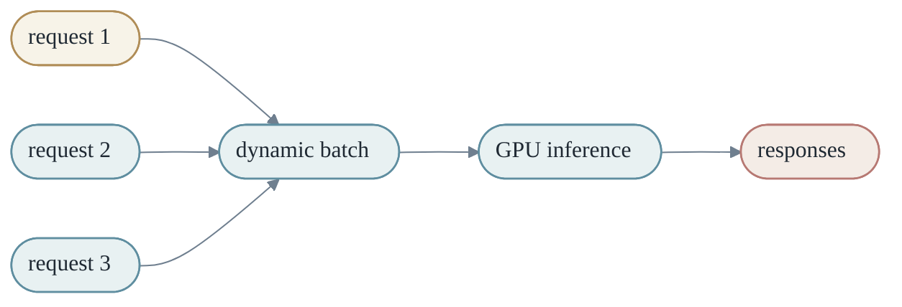
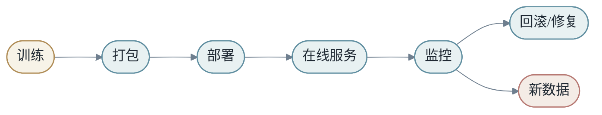
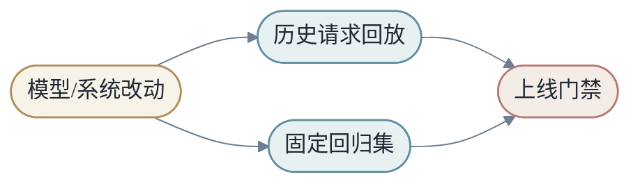

<h1 align="center">第七章：程序实现与计算系统</h1>

深度学习不是只存在于公式中。公式必须落到 tensor、kernel、显存、CPU/GPU 和分布式系统上。本章把 `X → Y by M` 这条数学链路放回真实计算系统中，看它如何被工程化。

原稿第 7 章末尾的"整合补充：实现配方、调试手册、模板和检查表"已经迁移到第 9 章作为附录。本章正文聚焦于"模型如何真的跑起来"。

<h2 align="center">第1节：Tensor、dtype、device</h2>

Tensor 是程序里的数学对象。语言模型 hidden states 常见形状是：

```text
[batch, sequence, hidden]
```

图像输入常见形状是：

```text
[batch, channel, height, width]
```

理解 shape，就是理解数据如何在模型中流动。

Tensor 有两个层面的含义。

第一，**它是数学对象**：向量、矩阵、高维数组。

第二，**它是内存对象**：一段连续或非连续的数据，加上 shape、stride、dtype、device 等元信息。

同一个 tensor 的逻辑形状和物理布局不一定一样。比如 transpose 可能只改变 stride，不真正复制数据。理解这一点，有助于理解为什么某些操作需要 `contiguous()`，也能解释很多性能差异。

### 1.1 dtype 和 device

深度学习中常见 dtype：

- **FP32**：训练稳定，但显存和带宽成本高。
- **FP16**：训练和推理常用，节省显存并提高吞吐；指数范围窄，需要 loss scaling 防下溢。
- **BF16**：指数范围接近 FP32，下溢风险小，是大模型预训练的常见选择。
- **INT8**：常用于推理量化。
- **FP8**：H100 之后才广泛使用的新格式，介于 FP16 和 INT8 之间。

Tensor 还在不同 device 上：CPU、GPU、甚至跨多 GPU。很多运行错误来自 tensor 不在同一个 device 上。

```python
# 典型 device 错误
x = torch.randn(4, 4)              # CPU
w = torch.randn(4, 4).cuda()       # GPU
y = x @ w                           # RuntimeError: device mismatch
```

养成习惯：模型创建后立即 `.to(device)`，数据加载时也明确放到目标 device。

<h2 align="center">第2节：CPU 与 GPU：计算与带宽</h2>

CPU 擅长通用控制流，GPU 擅长大规模并行数值计算。

矩阵乘法：

$$
C_{i,j}=\sum_k A_{i,k}B_{k,j}
$$

每个输出元素可以相对独立计算，因此非常适合 GPU。

GPU 的优势来自大量并行线程。它不擅长复杂分支和串行控制，但擅长让成千上万线程执行相似的数值操作。

深度学习中的高性能通常来自把计算组织成大块规则运算：矩阵乘法、卷积、attention。框架会调用底层库，例如 cuBLAS、cuDNN 或自定义 kernel。

### 2.1 Compute-bound 与 Memory-bound

一个操作慢，可能因为计算太多，也可能因为数据搬运太多。

- **Compute-bound**：瓶颈是算术计算。矩阵乘法（特别是大矩阵）通常 compute-bound。
- **Memory-bound**：瓶颈是显存读写。LayerNorm、激活函数、dropout 等操作计算不多，却需要读写大量数据，因此通常受内存带宽限制。

优化模型时，经常要问：**我们是在等计算，还是在等数据？** 这决定了优化方向完全不同。

### 2.2 Kernel Fusion

很多深度学习操作本身很小，但组合起来会产生大量内存读写。比如：

```text
y = dropout(gelu(x @ W + b))
```

如果每一步都单独写回显存，就会反复读写中间结果。**Kernel fusion** 的思想是把多个操作合成一个 kernel，减少中间 tensor 的 materialization。

```mermaid
%%{init: {"theme":"base","themeVariables":{"fontFamily":"Microsoft YaHei, Segoe UI, sans-serif","primaryColor":"#f7f3e8","primaryTextColor":"#1f2933","primaryBorderColor":"#b08d57","lineColor":"#6f7f8f","secondaryColor":"#e8f1f2","tertiaryColor":"#f4ece6"},"flowchart":{"curve":"basis","nodeSpacing":42,"rankSpacing":56,"padding":14}}}%%
flowchart LR
    n1(["matmul output"])
    n2(["bias add"])
    n3(["GELU"])
    n4(["dropout"])
    n5(["write once"])

    n1 --> n2
    n2 --> n3
    n3 --> n4
    n4 --> n5

    classDef source fill:#f7f3e8,stroke:#b08d57,color:#1f2933,stroke-width:1.3px;
    classDef transform fill:#e8f1f2,stroke:#5f8ea0,color:#1f2933,stroke-width:1.3px;
    classDef outcome fill:#f4ece6,stroke:#b77973,color:#1f2933,stroke-width:1.3px;
    class n1 source;
    class n2,n3,n4 transform;
    class n5 outcome;
```



Fusion 的收益通常来自**减少 memory traffic**，而不是减少数学计算。尤其在 memory-bound 操作中，少读写一次大 tensor 就可能带来明显速度提升。

这说明性能优化不能只数 FLOPs。两个 FLOPs 相同的实现，可能因为内存访问模式不同而速度差很多。

<h2 align="center">第3节：Batch——吞吐与延迟权衡</h2>

Batch 把多个样本合并成大矩阵运算：

$$
Y=XW
$$

它提高硬件利用率，但也带来吞吐和延迟之间的权衡。

训练中，batch size 影响梯度估计。小 batch 噪声大，可能有助于泛化但训练不稳定；大 batch 利用率高，但可能需要调整学习率和优化策略。

推理中，batching 提高吞吐，却可能增加单个请求等待时间。在线服务常常需要动态 batching：在很短时间窗口内把多个请求合并，既提高 GPU 利用率，又控制延迟。



### 3.1 Padding 和 Mask

序列 batch 中，不同样本长度可能不同。为了组成同一个 tensor，通常需要 padding。

Padding token 不应该影响 attention 或 loss，因此需要 mask。Transformer 的很多细节，本质上都在处理"哪些位置可见，哪些位置应该忽略"。第 5 章 §8 已经讨论过 attention mask 的工作方式。

<h2 align="center">第4节：训练系统</h2>

一次训练 step 包含：前向、反向、更新。


### 4.1 训练显存构成

训练显存包括四块：

1. **参数**：模型权重本身。
2. **梯度**：每个参数对应一份梯度。
3. **优化器状态**：Adam 每个参数额外两份（一阶动量 + 二阶动量）。
4. **中间激活**：反向传播需要前向中的中间值。

以 Adam 为例，一个 1B 参数的 FP32 模型：

```text
参数:      1B * 4 byte = 4 GB
梯度:      1B * 4 byte = 4 GB
Adam m:    1B * 4 byte = 4 GB
Adam v:    1B * 4 byte = 4 GB
激活:      和模型深度、batch size、序列长度相关，常常占大头
```

粗略来说，**训练显存常常是模型权重文件大小的多倍甚至十倍**。这就是为什么训练大模型需要分布式系统。

### 4.2 混合精度训练

混合精度训练用较低精度执行大部分计算，同时保留必要的高精度状态以稳定训练。

好处是：

- 减少显存占用。
- 提高吞吐（现代 GPU 的 tensor cores 对 FP16/BF16 有专门加速）。
- 更好利用硬件能力。

风险是数值稳定性。FP16 的指数范围窄，梯度太小可能下溢。常见缓解是 **loss scaling**：把 loss 乘以一个大数（例如 1024），让梯度也按比例放大，反向传播完成后再除回。BF16 由于指数范围接近 FP32，下溢风险小很多，越来越成为大模型预训练的默认选择。

### 4.3 Gradient Checkpointing

反向传播需要前向中间激活。Gradient checkpointing 的思路是：不保存所有激活，只保存一部分，反向时重新计算缺失激活。

这是用计算换显存：

```text
少存中间值 -> 反向时重算 -> 显存下降，计算增加
```

典型代价是 1.3–1.5 倍训练时间，换来约 5–10 倍的激活显存节省。在显存受限场景非常实用。

<h2 align="center">第5节：推理系统</h2>

语言模型推理通常分为：

- **Prefill**：处理 prompt，建立 KV Cache（第 6 章 §3 讨论过）。
- **Decode**：逐 token 生成。

推理系统关心延迟、吞吐、显存、batching、cache 管理和量化。

大模型推理的两个核心指标是：

- **TTFT (time to first token)**：首 token 延迟，主要由 Prefill 决定。
- **TPOT (time per output token)**：每输出 token 的生成时间，主要由 Decode 决定。

不同应用对这两个指标的权重不同。聊天应用对 TTFT 敏感，长文生成更关心 TPOT。

### 5.1 量化

量化把权重或激活从高精度表示变成低精度表示，例如 FP16 到 INT8。

量化的收益：

- 权重更小，显存压力降低。
- 带宽压力降低。
- 某些硬件上吞吐更高。

代价是精度损失。好的量化方法要在质量、速度和工程复杂度之间平衡。常见方案有 GPTQ、AWQ、SmoothQuant 等，本书不展开。

需要测试的是：量化是否影响**长尾 token、推理任务、特定领域术语**——这些往往比 benchmark 上的平均损失更敏感。

### 5.2 服务中的调度

真实服务中，请求长度不同，生成长度不同，用户优先级不同。调度系统需要决定哪些请求一起 batch，哪些 cache 保留，哪些请求可能被抢占或降级。

现代推理框架（vLLM、TensorRT-LLM 等）实现了 **continuous batching**（也叫 in-flight batching）：不等一整批请求都到达才开始，而是 token 级别动态加入和退出 batch，让 GPU 不空转。

这说明大模型推理不是单纯调用 `model.generate()`，而是一个复杂在线系统。

<h2 align="center">第6节：分布式训练</h2>

当模型太大，单机装不下，就需要分布式。

数据并行复制模型，拆分 batch；模型并行拆分模型本身；流水线并行拆层；专家并行拆 MoE experts。

### 6.1 数据并行（Data Parallel）

每张 GPU 有完整模型副本，处理不同 mini-batch。反向后通过 AllReduce 同步梯度。

**优点**：简单。
**缺点**：每张卡都要放完整模型。

ZeRO（DeepSpeed）系列优化把参数、梯度、优化器状态分片到不同 GPU 上，缓解了显存压力，是大模型训练的常见选择。

### 6.2 张量并行（Tensor Parallel）

把单个矩阵乘法拆到多张 GPU 上。例如把大矩阵按列或按行切分。这样单层模型也可以超过单卡显存。

**代价**：每层之间需要通信（AllReduce 或 AllGather）。通信带宽是限制因素，因此通常只在 NVLink 互联的卡之间用张量并行。

### 6.3 流水线并行（Pipeline Parallel）

把不同层放在不同 GPU 上，像工厂流水线一样处理 micro-batch。

**优点**：可以训练很深的模型。
**难点**：**pipeline bubble**——流水线的"启动期"和"排空期"，部分 GPU 在等待，吃掉一部分有效计算。可以用 1F1B、interleaved schedule 等技术缓解。

### 6.4 专家并行（Expert Parallel）

MoE 模型中，不同 expert 可以放在不同设备上。Router 把 token 发送到对应 expert。

这会引入 **all-to-all 通信**：每个 GPU 把自己持有的 token 发到对应 expert，再把结果收回来。系统设计非常关键，专家分布不均会拖慢整个 batch。

### 6.5 组合并行

实际大模型训练经常组合多种并行：例如"张量并行内 + 流水线并行间 + 数据并行外"。3D 并行的设计直接影响训练效率，是大模型工程的核心难点之一。

<h2 align="center">第7节：从公式到工程的落差</h2>

论文里的公式常常很短：

$$
Y=\text{softmax}(QK^T/\sqrt{d_k})V
$$

工程实现却要考虑：

- tensor shape
- memory layout
- mask
- numerical stability
- kernel fusion
- mixed precision
- distributed communication
- cache 管理

真正的深度学习工程，是把数学变换映射到可靠、高效、可维护的计算系统。

<h2 align="center">第8节：Attention 的工程实现</h2>

标准 attention 公式很短，但直接实现会产生巨大的 `T x T` score 矩阵。

当 `T` 很长时，score 矩阵不仅计算贵，也占显存。高性能 attention 实现通常会分块计算，避免把完整中间矩阵全部写入显存。

直觉上，FlashAttention 这类方法把 attention 变成流式分块过程：

```text
读取一块 Q
读取一块 K/V
更新局部 softmax 统计
累积输出
```

关键难点是**数值稳定**。Softmax 需要处理指数，不能简单分块相加。高性能实现会维护每一行的最大值和归一化因子，让分块结果与完整 attention 等价或近似等价。

从系统角度看，FlashAttention 这类方法的意义是：**不改变数学目标，却改变内存访问路径**。它把 attention 从 memory-bound 改造得更接近 compute-bound，让长上下文变得可行。

<h2 align="center">第9节：模型服务的生命周期与监控</h2>

一个模型进入线上服务，通常会经历多个阶段：



每个阶段都有失败模式。

训练阶段可能数据污染、指标虚高。打包阶段可能 tokenizer、权重、配置不匹配。部署阶段可能显存不足、版本错误。服务阶段可能延迟超标、流量突增、cache 爆掉。监控阶段如果指标缺失，问题会在线上隐身。

### 9.1 分层监控

模型服务需要同时监控机器指标、模型指标和业务指标。

- **机器指标**：CPU、GPU 利用率、显存、网络、磁盘、错误率。
- **模型指标**：输入长度、输出长度、TTFT、TPOT、cache 命中、拒答率、工具调用失败率。
- **数据指标**：feature 分布、缺失率、类别比例、输入长度分布。
- **业务指标**：点击、转化、留存、满意度、人工反馈。

```text
机器健康 -> 模型健康 -> 产品健康
```

这三层可能不一致。GPU 利用率很高不代表产品体验好；模型离线指标很好不代表线上稳定；业务指标下降也不一定是模型本身坏了，可能是流量分布变化。

可观测性的目标，是在问题发生时快速回答：

- 哪些请求受影响？
- 从什么时候开始？
- 是否关联某个模型版本、配置或流量来源？
- 是数据问题、模型问题、系统问题还是产品问题？

没有可观测性，模型就像一个无法打开的生产机器。

<h2 align="center">第10节：GPU 利用率与成本模型</h2>

### 10.1 GPU 利用率不是唯一目标

很多人优化推理系统时会盯着 GPU utilization。利用率高通常是好事，但它不是唯一目标。

如果为了提高 GPU 利用率，把请求等待时间拉得很长，用户体验可能变差。如果 batch 太大，吞吐上升但 P99 延迟恶化。在线系统需要同时平衡吞吐、延迟、成本和可靠性。

```text
训练系统：更关心吞吐和总训练时间
在线推理：同时关心 TTFT、TPOT、P95/P99、成本
```

GPU 利用率还可能误导。一个 memory-bound kernel 可能让 GPU 看起来忙，但实际 tensor cores 没有充分工作。一个服务也可能因为 CPU tokenization、网络等待或调度锁而让 GPU 空转。

因此性能分析要分层：请求队列、CPU 预处理、GPU kernel、显存带宽、网络通信、后处理，每一层都可能是瓶颈。

### 10.2 成本模型

模型系统最终要面对成本。训练成本、推理成本、存储成本、工程维护成本都是真实约束。

大模型推理成本大致受几类因素影响：

- **模型参数量**：影响权重显存和计算量。
- **输入长度**：影响 prefill 计算和 KV Cache。
- **输出长度**：影响 decode 步数。
- **batch 策略**：影响吞吐和延迟。
- **精度和量化**：影响显存、带宽和质量。
- **硬件类型**：影响单位 token 成本。

可以粗略理解为：

```text
总成本 = 每 token 成本 * token 数量 + 固定系统开销
```

但真实系统中，每 token 成本不是常数。短请求和长请求、prefill 和 decode、小 batch 和大 batch 的成本结构不同。

这就是为什么产品设计会反过来影响模型系统。限制最大上下文长度、控制输出长度、缓存常见结果、使用小模型处理简单请求，都可能显著降低成本。

<h2 align="center">第11节：模型版本、回归测试与回放</h2>

### 11.1 模型不是单个文件

模型不是单个文件。一个可运行模型通常包含权重、tokenizer、配置、代码、prompt 模板、后处理逻辑、量化参数和服务框架。

如果 tokenizer 和权重版本不匹配，模型可能直接输出异常。如果 prompt 模板改变，行为可能明显变化。如果后处理逻辑改了，线上指标可能变化但模型本身没变。

所以生产系统需要把这些一起版本化：

| 组件 | 为什么要版本化 |
|------|----------------|
| 权重 | 模型能力和行为来源 |
| tokenizer | token 边界影响输入输出 |
| 配置 | hidden size、层数、上下文长度 |
| prompt | 决定模型看到的任务格式 |
| 代码 | 决定执行路径 |
| 数据 | 决定训练和评估来源 |
| eval | 决定质量判断标准 |

版本化的目的，是让问题**可复现、可比较、可回滚**。

### 11.2 回放与回归测试

上线模型前，最好用历史请求回放。回放不是完美模拟线上，因为用户不会对新模型产生新的交互反馈，但它能发现很多明显问题：格式错误、延迟异常、拒答变化、工具调用失败、成本激增。

回归测试则用于防止旧能力被新模型破坏。每次模型、prompt、检索系统或服务代码变化，都跑一组固定测试集。



对于大模型产品，回归集应该包含典型任务、边界输入、失败案例、安全案例和高价值用户场景。它不是一次性构建，而是随着线上问题不断积累。

这让系统具备记忆。每次事故、每个 bug、每个坏案例，都可以变成未来防线的一部分。

<h2 align="center">第12节：数据系统是模型系统的一半</h2>

很多机器学习系统表面看是模型服务，底下其实是数据系统。

训练需要样本生成、去重、切分、标注、特征计算和版本管理。推理需要实时特征、检索索引、缓存、用户上下文和日志回写。评估需要固定数据集、线上抽样和人工审核。

如果数据系统不可靠，模型系统就不可靠。


这条闭环中，任何一处断裂都会影响学习：日志缺字段、标注延迟、样本重复、特征含义变化、索引过期、反馈无法归因。

### 12.1 在线特征和离线特征

训练时常用离线数据，因为它完整、便宜、可批量处理。上线时需要在线特征，因为请求必须实时响应。

这带来一个核心挑战：**离线和在线是否一致**。

例如训练时 `user_click_7d` 来自大数据批处理，推理时来自实时 key-value store。批处理可能按天更新，在线 store 可能按分钟更新；一个按自然日，一个按滚动窗口。字段名相同，数值分布可能不同。

减少偏差的方法：

- 共享特征定义。
- 使用同一套转换代码。
- 对训练和推理 feature 做分布对比。
- 记录在线样本用于回放。

### 12.2 数据漂移和概念漂移

**数据漂移**是输入分布变了。**概念漂移**是 `X` 到 `Y` 的关系变了。

例如用户设备从桌面变成移动端，这是数据漂移。用户对广告的点击偏好因为社会事件改变，这是概念漂移。

监控数据漂移可以看 feature 分布、缺失率、类别占比、输入长度、语言分布。监控概念漂移更难，因为需要新的标签或延迟反馈。

漂移不是一定坏。世界本来会变化。关键是系统能否发现变化，并决定是重训、调阈值、更新特征，还是改变产品策略。

<h2 align="center">第13节：安全、降级与从实验到生产</h2>

### 13.1 安全、权限和审计

模型系统越来越多地连接真实工具：搜索、数据库、邮件、代码仓库、支付、配置系统。系统能力越强，权限管理越重要。

安全设计至少要问：

- 模型能访问哪些数据？
- 工具调用是否需要用户授权？
- 哪些操作有副作用？
- 是否记录了调用日志？
- 是否能追溯某个输出用了哪些证据？
- 用户数据是否被不当写入训练集？

大模型系统尤其要防 **prompt injection**。外部文档可能包含恶意指令，试图覆盖系统规则。系统不能把所有文本都当同等级指令。

### 13.2 系统降级策略

一个可靠系统要假设依赖会失败。检索可能超时，工具可能报错，GPU 可能排队，模型可能返回格式错误。

降级策略包括：

- 使用缓存结果。
- 切换到小模型。
- 降低 top-k 或上下文长度。
- 返回部分结果并说明限制。
- 请求用户补充信息。
- 进入人工审核。

降级不是失败，而是控制失败范围。**没有降级，局部故障会变成整体不可用。**

### 13.3 从实验代码到生产代码

研究 notebook 可以快速试错，但生产系统需要可维护。二者目标不同。

实验代码追求探索速度。生产代码追求稳定、可测试、可观测、可回滚。

从实验走向生产时，需要补齐：配置管理、输入验证、错误处理、日志、指标、测试、版本化、部署脚本、回滚路径和文档。

```text
notebook 成功 -> pipeline 可复现 -> 服务可部署 -> 线上可观测
```

很多项目卡在中间，不是因为模型不好，而是因为实验资产没有被工程化。

### 本章在 X → Y by M 中的位置

第七章把数学落到硬件和工程：

- **Tensor 既是数学对象，也是内存对象**。dtype、device、layout 都影响行为。
- **CPU/GPU 的分工**决定了深度学习偏向大规模矩阵运算。
- **Batch、混合精度、Gradient Checkpointing、分布式并行**让大模型训练可行。
- **Prefill/Decode、量化、动态 batching** 让大模型推理变得高效。
- **Kernel Fusion 和 FlashAttention** 说明性能优化常常来自改变内存访问，而不只是减少计算。
- **模型版本、回归测试、监控、漂移检测、降级策略** 让模型服务变得可靠。
- **数据系统是模型系统的一半**——很多线上问题根因不在模型代码，而在数据流。

很多架构创新最终都要接受硬件现实的检验：算力、带宽、显存、通信和调度。这些约束反过来塑造模型设计——这就是第 8 章会强调的"系统反向影响模型"。

接下来的第 8 章会把全书所有线索收束回 `X → Y by M`，讨论端到端学习的最终含义。

### 思考题

1. 为什么训练显存通常远大于模型权重大小？至少列出四块构成。
2. 什么情况下一个操作可能 memory-bound 而不是 compute-bound？请举例。
3. 动态 batching 为什么能提高吞吐？它为什么可能增加单请求延迟？如何缓解？
4. KV Cache 对推理系统的显存管理提出了什么挑战？长上下文时尤其严重，为什么？
5. 数据并行、张量并行、流水线并行和专家并行分别解决什么问题？什么时候会组合使用？
6. FlashAttention 的核心思想是"不改数学，改内存访问"。这种优化能带来收益的前提是什么？
7. 一个模型上线后线上指标突然下降，但模型版本没变。你会按什么顺序排查？
8. Training-serving skew 是什么？给一个具体例子并讨论如何减少它。
9. 一个 LLM 推理服务的 P95 延迟突然变高，但平均延迟正常。可能的根因有哪些？
