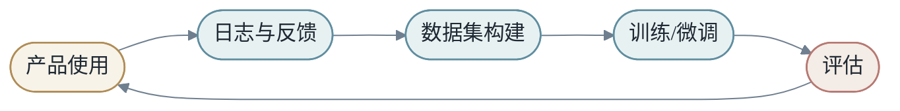
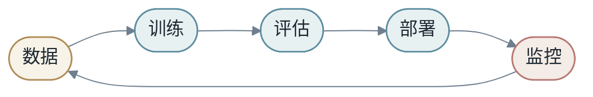
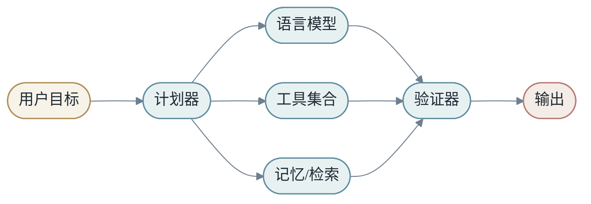
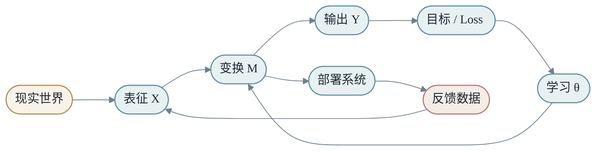

<h1 align="center">第八章：回到 End to End Learning</h1>

最后一章把全书重新收束到一个问题：端到端学习到底改变了什么？

原稿第 8 章末尾的"整合补充"（案例研究、逐步推演样例、课堂讲稿、练习册、设计模式、场景库）已经迁移到第 9 章作为附录。本章正文只保留主线收束。

<h2 align="center">第1节：端到端不是没有结构</h2>

端到端学习容易被误解为"不需要设计"。实际情况相反。我们仍然设计架构、数据、loss、训练流程、推理系统和评估标准。

改变的是：**更多中间步骤从手写规则变成可学习变换**。

```text
过去：人定义中间规则，模型学习最后一步
现在：人定义可学习结构，模型学习大量中间表示
```

端到端学习真正改变的是责任分配。过去，人类工程师需要为每个中间阶段写出明确规则。现在，人类更多设计目标、结构和约束，让模型通过数据学习中间表示。

这不是人类退出系统，而是**人类从"规则编写者"变成"学习系统设计者"**。

### 1.1 模块仍然重要

端到端不等于单体黑盒。现代 AI 系统依然有模块：tokenizer、embedding、attention、MLP、router、retriever、tool executor、safety filter、serving scheduler。

区别在于，模块之间越来越多通过可学习信号连接，而不是通过完全手写的中间格式连接。


### 1.2 结构是端到端的盟友

判断结构是否合理，可以问：

- 它是否编码了真实约束？
- 是否减少了不必要难度？
- 是否保留了足够学习空间？
- 是否让系统更可调试？

好结构减少搜索空间，让模型更容易学习。没有结构，模型可能需要更多数据、更多参数和更多计算才能学到同样规律。CNN 的卷积先验、Transformer 的 attention 结构、RAG 的检索模块、Agent 的工具和状态，都是这种结构。

端到端与模块化也不是非此即彼。很多系统是**端到端目标加模块化执行**：整体优化用户满意度，但内部仍有检索、排序、生成、验证、服务等模块。

<h2 align="center">第2节：可解释性</h2>

可解释性是在问：模型 `M` 到底怎样重排了输入空间？

小模型可以看权重，大模型需要从输入敏感性、隐藏表征、attention head、神经元行为和失败案例多个层次理解。

可解释性有两种需求。

第一种是**科学需求**：我们想知道模型内部到底形成了什么结构。

第二种是**工程需求**：模型出错时，我们需要定位原因、修复问题、建立信任。

### 2.1 从变换观解释模型

如果模型是 `M`，可解释性就是研究 `M` 如何改变空间：

- 哪些方向被放大？
- 哪些信息被压缩？
- 哪些输入被映射到相近位置？
- 哪些边界决定了输出变化？

这比只问"某个神经元是什么意思"更宽。一个模型的行为可能分布在许多参数和层中，不一定能被单个组件解释。

### 2.2 行为解释同样重要

对产品来说，行为层解释常常更有用：

- 模型在哪类输入上失败？
- 失败是否系统性偏向某些群体？
- 提示词如何影响输出？
- 加入检索后是否改善事实性？

解释模型，不只是看内部，也要看它和数据、用户、工具、环境的交互。

<h2 align="center">第3节：数据是学习的边界</h2>

模型从数据中学习。数据偏差会进入模型，数据缺口会变成模型盲点，标签噪声会影响模型目标。

**训练集只是现实分布的采样，不是现实本身**。

数据决定了模型可能学到什么，也决定了模型无法学到什么。

如果数据中某种模式从未出现，模型很难凭空掌握。如果数据中错误关联频繁出现，模型可能把它当成规律。如果数据分布随时间变化，旧模型会逐渐失效。

### 3.1 数据闭环和偏差放大

真实系统中的数据不是一次性静态资产，而是持续循环：



数据闭环可以让模型持续变好，也可能放大偏差。如果系统只学习自己已经偏好的数据，反馈回路会变窄。推荐系统里马太效应（强者更强、长尾被压制）就是这种闭环的副作用。

因此数据治理和评估同样重要。**反馈闭环不是自动改进的保证，它需要被主动设计**——加入探索、去偏、分群评估、长期指标。

<h2 align="center">第4节：从模型到产品系统</h2>

产品系统不是训练完模型就结束。它需要持续数据、评估、部署、监控和反馈。



**模型上线不是终点，而是另一个学习过程的开始。**

产品中的模型要面对训练集中没有的输入、用户误用、恶意攻击、环境变化、延迟要求、成本约束和安全边界。

### 4.1 最小闭环

一个实际系统至少需要：

- **数据管线**：收集、清洗、标注、版本管理。
- **训练管线**：可复现训练，记录配置和指标。
- **评估体系**：离线指标、人工评估、回归测试。
- **部署机制**：灰度、回滚、监控。
- **反馈机制**：把线上问题转回数据和训练。

这就是为什么机器学习工程不只是写模型代码。模型是核心，但不是全部。

### 4.2 未来模型：从函数到系统

现代大模型不再只是一个函数。它有上下文、工具、检索、缓存、外部环境和多步交互。

可以粗略写成：

$$
Y=S(M_1,M_2,...,M_k,X,C,T)
$$

其中 `C` 是上下文，`T` 是工具，`S` 是调度策略。

未来模型可能越来越不像单一神经网络，而像一个由多个可学习组件、符号工具、检索系统和执行环境组成的复合系统。

它可能包括：

- 一个基础语言模型
- 一个检索系统
- 多个专门工具
- 一个长期记忆模块
- 一个计划与执行循环
- 一个安全与验证层



从这里看，**深度学习正在从"学习函数"走向"学习系统行为"**。

### 4.3 系统反向影响模型设计

如果只在论文中看模型，我们可能只关心质量指标。但模型进入产品后，延迟、吞吐、显存、成本、稳定性都会反过来影响模型设计。

一个 70B 模型可能质量更好，但如果请求量巨大、延迟要求严格、预算有限，系统可能选择 7B 模型加检索、蒸馏或路由。一个长上下文模型能放入更多资料，但如果 prefill 成本太高，也许更好的方案是检索和摘要。

模型结构也受硬件影响。矩阵乘法适合 GPU，所以深度学习架构倾向于组织成大矩阵运算。Attention 的工程优化会影响长上下文可行性。量化降低显存和带宽需求，但可能损失质量。

**模型设计不是纯数学问题。它是数学、数据和硬件之间的协商。**

<h2 align="center">第5节：回到 X → Y 主线</h2>

全书最后仍然回到：

$$
X \xrightarrow{M} Y
$$

看到任何模型，都可以问三个问题：

1. 这里的 `X` 是如何表示的？
2. 这里的 `M` 能表达什么变换？
3. 这里的 `Y` 和 loss 是否对应真正目标？

这三个问题，是理解机器学习和深度学习的最小工具箱。

### 5.1 全书的统一图景



这张图把整本书收束在一起：

- **表征**决定模型看到什么。
- **模型**决定可以表达什么变换。
- **Loss** 决定模型优化什么目标。
- **优化器**决定参数如何变化。
- **系统**决定模型能否高效可靠地运行。
- **反馈**决定模型如何继续演化。

### 5.2 为什么还要回到简单表达

本书用了大量章节讨论 Transformer、MoE、RAG、KV Cache、分布式训练和模型服务。最后仍然回到 `X -> Y by M`，不是因为这些细节不重要，而是因为细节需要一个中心来组织。

没有中心，知识会变成术语堆叠。今天是 CNN，明天是 Transformer，后天是 Agent。每个概念都像孤岛。

有了中心，我们就能问：这个新方法改变了 `X`、`M`、`Y`、loss、优化，还是系统执行？它解决了表达能力、数据效率、计算效率，还是产品闭环？

这就是统一框架的意义。它不是替代细节，而是让细节有位置。

### 5.3 本书的最终定义

End to End Learning 可以定义为：

> 在给定目标信号和系统约束下，设计一条从输入到输出的可学习路径，让数据塑造中间表示，并让模型在真实环境中持续接受评估和反馈。

这个定义包含四个关键词。

第一，**目标信号**。没有目标，学习没有方向。

第二，**可学习路径**。不是所有步骤都手写，也不是所有步骤都无约束，而是把可学习结构放在合适位置。

第三，**中间表示**。深度学习的强大，来自中间表示可以被数据塑造。

第四，**真实环境**。模型只有进入数据、用户、成本、延迟和安全约束构成的现实世界，才算完成闭环。

所以本书从 `X -> Y by M` 开始，也在这里结束。这个表达足够简单，可以放进第一章；也足够深，可以贯穿从线性回归到大模型系统的全部路径。

<h2 align="center">第6节：端到端工具包</h2>

把端到端思考变成习惯，需要几个常用工具：检查表、复盘、阅读论文的框架、项目评审、实验报告。

### 6.1 最终检查表

可以把整本书浓缩成一张检查表：

**问题层**

- `X` 是什么？
- `Y` 是什么？
- 错误代价是什么？
- 目标是否可测量？

**数据层**

- 数据来自哪里？
- 标签如何产生？
- 是否有分布偏差？
- 是否存在泄漏？

**表征层**

- 输入是否包含任务需要的信息？
- 离散、连续、结构对象分别如何表示？
- 表征是否稳定？
- 是否有冷启动或长尾问题？

**模型层**

- 模型容量是否匹配任务？
- 是否有合适 baseline？
- loss 是否对应目标？
- 是否做过 ablation？

**系统层**

- 延迟和成本是否可接受？
- 是否可复现实验？
- 是否可监控？
- 是否可回滚？

这张表并不复杂，但它能防止很多常见失败。

### 6.2 如何阅读一篇机器学习论文

读论文时，不要先被方法名和图表淹没。可以用本书框架拆解。

**第一，论文改变了什么？**

- 改 `X`：新的输入表征、数据构造、增强方式。
- 改 `M`：新的模型结构、注意力机制、路由、模块。
- 改 `Y`：新的任务定义或输出格式。
- 改 loss：新的训练目标、正则项、偏好优化。
- 改 optimization：新的优化器、训练策略、并行方式。
- 改 system：新的推理、压缩、缓存或部署方法。

**第二，论文解决什么瓶颈？** 是质量、数据效率、计算效率、长上下文、可控性、稳定性，还是成本？

**第三，代价是什么？** 参数更多、训练更慢、推理更贵、实现更复杂、依赖更多数据，还是评估更困难？

**第四，它的实验是否支持主张？** 有没有 ablation？有没有和强 baseline 比较？有没有分析失败案例？

这样读论文，会比只记住结论更稳。你会知道一个方法应该放在整张地图的哪个位置。

### 6.3 如何设计项目评审

如果你要评审一个机器学习项目，可以按本书结构提问：

**问题定义**：目标是否清楚？`Y` 是否可观测？指标是否真的代表目标？

**数据**：数据是否覆盖目标场景？标签是否可靠？是否存在泄漏？是否有分布漂移风险？

**模型**：baseline 是什么？为什么当前模型比 baseline 更合适？是否做过 ablation？错误案例是否被分析？

**系统**：延迟、成本和稳定性如何？是否可监控？是否可回滚？线上失败时如何定位？

项目评审不是阻止创新，而是让创新进入可靠路径。

### 6.4 实验报告模板

实验报告不是流水账，而是让别人判断结论是否可信。一份好的实验报告应该包含：

- 问题定义：`X`、`Y`、使用场景。
- 数据说明：来源、时间范围、切分方式、样本量、标签生成。
- Baseline：简单方法的结果。
- 方法：模型、特征、loss、训练配置。
- 指标：总体指标和关键分群指标。
- Ablation：哪些改动真正带来收益。
- 错误分析：典型失败案例和失败类型。
- 系统指标：延迟、成本、资源占用。
- 结论：是否建议上线，风险是什么，下一步做什么。

实验报告最重要的不是显得复杂，而是让读者知道：**这个结论能不能信，能信到什么程度**。

### 6.5 如何把一个想法变成实验

机器学习项目经常从一个模糊想法开始：能不能预测用户流失？能不能让助手回答内部问题？能不能检测异常交易？

把想法变成实验，需要经过几个步骤：

1. **写出任务句子**：给定什么，预测什么，为谁服务，在什么场景使用。
2. **定义最小可用 `Y`**：如果真实目标很复杂，先找一个可观测代理目标，但要标明它的局限。
3. **收集第一版数据**：不要一开始追求完美数据，而是构造能验证方向的小样本。
4. **建立 baseline**：Baseline 可以很简单，但必须存在。
5. **跑第一个闭环**：训练、评估、看错误、写结论。
6. **再决定是否扩大模型、扩大数据或重定义任务**。

很多项目失败，是因为跳过了前几步，直接进入复杂模型。**复杂模型会把问题掩盖起来，让团队更晚才发现 `Y` 不清楚或数据不可用**。

<h2 align="center">第7节：学习路径——推公式、写代码、看系统</h2>

读完这本书，读者应该拥有一张地图，但地图不是终点。深度学习真正的理解来自三种练习：

**推公式**是为了理解变换。比如手推线性回归梯度、softmax 交叉熵梯度、attention shape 和复杂度。公式训练的是"知道每个量从哪里来"。

**写代码**是为了理解执行。比如从零写一个 MLP、训练一个文本分类器、实现一个 tiny Transformer。代码训练的是"知道每个 tensor 如何流动"。

**看系统**是为了理解边界。比如观察 GPU 利用率、batching 延迟、KV Cache 显存、量化质量。系统训练的是"知道模型如何进入现实"。

三者缺一不可。只会公式，容易脱离工程；只会代码，容易把框架当魔法；只看系统，容易不知道问题的数学根源。

### 7.1 一条实践路线

可以按下面路线把本书内容转化成实践能力：

1. 用 NumPy 写线性回归和梯度下降。
2. 用 PyTorch 写 MLP 分类器。
3. 在真实小数据集上做 train/validation/test split。
4. 调一次过拟合和正则化。
5. 写一个 embedding 文本分类模型。
6. 从 shape 出发实现单头 attention。
7. 扩展到 multi-head attention 和 Transformer block。
8. 训练一个 tiny language model。
9. 加入 KV Cache 做简单 decode。
10. 做一个 RAG demo，把检索接进 prompt。
11. 记录延迟、显存、吞吐和错误案例。

这条路线的目的不是追求大模型规模，而是让读者**把 `X`、`M`、`Y`、loss、优化、系统执行全部亲手走一遍**。

<h2 align="center">第8节：学习的边界</h2>

机器学习强大，但不是所有问题都应该交给学习系统。

有些规则非常明确，例如税率计算、权限校验、协议解析。用模型学习这些规则不仅没必要，还可能引入不确定性。

有些任务缺少反馈信号。没有可靠 `Y`，模型很难学习。还有些任务错误代价极高，需要确定性验证、人工审核或形式化方法。

学习系统适合处理复杂、模糊、难以手写规则但有足够数据反馈的问题。不适合替代所有逻辑。

```text
规则清楚 -> 写规则
模式复杂且有数据 -> 学模型
高风险 -> 模型 + 验证 + 人类责任
```

成熟的 AI 系统往往不是纯模型，而是规则、模型、工具、验证和人类流程的组合。

<h2 align="center">第9节：从学习系统看职业能力</h2>

学习机器学习，最后不是为了背更多模型名字，而是形成一种解决问题的能力。

这种能力可以拆成几层。

**第一层是问题建模**。你能把一个模糊需求写成 `X -> Y by M`，能说清输入、输出、目标和约束。

**第二层是数据判断**。你能判断数据是否代表未来，标签是否可靠，特征是否泄漏，分布是否稳定。

**第三层是模型选择**。你知道什么时候用线性模型、树模型、深度网络、大模型、RAG 或规则系统。

**第四层是训练和评估**。你能设计 baseline、验证集、指标、ablation 和错误分析。

**第五层是系统落地**。你能考虑延迟、成本、监控、灰度、回滚和反馈闭环。

一个成熟实践者不一定记得每个公式细节，但一定能把问题放进这五层地图里。

### 9.1 实践者与读者的区别

读懂机器学习和会做机器学习之间，还有一段距离。这段距离靠实践补齐。

实践者和读者的区别，不在于记住更多术语，而在于能把模糊问题变成可运行闭环。

面对一个新问题，实践者会自然地问：

- 这个任务的 `Y` 是否清楚？
- 训练数据是否代表未来使用场景？
- 有没有简单 baseline？
- 错误代价是否对称？
- 模型输出如何被产品使用？
- 上线后如何监控和回滚？

这些问题听起来不如复杂模型酷，但它们决定项目是否可靠。

<h2 align="center">第10节：未来十年的学习主线</h2>

未来模型会继续变大，也会继续变小。大模型负责通用能力，小模型负责低成本、低延迟、可控场景。二者不是替代关系，而是**系统组合关系**。

未来数据会更重要。高质量数据、反馈数据、合成数据、隐私保护数据、企业内部数据，都会决定模型能否进入真实场景。

未来系统会更复杂。模型会调用工具、读写记忆、执行计划、与人协作。学习系统会越来越像运行环境，而不是单个函数。

未来评估会更难。单一分数无法描述真实行为，多轮任务、工具使用、长期满意度、安全边界都需要新评估方式。

但不管形式如何变化，本书的主线仍然可用：

> **看清 X，设计 M，定义 Y，理解 loss，掌握优化，落到系统，建立反馈。**

End to End Learning 的精神，是把学习看成完整路径，而不是孤立模型。**路径清楚，系统才清楚；系统清楚，改进才有方向。**

### 本章在 X → Y by M 中的位置（也是全书的总结）

第八章把所有线索收束回主线：

- 端到端不是无结构，而是可学习结构。
- 可解释性要同时看内部机制和外部行为。
- 数据是模型能力和偏差的边界。
- 产品化需要数据、训练、评估、部署、监控的闭环。
- 系统约束反过来塑造模型设计。
- 未来模型会从单一函数走向复合系统。
- 最终检查表把问题、数据、表征、模型和系统重新接回同一条路径。

如果读完这本书你只能记住一件事，记住 `X → Y by M`。如果你能记住两件事，加上"系统决定模型能否真的工作"。如果你能记住三件事，再加上"loss 是模型的价值观"。

这三件事，足够你在未来十年面对任何新模型、新论文、新产品、新事故时，保持冷静的提问能力。

### 思考题

1. 举一个传统系统被端到端学习替代的例子，并指出哪些中间步骤从手写变成了可学习。
2. 如果一个模型在线上表现变差，可能是数据问题、模型问题还是系统问题？分别举例。
3. 为什么说端到端学习不是把人类设计移除，而是把设计上移？设计的"层次"具体上移到哪里？
4. 对一个 RAG 系统，分别指出其中的 `X`、`M`、`Y`、`C` 和 `T`。
5. 系统约束如何反向影响模型设计？给两个具体例子（一个推理侧、一个训练侧）。
6. 用最终检查表评估一个你熟悉的 AI 产品。哪些层最难回答？为什么？
7. 找一个新论文或新系统，说明它主要改变了 `X`、`M`、`Y`、loss 还是系统执行。它解决的瓶颈是什么？代价是什么？
8. 如果你要给一个非技术同事用 5 分钟解释 End to End Learning，你会怎么讲？
