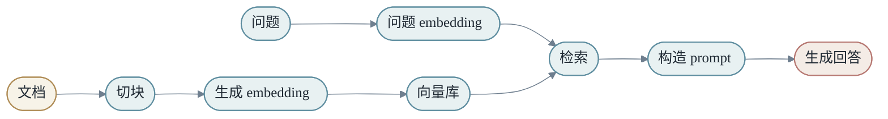
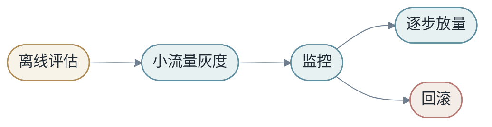

<h1 align="center">第九章：附录</h1>

这一章收纳全书的支撑材料：术语、参考阅读、代码索引、习题答案、实战项目、扩写计划，以及从第 6/7/8 章迁移过来的十大整合补充——深度讲解、实现配方、调试手册、模板检查表、案例研究、逐步推演、课堂讲稿、练习册、设计模式、场景库。

修订稿把这些原本散在各章末尾的"整合补充"集中到第 9 章，理由有三：

1. 原稿中第 6/7/8 章正文之后挂着大型附录，让正文与附录的边界模糊，读者很难判断某个概念到底属于哪一章。
2. 整合补充里有不少内容和正文重复（例如深度讲解第 1 节"泛化"已经在第 1 章讲过、第 2 节"feature"已经在第 3 章讲过），集中放在附录便于做去重处理。
3. 第 9 章本身定位就是"附录"，集中以后结构更干净。

第 9 章的使用方式：

- **§1-§6 是查阅型附录**：术语、参考、代码、答案、项目、计划。读完任意章节后可以来这里反查。
- **§7-§10 是实现型附录**：深度讲解、配方、调试、模板。做项目时按场景翻阅。
- **§11-§16 是学习型附录**：案例、推演、讲稿、练习、模式、场景。备课、做读书会或自我训练时按主题展开。

本章在 `X → Y by M` 中的位置：附录不引入新的主线节点，但它把主线穿过的每个节点都准备了"展开版"——从 `X` 的具体表征到 `M` 的具体结构、从 `Y` 的设计到 loss 的工程化、从训练到部署、从单一模型到完整系统，都能在这里找到落到代码、检查表或案例的具体抓手。


<h2 align="center">第1节：术语表</h2>

这个术语表服务于《从 X 到 Y：用变换理解机器学习与深度学习》。它不是严格数学词典，而是按本书的“变换观”解释核心概念。

## A

### Attention

一种根据内容动态选择信息的机制。给定 query、key、value，attention 先用 query 和 key 计算相关性，再加权汇聚 value。

$$
Attention(Q,K,V)=softmax(QK^T/\sqrt{d_k})V
$$

在本书中，attention 被理解为一种输入相关的动态变换。

### Autodiff

自动微分。深度学习框架根据前向计算图自动计算梯度。它让用户主要写前向逻辑，框架负责反向传播。

## B

### Backpropagation

反向传播。链式法则在神经网络中的高效实现，用来计算 loss 对参数的梯度。

### Batch

一组样本同时参与计算。Batch 让矩阵运算更大、更适合 GPU，也影响训练稳定性和推理延迟。

## C

### Classification

分类任务。模型输出类别或类别概率，例如图片类别、垃圾邮件判断、下一个 token 预测。

### Compute-bound

计算受限。程序瓶颈主要在算术计算，而不是内存读写。

## D

### Distribution Shift

分布漂移。训练数据分布和线上数据分布不同，导致模型性能下降。

## E

### Embedding

把离散对象映射到稠密向量的表征方式。Embedding table 本质是可学习查表函数。

### End to End Learning

端到端学习。让从输入到输出之间更多中间表示参与共同优化，而不是全部由人手写规则。

## F

### Feature

现实对象的可计算描述。Feature 决定模型能看到什么。

### Feature Engineering

人工设计特征的过程。传统机器学习中非常重要，深度学习则把许多 feature construction 交给模型学习。

## G

### Generalization

泛化。模型在未见数据上表现良好的能力。

### Gradient Descent

梯度下降。沿着 loss 下降方向更新参数的方法。

## K

### Kernel Trick

核技巧。不显式构造高维特征 φ(x)，而直接计算高维空间内积 K(x_i,x_j)。

### KV Cache

Key/Value 缓存。自回归推理中保存历史 token 的 K/V，避免每步重复计算整个前缀。

## L

### Linear Model

线性模型。最简单的可学习变换之一，通常写作 ŷ = w^T x + b。

### Loss Function

损失函数。把模型错误写成可优化数字的函数。

## M

### Memory-bound

内存受限。程序瓶颈主要在数据读写，而不是算术计算。

### MoE

Mixture of Experts。通过 router 为不同输入选择不同专家，实现条件计算。

## O

### Overfitting

过拟合。模型在训练集上表现好，在新数据上表现差，说明学到了训练集偶然细节。

## P

### Parameter

参数。训练过程中被优化器更新的模型内部数字，例如权重、bias、embedding table。

### Prefill

大模型推理阶段之一。处理 prompt，建立 KV Cache，主要影响首 token 延迟。

## R

### Representation

表征。现实对象进入模型后的数学形式，可以是 feature、向量、张量或隐藏状态。

### RNN

循环神经网络。逐步读取序列，用隐藏状态保存历史信息。

## S

### Scaling Law

规模律。模型性能随参数、数据和计算量变化呈现规律性趋势的经验现象。

### Softmax

把 logits 转成概率分布的函数。

### SVM

支持向量机。通过最大化分类间隔学习边界的传统机器学习方法。

## T

### Tensor

深度学习程序中的多维数组，也是承载向量、矩阵和高维数据的基本对象。

### Transformer

以 self-attention 和 MLP 为核心的深度学习架构，现代语言模型的基础。

## U

### Underfitting

欠拟合。模型太弱或训练不足，训练集和验证集表现都差。

## X / Y / M

### X

输入。可以是向量、图片、文本、音频、用户行为、上下文或系统状态。

### Y

目标输出。可以是标签、数值、概率分布、序列、动作或结构化对象。

### M

模型，也就是从 X 到 Y 的变换。


<h2 align="center">第2节：参考阅读</h2>

这个附录不是传统论文 bibliography，而是面向学习路径的参考清单。它帮助读者把本书中的概念继续向外延展。

## 数学与机器学习基础

- 线性代数：向量、矩阵、基、投影、特征值，是理解 `M` 的第一层语言。
- 概率论：条件概率、期望、分布、采样，是理解数据和泛化的基础。
- 优化：梯度下降、动量、自适应优化，是理解参数如何被学习的基础。
- 统计学习：经验风险、真实风险、bias/variance、过拟合，是理解“为什么训练集好不等于模型好”的基础。

## 深度学习核心主题

- Backpropagation：理解链式法则如何变成可扩展算法。
- Representation Learning：理解模型如何自动构造中间表征。
- CNN/RNN/Transformer：理解不同数据结构上的架构先验。
- Attention：理解动态信息选择和 token 间通信。
- Scaling Law：理解模型、数据、计算量之间的经验关系。

## 大模型与系统主题

- Language Modeling：next-token prediction、tokenization、sampling。
- KV Cache：理解大模型推理中的计算与显存交换。
- Sparse Attention / Compressed Attention：理解长上下文中的压缩和选择。
- Mixture of Experts：理解条件计算和专家路由。
- RAG：理解参数记忆和外部知识的组合。
- Agent Systems：理解模型、工具、上下文和执行循环。
- ML Systems：理解训练、部署、监控、回滚和反馈闭环。

## 本 wiki 中相关页面

- [[compressed-sparse-attention]]：DeepSeek-V4 中 CSA 的压缩与稀疏选择机制。
- [[heavily-compressed-attention]]：长上下文压缩注意力的另一个视角。
- [[manifold-constrained-hyper-connections]]：模型结构连接方式的扩展概念。
- [[on-policy-distillation]]：后训练和蒸馏相关主题。
- [[muon-optimizer]]：优化器设计的一个现代例子。

## 推荐阅读方式

不要按参考资料的难度顺序死读。更好的方式是带着本书中的问题去读：

1. 这个资料在解释 `X`、`M`、`Y` 中的哪一个？
2. 它是在改进表征、模型、优化，还是系统？
3. 它解决的是能力问题、效率问题，还是产品可靠性问题？
4. 如果把它放进 `X -> Y by M`，表达式中的哪一部分会变化？

这种读法能把零散论文和工程文章重新接回统一主线。

## 主题阅读路线

### 路线一：从数学到模型

适合想打牢基础的读者。

1. 线性代数：向量空间、矩阵乘法、投影。
2. 概率统计：分布、条件概率、最大似然。
3. 优化：梯度下降、动量、Adam。
4. 统计学习：泛化、正则化、bias/variance。
5. 神经网络：反向传播、激活函数、初始化。

读这条路线时，要不断问：这些数学对象如何进入 `M`？

### 路线二：从模型到系统

适合已经会训练模型、想理解工程落地的读者。

1. Tensor layout、dtype、device。
2. GPU kernel、memory-bound、compute-bound。
3. Distributed training、data/tensor/pipeline parallel。
4. Serving、batching、KV Cache、量化。
5. Observability、monitoring、rollback。

读这条路线时，要不断问：公式落到机器上时，代价在哪里？

### 路线三：从大模型到产品

适合想构建 AI 应用的读者。

1. Language modeling 和 tokenization。
2. Prompt 和 context engineering。
3. RAG、embedding、reranking。
4. Tool use 和 Agent loop。
5. Evaluation、safety、feedback loop。

读这条路线时，要不断问：模型能力如何变成可靠用户体验？

## 建议保留的问题清单

每读完一篇资料，可以写下五句话：

1. 它解决什么问题？
2. 它改变 `X`、`M`、`Y`、loss、optimization、system 中的哪一项？
3. 它比 baseline 好在哪里？
4. 它的代价是什么？
5. 它在哪些场景可能失败？

如果这五句话写不出来，说明还没有真正消化。

## 经典主题索引

| 主题 | 应该掌握的问题 |
|------|----------------|
| Linear Models | 为什么线性模型仍然重要 |
| Kernels | 如何隐式改变特征空间 |
| Backpropagation | 梯度如何穿过复合函数 |
| CNN | 局部性和权重共享如何进入架构 |
| RNN | 状态压缩为什么困难 |
| Attention | 动态信息选择如何工作 |
| Transformer | 通信和计算如何交替 |
| Scaling Law | 参数、数据、计算如何配平 |
| RAG | 外部知识如何进入上下文 |
| MoE | 条件计算如何扩大容量 |
| Quantization | 质量和成本如何交换 |
| Evaluation | 分数如何连接决策 |


<h2 align="center">第3节：代码索引</h2>

这个附录把全书中适合动手实现的代码练习组织成一条路线。它不是要求读者一次写完，而是让每一章都有可执行落点。

## 第一阶段：从零实现学习

### 1. NumPy 线性回归

目标：不用深度学习框架，手写 `ŷ = wx + b`、MSE 和梯度下降。

读者应该观察：

- loss 如何随迭代下降。
- 学习率过大时如何发散。
- 噪声数据如何影响最终参数。

### 2. 训练/验证/测试切分

目标：在同一个小数据集上比较训练误差和验证误差。

读者应该观察：

- 模型容量增加时，训练误差可能继续下降。
- 验证误差可能先下降后上升。
- 测试集只能在最后使用。

## 第二阶段：表征与浅层模型

### 3. Bag-of-words 文本分类

目标：把文本转成词频向量，用线性模型做情感分类。

关键问题：

- 去掉高频停用词是否有帮助？
- 加入 bigram 是否改善 `not good` 这类短语？
- 哪些词权重最大？它们是否可解释？

### 4. Embedding 分类器

目标：用 `nn.Embedding` 把 token id 转成向量，再做平均池化和分类。

关键问题：

- embedding 维度变大是否一定更好？
- 未登录词或低频词如何处理？
- embedding 最近邻是否呈现语义结构？

## 第三阶段：深度学习模型

### 5. MLP 分类器

目标：实现线性层、ReLU、交叉熵训练循环。

检查点：

- 每层 tensor shape 是否正确。
- 训练 loss 是否下降。
- 小数据集上能否过拟合。

### 6. 单头 Attention

目标：从 Q/K/V 开始实现 scaled dot-product attention。

检查点：

```text
Q: [B, T, D]
K: [B, T, D]
V: [B, T, D]
scores: [B, T, T]
output: [B, T, D]
```

### 7. Tiny Transformer Block

目标：把 attention、MLP、LayerNorm、Residual 组合成 block。

关键问题：

- pre-norm 和 post-norm 有什么差异？
- mask 是否正确阻止未来 token 可见？
- 残差连接是否保持 shape 不变？

## 第四阶段：大模型系统练习

### 8. Tiny Language Model

目标：训练一个小 next-token model，观察 loss 和生成质量。

读者应该记录：

- context length 对质量和成本的影响。
- temperature 对输出多样性的影响。
- 训练数据规模对过拟合的影响。

### 9. KV Cache Decode

目标：实现简化 KV Cache，比较有 cache 和无 cache 的 decode 成本。

核心观察：

- Prefill 和 decode 是不同性能形态。
- cache 节省重复计算，但消耗显存。

### 10. RAG Demo

目标：把文档切块、embedding、向量检索和 prompt 拼接连起来。

关键问题：

- chunk 太大或太小分别有什么问题？
- top-k 取多少合适？
- 模型是否引用了检索证据？

## 第五阶段：工程观测

### 11. 记录系统指标

目标：对同一个模型记录 batch size、延迟、吞吐、显存。

建议表格：

| batch size | latency | throughput | memory | note |
|------------|---------|------------|--------|------|
| 1 | | | | |
| 4 | | | | |
| 16 | | | | |

代码练习的最终目的不是堆功能，而是让读者亲眼看到：公式、tensor、系统指标是同一件事的不同层面。

## 第六阶段：调试与评估练习

### 12. 小数据集过拟合测试

目标：选 100 条样本，让模型尽量把训练 loss 降到接近 0。

如果做不到，优先检查：

- 标签是否读错。
- loss 是否写错。
- 模型输出 shape 是否正确。
- optimizer 是否更新参数。
- 学习率是否太小或太大。

这个练习是深度学习调试的第一块试金石。

### 13. 错误案例库

目标：把模型预测错误的样本保存成结构化表格。

建议字段：

| id | input | expected | predicted | confidence | error_type | note |
|----|-------|----------|-----------|------------|------------|------|

读者应该每轮训练后查看错误类型是否变化，而不是只看平均指标。

### 14. 阈值扫描

目标：对二分类模型扫描不同阈值，画出 precision、recall、F1 和业务成本。

观察：

- 阈值从 0.1 到 0.9 时，各指标如何变化。
- 最优 F1 阈值是否等于最优业务成本阈值。
- 类别不平衡时 accuracy 是否误导。

## 第七阶段：系统化小项目

### 15. 最小模型服务

目标：把训练好的模型包装成一个本地 HTTP 服务。

必须包含：

- `/predict` 接口。
- 输入校验。
- 错误返回。
- 简单日志。
- 延迟统计。

这个项目让读者理解模型从 notebook 到服务之间的差距。

### 16. RAG 回归集

目标：为 RAG demo 建立 20 个固定问题，每个问题写标准证据和期望答案要点。

每次改 chunk、embedding、top-k 或 prompt 后，都跑这组问题。

观察：

- 检索命中是否变化。
- 答案是否引用正确证据。
- 修改 prompt 是否改善一类问题但伤害另一类问题。

### 17. 简化 Agent Loop

目标：实现一个极小 Agent：给定任务，选择工具，读取观察结果，再决定下一步。

工具可以很简单，例如：

- `search_docs(query)`
- `calculator(expression)`
- `read_note(name)`

重点不是工具强大，而是记录状态：已经做了什么、观察到什么、下一步为什么合理。

## 建议代码仓库结构

```text
end-to-end-learning-code/
  01-linear-regression/
  02-text-classifier/
  03-mlp/
  04-attention/
  05-tiny-transformer/
  06-rag-demo/
  07-model-service/
  08-agent-loop/
  shared/
    metrics.py
    data_utils.py
    plotting.py
```

保持每个项目小而完整。一个能运行、能复现、能解释的 200 行项目，比一个半成品大工程更适合学习。


<h2 align="center">第4节：习题参考答案</h2>

这个附录给出部分习题的参考答案。答案不是唯一标准，更重要的是展示思考路径。

## 第一章参考答案

### 1. 传统编程和机器学习的区别

传统编程中，人写规则，程序按规则处理数据。机器学习中，人定义输入、目标、模型结构和优化方式，具体规则由模型从数据中学习。

可以写成：

```text
传统编程：Data + Rules -> Output
机器学习：Data + Output -> Learned Rules / Model
```

### 2. 为什么训练集表现好不代表模型好

训练集表现好可能只是记住了训练样本。真正目标是对未见样本也有效，也就是泛化。验证集和测试集用于估计这种能力。

### 3. 欠拟合和过拟合的区别

欠拟合：训练集和验证集都差，说明模型没有学到足够规律。

过拟合：训练集好，验证集差，说明模型过度记住训练细节。

## 第二章参考答案

### 1. 为什么没有激活函数的多层线性网络仍然是线性的

两层线性网络：

$$
y=W_2(W_1x+b_1)+b_2
$$

展开：

$$
y=(W_2W_1)x+(W_2b_1+b_2)
$$

这仍然是 `Ax+c` 的形式。所以无论叠多少层，只要没有非线性，整体仍等价于一层线性变换。

### 2. Kernel Trick 的核心

Kernel Trick 让模型在不显式构造高维特征的情况下，计算高维空间中的内积。它把“先变换再内积”替换成一个核函数。

## 第三章参考答案

### 1. 为什么 one-hot 不能表达语义相似

One-hot 向量之间通常两两正交。`cat`、`dog`、`airplane` 的 one-hot 距离没有天然差别，所以它不能表达猫和狗更相似。Embedding 通过训练把相似对象放近。

### 2. Embedding table 是查表，为什么还能泛化

单个 ID 的取向量是查表，但这些向量是在共享任务目标下训练出来的。相似上下文或相似行为的对象会被推向相似区域，后续模型可以利用这种几何结构泛化。

## 第四章参考答案

### 1. 参数和超参数

参数由训练更新，例如权重、bias、embedding。超参数由人或外部搜索决定，例如学习率、batch size、层数、dropout rate。

### 2. 为什么 loss 下降不一定产品指标变好

Loss 是可优化代理目标，产品指标是真实目标的一部分。二者可能错位。例如推荐模型点击率上升，但用户长期满意度下降。

## 第五章参考答案

### 1. Attention 为什么是动态变换

线性层的混合矩阵固定；attention 的权重由当前输入的 Q/K 相似度生成。不同输入会产生不同 attention matrix，所以它是输入相关的动态变换。

### 2. Transformer 中 Attention 和 MLP 的分工

Attention 负责 token 之间的信息交换，MLP 负责每个 token 内部表征的非线性加工。两者交替叠加，让模型既能通信又能计算。

## 第六章参考答案

### 1. KV Cache 节省了什么

KV Cache 保存历史 token 的 key/value，避免每生成一个新 token 都重新计算整个前缀。它节省计算，但增加显存占用。

### 2. 为什么长上下文需要压缩和选择

上下文越长，相关信息越稀疏。如果所有 token 都全量 attention，计算和存储成本很高。压缩减少历史表示数量，选择让模型聚焦相关片段。

## 第七章参考答案

### 1. 训练显存为什么大于权重大小

训练不仅要保存权重，还要保存梯度、优化器状态和前向激活。Adam 还需要一阶和二阶动量，因此显存常常是权重文件大小的多倍。

### 2. Dynamic batching 的权衡

Dynamic batching 把短时间内到来的请求合并，提高 GPU 利用率和吞吐。但请求可能需要等待 batch 形成，因此单请求延迟可能增加。

## 第八章参考答案

### 1. 为什么端到端不是移除人类设计

端到端学习把更多中间规则交给模型学习，但人类仍然设计数据、目标、结构、约束、评估和系统边界。设计没有消失，而是上移到学习系统层。

### 2. RAG 系统中的 X、M、Y、C、T

- `X`：用户问题和检索证据组成的输入。
- `M`：语言模型和检索/生成流程。
- `Y`：最终回答。
- `C`：上下文，包括 prompt、历史对话、检索文档。
- `T`：检索系统、数据库、搜索 API 等工具。

## 扩展章节参考答案

### 1. 为什么 baseline 是第一根尺子

Baseline 提供最低可信参照。没有 baseline，复杂模型的指标没有意义。一个深度模型如果只比多数类预测好一点，说明任务信号、数据质量或模型设计可能有问题。Baseline 还能帮助定位收益来源：每次增加 feature、模型结构或训练技巧，都应该和 baseline 比较。

### 2. 为什么负样本定义困难

负样本常常不是“真实不喜欢”，而是“没有观察到正反馈”。推荐系统中，用户没有点击可能是因为没看到；广告系统中，没有转化可能是决策周期更长；问答系统中，用户没有点赞不代表答案错。粗糙负样本会让模型学到错误边界。

### 3. 为什么缺失值本身可能有信息

缺失不是纯空白。某个字段缺失可能代表用户选择不填写、设备不支持、数据管道异常或对象刚创建。把缺失简单填 0 会混淆真实 0 和未知。因此常用 value + missing indicator 的设计。

### 4. 什么是 training-serving skew

训练时和推理时 feature 计算逻辑不一致，就会产生 training-serving skew。例如训练时用离线 SQL 计算过去 7 天点击，推理时用实时服务计算最近 168 小时点击。字段名类似，但含义不同，模型线上表现会下降。

### 5. 为什么阈值不应该总是 0.5

阈值决定 precision 和 recall 的取舍。不同任务错误代价不同。医疗筛查可能希望提高 recall，减少漏诊；垃圾邮件过滤可能希望控制 false positive，避免误拦重要邮件。因此阈值应根据业务代价和目标选择。

### 6. 为什么模型选择不是排行榜选择

排行榜只反映某个 benchmark 的质量，不反映当前项目约束。真实选择还要考虑延迟、成本、解释性、部署环境、数据规模、维护难度和失败代价。小模型在某些场景可能比大模型更合适。

### 7. Transformer 中 MLP 的作用

Attention 负责 token 间通信，MLP 负责 token 内部非线性加工。MLP 通常把 hidden dimension 扩大再压回，提供更丰富的非线性组合空间。没有 MLP，模型表达能力会明显受限。

### 8. 为什么长上下文不是无限记忆

长上下文增加模型可见 token，但成本、注意力稀释和位置偏差都会增加。相关信息可能被噪声淹没。实际系统仍然需要检索、摘要、索引和结构化上下文，而不是把所有资料直接塞进 prompt。

### 9. 如何判断一个新论文改变了哪一层

可以问：它改变输入表征 `X`，模型结构 `M`，输出 `Y`，loss，优化过程，还是系统执行？例如 FlashAttention 主要改变系统执行和 attention 计算方式；RAG 改变输入上下文和系统结构；MoE 改变模型结构和计算路径。

### 10. 为什么错误分析要看高置信错误

低置信错误可能只是模型知道自己不确定。高置信错误说明模型非常确定但错了，常常暴露数据偏差、标签问题、表征缺陷或系统性盲点。高置信错误更适合优先进入错误案例库。

## 项目型问题参考答案

### 1. 如何判断一个 ML idea 是否值得进入建模阶段

先不要问能不能用深度学习。先问四件事：目标是否清楚，`Y` 是否可观测，数据是否覆盖使用场景，错误代价是否可接受。如果这四个问题答不清，建模越早越容易浪费。

一个值得进入建模阶段的 idea，至少应该有：明确用户场景、可获得训练数据、可定义 baseline、可衡量改进、上线后可监控。

### 2. 如何给一个模型写上线建议

上线建议不应只写“指标提升”。应该包含：离线指标是否提升，关键分群是否无退化，错误案例是否可接受，延迟和成本是否满足要求，灰度方案是什么，回滚条件是什么。

一个保守模板是：

```text
建议小流量灰度。理由：总体指标提升，核心分群无明显退化，P95 延迟增加可接受。
风险：长尾输入仍有高置信错误。
监控：主指标、错误率、分群指标、延迟、回滚阈值。
```

### 3. 如果 RAG 回答错了，如何定位

分三步看。

第一，检索是否拿到正确文档。如果没有，是 embedding、chunk、top-k、query rewrite 或权限问题。

第二，正确文档是否进入 prompt。如果没有，是上下文构造或裁剪问题。

第三，模型是否正确使用证据。如果证据在 prompt 里但答案错，是阅读、推理、指令或输出约束问题。

不要直接调模型参数。先确定错误发生在哪一层。

### 4. 为什么小数据过拟合是好测试

小数据过拟合测试能证明训练链路基本可用。如果模型在 100 条样本上都无法把 loss 降下来，通常说明数据、标签、loss、mask、optimizer 或 shape 有 bug。

能过拟合小数据不代表能泛化，但不能过拟合小数据通常说明系统有问题。

### 5. 如何处理模型线上指标下降

先确定下降范围：所有流量还是某个分群，所有版本还是某个版本，突然发生还是缓慢变化。

然后按路径排查：数据输入是否变了，feature 是否缺失，模型版本是否正确，依赖服务是否超时，流量分布是否变化，业务事件是否影响反馈。

最后决定动作：回滚、降级、重训、修数据、调阈值或继续观察。不要只根据一个总指标做结论。

### 6. 如何读一个复杂 AI 系统架构图

先找输入和输出。再找哪些模块改变 `X`，哪些模块属于 `M`，哪些模块定义 `Y` 或约束输出。然后看数据流、控制流和反馈流。

特别注意：哪些模块可学习，哪些模块是规则，哪些模块有外部副作用，哪些模块失败后有降级。

复杂架构图不是为了展示组件多，而是为了说明责任如何分配。


<h2 align="center">第5节：实战项目</h2>

这个附录把全书变成一组可以动手完成的项目。每个项目都围绕 `X -> Y by M` 展开，并要求记录数据、表征、模型、loss、评估和系统观察。

## 项目一：从零实现线性回归

### 目标

不用深度学习框架，手写一个最小学习系统。

```text
X = 单个或多个数值特征
Y = 连续目标值
M = 线性函数
Loss = MSE
Optimizer = 手写梯度下降
```

### 步骤

1. 构造一个带噪声的数据集，例如 `y = 3x + 2 + noise`。
2. 初始化 `w` 和 `b`。
3. 写出预测 `ŷ = wx + b`。
4. 写出 MSE loss。
5. 手推并实现 `dw` 和 `db`。
6. 用梯度下降更新参数。
7. 画出 loss 曲线。
8. 改变学习率，观察收敛速度和发散。

### 观察问题

- 学习率太小时，loss 曲线是什么样？
- 学习率太大时，参数会发生什么？
- 噪声变大后，最终 loss 为什么不能降到 0？
- 如果训练数据范围是 `[0, 10]`，模型能否可靠外推到 `[20, 30]`？

### 本项目对应章节

- Chapter 1：学习的本质和泛化。
- Chapter 2：线性函数和矩阵变换。
- Chapter 4：loss、梯度下降和学习率。

## 项目二：文本情感分类器

### 目标

从 bag-of-words 到 embedding，比较不同表征对模型行为的影响。

```text
X = 文本评论
Y = 正面 / 负面标签
M = 线性分类器或 embedding 模型
Loss = 交叉熵
```

### 版本设计

V0：多数类 baseline。总是预测训练集中最多的类别。

V1：bag-of-words + logistic regression。

V2：bigram + logistic regression。

V3：embedding average + MLP。

V4：小 Transformer encoder。

### 需要记录

| 版本 | 表征 | 参数量 | 训练指标 | 验证指标 | 典型错误 |
|------|------|--------|----------|----------|----------|
| V0 | 多数类 | 0 | | | |
| V1 | unigram | | | | |
| V2 | unigram + bigram | | | | |
| V3 | embedding | | | | |
| V4 | Transformer | | | | |

### 错误分析

重点看四类样本：否定、讽刺、长句、领域词。

例如：

```text
"Great, another update that breaks everything."
```

如果模型只看关键词，它可能被 `Great` 误导。如果模型能理解上下文，它应该识别出负面语气。

### 本项目对应章节

- Chapter 3：文本表征、one-hot、embedding。
- Chapter 4：训练循环和错误分析。
- Chapter 5：Transformer encoder。

## 项目三：Tiny Transformer Language Model

### 目标

训练一个很小的 next-token model，亲手走完语言模型的核心路径。

```text
X = token prefix
Y = next token
M = Transformer decoder
Loss = next-token cross entropy
```

### 最小结构

模型包含：

- Token embedding
- Position embedding
- Multi-head causal self-attention
- MLP
- LayerNorm
- Residual connection
- Vocab projection

### 实验变量

1. 改变 context length。
2. 改变 layer 数。
3. 改变 hidden size。
4. 改变 temperature。
5. 对比有无 dropout。
6. 对比训练集 loss 和验证集 loss。

### 需要观察

训练早期，模型输出可能只是高频字符或高频 token。训练继续后，它会学会局部模式。数据太少时，它会背诵。模型太小时，它会欠拟合。

生成样例要和 loss 一起看。loss 下降说明统计预测更好，但生成文本可以暴露重复、崩坏、长程一致性差等问题。

### 本项目对应章节

- Chapter 5：Attention、Transformer block、mask。
- Chapter 6：语言模型、采样、KV Cache。
- Chapter 7：训练和推理系统。

## 项目四：RAG 问答系统

### 目标

构建一个小型文档问答系统，理解参数知识和外部知识如何结合。

```text
X = 用户问题 + 检索证据
Y = 有根据的回答
M = embedding retriever + prompt builder + LLM
```

### 系统步骤

1. 收集一组 markdown 文档。
2. 按标题或段落切 chunk。
3. 为每个 chunk 生成 embedding。
4. 把 embedding 存入向量索引。
5. 对用户问题生成 query embedding。
6. 检索 top-k chunk。
7. 构造 prompt。
8. 调用语言模型生成回答。
9. 记录回答是否引用了正确证据。

### 关键实验

改变 chunk size：小 chunk 精确但上下文不足，大 chunk 完整但检索噪声更大。

改变 top-k：top-k 太小容易漏证据，太大容易污染 prompt。

加入 reranker：观察准确率和延迟如何变化。

加入引用要求：观察模型是否更少幻觉。

### 错误分类

| 错误类型 | 描述 | 修复方向 |
|----------|------|----------|
| 检索失败 | 没找到相关文档 | 改 embedding/chunk/rerank |
| 阅读失败 | 文档存在但没用对 | 改 prompt/上下文排序 |
| 生成失败 | 编造或过度概括 | 加引用/约束/验证 |
| 系统失败 | 超时或工具错误 | 加重试/降级/监控 |

### 本项目对应章节

- Chapter 3：向量检索和表征。
- Chapter 6：RAG、工具和外部记忆。
- Chapter 7：服务监控和成本。

## 项目五：模型服务和监控

### 目标

把一个训练好的模型包装成服务，并观察延迟、吞吐、错误和成本。

```text
X = 在线请求
Y = 在线响应
M = 模型 + serving layer
```

### 服务要求

- 支持单请求推理。
- 支持 batch 推理。
- 记录请求长度和输出长度。
- 记录 latency。
- 记录错误。
- 保存输入输出样例用于回放。

### 指标

| 指标 | 意义 |
|------|------|
| P50 latency | 一般用户体验 |
| P95 latency | 较慢请求体验 |
| P99 latency | 长尾风险 |
| throughput | 系统吞吐能力 |
| error rate | 稳定性 |
| memory usage | 成本和容量 |

### 实验

1. batch size 从 1 增加到 16，观察吞吐和延迟。
2. 输入长度加倍，观察 latency 变化。
3. 输出长度加倍，观察 decode 成本。
4. 加入缓存，观察重复请求性能。
5. 模拟错误输入，观察服务是否可恢复。

### 本项目对应章节

- Chapter 7：推理系统、batching、监控。
- Chapter 8：产品闭环和最终检查表。

## 项目六：完整端到端复盘报告

最后一个项目不是写代码，而是写报告。选择前面任意一个项目，用下面模板复盘：

### 1. 问题定义

- `X` 是什么？
- `Y` 是什么？
- `M` 是什么？
- loss 是什么？
- 指标是什么？

### 2. 数据

- 数据从哪里来？
- 标签如何产生？
- 是否有偏差或泄漏？
- train/validation/test 如何切分？

### 3. 表征

- 使用了哪些 feature？
- 离散对象如何表示？
- 连续对象是否归一化？
- 是否有 embedding 或检索？

### 4. 模型

- baseline 是什么？
- 最终模型是什么？
- 为什么选择这个模型？
- 做了哪些 ablation？

### 5. 训练

- 学习率、batch size、epoch 是多少？
- 是否过拟合？
- 是否使用正则化？
- 遇到过哪些训练问题？

### 6. 评估

- 总体指标如何？
- 分群指标如何？
- 典型错误是什么？
- 高置信错误有哪些？

### 7. 系统

- 推理延迟是多少？
- 成本瓶颈在哪里？
- 如何监控？
- 如何回滚？

### 8. 下一步

- 最值得改的数据问题是什么？
- 最值得改的模型问题是什么？
- 最值得改的系统问题是什么？

如果读者能完成这个复盘，就已经不只是“看懂深度学习”，而是在用工程方式理解 End to End Learning。

## 项目七：Feature Store 设计练习

### 目标

设计一个小型 feature store 文档，而不是实现完整系统。重点是训练读者把 feature 当成可治理资产。

### 场景

假设你在做用户流失预测。你需要管理以下 feature：

- 最近 7 天打开次数。
- 最近 30 天购买次数。
- 用户注册天数。
- 最近一次客服投诉时间。
- 用户所在城市。
- 设备类型。

### 任务

为每个 feature 写清：

| Feature | 定义 | 数据来源 | 更新时间 | 训练可用 | 推理可用 | 缺失处理 | 泄漏风险 |
|---------|------|----------|----------|----------|----------|----------|----------|

### 思考

- 哪些 feature 可能在推理时不可用？
- 哪些 feature 可能泄漏未来信息？
- 哪些 feature 需要 missing indicator？
- 如果城市字段含义变化，如何发现？

## 项目八：模型评审会

### 目标

模拟一次机器学习项目评审。一个人扮演项目负责人，另一个人扮演评审者。

### 项目负责人需要准备

- 任务定义。
- 数据来源。
- Baseline。
- 当前模型。
- 离线指标。
- 分群指标。
- 错误案例。
- 延迟和成本。
- 上线计划。

### 评审者提问

1. `Y` 是否真的代表业务目标？
2. 标签如何产生？
3. 是否有泄漏？
4. 为什么当前模型优于简单 baseline？
5. 哪些用户群体表现最差？
6. 上线后如何监控？
7. 如果指标下降，如何回滚？

### 输出

最后写一页评审结论：可以上线、需要补实验、需要补数据，还是需要重新定义任务。

## 项目九：长上下文问答对比

### 目标

比较三种处理长资料的方式。

### 三种方案

1. 全量塞进 prompt。
2. 先摘要再问答。
3. RAG 检索相关段落再问答。

### 评估维度

- 答案正确性。
- 是否引用证据。
- 延迟。
- token 成本。
- 对干扰文本的鲁棒性。

### 观察

全量上下文简单但成本高，且可能被干扰。摘要成本低，但可能丢信息。RAG 更结构化，但检索失败会影响答案。

这个项目帮助读者理解：长上下文不是唯一解，结构化信息选择同样重要。


<h2 align="center">第6节：200 页扩写计划</h2>

修订稿当前 8 章正文合计约 25.7 万字符。本章附录目前承接十大整合补充，预计合计约 40 万字符，按 A4 宽松技术书排版约 330–350 页。

这个计划用于把后续扩写变成可执行工程，而不是一次性堆文字。

## 总目标

| 指标 | 原稿 | 修订稿当前 | 长期目标 |
|------|------|------------|----------|
| 字符数 | 约 21.7 万 | 约 25.7 万（正文 8 章） | 约 40 万（含附录） |
| A4 页数 | 约 200 页 | 约 220 页 | 约 330–350 页 |
| 主章数 | 8 主章 + 浅附录 | 8 主章 + 厚附录 | 同上 |

## 主章目标（修订稿）

| 主章 | 当前角色 | 目标扩写方向 | 目标字符 |
|------|----------|--------------|----------|
| Chapter 1 | 建立世界观 | 任务定义、baseline、分布、因果、项目闭环案例 | 25,000 |
| Chapter 2 | 数学语言 | 线性代数、概率、边界、组合性、几何例子 | 24,000 |
| Chapter 3 | 表征 | 文本、表格、图像、时间、ID、RAG、泄漏案例 | 26,000 |
| Chapter 4 | 学习模型 | loss、优化器、训练循环、调参、错误分析、实验管理 | 26,000 |
| Chapter 5 | 深度学习 | MLP、CNN、RNN、Attention、Transformer 的逐层展开 | 30,000 |
| Chapter 6 | 大模型 | LM、KV Cache、长上下文、MoE、RAG、Agent、评估（深度讲解已迁出至附录） | 22,000 |
| Chapter 7 | 系统 | GPU、kernel、serving、分布式、监控、成本（实现配方/调试手册/模板已迁出至附录） | 22,000 |
| Chapter 8 | 综合 | 产品闭环、实践路线、检查表、未来系统（案例/推演/讲稿/练习/模式/场景已迁出至附录） | 20,000 |
| 附录 | 支撑材料 | 术语、参考、代码、答案、项目、计划，以及十大整合补充 | 130,000+ |

## 扩写原则

每一节尽量包含五种内容：

1. 概念直觉：用普通语言解释为什么需要这个概念。
2. 形式表达：公式或伪代码，说明它在 `X -> Y by M` 中的位置。
3. 小例子：房价、文本、图像、推荐、语言模型或 RAG。
4. 工程视角：数据、训练、部署、监控或性能中的影响。
5. 练习问题：让读者把概念迁移到新场景。

## 修订重点（已完成）

- 把 6/7/8 章末尾的整合补充全部迁移到第 9 章。
- 在每章末尾加"本章在 X → Y by M 中的位置"主线坐标。
- 统一术语和符号：模型一律写 `M` / `M_θ`，参数集合一律写 `θ`。

## 后续扩写建议

第一批：把附录中的深度讲解和案例研究继续展开，每个案例补一条完整的"数据 → 模型 → 评估 → 部署 → 监控"路径。

第二批：把实现配方和调试手册补成"配方编号 + 代码 + 检查清单"三段式。

第三批：练习册和场景库扩展到覆盖至少 50 个独立场景，每个场景至少含一组思考问题。

第四批：统一术语、章节编号、目录、跨引用、Mermaid 主题色。

## 进度记录

- 2026-05-13：完成 8 主章的修订稿，整合补充从 6/7/8 章迁出。
- 2026-05-14：第 9 章附录承接全部 10 个整合补充，结构合并完成。
- 后续若继续追求更厚的出版稿，可优先扩深度讲解、案例研究和场景库三部分。


<h2 align="center">第7节：深度讲解</h2>

这个附录原本挂在第 6 章末尾。修订稿把它整体迁到第 9 章，并对其中和正文重复较多的几节做了去重处理。这里收集的不是边角料，而是把主线中最容易卡住初学者的几个地方展开讲透。

读法建议：每篇 Deep Dive 都可以独立读。建议读完对应正文章节后，再用相应 Deep Dive 做一次"二刷"，把概念里最反直觉的部分捞出来。

## Deep Dive 1：泛化的几种失败方式（精简版）

正文第 1 章已经讲过泛化的基本定义和偏差/方差。这里只保留**泛化失败的四种典型形态**，作为快速诊断清单：

1. **学到噪声**：训练集中偶然出现的模式被模型当成规律。表现为训练 loss 降到很低、验证集 loss 反弹。
2. **学到捷径**：图像分类器学到水印，文本情感模型记住模板词。表现为模型在改造数据集（去水印、改模板词）上崩溃。
3. **分布漂移**：训练分布和测试分布不同。过去数据不代表未来，某地区数据不代表另一地区。
4. **评估集被污染**：测试集被反复使用后，模型和研究者都会逐渐适应它，最终测试集失去"未知数据"的意义。

正文已经讲清楚定义，这里把诊断动作再叠一层：遇到泛化差时，按 1→2→3→4 的顺序排查通常最经济。详见正文 [[part-1-learning-nature]] §3。

## Deep Dive 2：Feature 决定问题形状（精简版）

正文第 3 章已经详细讲过 feature 和表征学习。这里强调一句容易被忽视的工程事实：

> 在工业系统中，feature 问题往往比模型结构问题更常见。线上效果突然变差，70% 以上是某个 feature 延迟、缺失、含义变化或训练/推理不一致，剩下才是模型问题。

所以做线上模型时，feature 监控应该比模型监控更密集。详见正文 [[part-3-representing-x]]。

## Deep Dive 3：Loss 是模型的价值观（精简版）

正文第 4 章已经讲过 loss 设计的三个层面（数学、统计、产品）。这里只补一个**反直觉的事实**：

> 当一个模型"学坏了"，多半不是模型突然有了坏意图，而是目标设计让某种坏行为成为优化捷径。

诊断动作：模型行为异常时，先去查 loss/reward 是否在某个边角触发了高得分路径，再去查数据或模型。详见正文 [[part-4-learning-models]] §2。

## Deep Dive 4：Transformer 统一了什么（精简版）

正文第 5 章已经详细拆解了 Transformer。这里只保留一句结构性总结，便于和后面的"为什么是基础架构"对接：

> Transformer 不是"更复杂的 RNN"，而是把序列中每个位置都变成可相互通信的节点。文本、图像 patch、代码、多模态 token，都能统一进这套节点-通信框架。

详见正文 [[part-5-deep-learning]]。

## Deep Dive 5：大模型为什么像系统而不只是函数

传统机器学习模型经常被看作函数：输入进去，输出出来。大模型仍然可以这样看，但这个视角已经不够。

实际大模型应用包含 prompt、上下文、工具、检索、缓存、安全策略、路由、评估、监控和用户反馈。模型权重只是其中一部分。

- RAG 系统中，答案质量可能主要受检索影响。
- Agent 系统中，成败可能取决于工具 schema 和错误恢复。
- 长上下文系统中，关键可能是信息组织，而不是模型参数。
- 服务系统中，用户体验可能受 TTFT 和 TPOT 支配。

所以现代 `M` 更像：

```text
M = base model + context builder + tools + memory + verifier + serving system
```

这并不是削弱模型的重要性，而是把模型放回真实环境。参数模型负责生成和推理，系统负责给它正确上下文、可靠工具、合适约束和可观测运行环境。

这个观点在正文 [[part-6-large-models]] §尾部和 [[part-8-synthesis]] §6 都出现过；本节作为"系统化思考的入口"留在附录，便于参考。

## Deep Dive 6：为什么系统指标会反过来改变模型设计

只在论文中看模型时，我们可能只关心质量指标。但模型进入产品后，延迟、吞吐、显存、成本、稳定性都会反过来影响模型设计。

- 一个 70B 模型可能质量更好，但如果请求量巨大、延迟要求严格、预算有限，系统可能选择 7B 模型加检索、蒸馏或路由。
- 一个长上下文模型能放入更多资料，但如果 prefill 成本太高，也许更好的方案是检索和摘要。

模型结构也受硬件影响。矩阵乘法适合 GPU，所以深度学习架构倾向于组织成大矩阵运算。Attention 的工程优化会影响长上下文可行性。量化降低显存和带宽需求，但可能损失质量。

这说明模型设计不是纯数学问题。**它是数学、数据和硬件之间的协商。**

工程对应：每次评审一个新模型方案，应该同时给出"在目标硬件、目标 QPS、目标延迟下"的指标，而不只给离线质量。

## Deep Dive 7：从一次错误到一条改进路径

模型出错时，最差的反应是笼统地说"模型不行"。更好的反应是把错误放回完整路径，按层次定位。

1. **看输入**。`X` 是否包含足够信息？是否有缺失、噪声、格式异常？
2. **看表征**。tokenization 是否合理？feature 是否泄漏或缺失？embedding 是否覆盖长尾对象？
3. **看模型**。容量是否不足？结构是否适合数据？是否过拟合或欠拟合？
4. **看 loss**。训练目标是否和实际目标一致？类别不平衡是否被处理？阈值是否合适？
5. **看系统**。线上 feature 是否和训练一致？模型版本是否正确？服务是否超时？检索是否失败？
6. **看反馈**。这个错误是否是孤例，还是某类用户、某类输入、某个时间段的系统性问题？

这样的排查方式，把一次错误变成一条改进路径。每个错误都可以成为新的数据、新的测试、新的监控或新的设计约束。

可以把这 6 条做成团队共享的"错误归因模板"，强制每个 bug ticket 至少回答其中一条。

## Deep Dive 8：把本书变成自己的知识图谱

读一本技术书，最怕读完只剩一堆术语。更好的做法是把每个概念放进自己的知识图谱。

可以用五个节点组织：

```text
表征 → 模型 → 目标 → 优化 → 系统
```

遇到新概念时，问它属于哪一层。

- Embedding 属于表征，也属于参数记忆。
- Attention 属于模型结构，也影响系统复杂度。
- Cross entropy 属于目标和优化。
- KV Cache 属于系统，也改变推理时的信息流。
- RAG 属于表征、系统和外部记忆。

当你能把新概念放入这张图，你就不再只是背名词，而是在理解机器学习的结构。

这也是本书标题 End to End Learning 的意义：不是只看端点，也不是只看中间某个模块，而是看从现实输入到系统输出再到反馈改进的完整链条。

## Deep Dive 9：训练集、验证集和测试集的伦理

数据切分看起来是技术细节，其实影响结论可信度。

训练集用于学习参数，验证集用于选择模型和超参数，测试集用于最终估计泛化能力。如果反复根据测试集调模型，测试集就会逐渐变成验证集，最终失去"未知数据"的意义。

这不是小洁癖，而是科学方法的一部分。我们需要保留一个尽量少被触碰的评估面，才能知道模型是否真的能泛化。

特别值得警惕的几种切分错误：

- **时间序列任务用随机切分**：会造成未来信息泄漏。
- **用户级任务用样本级切分**：同一个用户的数据同时出现在训练和测试中，会让结果虚高。
- **文档问答中训练语料包含 benchmark 答案**：会造成 contamination，模型并没有学会推理，只是背诵。

所以切分方式必须匹配真实使用场景。未来预测就按时间切，用户泛化就按用户切，地区泛化就按地区切。**评估不是随便抽样，而是在模拟模型将来遇到的未知。**

## Deep Dive 10：端到端不等于无结构（精简版）

正文第 8 章 §1 已经讲了端到端不是无结构。这里只保留**判断结构是否合理的四个问题**：

1. 它是否编码了真实约束？
2. 是否减少了不必要难度？
3. 是否保留了足够学习空间？
4. 是否让系统更可调试？

如果四个问题都回答"是"，结构就是端到端的盟友而不是敌人。详见正文 [[part-8-synthesis]] §1。

## Deep Dive 11：为什么小模型是理解大模型的入口

初学者有时直接从大模型开始，容易把所有现象都归因于规模。其实很多大模型问题在小模型中都有缩影。

小模型也会过拟合，也会欠拟合，也需要 feature，也有 loss，也有优化器，也有 train/test gap。小 Transformer 也有 embedding、attention、MLP、LayerNorm、残差和输出头。

在小模型中，你可以：

- 打印每个 tensor 的 shape。
- 观察梯度。
- 快速跑实验。
- 故意制造错误，看系统如何失败。

这些经验迁移到大模型时非常有价值。

大模型的特殊性在于规模带来的 emergent behavior、系统复杂度和数据广度。但它没有脱离基本学习框架。

所以学习顺序应该是：**先用小模型建立可解释的心智模型，再用大模型理解规模如何改变边界。**

## Deep Dive 12：从指标到决策

指标不是目的，决策才是目的。

Accuracy、F1、AUC、loss、P95 延迟、成本、转化率，这些数字都只是帮助我们做决定。问题是：根据这个数字，你要做什么？上线、回滚、重训、改数据、改阈值、改产品，还是继续观察？

一个好指标应当满足三点：

1. 它和真实目标相关。
2. 它能及时反映变化。
3. 它能指导行动。

有些指标相关但太慢，例如长期留存。有些指标快但偏离目标，例如点击率。有些指标很精确但没人知道怎么行动，例如某个难解释的内部分数。

成熟的机器学习团队会同时维护多层指标：

| 层 | 目的 | 例子 |
|----|------|------|
| 训练指标 | 看模型是否在学 | train loss、grad norm |
| 离线评估 | 看模型是否够用 | accuracy、F1、人工评估 |
| 线上代理指标 | 看实时表现 | CTR、转化率、停留 |
| 长期业务指标 | 看最终价值 | 留存、付费、满意度 |
| 系统健康指标 | 看是否能服务 | P95 延迟、错误率、显存 |
| 人工审核指标 | 看安全合规 | 违规率、高置信错误率 |

指标体系的价值，是把复杂系统转化成可讨论、可比较、可行动的信号。

## Deep Dive 13：为什么错误案例库比平均分更有生命力

平均分告诉你总体表现，错误案例告诉你系统如何失败。

一个模型从 90 分提升到 91 分，可能听起来很好。但如果新增错误集中在高价值用户、医疗高风险样本或安全场景，这个提升可能不可接受。反过来，总体分数不变，但关键错误类型减少，也可能是重要进步。

错误案例库应该记录：

- 输入
- 预期输出
- 模型输出
- 错误类型
- 严重程度
- 相关版本
- 修复状态
- 是否进入回归集

每次线上事故都应该留下测试。每次人工审核发现系统性问题，都应该进入案例库。久而久之，案例库成为系统记忆。

这也是从研究走向工程的关键变化：**我们不只追求一次实验好看，而是让系统不断吸收失败经验。**


<h2 align="center">第8节：实现配方</h2>

这个附录原本挂在第 7 章末尾。修订稿把它整体迁到第 9 章，便于在做任何项目时按场景翻阅。代码是伪代码和 Python 风格混合，重点不是依赖某个框架，而是让读者看见一个端到端机器学习系统通常由哪些部件组成。

每个配方都遵循同一个骨架：定义输入、定义目标、构造数据、训练模型、评估结果、记录实验、准备上线。

## 配方一：最小监督学习流水线

```python
class Dataset:
    def __init__(self, rows, feature_columns, label_column):
        self.rows = rows
        self.feature_columns = feature_columns
        self.label_column = label_column

    def __len__(self):
        return len(self.rows)

    def __getitem__(self, index):
        row = self.rows[index]
        x = [row[name] for name in self.feature_columns]
        y = row[self.label_column]
        return x, y


def train(model, dataset, optimizer, loss_fn, epochs):
    for epoch in range(epochs):
        total_loss = 0.0
        for x, y in dataset:
            y_hat = model(x)
            loss = loss_fn(y_hat, y)
            optimizer.zero_grad()
            loss.backward()
            optimizer.step()
            total_loss += loss.item()
        print(epoch, total_loss / len(dataset))
```

这个最小流水线包含了本书反复讲的几个对象。`Dataset` 负责把现实记录变成 `X` 和 `Y`。`model` 是 `M`。`loss_fn` 衡量 `ŷ` 和 `y` 的差距。`optimizer` 根据梯度更新参数 `θ`。

实际项目会复杂得多，但复杂系统仍然离不开这个骨架。如果一个项目连这个骨架都说不清，就很难判断问题在数据、模型、loss 还是训练过程。

## 配方二：可复现的数据切分

```python
import hashlib


def stable_bucket(key, modulo=1000):
    digest = hashlib.md5(str(key).encode("utf-8")).hexdigest()
    return int(digest[:8], 16) % modulo


def split_row(row):
    bucket = stable_bucket(row["entity_id"])
    if bucket < 800:
        return "train"
    if bucket < 900:
        return "validation"
    return "test"


def split_dataset(rows):
    parts = {"train": [], "validation": [], "test": []}
    for row in rows:
        parts[split_row(row)].append(row)
    return parts
```

随机切分如果每次都变，会让实验结果难以比较。稳定切分使用实体 ID 的 hash，让同一个用户、商品或文档长期落在同一集合中。

时间序列任务不能使用这种普通随机切分。它应该按时间切：过去训练，未来验证，再更远的未来测试。切分策略必须反映上线时的信息条件。

## 配方三：Feature Schema

```python
FEATURE_SCHEMA = {
    "user_age": {
        "type": "float",
        "min": 0,
        "max": 120,
        "required": False,
        "default": None,
    },
    "country": {
        "type": "category",
        "allowed": "dynamic",
        "required": True,
        "default": "UNKNOWN",
    },
    "days_since_last_active": {
        "type": "float",
        "min": 0,
        "max": 3650,
        "required": True,
        "default": 3650,
    },
}


def validate_row(row, schema):
    errors = []
    for name, rule in schema.items():
        value = row.get(name)
        if value is None and rule["required"]:
            errors.append(f"missing required feature: {name}")
            continue
        if value is None:
            continue
        if rule["type"] == "float":
            if value < rule["min"] or value > rule["max"]:
                errors.append(f"feature out of range: {name}={value}")
    return errors
```

Feature schema 是训练服务一致性的基础。它说明每个 feature 的类型、范围、缺失含义和默认值。没有 schema，数据问题会在模型里变成难以解释的行为。

上线前，schema 应该同时用于训练数据检查和在线请求检查。如果训练接受 `country = UNKNOWN`，线上也应该同样处理；如果训练把缺失年龄当作 `None`，线上不能悄悄填成 `0`。

## 配方四：错误分析导出

```python
ERROR_COLUMNS = [
    "sample_id",
    "input_summary",
    "true_label",
    "predicted_label",
    "score",
    "confidence",
    "segment",
    "timestamp",
    "feature_missing_count",
    "error_bucket",
    "notes",
]


def collect_errors(model, dataset, threshold=0.5):
    rows = []
    for sample_id, x, y, metadata in dataset.iter_with_metadata():
        score = model.predict_score(x)
        pred = 1 if score >= threshold else 0
        if pred != y:
            rows.append({
                "sample_id": sample_id,
                "input_summary": metadata.get("summary"),
                "true_label": y,
                "predicted_label": pred,
                "score": score,
                "confidence": abs(score - threshold),
                "segment": metadata.get("segment"),
                "timestamp": metadata.get("timestamp"),
                "feature_missing_count": metadata.get("missing_count"),
                "error_bucket": "UNLABELED",
                "notes": "",
            })
    return rows
```

错误分析导出应该成为训练流水线的一部分。每次训练后，不只看 aggregate metric，还要导出高置信错误、低置信错误、关键 segment 错误和近期新增错误。

真正的模型改进常从这些表开始。你会发现标签错了、feature 缺了、某个用户群体被系统性误判、某类长文本被截断、某个上游字段在某天变成默认值。

## 配方五：训练循环中的指标记录

```python
class MetricLogger:
    def __init__(self):
        self.rows = []

    def log(self, step, split, metrics):
        record = {"step": step, "split": split}
        record.update(metrics)
        self.rows.append(record)

    def latest(self, split):
        items = [row for row in self.rows if row["split"] == split]
        return items[-1] if items else None


def evaluate(model, dataset, metric_fns):
    predictions = []
    labels = []
    for x, y in dataset:
        predictions.append(model(x))
        labels.append(y)
    return {name: fn(predictions, labels) for name, fn in metric_fns.items()}
```

训练日志至少要包含训练 loss、验证 loss、核心指标、学习率、batch size、数据版本、代码版本和模型版本。没有这些记录，实验会变成记忆游戏。

指标记录还要关注趋势。一次验证集提升可能只是随机波动，连续多个版本在同一类样本上提升才更可信。

## 配方六：配置化实验

```yaml
experiment:
  name: churn_model_v3
  owner: ml_team
  seed: 20260513

data:
  snapshot: customer_events_2026_05_01
  train_start: 2025-11-01
  train_end: 2026-04-01
  validation_start: 2026-04-01
  validation_end: 2026-05-01

model:
  type: gradient_boosted_trees
  max_depth: 6
  learning_rate: 0.05
  n_estimators: 500

metrics:
  primary: auc
  secondary:
    - precision_at_10_percent
    - recall_at_10_percent
    - calibration_error
```

配置化实验的好处是让每次训练可以被复现。不要把关键参数散落在脚本里。实验配置应该和训练结果一起保存。

当实验很多时，配置本身也要版本化。某次提升来自数据变化、feature 变化还是模型参数变化，必须能查清。

## 配方七：RAG 评估脚本

```python
def evaluate_rag(system, examples):
    results = []
    for ex in examples:
        question = ex["question"]
        gold_answer = ex["answer"]
        gold_docs = set(ex["evidence_doc_ids"])

        trace = system.run_with_trace(question)
        retrieved_docs = set(item.doc_id for item in trace.retrieved)
        answer = trace.answer

        retrieval_hit = len(gold_docs & retrieved_docs) > 0
        answer_contains_key_fact = contains_key_fact(answer, gold_answer)
        cites_evidence = any(doc_id in answer for doc_id in gold_docs)

        results.append({
            "question": question,
            "retrieval_hit": retrieval_hit,
            "answer_contains_key_fact": answer_contains_key_fact,
            "cites_evidence": cites_evidence,
            "answer": answer,
        })
    return results
```

RAG 评估要拆成检索、阅读和生成三层。只看最终答案，会把问题混在一起。检索没命中时，LLM 没有证据；检索命中但回答错，问题在阅读或 prompt；回答正确但引用错，问题在证据绑定。

评估集应该包含三类问题：文档中明确有答案的问题、文档中没有答案的问题、文档中有冲突证据的问题。这样才能测试系统是否会拒答、是否会处理冲突、是否会忠实引用。

## 配方八：在线推理服务骨架

```python
class PredictionService:
    def __init__(self, model, feature_builder, monitor):
        self.model = model
        self.feature_builder = feature_builder
        self.monitor = monitor

    def predict(self, request):
        start = now_ms()
        try:
            features = self.feature_builder.build(request)
            self.monitor.record_feature_stats(features)
            score = self.model.predict(features)
            response = self.format_response(score)
            self.monitor.record_success(now_ms() - start)
            return response
        except Exception as error:
            self.monitor.record_failure(type(error).__name__)
            return self.fallback_response(request)

    def format_response(self, score):
        return {
            "score": score,
            "decision": "positive" if score >= 0.5 else "negative",
            "model_version": self.model.version,
        }
```

上线服务必须考虑异常路径。特征构造可能失败，模型文件可能加载失败，依赖服务可能超时。没有 fallback，模型系统就会把局部故障放大成用户可见故障。

响应里最好带上模型版本和必要诊断信息。排查线上问题时，知道哪个版本做出这个决策非常重要。

## 配方九：监控指标定义

```yaml
monitoring:
  system:
    - request_count
    - error_rate
    - p50_latency_ms
    - p95_latency_ms
    - p99_latency_ms
    - gpu_memory_used
    - queue_depth
  data:
    - missing_feature_rate
    - categorical_unknown_rate
    - numeric_feature_min_max
    - input_length_distribution
  model:
    - score_distribution
    - confidence_distribution
    - calibration_error
    - prediction_positive_rate
  product:
    - click_rate
    - conversion_rate
    - complaint_rate
    - retention_delta
```

监控不是越多越好，而是要分层。系统指标告诉你服务是否健康。数据指标告诉你输入是否变化。模型指标告诉你输出是否异常。产品指标告诉你用户是否真的受益。

当事故发生时，分层指标能缩短定位时间。比如错误率正常但正类预测率突然翻倍，可能是数据分布或阈值问题；P99 延迟升高但模型分数正常，可能是服务或依赖问题。

## 配方十：A/B 实验记录

```yaml
ab_test:
  name: reranker_v2_launch
  hypothesis: reranker_v2 improves long-query satisfaction without increasing latency
  control: model_v1
  treatment: model_v2
  traffic: 5_percent
  start_time: 2026-05-13T00:00:00Z
  guardrail_metrics:
    - error_rate
    - p95_latency_ms
    - complaint_rate
  success_metrics:
    - satisfaction_rate
    - task_success_rate
    - long_query_success_rate
  rollback_conditions:
    - error_rate_increase_gt_0_5_percent
    - p95_latency_increase_gt_100_ms
    - complaint_rate_increase_gt_2_percent
```

A/B 实验不是把两个版本放出去等结果。它需要明确假设、流量、成功指标、护栏指标和回滚条件。没有预先定义的回滚条件，团队容易在事故中争论。

实验还要考虑样本污染。用户跨组、缓存共享、模型输出影响后续输入，都可能让实验不干净。

## 配方十一：Prompt 版本管理

```text
prompt_version: support_summary_v4
system_message: |
  You summarize customer support tickets for internal agents.
  Use only the provided ticket content.
  If a field is missing, write "unknown".
user_template: |
  Ticket:
  {ticket_text}

  Return:
  - issue
  - user impact
  - attempted fixes
  - next action
```

在 LLM 应用中，prompt 是系统行为的一部分，必须像代码一样版本化。prompt 改动可能改变语气、事实约束、格式、拒答行为和工具调用倾向。

评估 prompt 时，不要只看几个成功例子。要有固定问题集，覆盖短输入、长输入、缺失信息、冲突信息、恶意输入和格式边界。

## 配方十二：事故复盘模板

```markdown
# Incident Review

## Summary
- What happened:
- User impact:
- Start time:
- End time:
- Detection source:

## Timeline
- T0:
- T1:
- T2:

## Root Cause
- Data:
- Model:
- Serving:
- Evaluation:
- Monitoring:

## What Worked
- Detection:
- Rollback:
- Communication:

## What Failed
- Missing alert:
- Missing test:
- Missing owner:

## Action Items
- Prevent recurrence:
- Improve detection:
- Improve recovery:
```

事故复盘的价值不是追责，而是把系统盲点变成改进行动。好的复盘会指出为什么现有评估没有发现问题，为什么监控没有及时报警，为什么回滚不够快。

机器学习事故尤其要关注数据和评估。很多问题不是模型代码 bug，而是数据含义变化、标签延迟、评估集陈旧、线上分布迁移。

## 配方十三：端到端项目 README

```markdown
# Project Name

## Problem
Who is the user? What decision does the system support?

## X / Y / M
- X:
- Y:
- M:

## Data
- Source:
- Label generation:
- Freshness:
- Known bias:

## Baseline
- Rule baseline:
- Simple model:
- Current production:

## Training
- Data snapshot:
- Feature schema:
- Loss:
- Optimizer:

## Evaluation
- Offline metrics:
- Segment metrics:
- Human evaluation:
- Known gaps:

## Serving
- Latency target:
- Dependencies:
- Fallback:
- Rollback:

## Monitoring
- System:
- Data:
- Model:
- Product:
```

这个 README 模板可以作为任何机器学习项目的入口。它迫使团队把隐含假设写出来。很多项目的问题不在模型，而在没有人能回答"标签怎么来的""上线后怎么知道坏了""失败时怎么回滚"。

## 配方十四：从 Notebook 到 Production

Notebook 适合探索，但不适合长期运行。把 Notebook 变成生产系统时，要完成几步转化：

1. 把数据读取变成可配置输入。
2. 把特征处理封装成可测试函数。
3. 把训练参数放进配置。
4. 把评估输出变成稳定报告。
5. 把模型 artifact 保存到版本化位置。
6. 把推理逻辑和训练逻辑对齐。
7. 把监控和日志接入服务。
8. 把失败路径和回滚路径写清楚。

Notebook 的价值是快速学习，生产系统的价值是稳定复现。二者都重要，但不能混为一谈。

## 配方十五：质量门禁

```yaml
quality_gate:
  data_checks:
    - no_required_feature_missing
    - label_distribution_within_expected_range
    - no_future_timestamp_in_training
  model_checks:
    - validation_auc_above_baseline
    - no_segment_regression_gt_2_percent
    - calibration_error_below_threshold
  serving_checks:
    - p95_latency_below_target
    - model_artifact_loads_successfully
    - fallback_path_tested
  documentation_checks:
    - experiment_config_saved
    - model_card_updated
    - rollback_plan_exists
```

质量门禁把经验变成自动化。它不能保证模型一定好，但能阻止明显不合格的版本进入下一阶段。

门禁要区分硬失败和软警告。必需 feature 缺失是硬失败；某个长尾 segment 略有下降可能是软警告，需要人工判断。

## 本节小结

实现配方的目的，是把抽象概念变成工程动作。学会 `X -> Y by M` 之后，读者还需要学会把 `X` 做成数据，把 `Y` 做成标签，把 `M` 做成可训练、可评估、可服务、可监控的系统。


<h2 align="center">第9节：调试手册</h2>

这个附录原本挂在第 7 章末尾。修订稿把它整体迁到第 9 章，便于在出问题时按症状定位。

机器学习系统失败时，最危险的说法是"模型不行"。它太笼统，不能指导行动。更好的方式是沿着链条逐段拆：问题定义、数据、表征、标签、训练、评估、服务、监控、反馈。

每个 playbook 都包含**症状、可能根因、排查顺序和修复方向**。

## Playbook 1：训练集很好，验证集很差

### 症状

训练 loss 持续下降，训练指标很高，但验证指标很低。模型在训练样本上几乎完美，在新样本上明显失败。

### 可能根因

- 模型容量过大，记住训练样本。
- 训练数据太少或重复太多。
- 训练集和验证集分布不同。
- 验证集标签质量差。
- 数据切分按行随机，导致同一实体泄漏到训练和验证。

### 排查顺序

先检查切分方式。用户、商品、文档、会话等实体是否跨集合泄漏。再检查训练和验证的 feature 分布。然后抽样看验证错误，判断是标签噪声、长尾场景还是模型能力不足。

### 修复方向

减少模型复杂度、增加正则化、增加数据、按实体或时间重新切分、清理标签、做数据增强。不要在没有错误分析前盲目换模型。

## Playbook 2：离线指标提升，线上指标下降

### 症状

新模型在验证集上更好，但 A/B 实验或灰度上线后用户指标下降。

### 可能根因

- 离线指标和真实产品目标错位。
- 评估集陈旧，没有覆盖线上流量。
- 训练和服务 feature 不一致。
- 新模型改变了用户行为，导致反馈分布变化。
- 指标只看平均值，忽略关键 segment 退化。

### 排查顺序

先检查线上护栏：错误率、延迟、降级、依赖超时。系统正常后，再查数据分布和分数分布。然后按 segment 比较新旧模型，特别看高价值用户、长尾查询、冷启动对象和近期新增内容。

### 修复方向

更新评估集，加入线上困难样本，重新定义成功指标，修复 train-serve gap。必要时回滚，重新以小流量验证。

## Playbook 3：模型分数突然整体偏高

### 症状

正类预测率突然上升，业务报警，但模型版本没有变化。

### 可能根因

- 某个关键 feature 缺失后被填成高风险默认值。
- 上游枚举含义变化。
- 数据延迟导致近期行为为空。
- 归一化统计过期或加载失败。
- 阈值配置被误改。

### 排查顺序

先对比异常前后的输入 feature 分布。检查缺失率、默认值比例、类别 unknown 比例、数值 min/max。再检查模型 artifact、配置版本和阈值。最后抽样看高分样本是否合理。

### 修复方向

恢复上游数据、修正默认值、回滚配置、加 schema 校验和分布漂移报警。

## Playbook 4：RAG 回答流畅但事实错误

### 症状

回答语言自然，看起来可信，但引用不支持结论，或者答案和文档相反。

### 可能根因

- 检索没有命中正确文档。
- 正确文档在上下文中但位置太靠后。
- prompt 没有要求只使用证据。
- 文档之间有冲突，模型选择了错误证据。
- 模型使用预训练知识覆盖了私有文档。

### 排查顺序

看 trace。先看 query rewrite，再看 top-k 文档，再看 reranker 排序，再看 prompt 中证据位置，最后看生成输出。把"检索失败"和"生成失败"分开。

### 修复方向

改 chunk 策略、加入标题和元数据、训练或调整 reranker、缩短 prompt 噪声、要求引用证据、对无证据问题允许拒答。

## Playbook 5：Agent 陷入循环

### 症状

Agent 不断搜索、调用工具或重写计划，却迟迟不给最终答案。

### 可能根因

- 任务目标不明确。
- 没有停止条件。
- 工具结果解析失败。
- 中间状态太长，关键事实被淹没。
- 计划器把同一个子问题反复加入队列。

### 排查顺序

查看每一步 action 和 observation。标记重复工具调用，检查每次调用是否带来新信息。观察上下文是否越来越长但决策没有收敛。

### 修复方向

设置最大步数、明确完成条件、加入状态摘要、记录已尝试动作、让模型在继续前说明"下一步会带来什么新信息"。

## Playbook 6：长上下文任务漏掉关键信息

### 症状

答案引用了上下文前半部分或后半部分，却忽略中间某段关键事实。

### 可能根因

- 长上下文注意力不稳定。
- prompt 中关键信息位置不显著。
- 多个事实冲突，模型选择了更常见说法。
- 上下文包含太多无关内容。

### 排查顺序

把同一事实放在不同位置测试。减少上下文噪声，看答案是否恢复。用问答对直接测试模型是否能读取目标片段。

### 修复方向

使用检索和 rerank 缩短上下文，加入结构化摘要，把关键事实放在显著位置，分段读取后汇总。

## Playbook 7：训练 loss 变成 NaN

### 症状

训练到某一步后 loss 变成 NaN，之后无法恢复。

### 可能根因

- 学习率过大。
- 梯度爆炸。
- 输入包含 NaN 或 Inf。
- 标签超出范围。
- 混合精度溢出。
- loss 函数对极端值不稳定。

### 排查顺序

保存触发 NaN 的 batch。检查输入、标签、模型输出、loss 前后的值。降低学习率，关闭混合精度，开启梯度裁剪，逐层检查激活。

### 修复方向

清理数据、限制输入范围、使用稳定 loss 实现、调低学习率、加入 gradient clipping、修正初始化。

## Playbook 8：某个用户群体表现特别差

### 症状

整体指标可接受，但某个地区、语言、设备、年龄段或业务 segment 指标显著低。

### 可能根因

- 该群体训练样本不足。
- 标签标准在该群体上不同。
- feature 对该群体缺失更多。
- 模型学到多数群体规律，牺牲少数群体。
- 评估指标没有按群体报告。

### 排查顺序

按 segment 输出样本量、标签分布、feature 缺失率、分数分布和错误样本。确认问题是数据覆盖、标签、特征还是模型容量。

### 修复方向

补数据、重采样、加权 loss、segment-specific calibration、改 feature、引入公平性或可靠性指标。

## Playbook 9：模型太慢

### 症状

质量指标不错，但线上 P95 或 P99 延迟超标。

### 可能根因

- 模型太大。
- 输入太长。
- batch 策略不合适。
- 特征获取慢。
- 检索或 reranker 慢。
- GPU 利用率低或排队严重。
- 后处理串行执行。

### 排查顺序

做端到端 latency breakdown。区分排队、预处理、模型计算、后处理和网络。看 P50、P95、P99，不只看平均值。

### 修复方向

蒸馏、量化、缓存、动态 batching、模型级联、缩短上下文、并行化特征获取、优化后处理。

## Playbook 10：模型输出不稳定

### 症状

同一个输入多次得到不同答案，或者相似输入输出差异很大。

### 可能根因

- 解码温度过高。
- prompt 不够约束。
- 上下文检索结果不稳定。
- 模型对边界样本不确定。
- 非确定性服务配置。

### 排查顺序

固定 seed 和解码参数，重复运行同一输入。记录检索结果和 prompt。比较输出差异来自检索、prompt 还是模型采样。

### 修复方向

降低 temperature，使用结构化输出，固定检索排序，增加证据约束，对不确定样本输出置信度或请求人工确认。

## Playbook 11：模型过度拒答

### 症状

系统经常说不知道或无法回答，即使上下文中有答案。

### 可能根因

- 安全 prompt 太强。
- 检索证据没有被模型识别为足够。
- 评估中过度惩罚错误，导致模型学会保守。
- 任务指令和拒答指令冲突。

### 排查顺序

抽样拒答案例，判断是否真无证据。查看 prompt 中拒答规则位置和措辞。比较有无证据、弱证据、强证据三类问题的拒答率。

### 修复方向

细化拒答条件，要求引用证据后回答，调整 prompt 层级，加入"部分回答并说明不确定性"的选项。

## Playbook 12：模型编造引用

### 症状

答案中出现看似真实的文档名、链接或段落编号，但实际不存在。

### 可能根因

- 引用格式由模型自由生成。
- prompt 要求引用，但没有提供可引用 ID。
- 后处理没有校验引用。
- 模型把相似文档混在一起。

### 排查顺序

检查 prompt 是否把文档 ID 明确提供给模型。检查输出引用是否经过白名单校验。抽样看引用文本是否真的支持答案。

### 修复方向

引用必须从检索结果 ID 中选择，生成后做引用校验，不存在的引用直接拒绝或重试。

## Playbook 13：推荐系统越训越窄

### 症状

短期点击率提升，但内容多样性下降，用户长期留存下降。

### 可能根因

- 目标只优化短期点击。
- 反馈循环强化已有偏好。
- 探索不足。
- 多样性和新颖性没有进入指标。

### 排查顺序

看内容分布、曝光集中度、用户兴趣覆盖、长期指标。比较新老模型的推荐列表相似度。

### 修复方向

加入多目标排序、探索机制、多样性约束、长期满意度指标和反事实评估。

## Playbook 14：标签质量不稳定

### 症状

同类样本标签不一致，不同标注员分歧大，模型上限很低。

### 可能根因

- 标注指南模糊。
- 任务本身主观。
- 标注员背景不同。
- 样本缺少上下文。
- 标签体系太细或太粗。

### 排查顺序

计算标注一致性。抽样看高分歧样本。让专家复审。检查是否存在多标签或层级标签需求。

### 修复方向

改标注指南、增加示例、合并模糊类别、允许不确定标签、引入多标注投票或专家仲裁。

## Playbook 15：评估集失效

### 症状

模型在评估集上持续提升，但线上收益越来越小，甚至没有收益。

### 可能根因

- 评估集太旧。
- 团队反复根据评估集调参，造成过拟合。
- 评估集没有覆盖新场景。
- 指标和产品目标脱节。

### 排查顺序

检查评估集时间、来源、样本构成和与线上流量的差异。看最近线上错误是否出现在评估集中。

### 修复方向

滚动更新评估集，保留隐藏集，增加线上困难样本，按 segment 报告指标，引入人工评估。

## Playbook 16：部署后无法复现结果

### 症状

线上某个坏结果无法在离线环境复现。

### 可能根因

- 没有记录模型版本。
- prompt 或配置被覆盖。
- 检索索引版本不同。
- feature 快照不可追溯。
- 解码参数或随机性不同。

### 排查顺序

收集完整 trace：请求、时间、模型版本、配置版本、prompt、检索结果、特征值、解码参数、输出。缺哪个字段，就补哪个日志。

### 修复方向

版本化所有关键 artifact，建立 request replay 能力，保存可脱敏 trace，统一离线和线上推理路径。

## Playbook 17：成本突然上升

### 症状

请求量变化不大，但 GPU 成本、token 成本或服务成本上升。

### 可能根因

- 平均输入变长。
- 输出变长。
- 检索 top-k 增大。
- 更多请求升级到大模型。
- cache 命中率下降。
- batch 利用率下降。

### 排查顺序

分解成本：请求数、输入 token、输出 token、模型选择、cache 命中、GPU 利用率、重试率。按场景比较变化。

### 修复方向

限制上下文长度，优化 prompt，提升 cache，使用模型级联，减少重试，优化 batch 和路由。

## Playbook 18：安全过滤误伤

### 症状

系统拒绝了本应允许的请求，用户体验下降。

### 可能根因

- 安全分类器阈值太低。
- 规则关键词过宽。
- 上下文缺失导致误判。
- 多语言或行业术语被误识别。

### 排查顺序

收集误伤样本，按类别分桶。检查触发的是规则、分类器还是 LLM 拒答。比较不同语言、地区和场景。

### 修复方向

细化规则、调整阈值、增加上下文、为高风险和低风险场景使用不同策略，保留人工申诉路径。

## Playbook 19：模型更新后格式变乱

### 症状

答案内容还可以，但 JSON、表格或字段格式经常不合法。

### 可能根因

- prompt 对格式约束不够。
- 新模型更自由地改写格式。
- 输出没有 schema 校验。
- 示例不足。

### 排查顺序

统计格式失败率，保存失败输出。检查是否在长输入、边界输入或多语言输入上更常见。

### 修复方向

使用 structured output、schema validation、重试修复、更多格式示例、把自由文本和结构字段分开生成。

## Playbook 20：团队不知道下一步该优化什么

### 症状

模型项目进入平台期，大家不断尝试新模型和新参数，但指标没有稳定提升。

### 可能根因

- 没有错误分桶。
- 没有 segment 指标。
- 没有清楚的产品目标。
- 改动太多，无法归因。
- 评估集不再区分模型能力。

### 排查顺序

停止大改动，回到错误分析。列出 top 错误类型、最高价值 segment、用户最痛问题、系统最大成本。判断下一步是补数据、改目标、改模型、改服务还是改产品流程。

### 修复方向

建立实验路线图。每次只验证一个假设。把"试试更大模型"改成"减少某类错误 20%"。

## 本节小结：调试是一种端到端阅读能力

调试机器学习系统，不是只读代码，也不是只看模型指标。它要求你阅读数据、标签、模型、服务、日志、用户行为和业务目标。

当系统失败时，沿着 `X -> Y by M` 反向追问：`Y` 定义对吗？`X` 足够吗？`M` 适合吗？loss 对齐吗？评估真实吗？服务稳定吗？反馈可靠吗？

能这样追问，才算真正掌握 End to End Learning。


<h2 align="center">第10节：模板和检查表</h2>

这个附录原本挂在第 7 章末尾。修订稿把它整体迁到第 9 章，便于在做任何项目时直接复制改写。

模板的价值不是替代思考，而是防止遗漏。机器学习项目最常见的问题，往往不是某个公式不会推，而是问题定义、数据版本、评估边界、上线回滚这些环节没有写清楚。

## 模板一：问题定义卡

```markdown
# Problem Definition Card

## User
- Who experiences the problem?
- Who makes the decision?
- Who is affected by a wrong decision?

## Decision
- What decision will the system support?
- Is the decision reversible?
- What is the cost of a false positive?
- What is the cost of a false negative?

## X / Y / M
- X:
- Y:
- M:

## Success
- Primary metric:
- Guardrail metrics:
- Minimum acceptable baseline:
- Human review requirement:

## Scope
- In scope:
- Out of scope:
- Known limitations:
```

使用这个模板时，最重要的是写清楚"谁会被错误影响"。如果错误只影响推荐排序，代价可能较低；如果错误影响医疗、金融或法律决策，就必须设计人工确认和审计。

## 模板二：数据集说明卡

```markdown
# Dataset Card

## Identity
- Dataset name:
- Version:
- Owner:
- Created at:
- Valid time range:

## Source
- Raw source:
- Collection method:
- Sampling method:
- Known missing groups:

## Schema
| Field | Type | Required | Meaning | Missing value | Owner |
|-------|------|----------|---------|---------------|-------|
|       |      |          |         |               |       |

## Label
- Label definition:
- Label source:
- Label delay:
- Human annotation guideline:
- Known ambiguity:

## Quality Checks
- Row count:
- Duplicate rate:
- Missing feature rate:
- Label distribution:
- Time coverage:
- Segment coverage:

## Risks
- Privacy risks:
- Bias risks:
- Leakage risks:
- Distribution shift risks:
```

数据集说明卡应该和数据一起版本化。半年后再看一个模型结果时，团队需要知道当时数据覆盖了哪些时间、哪些用户、哪些业务场景，以及哪些群体缺失。

## 模板三：实验记录

```markdown
# Experiment Record

## Summary
- Experiment name:
- Hypothesis:
- Owner:
- Date:

## Versions
- Code commit:
- Data snapshot:
- Feature schema:
- Model config:
- Prompt version:
- Evaluation set:

## Changes
- What changed from baseline:
- What stayed fixed:

## Metrics
| Metric | Baseline | New | Delta | Notes |
|--------|----------|-----|-------|-------|
|        |          |     |       |       |

## Segment Results
| Segment | Sample count | Baseline | New | Delta |
|---------|--------------|----------|-----|-------|
|         |              |          |     |       |

## Error Analysis
- Top error bucket 1:
- Top error bucket 2:
- Top error bucket 3:

## Decision
- Ship:
- Continue experiment:
- Roll back:
- Next action:
```

一个好的实验记录必须回答"这次提升来自哪里"。如果同时换了数据、feature、模型、loss 和 prompt，即使指标提升，也很难知道哪个因素有效。

## 模板四：模型卡

```markdown
# Model Card

## Model
- Name:
- Version:
- Type:
- Owner:
- Training date:

## Intended Use
- Intended users:
- Intended scenarios:
- Not intended for:

## Training Data
- Dataset:
- Time range:
- Sampling:
- Important exclusions:

## Evaluation
- Primary metric:
- Segment metrics:
- Stress tests:
- Human evaluation:

## Limitations
- Known weak scenarios:
- Sensitive inputs:
- Unsupported languages:
- Unsupported domains:

## Operational Notes
- Latency target:
- Cost estimate:
- Required features:
- Fallback behavior:
- Rollback version:
```

模型卡让模型从一个文件变成一个可理解的系统部件。它告诉使用者这个模型适合什么，不适合什么，出了问题应该联系谁。

## 模板五：RAG 系统卡

```markdown
# RAG System Card

## Corpus
- Document sources:
- Update frequency:
- Access control:
- Chunking strategy:

## Index
- Embedding model:
- Vector database:
- Metadata fields:
- Refresh process:

## Retrieval
- Query rewrite:
- Top-k:
- Filters:
- Reranker:

## Generation
- LLM:
- Prompt version:
- Citation rule:
- Refusal rule:

## Evaluation
| Layer | Metric | Dataset | Owner |
|-------|--------|---------|-------|
| Retrieval | recall@k | | |
| Reading | evidence use | | |
| Generation | faithfulness | | |
| Citation | citation accuracy | | |

## Failure Modes
- Missing document:
- Bad chunk:
- Bad retrieval:
- Bad synthesis:
- Hallucinated citation:
```

RAG 卡的核心是分层。检索、阅读、生成、引用分别评估，才能知道该修哪里。

## 模板六：Prompt 变更记录

```markdown
# Prompt Change Record

## Prompt Identity
- Prompt name:
- Old version:
- New version:
- Owner:

## Change Type
- Instruction wording:
- Output format:
- Safety behavior:
- Tool usage:
- Examples:

## Expected Effect
- What should improve:
- What might regress:

## Evaluation
- Fixed eval set:
- New edge cases:
- Format validation:
- Human review:

## Rollout
- Offline only:
- Shadow:
- Canary:
- Full rollout:

## Rollback
- Rollback version:
- Trigger condition:
```

Prompt 是代码。它会改变系统行为，也会引入回归。把 prompt 改动写成记录，是 LLM 应用走向工程化的必要步骤。

## 模板七：上线检查表

```markdown
# Launch Checklist

## Data
- [ ] Data snapshot is versioned.
- [ ] Feature schema is validated.
- [ ] Label definition is documented.
- [ ] Train/validation/test split is reproducible.

## Model
- [ ] Model artifact is versioned.
- [ ] Baseline comparison is complete.
- [ ] Segment metrics are reviewed.
- [ ] Error buckets are reviewed.

## Service
- [ ] Latency target is met.
- [ ] Fallback path is tested.
- [ ] Rollback artifact exists.
- [ ] Dependency failures are handled.

## Monitoring
- [ ] System metrics are live.
- [ ] Data drift metrics are live.
- [ ] Model output metrics are live.
- [ ] Product guardrails are live.

## Operations
- [ ] Owner is assigned.
- [ ] On-call path is known.
- [ ] Rollout plan is approved.
- [ ] Incident review template is ready.
```

上线检查表应该在每次发布前使用，而不是事故后才补。检查表不是官僚流程，而是把团队记忆固化下来。

## 模板八：事故时间线

```markdown
# Incident Timeline

| Time | Event | Evidence | Owner |
|------|-------|----------|-------|
| T0 | First bad signal | | |
| T1 | Alert fired | | |
| T2 | Triage started | | |
| T3 | Root cause suspected | | |
| T4 | Mitigation applied | | |
| T5 | Metrics recovered | | |

## Impact
- Users affected:
- Requests affected:
- Business impact:
- Duration:

## Detection
- Alert:
- User report:
- Manual observation:

## Mitigation
- Immediate action:
- Rollback:
- Data fix:
- Config fix:

## Follow-up
- Prevent:
- Detect:
- Recover:
```

时间线能避免复盘变成印象讨论。每个判断都应该有证据。机器学习系统尤其要记录数据版本和模型版本，因为根因常常藏在版本变化里。

## 模板九：评估集设计表

```markdown
# Evaluation Set Design

## Purpose
- What capability does this set measure?
- What decision will depend on this set?

## Composition
| Category | Count | Source | Why included |
|----------|-------|--------|--------------|
| Easy | | | |
| Normal | | | |
| Hard | | | |
| Adversarial | | | |
| Long tail | | | |

## Labels
- Who labels:
- Label guideline:
- Disagreement handling:
- Refresh cadence:

## Metrics
- Primary:
- Secondary:
- Segment:
- Human rubric:

## Anti-overfitting
- Hidden subset:
- Rotation plan:
- New failure cases:
```

评估集是模型项目的尺子。尺子弯了，所有测量都会错。评估集必须随着产品和用户变化而更新。

## 模板十：人工评审 Rubric

```markdown
# Human Evaluation Rubric

Score 5:
- Completely correct.
- Uses evidence accurately.
- Clear and concise.
- No unsupported claims.

Score 4:
- Mostly correct.
- Minor omission or wording issue.
- Evidence generally supports answer.

Score 3:
- Partially correct.
- Missing important nuance.
- Some unsupported statements.

Score 2:
- Major error.
- Uses wrong evidence.
- User would likely be misled.

Score 1:
- Completely wrong or unsafe.
- Fabricates facts.
- Fails task requirements.
```

人工评审要有清晰标准，否则评分只是偏好投票。对于生成式系统，最好同时评事实、完整性、引用、格式和安全。

## 模板十一：端到端复盘问题清单

```text
1. 用户问题是否定义清楚？
2. Y 是否真能代表用户价值？
3. X 是否包含完成任务所需信息？
4. 标签如何生成，是否延迟或有噪声？
5. baseline 是否足够强？
6. 复杂模型的收益来自哪里？
7. 错误是否被分桶？
8. 评估集是否覆盖线上场景？
9. 训练和服务是否一致？
10. 上线是否有灰度和回滚？
11. 监控能否发现数据、模型、系统和业务问题？
12. 用户反馈如何进入下一轮改进？
```

这 12 个问题可以作为全书的压缩版。任何机器学习项目，只要认真回答它们，就已经超过了只讨论模型结构的层次。

## 模板十二：个人学习周报

```markdown
# Weekly Learning Report

## What I Built
- Artifact:
- Link:
- What works:
- What does not work:

## What I Learned
- Concept:
- Implementation detail:
- Debugging lesson:

## X / Y / M
- X:
- Y:
- M:

## Evidence
- Metric:
- Example output:
- Failure case:

## Next Week
- Improve:
- Test:
- Read:
```

学习机器学习最好的方式，是每周产出一个小系统。周报迫使学习者把"我懂了"变成"我做出了什么，证据是什么，失败在哪里"。

## 本节小结

这些模板可以直接用于项目，也可以作为读书时的检查工具。它们的共同目标，是把端到端思考变成习惯：不只问模型是什么，还问数据从哪里来、标签代表什么、评估是否真实、上线如何失败、反馈如何回流。


<h2 align="center">第11节：案例研究</h2>

这个附录原本挂在第 8 章末尾。修订稿把它整体迁到第 9 章，作为全书十大案例的集中区。

每个案例都按同一套问题展开：`X` 是什么，`Y` 是什么，`M` 是什么，loss 如何定义，系统如何运行，失败时该看哪里。读完正文后用这十个案例做一次"全主线复盘"，效果远好于零散记几个概念。

## 案例一：房价预测

### 问题定义

目标是根据房屋信息预测价格。

```text
X = 房屋特征
Y = 成交价格
M = 回归模型
```

表面上这是最简单的监督学习任务，但它包含机器学习的多数核心问题。

### 表征

可能的 feature 包括：面积、城市、区域、楼层、房龄、房型、是否近地铁、学区、装修状态、历史成交均价。

这些 feature 可以分成几类：

- 连续数值：面积、房龄、历史均价。
- 类别变量：城市、区域、房型。
- 布尔变量：是否近地铁、是否学区。
- 时间变量：成交月份、挂牌时长。

如果只输入面积，模型只能学到非常粗糙的规律。加入地段和时间后，模型才开始接近真实市场。

### 模型路径

一个最小模型是线性回归：

$$
ŷ=w^Tx+b
$$

更复杂一点，可以用树模型或 MLP。树模型擅长表格数据中的非线性分段，MLP 擅长把 embedding 和数值特征组合起来。

### 失败模式

房价预测最典型的失败是分布漂移。训练数据来自去年，预测对象来自今年；市场政策、利率、供需关系变了，旧规律不再稳定。

另一个失败是标签噪声。挂牌价不等于成交价，异常交易也会污染训练目标。

这个案例说明：机器学习不是只拟合函数，还要理解数据生成过程。

## 案例二：文本情感分类

### 问题定义

输入是一段评论，输出是正面或负面。

```text
X = 评论文本的表征
Y = 情感标签
M = 文本分类模型
```

### 三种实现

第一版可以用 bag-of-words 加线性分类器。它简单、可解释，适合小数据集。

第二版可以用 embedding 平均池化。它能学习词之间的相似性，但仍然很难处理复杂句法。

第三版可以用 Transformer encoder。它能建模上下文，理解 `not bad`、`hardly useful`、讽刺和长距离依赖。

### 评估

如果类别平衡，可以看 accuracy。如果正负样本不平衡，需要看 precision、recall、F1。产品中还可能关心"误杀正面评论"和"漏掉负面评论"的不同代价。

### 失败模式

讽刺和反语是常见难点：

```text
"Great, another app that crashes every five minutes."
```

表面有 `Great`，实际是负面。模型需要上下文和世界知识才能判断。

这个案例说明：表征决定模型能看到什么，loss 决定模型愿意优化什么。

## 案例三：Tiny Language Model

### 问题定义

给定前文 token，预测下一个 token。

```text
X = token 序列前缀
Y = 下一个 token
M = Transformer language model
```

训练数据可以是一小本文集。模型很小，但结构和大模型相同：embedding、position、Transformer block、vocab projection。

### 训练观察

训练早期，模型只学会高频 token 和简单搭配。训练继续，模型开始学会局部语法。数据太少时，它会背诵训练文本。模型太小，则 loss 下降到一定程度后停住。

可以观察三条曲线：训练 loss、验证 loss、生成样例质量。三者不总是一致。验证 loss 更可靠，但生成样例能暴露重复、崩坏和模式坍缩。

### 推理观察

temperature 改变输出分布。低温度更保守，高温度更多样。context length 改变模型可见历史，KV Cache 改变 decode 成本。

这个案例说明：语言模型不是魔法，它仍然是 `X -> Y by M`，只是 `Y` 是词表上的概率分布，而 `M` 被做得很大。

## 案例四：RAG 问答系统

### 问题定义

用户问一个需要私有文档知识的问题，模型需要基于文档回答。

```text
X = 用户问题 + 检索证据
Y = grounded answer
M = retriever + prompt builder + LLM
```

### 系统路径



### 关键设计

Chunk 太短，语义不完整；chunk 太长，检索不精确。Top-k 太小，可能漏证据；top-k 太大，prompt 被噪声淹没。Embedding 模型、reranker、prompt 模板都会影响最终质量。

### 失败模式

RAG 的错误常分三类：

1. 检索失败：相关文档没被找出来。
2. 阅读失败：文档在上下文中，但模型没用对。
3. 生成失败：模型编造或过度概括。

调试 RAG 时，要把这三步拆开看，而不是只看最终回答。

## 案例五：线上模型服务

### 问题定义

训练好的模型要服务真实用户。目标不只是预测准确，还要稳定、低延迟、可监控、可回滚。

```text
X = 在线请求
Y = 在线响应
M = 模型 + 服务系统
```

### 系统指标

需要同时看：

- 质量：accuracy、F1、人工评分、业务指标。
- 延迟：P50、P95、P99、TTFT、TPOT。
- 成本：GPU 时间、显存、吞吐、cache 命中率。
- 可靠性：错误率、超时率、回滚次数。

### 灰度发布

模型上线不应该一次性全量切换。常见流程是：离线评估通过，小流量灰度，监控关键指标，逐步放量，发现问题可回滚。



### 失败模式

线上失败不一定是模型质量问题。可能是 tokenizer 版本不一致、特征缺失、请求分布变化、batching 延迟过高、GPU 显存碎片、依赖服务超时。

这个案例说明：End to End Learning 的终点不是训练完成，而是模型在真实系统中形成可靠闭环。

## 案例总结

前五个案例看起来不同，但它们共享同一个骨架：

| 案例 | X | M | Y | 主要风险 |
|------|---|---|---|----------|
| 房价预测 | 表格特征 | 回归模型 | 价格 | 分布漂移 |
| 情感分类 | 文本表征 | 分类器 | 标签 | 语义和讽刺 |
| Tiny LM | token 前缀 | Transformer | 下一个 token | 过拟合和生成退化 |
| RAG | 问题 + 证据 | 检索 + LLM | grounded answer | 检索/阅读/生成失败 |
| 线上服务 | 在线请求 | 模型 + 系统 | 响应 | 延迟、成本、可靠性 |

掌握这张表，就能把抽象概念带回真实工程。

## 案例六：医疗筛查模型

医疗筛查是理解错误代价的好案例。输入可能是检查指标、影像、病史和人口统计信息，输出是某种疾病风险。

```text
X = 医疗数据表征
Y = 疾病风险或筛查结论
M = 风险预测模型
```

这个场景中，false negative 和 false positive 的代价不同。漏掉真正高风险患者可能延误治疗；误报则可能造成焦虑、额外检查和医疗成本。

因此阈值不能简单设为 0.5。不同疾病、不同筛查阶段、不同医疗资源条件下，阈值都可能不同。

医疗模型还特别重视校准。如果模型说风险是 20%，医生和患者需要这个概率有真实含义。一个排序能力强但概率不准的模型，可能不适合直接用于风险沟通。

### 数据问题

医疗数据常有缺失、偏差和机构差异。大医院数据训练出的模型，不一定适合基层医院。某个地区人群数据训练出的模型，不一定适合另一个地区。

### 系统问题

医疗 AI 不应该只给结论，还应该给证据、置信度、适用范围和建议下一步。高风险输出可能需要医生确认，而不是自动决定。

这个案例说明：模型输出不是终点，人的责任和流程设计仍然是系统的一部分。

## 案例七：代码补全模型

代码补全模型输入是当前代码上下文，输出是下一个 token、下一行或一个函数片段。

```text
X = 当前文件、光标位置、相关上下文
Y = 补全代码
M = 代码语言模型
```

代码任务和普通文本不同。代码有语法、类型、作用域、API、测试和运行结果。一个补全看起来合理，不代表能编译；能编译，也不代表逻辑正确。

### 表征

代码模型需要看到局部上下文，也可能需要看到项目级信息：import、类型定义、调用约定、测试文件。上下文不足时，模型会猜 API；上下文太多时，关键线索可能被淹没。

### 评估

代码补全可以用多层评估：

- 语法是否正确。
- 是否通过类型检查。
- 是否通过单元测试。
- 是否符合项目风格。
- 是否引入安全问题。

这比自然语言答案更容易自动验证，但也更容易出现"看起来对、实际错"的情况。

### 系统

代码补全还要求低延迟。用户在编辑器里等待几秒会打断思路。因此系统可能需要小模型、本地缓存、检索相关文件、增量上下文构造和快速取消。

这个案例说明：AI 产品的 `M` 经常是模型和工具链的组合，而不是裸模型。

## 案例八：推荐系统冷启动

### 问题定义

推荐系统要在用户和内容之间建立匹配。冷启动场景中，用户、商品或内容缺少历史行为，模型不能只依赖 ID embedding。

```text
X = 用户上下文 + 内容属性 + 少量或没有历史行为
Y = 点击、购买、停留或满意度
M = 召回 + 排序 + 探索策略
```

### 为什么冷启动困难

成熟用户和成熟商品有丰富历史。模型可以从点击、购买、浏览、收藏中学习偏好。新用户和新商品没有这种历史，ID embedding 还没有被充分训练。

如果系统只推荐历史表现好的内容，新内容永远拿不到曝光，也就永远没有数据。这会形成马太效应：强者更强，长尾更难被发现。

### 表征策略

冷启动需要更多内容特征和上下文特征。

对新商品，可以用标题、类目、价格、图片、商家、描述、品牌。对新用户，可以用注册来源、当前会话行为、地理位置、设备、入口页面。对新内容，可以用文本 embedding、图像 embedding、作者信息和主题标签。

这说明 ID embedding 很强，但不能是唯一表征。系统需要在"历史行为表征"和"内容语义表征"之间切换或融合。

### 探索与利用

冷启动不仅是预测问题，也是探索问题。系统需要给新对象一定曝光，收集反馈。但探索会牺牲短期指标，因为推荐不确定内容可能降低点击率。

因此推荐系统常常需要平衡 exploitation 和 exploration：

```text
利用：推荐已知高质量对象
探索：给未知对象收集数据
```

### 失败模式

冷启动失败可能表现为新内容没有曝光，新用户看到泛化推荐，热门内容垄断，或者探索流量过大导致用户体验下降。

这个案例说明：学习系统不只是根据数据训练模型，还要主动设计数据产生机制。

## 案例九：欺诈检测

### 问题定义

欺诈检测要识别异常交易、异常注册、刷量、作弊点击或恶意行为。

```text
X = 行为序列、账户信息、设备信息、网络特征
Y = 是否欺诈或风险分数
M = 异常检测 + 监督模型 + 规则系统
```

### 标签延迟

欺诈标签通常来得很晚。一次交易是否欺诈，可能需要用户投诉、银行拒付、人工审核或后续行为才能确认。

这意味着训练数据天然滞后。模型学到的是过去攻击方式，而攻击者会适应系统。

### 类别不平衡

欺诈样本通常很少。Accuracy 在这里几乎没用，因为全预测正常也能得到很高 accuracy。更重要的是 precision、recall、PR-AUC、人工审核量和拦截收益。

阈值选择也非常敏感。阈值太低，误伤正常用户；阈值太高，漏掉风险。

### 对抗性

欺诈检测和普通分类不同。普通数据不会主动骗模型，欺诈者会。一旦某些特征被识别为风控信号，攻击者可能改变行为。

所以欺诈检测系统需要持续更新：规则、模型、图谱、人工审核、在线监控共同工作。

### 失败模式

常见失败包括：新攻击模式没被训练集覆盖；规则误伤新用户；模型过度依赖容易伪造的特征；人工审核反馈太慢；线上阈值没有随风险变化调整。

这个案例说明：有些学习问题是动态博弈，`M` 面对的不只是自然分布，还有会反应的对手。

## 案例十：企业知识助手

### 问题定义

企业知识助手帮助员工查询内部文档、项目记录、会议纪要、代码说明和流程规范。

```text
X = 用户问题 + 权限范围内的企业知识
Y = 可追溯、可执行、权限合规的回答
M = RAG + LLM + 权限系统 + 引用验证
```

### 权限是第一约束

企业场景里，最重要的问题不是模型能不能回答，而是模型是否应该回答。不同用户能看到的文档不同，检索系统必须在权限边界内工作。

如果检索先拿到所有文档再让模型过滤，风险很高。更合理的做法是在检索层就执行权限过滤。

### 来源和可追溯性

企业知识经常过时、冲突或有多个版本。助手回答时应该尽量给出来源，让用户知道答案来自哪个文档、什么时候更新、是否有 owner。

这和普通聊天不同。企业助手不是追求说得流畅，而是追求可验证。

### 失败模式

第一，检索到过时文档。第二，不同文档冲突，模型没有说明。第三，模型把无权限信息泄露给用户。第四，回答没有引用，用户无法信任。第五，工具调用失败但模型继续编造。

### 系统设计

企业知识助手需要：权限过滤、文档版本、引用、冲突检测、反馈入口、失败降级和审计日志。

这个案例说明：把 LLM 投入企业场景，最大的工作不是改模型，而是给模型套上一整圈"合规和可信"的工程外壳。

## 扩展案例总览

| 案例 | 关键概念 | 最该检查的问题 |
|------|----------|----------------|
| 医疗筛查 | 错误代价、校准、人机协作 | 阈值和责任边界是否清楚 |
| 代码补全 | 上下文、可验证性、低延迟 | 是否编译、测试、符合项目约定 |
| 推荐冷启动 | 表征、探索、反馈闭环 | 新对象是否有机会获得数据 |
| 欺诈检测 | 类别不平衡、标签延迟、对抗性 | 模型是否只学到过时攻击模式 |
| 企业知识助手 | RAG、权限、引用 | 答案是否可追溯且权限合规 |

这些案例把本书的核心观点推到真实复杂度中：一个学习系统不是单个模型，而是一条从数据、目标、模型、系统到反馈的完整链路。


<h2 align="center">第12节：逐步推演样例</h2>

这个附录原本挂在第 8 章末尾。修订稿把它整体迁到第 9 章。

正文讲概念时常会压缩细节，而这里的目标相反：把一个问题从 `X`、`Y`、`M`、loss、训练、评估、部署一路拆开，让读者看到每个选择为什么会影响最后的系统。

这些样例不追求覆盖所有算法，而是反复练习同一个能力：看见一个现实问题时，能把它翻译成可学习的形式，同时也能看见这种翻译丢掉了什么。

## 样例一：从一维房价到多特征回归

最小问题是：只知道房屋面积，预测成交价格。

```text
X = 面积
Y = 成交价格
M = 一条直线
```

如果用线性模型，形式是：

$$
ŷ = wx + b
$$

这里 `w` 表示每增加一平方米，价格平均增加多少；`b` 表示当面积为零时模型给出的截距。真实世界里零平方米房屋没有意义，但截距仍然有数学作用，它让直线可以上下平移。

训练数据可能是：

| 面积 | 价格 |
|------|------|
| 50 | 300 万 |
| 70 | 410 万 |
| 90 | 520 万 |
| 110 | 660 万 |

如果模型预测 `ŷ` 和真实价格 `y` 的差距很大，就要调整 `w` 和 `b`。用均方误差时，loss 是：

$$
L = \frac{1}{N}\sum_i(ŷ_i-y_i)^2
$$

这个公式看起来简单，却已经包含了机器学习的核心：模型不是直接记住答案，而是找一组参数，让很多样本上的误差整体变小。

### 为什么一个特征不够

面积不是房价的全部。两个同样 90 平方米的房子，一个在核心城区，一个在远郊，价格可能差几倍。如果模型只看面积，它会把地段差异当成随机噪声。

于是我们把 `X` 扩展为向量：

```text
X = [面积, 区域, 楼层, 房龄, 是否近地铁, 学区等级]
```

模型变成：

$$
ŷ = w_1x_1+w_2x_2+\cdots+w_dx_d+b
$$

每个 feature 都对应一个权重。连续特征可以直接输入，类别特征要编码。区域可以 one-hot，也可以用 embedding。如果城市里有几百个片区，one-hot 会很稀疏；embedding 则允许模型学习片区之间的相似性。

### 错误分析

训练后，如果整体误差还可以，但某些区域总是预测偏低，说明模型可能缺少区域内部的细粒度信息。比如同一片区里，靠近地铁站和远离地铁站的价格不同；同一学区里，学校热度也不同。

错误分析的第一步不是换更大的模型，而是问：模型看见的 `X` 是否包含解释误差所需的信息？如果信息根本不在 `X` 里，再复杂的 `M` 也只能猜。

### 小练习

给定一个房价模型，如果它在新楼盘上系统性低估，在老小区上系统性高估，你应该先检查哪些 feature？为什么这可能不是优化器问题？

## 样例二：线性分类器如何画出决策边界

考虑一个二维分类任务。输入是两个特征：学习时长和练习题数量。输出是考试是否通过。

```text
X = [学习时长, 练习题数量]
Y = 通过 / 未通过
M = 线性分类器
```

模型可以先计算一个分数：

$$
s = w_1x_1+w_2x_2+b
$$

再通过 sigmoid 变成概率：

$$
p = \sigma(s)
$$

如果 `p > 0.5`，预测通过；否则预测未通过。

### 边界的意义

`p = 0.5` 时，sigmoid 的输入 `s = 0`。所以决策边界是：

$$
w_1x_1+w_2x_2+b=0
$$

在二维平面上，这是一条直线。直线一侧预测通过，另一侧预测未通过。训练的过程就是移动和旋转这条线，让它尽量把两类样本分开。

如果数据本身呈现非线性形状，例如学习时间太少不行，太多导致疲劳也不行，那么直线边界就不够。此时可以加特征，例如 $\text{学习时长}^2$，也可以换成更复杂的模型。

### 工程含义

很多业务系统的第一版模型都可以从线性分类器开始。它快、稳定、可解释，容易做错误分析。如果线性模型表现很差，至少能暴露两类问题：一是 feature 不够，二是任务本身边界复杂。

复杂模型不应该是起点，而应该是 baseline 被充分理解后的下一步。

## 样例三：文本情感分类中的表征选择

现在输入是一句话，输出是正面或负面。

```text
X = 文本
Y = 情感标签
M = 分类模型
```

问题的难点在于，模型不能直接处理原始字符串。我们必须把文本变成向量。

### Bag-of-Words

最简单的方法是统计词是否出现。

```text
句子: this movie is not good
表征: {this:1, movie:1, is:1, not:1, good:1}
```

这种表示很容易让线性模型工作。如果 `good` 经常出现在正面评论中，它的权重会变正；如果 `bad` 经常出现在负面评论中，它的权重会变负。

问题是，bag-of-words 不理解顺序。`not good` 和 `good not` 在这种表示下几乎一样。它也不理解组合意义：`not bad` 可能是正面，`hardly good` 可能是负面。

### Embedding 平均

第二种方法是把每个词变成 embedding，然后平均。

```text
X = average(embedding(token_1), ..., embedding(token_n))
```

embedding 可以表达词之间的相似性。`good`、`great`、`excellent` 可能接近；`bad`、`terrible`、`awful` 可能接近。这样模型可以泛化到训练集中很少出现的词。

但平均仍然会丢失顺序。`dog bites man` 和 `man bites dog` 在平均后很接近，语义却完全不同。

### Transformer Encoder

第三种方法是让每个 token 在上下文中重新表示自己。`good` 在 `not good` 中的含义，和在 `very good` 中不同。Transformer 的 self-attention 正是用来做这种上下文重写。

此时 `X` 不再是固定词表统计，而是一组上下文相关向量。分类头只需要读取 `[CLS]` 或 pooled representation，就能判断整体情感。

### 读者要记住的点

表征不是预处理小事。表征决定模型能看见什么，模型能看见什么，又决定它能学到什么。

## 样例四：推荐系统中的负样本

推荐系统输入用户和物品，输出用户是否会点击、购买或停留。

```text
X = 用户特征 + 物品特征 + 上下文
Y = 点击或不点击
M = 排序模型
```

看起来这是二分类问题，但推荐系统的难点在于负样本。用户没有点击某个物品，不一定表示不喜欢。也许用户根本没看见它。

### 曝光负样本

如果一个物品被展示给用户，但用户没有点击，这可以作为相对可信的负样本。它说明在那个上下文下，用户至少有机会点击但没有点击。

### 未曝光负样本

如果一个物品没有展示，不能直接当负样本。把所有未曝光物品都当负样本，会让模型学到展示系统的偏差，而不是用户偏好。

### 训练目标

推荐模型常用 pointwise、pairwise 或 listwise 目标。pointwise 把每个样本看成独立分类；pairwise 学习正样本比负样本分数高；listwise 直接优化列表排序质量。

在 `X -> Y by M` 框架中，推荐系统提醒我们：`Y` 不是自然存在的纯标签，它往往由产品机制生成。标签生成过程本身也是系统的一部分。

## 样例五：图像分类从像素到层级特征

图像输入看起来是一个矩阵：

```text
X = H x W x C 的像素张量
Y = 类别
M = CNN 或 Vision Transformer
```

如果直接把所有像素展开，用线性模型分类，模型会非常脆弱。猫向右移动几个像素，展开后的向量就大变，但语义没有变。

### 卷积的归纳偏置

卷积利用了图像的局部性。同一个边缘检测器可以在图像不同位置使用，这叫参数共享。它让模型更少依赖绝对位置，更容易学习局部纹理和形状。

第一层可能学边缘，第二层组合成角点和纹理，更深层组合成部件，最后组合成对象。这不是人工规定每层必须学什么，而是任务和结构共同诱导出的层级表示。

### 错误分析

如果模型把狗误判成狼，可能是因为训练集中狼常出现在雪地背景，而狗很少在雪地。模型学到的不是动物本身，而是背景线索。

这类问题说明：高准确率不等于学到了正确概念。模型可能用捷径完成任务。

## 样例六：时间序列预测中的窗口

时间序列任务输入过去一段历史，输出未来值。

```text
X = 过去 k 个时间点
Y = 下一个时间点或未来窗口
M = 序列模型
```

窗口长度 `k` 是关键选择。太短，看不到季节性；太长，噪声和计算成本增加。

### 特征设计

除了原始数值，还可以加入小时、星期、节假日、促销、天气、事件等外生变量。很多时间序列错误不是模型不够强，而是缺少解释突变的外部信息。

### 评估方式

时间序列不能随机切分训练集和测试集。必须按时间切分，用过去训练，未来测试。否则未来信息会泄漏到训练中，离线指标虚高。

### 部署问题

线上预测时，某些外部特征可能延迟到达。训练时 feature 完整，线上时 feature 缺失，会造成训练服务偏差。时间序列系统要特别关注数据新鲜度。

## 样例七：RAG 中的检索失败

用户问："我们系统如何处理长上下文的缓存？" 文档库里确实有答案，但系统答错了。

RAG 的 `M` 其实由几段组成：

```text
M = query rewrite + retriever + reranker + prompt builder + LLM
```

调试时不能只看最终回答。要逐段检查：

1. 改写后的 query 是否保留了原意。
2. 检索 top-k 是否包含相关 chunk。
3. reranker 是否把证据排到前面。
4. prompt 是否让模型使用证据。
5. 生成是否忠实于证据。

### 常见根因

如果检索不到，可能是 chunk 太大、chunk 太小、标题丢失、embedding 模型不适合领域术语，或者 query 和文档使用不同说法。

如果检索到了但没用，可能是 prompt 太长、证据冲突、答案位置太靠后，或者模型更相信预训练知识。

RAG 是最适合练习"拆系统"的例子。它让读者看到：一个 AI 应用不是一个模型，而是一串变换。

## 样例八：大语言模型的 next-token 训练

语言模型训练可以写成：

```text
X = token_1 ... token_t
Y = token_{t+1}
M = Transformer
```

模型输出整个词表上的概率分布。正确 token 的概率越高，loss 越低。

$$
L = -\log p(y \mid x)
$$

### 为什么这个目标强大

next-token 预测看起来很窄，却逼迫模型学习语言、事实、风格、推理模式和世界结构。因为要预测下一个 token，模型必须压缩前文中对未来有用的信息。

### 为什么这个目标也有限

模型学到的是"在训练分布中，下一个 token 通常是什么"。它不天然知道什么是真，也不天然知道什么时候应该拒绝回答。对齐、工具使用、检索、验证和评估，都是在基础目标之上补出来的系统能力。

### 生成中的控制

temperature、top-p、重复惩罚、系统提示词都会改变输出。它们不是训练，而是推理时对概率分布的再加工。理解这一点，才能区分"模型不会"和"解码策略不合适"。

## 样例九：MoE 路由的直觉

Mixture of Experts 把一个大模型拆成多个专家。每个 token 不必经过所有专家，而是由 router 选择少数几个。

```text
X = token representation
Y = transformed representation
M = router + selected experts
```

这样可以增加总参数量，同时控制每次推理的计算量。

### 路由风险

如果 router 总是选择少数专家，这些专家会过载，其他专家学不到东西。训练时需要负载均衡损失，让 token 分布更均匀。

### 系统风险

MoE 不只是算法问题。专家分布在不同设备上时，路由会引入通信。某些专家过热会拖慢整个 batch。模型看起来稀疏，系统却可能因为通信变复杂。

这个样例连接了第六章和第七章：模型结构和计算系统不能分开理解。

## 样例十：线上模型监控

模型上线后，训练并没有结束。线上请求形成新的数据流，系统要持续观察：

```text
X_live = 在线输入
Y_live = 用户反馈或延迟标签
M_live = 正在服务的模型
```

### 监控层次

第一层是系统指标：错误率、延迟、吞吐、资源使用。第二层是数据指标：feature 分布、缺失率、类别比例。第三层是模型指标：分数分布、校准、置信度。第四层是业务指标：点击、转化、留存、满意度。

如果业务指标下降，但系统指标正常，可能是数据分布变了。如果系统指标异常，模型质量再好也没有用。

### 回滚和实验

线上模型必须可回滚。发布新模型前要保存旧模型、旧特征配置、旧 tokenizer、旧后处理逻辑。否则出问题时很难恢复。

实验也要分层。离线指标好，不代表线上好；小流量好，不代表全量好；短期好，不代表长期好。

## 样例十一：代码补全的上下文选择

代码补全的输入不只是当前行。它可能包括当前文件、相邻文件、类型定义、测试、依赖版本和用户意图。

```text
X = 代码上下文 + 光标位置 + 项目线索
Y = 补全片段
M = 代码模型
```

### 上下文太少

如果模型只看当前函数，可能不知道项目里已有 helper，于是重复造轮子。它可能猜错 API 名称，或者用不存在的字段。

### 上下文太多

如果把整个仓库都塞进上下文，关键线索会被噪声淹没，成本也很高。更好的方式是检索相关文件、类型和测试，把上下文变成有选择的证据集合。

### 评估

代码补全不能只看文本相似度。更有意义的指标包括：能否编译、能否通过测试、是否符合项目风格、是否引入安全问题、是否减少用户编辑距离。

这个样例说明：对于实际 AI 工具，`Y` 往往不是单一答案，而是一段需要被环境验证的行为。

## 样例十二：从小模型到产品闭环

最后把所有样例合在一起。一个模型项目通常经历以下路径：

1. 明确用户问题。
2. 定义 `X` 和 `Y`。
3. 做最简单 baseline。
4. 分析错误。
5. 改进表征。
6. 改进模型。
7. 建立评估。
8. 部署服务。
9. 监控线上。
10. 用反馈重新改进。

每一步都可能失败。很多项目不是死在模型结构，而是死在问题定义、数据质量、评估错位或上线后无人监控。

End to End Learning 的核心不是"端到端就是不用思考"。恰恰相反，它要求我们把整个链条都看见：从现实对象如何变成 `X`，到系统如何产生 `Y`，再到人如何判断这个 `Y` 是否真的有用。


<h2 align="center">第13节：课堂讲稿</h2>

这个附录原本挂在第 8 章末尾。修订稿把它整体迁到第 9 章。

这份讲稿把全书内容改写成可以直接讲给学生或团队成员听的版本。它的语气比正文更口语，节奏更慢，适合用来备课、录课，或者做读书会主持稿。

每一讲都围绕三个问题：今天要建立什么直觉，为什么这个直觉会在后面反复出现，听众应该带走哪一个可操作的判断方法。

## 第一讲：学习不是背答案

开场可以先问一个简单问题：如果我们把所有见过的输入和输出都记在一张巨大表里，这算不算学习？

从训练集角度看，它似乎很好。每个见过的 `X` 都能查到对应的 `Y`。但一旦出现没见过的 `X`，系统就失效了。机器学习真正关心的不是记住旧问题，而是处理新问题。

这里要把"泛化"讲清楚。泛化不是玄学，它只是说模型从有限样本中抽出某种规律，然后把规律用于新样本。这个规律可能很简单，比如房价大致随面积增加；也可能很复杂，比如一句话的情感取决于词义、语气、上下文和世界知识。

课堂上可以画一个对比：

```text
记忆表: 见过才会
学习模型: 没见过也能猜
```

然后告诉听众，整本书都在研究第二件事：怎么从数据里学到一个能泛化的变换 `M`。

### 讲解重点

不要一开始就讲神经网络。先让听众承认：如果目标是处理新样本，就必须在记忆之外建立某种抽象。模型就是这种抽象的载体。

可以用儿童识别猫的例子。孩子不是记住世界上每一只猫的照片，而是逐渐形成"猫"的概念。这个概念不是完美的，可能把玩具猫也认成猫，但它有泛化能力。

机器学习也是这样。区别在于，机器的概念通常由参数、结构和训练数据共同形成。

## 第二讲：X、Y、M 是最小地图

很多人学习机器学习时，被术语淹没：特征、标签、模型、参数、loss、优化、训练、验证。可以先把所有词收束到三个符号：`X`、`Y`、`M`。

`X` 是输入，是系统能够看见的东西。`Y` 是目标，是系统希望输出或预测的东西。`M` 是中间的变换，是从输入到输出的方法。

```text
X -> M -> Y
```

这个图非常小，但它是一张地图。任何复杂系统都可以先用这张地图定位。

### 课堂提问

给听众几个问题，让他们现场翻译：

- 垃圾邮件识别中，`X` 是什么？`Y` 是什么？
- 语音识别中，`X` 是什么？`Y` 是什么？
- 推荐系统中，`X` 是什么？`Y` 是什么？
- 代码补全中，`X` 是什么？`Y` 是什么？

这些问题的价值不在答案本身，而在让听众意识到：问题定义不是显然的。同一个系统可以有不同的 `Y`。推荐系统可以预测点击，也可以预测购买、停留、满意度或长期留存。`Y` 一变，整个系统都会变。

### 常见误区

初学者常以为模型是中心。实际上，`X` 和 `Y` 的定义往往更决定成败。一个错误的标签会把模型训练到错误方向；一个缺失关键信息的输入，会让模型无法学到真正规律。

## 第三讲：baseline 是学习的起点

讲到建模时，很多人会立刻问：用 Transformer 还是树模型？用多大网络？用什么优化器？更好的顺序是先问：最简单的 baseline 是什么？

baseline 有两个作用。第一，它给我们一个最低可接受水平。第二，它帮助我们理解数据。一个简单模型如果已经很好，说明任务可能不需要复杂模型；一个简单模型如果很差，错误分析能告诉我们下一步该补 feature、换目标，还是换模型。

### 可以讲的例子

房价预测中，baseline 可以是"总是预测训练集平均价格"。如果线性回归只比平均值好一点点，说明面积一个 feature 不够。如果加入区域后明显提升，说明地段信息重要。

文本分类中，baseline 可以是关键词规则。如果规则已经覆盖大量明显负面评论，复杂模型的价值就在于处理讽刺、隐含情绪和长文本依赖。

语言模型中，baseline 可以是 unigram 或 bigram。它们很弱，但能让读者看到：next-token 预测一开始可以非常简单，Transformer 是在这个目标上逐步增强上下文建模能力。

### 讲解重点

baseline 不是为了发表论文，而是为了建立判断。没有 baseline，就不知道复杂模型的收益来自哪里，也不知道失败是否真的值得大动干戈。

## 第四讲：表征决定模型能看见什么

这一讲要让听众记住一句话：模型无法利用自己看不见的信息。

如果房价模型没有地段 feature，它就无法真正理解地段。如果情感模型只看词频，它就很难处理否定和语序。如果 RAG 系统检索不到相关文档，LLM 再强也只能靠猜。

### 讲解路径

先从表格数据讲起。表格 feature 看起来朴素，但每一列都有含义。连续值要考虑尺度，类别值要编码，缺失值要处理，时间值要防止泄漏。

然后讲文本。文本需要 tokenization，需要 embedding，需要上下文表示。一个词的意思不是固定的，它会被上下文重写。

再讲图像。像素本身不是对象，卷积或 attention 要从局部模式中逐步形成更高层语义。

最后讲多模态。图片、文本、音频和结构化数据要进入同一个系统时，表征对齐成为核心问题。

### 课堂活动

给听众一个任务：预测一家餐厅下个月营业额。让他们列出可能的 `X`。多数人会想到历史销售额、位置、菜系、价格。继续追问，他们会想到天气、节假日、点评分数、附近活动、竞争对手、外卖平台曝光。

这个活动的目的，是让大家体会：表征不是技术细节，而是对现实问题的建模。

## 第五讲：loss 是价值观的数学化

loss 不是一个随便选的公式。它告诉模型什么叫错，错多少，以及哪种错更严重。

回归任务常用均方误差。它会放大大误差，因为误差被平方。分类任务常用交叉熵，它鼓励模型把概率质量放到正确类别上。排序任务可能用 pairwise loss，因为我们关心 A 是否排在 B 前面。

### 讲解重点

同一个任务可以有不同 loss。医疗筛查中，漏诊和误诊代价不同。金融风控中，放过坏样本和拒绝好用户代价不同。推荐系统中，短期点击和长期满意度可能冲突。

当业务目标和 loss 不一致时，模型会忠实优化 loss，然后在真实目标上失败。

### 课堂例子

假设一个模型用于检测欺诈交易。如果欺诈样本只有 1%，模型永远预测"不是欺诈"也有 99% accuracy。但这个模型毫无价值。此时要看 precision、recall、AUC、成本曲线，甚至要把不同错误的业务代价写进目标。

这一讲要让听众明白：评估指标和 loss 不是最后才补的，它们从一开始就决定学习方向。

## 第六讲：梯度下降是在参数空间里找路

现在可以进入训练。先不要急着推复杂公式，而是讲一个形象：参数是一组旋钮，loss 是仪表盘。训练就是不断调旋钮，让仪表盘上的 loss 下降。

梯度告诉我们，某个参数往哪个方向调会让 loss 增加最快。梯度下降反过来走，让 loss 降低。

$$
θ \leftarrow θ - η \nabla_θ L
$$

这里 `η` 是学习率。学习率太小，走得慢；太大，可能越过低谷甚至发散。

### 讲解重点

梯度下降不是保证找到全局最优的魔法。它是一个局部方法。深度学习之所以可行，不是因为优化问题简单，而是因为大模型、高维空间、随机梯度、归一化、残差结构和大量数据共同形成了可训练的路径。

### 课堂比喻

可以把训练比作在雾中下山。你看不见整座山，只能感知脚下坡度。每一步都根据局部坡度走。batch 就像你每次只摸到一小片地形，所以方向有噪声，但便宜、快速，并且噪声有时能帮助跳出坏位置。

## 第七讲：反向传播不是神秘仪式

很多学习者害怕反向传播，因为它看起来像一堆矩阵求导。课堂上可以先讲链式法则。

如果一个模型是多层函数复合：

$$
M = f_3 \circ f_2 \circ f_1
$$

输出误差要影响第一层参数，就必须沿着计算图往回传。反向传播只是高效地复用中间结果，逐层计算梯度。

### 讲解重点

反向传播不是一种新的学习哲学，它是计算梯度的算法。真正的学习目标仍然由 loss 定义，真正的模型能力仍然来自结构、数据和优化。

### 可以现场推的小例子

令：

$$
z = wx + b
$$

$$
L = (z-y)^2
$$

则：

$$
\frac{\partial L}{\partial w}=2(z-y)x
$$

这个例子足够小，却包含了反向传播的核心：误差先作用到输出，再通过 `z` 传到 `w`。

## 第八讲：深度学习是可学习变换的组合

深度学习的关键不是"深"这个字，而是多层可学习变换的组合。每一层都把表示改写一点，很多层叠起来，就能形成复杂映射。

```text
X -> layer 1 -> layer 2 -> ... -> layer n -> Y
```

### 讲解 MLP

MLP 可以看成线性变换加非线性的重复。如果没有非线性，多层线性仍然等价于一层线性。非线性让模型可以表达弯曲边界。

### 讲解 CNN

CNN 把图像中的局部模式逐层组合。它的归纳偏置是局部性和平移共享。

### 讲解 RNN

RNN 用隐藏状态处理序列，但长距离依赖难学，训练也不容易并行。

### 讲解 Attention

Attention 允许每个位置直接读取其他位置的信息。它把序列建模从单一路径变成可学习的信息路由。

这一讲结束时，听众应该理解：不同网络结构不是名字之争，而是对数据结构的不同假设。

## 第九讲：Transformer 是信息路由机器

Transformer 可以从三个角度讲。

第一，embedding 把 token 变成向量。第二，self-attention 让 token 之间交换信息。第三，MLP 对每个位置做非线性变换。残差和 LayerNorm 让这些层可以稳定堆叠。

### 讲解 Attention

每个 token 产生 query、key、value。query 问"我需要什么信息"，key 表示"我有什么特征可被匹配"，value 是"如果被关注，我提供什么内容"。

Attention 权重不是人工规则，而是由数据训练出来的信息选择方式。

### 讲解残差

残差连接让层学习增量，而不是每层都重写全部表示。这让深层网络更容易训练，也让信息可以跨层流动。

### 讲解位置

Transformer 本身不天然知道顺序，所以需要位置编码或相对位置机制。语言中的顺序极其重要，位置机制决定模型如何理解先后关系和距离。

## 第十讲：大模型不是一个模型，而是一套系统

讲到大模型时，要避免神化。大模型仍然是 `X -> Y by M`。不同的是，`X` 可以很长，`M` 很大，`Y` 是复杂分布，系统外还包着检索、工具、缓存、评估和安全层。

### 讲解 KV Cache

生成时，每一步都要预测下一个 token。如果每次都重新计算全部历史，成本很高。KV Cache 保存历史 token 的 key/value，让后续 token 可以复用。

### 讲解 RAG

RAG 把外部文档加入上下文，让模型不只依赖参数记忆。它的关键不是"把文档塞进去"，而是检索、切块、排序、引用和忠实生成。

### 讲解 Agent

Agent 不是魔法人格，而是一个循环：观察、计划、调用工具、读取结果、继续决策。它的风险也来自循环：错误会累积，工具结果会被误读，目标可能漂移。

## 第十一讲：系统决定模型能不能被使用

训练出模型只是中点。真正的产品要处理延迟、成本、吞吐、稳定性、回滚、监控和隐私。

### 讲解延迟

用户感知的是端到端延迟。模型计算只是其中一部分。请求排队、网络、特征获取、检索、后处理都可能成为瓶颈。

### 讲解吞吐

batching 可以提高吞吐，但会增加等待。低延迟场景和高吞吐场景需要不同策略。

### 讲解成本

模型越大不一定越适合。一个略小但稳定、便宜、可监控的模型，可能比一个昂贵大模型更适合产品。

### 讲解监控

系统要监控的不只是错误率，还要监控输入分布、输出分布、分数校准、feature 缺失、数据延迟、业务指标和用户反馈。

## 第十二讲：End to End 不等于放弃设计

最后一讲要回到书名。End to End Learning 容易被误解为"什么都交给模型"。但真正成熟的端到端系统，反而需要更强的设计能力。

你要设计 `X` 如何进入系统，`Y` 如何定义，`M` 如何训练，loss 如何对齐目标，评估如何避免自欺，服务如何稳定运行，反馈如何回到下一轮训练。

端到端不是没有中间环节，而是让中间环节在同一个目标下协作。它不是把人的判断拿掉，而是把人的判断前置到问题定义、数据治理、评估设计和系统边界中。

### 结课问题

让听众选择一个自己熟悉的系统，写下：

1. 它的 `X` 是什么。
2. 它的 `Y` 是什么。
3. 它的 `M` 是什么。
4. 它的 loss 或评估指标是什么。
5. 它最可能在哪里失败。
6. 如果线上指标下降，第一步查什么。

如果能回答这六个问题，说明读者已经不是在背机器学习术语，而是在用机器学习思考。


<h2 align="center">第14节：练习册</h2>

这个附录原本挂在第 8 章末尾。修订稿把它整体迁到第 9 章。

练习册按全书八章组织。每组练习都要求读者把概念放回 `X -> Y by M` 的框架里，而不是只背定义。题目分为三类：概念解释、建模判断、工程诊断。

答案不是唯一的。机器学习项目里，很多重要问题没有标准答案，只有更清楚的假设、更完整的证据和更可验证的决策。

## 第一章练习：学习的本质

### 练习 1：记忆表和模型的区别

给定一个客服 FAQ 系统，它保存了 10,000 个问题和标准答案。用户输入问题后，系统查找最相似的问题并返回答案。请回答：这个系统更像记忆表，还是学习模型？它在哪些条件下可以泛化？

参考思路：如果系统只是精确匹配，它更像记忆表。如果它用 embedding 表示问题，并能把不同表达方式映射到相近空间，就有一定泛化能力。但这种泛化仍然受限于已有答案库，遇到真正新问题时可能失败。

### 练习 2：定义 X 和 Y

把以下任务写成 `X`、`Y`、`M`：

1. 判断一张照片是否包含交通事故。
2. 预测用户明天是否会打开 App。
3. 给一段代码生成单元测试。
4. 根据会议记录生成摘要。

参考思路：不要只写"输入是图片"或"输出是结果"。要写清楚系统实际看见什么、目标如何产生、输出给谁使用。例如会议摘要任务中，`Y` 可以是短摘要、行动项、决策记录或风险清单，不同 `Y` 代表不同系统。

### 练习 3：泛化失败

一个模型在训练集上准确率 99%，测试集上只有 62%。列出至少五种可能原因，并说明你会如何排查。

参考思路：可能原因包括过拟合、训练测试分布不同、数据泄漏导致训练指标虚高、标签标准不一致、测试集太小、线上数据预处理不同。排查时先看切分方式，再看特征分布，再看错误样本，而不是直接换模型。

### 练习 4：baseline 设计

为"预测用户是否会取消订阅"设计三个 baseline：一个规则 baseline，一个简单模型 baseline，一个强模型 baseline。

参考思路：规则 baseline 可以是"过去 7 天没有使用则高风险"。简单模型可以是 logistic regression 或树模型。强模型可以加入序列行为、文本反馈和用户画像。每个 baseline 都要说明输入、输出和评估指标。

### 练习 5：问题定义改写

"提高用户满意度"不是一个直接可训练的 `Y`。请把它改写成三个可训练任务，并讨论每个任务的缺陷。

参考思路：可以预测评分、预测投诉、预测留存、预测复购、预测人工标注满意度。每个替代目标都只是满意度的代理，可能被优化到偏离真实体验。

## 第二章练习：变换的语言

### 练习 1：线性模型的可解释性

一个线性模型预测房价，面积权重为 4，房龄权重为 -2，近地铁权重为 30。请解释这些权重的含义，并说明为什么不能轻易把它们当作因果结论。

参考思路：权重描述在其他 feature 固定时，模型学到的平均关联。它不等于因果，因为 feature 之间可能相关，数据可能有选择偏差，模型也可能缺少关键变量。

### 练习 2：矩阵作为批量变换

给定 batch 输入矩阵 `X`，权重矩阵 `W`，输出 `Y = XW`。请说明 `W` 的每一列表示什么，为什么矩阵乘法适合 GPU。

参考思路：每一列可以看成一个输出维度的线性组合权重。矩阵乘法把大量相似操作组织成规则计算，适合并行执行和硬件优化。

### 练习 3：非线性的必要性

解释为什么没有非线性的多层神经网络仍然等价于一层线性模型。给出一个线性模型无法解决的二维分类例子。

参考思路：多个线性变换复合仍然是线性变换。XOR 是经典例子，单条直线无法分开两个对角类别。

### 练习 4：核方法和深度学习

核方法通过隐式高维特征解决非线性问题，深度学习通过学习表征解决非线性问题。请比较两者的不同。

参考思路：核方法通常预先定义相似度，训练时在固定特征空间中学习；深度学习让特征空间本身可学习。核方法在中小数据和清晰相似度下很好，深度学习在大数据和复杂结构中更灵活。

### 练习 5：查表函数

embedding 可以看成查表。为什么查表也可以学习？它和普通规则表有什么不同？

参考思路：embedding 表的每一行是参数，会通过梯度更新。普通规则表由人写死，embedding 表则在任务 loss 下学习，使相似对象在向量空间中接近。

## 第三章练习：表征 X

### 练习 1：泄漏特征

一个模型预测贷款是否违约，其中有一列 feature 叫 `collection_called`，表示催收团队是否联系过用户。训练时这个 feature 很有用，但上线后模型表现异常。为什么？

参考思路：这个 feature 很可能发生在违约风险已经显现之后，甚至是标签的后果。训练时它泄漏未来信息，线上预测时不可用或含义不同。

### 练习 2：类别特征编码

城市、用户 ID、商品 ID、职业、星期几都可以看成类别特征。哪些适合 one-hot，哪些适合 embedding？为什么？

参考思路：低基数、无复杂相似关系的类别适合 one-hot；高基数且有潜在相似性的 ID 类特征适合 embedding。但 embedding 需要足够数据，否则容易过拟合。

### 练习 3：文本切分

RAG 系统中，chunk 太大和太小分别有什么问题？如何设计一个实验比较不同 chunk 策略？

参考思路：太大导致检索不精确、上下文成本高；太小导致语义不完整。实验可以固定问题集，比较 recall@k、answer faithfulness、引用准确率和人工评分。

### 练习 4：图像增强

图像分类训练中使用随机裁剪、翻转、颜色扰动。这些增强背后的假设是什么？什么时候这些假设会错？

参考思路：假设类别对这些变化不敏感。例如猫左右翻转仍是猫。但医学影像或交通标志中，方向和颜色可能有真实含义，随意增强会破坏标签。

### 练习 5：表示质量诊断

你训练了一个用户 embedding，想知道它是否有用。请设计三种诊断方法。

参考思路：可以做最近邻检查，看相似用户是否合理；做下游任务 ablation，看加入 embedding 是否提升；看分群和业务指标是否对应；也可以检查冷启动用户表现。

## 第四章练习：学习模型

### 练习 1：学习率问题

训练 loss 一开始快速下降，然后突然变成 NaN。列出可能原因和排查顺序。

参考思路：学习率过大、梯度爆炸、数据异常、loss 计算溢出、混合精度设置不当。先复现最小 batch，检查输入范围和标签，再降低学习率，打开梯度范数监控。

### 练习 2：训练集和验证集

为什么不能一直根据验证集调参直到满意？如果这样做，验证集会发生什么问题？

参考思路：验证集会被间接过拟合。虽然模型没有直接训练在验证集上，但人的选择过程使用了验证指标，导致验证集不再是独立估计。最终需要保留测试集或线上实验。

### 练习 3：错误分析表

为一个分类模型设计错误分析表，至少包含十列信息。

参考思路：可以包含样本 ID、输入摘要、真实标签、预测标签、置信度、数据来源、用户群体、时间、feature 缺失、错误类型、可能根因、是否可修复。

### 练习 4：正则化

Dropout、weight decay、数据增强、早停都可以减少过拟合。它们分别从什么角度限制模型？

参考思路：Dropout 降低对单个路径依赖；weight decay 限制参数过大；数据增强扩大有效数据分布；早停阻止模型继续记忆训练噪声。

### 练习 5：实验记录

为什么机器学习项目需要实验记录？一个好的实验记录至少应该包含哪些内容？

参考思路：需要记录数据版本、代码版本、参数、模型结构、训练时长、随机种子、指标、错误分析和结论。否则无法复现，也无法判断改动是否真的有效。

## 第五章练习：深度学习

### 练习 1：MLP 的限制

为什么 MLP 可以处理图像，但通常不是图像任务的最佳第一选择？

参考思路：MLP 展平像素后丢失局部结构，参数量大，难以利用平移共享。CNN 或 ViT 更好地利用图像结构。

### 练习 2：CNN 的归纳偏置

卷积层的局部连接和参数共享分别带来什么好处？什么时候这些偏置可能不够？

参考思路：局部连接利用邻近像素相关性，参数共享提高样本效率。对于需要全局关系、长距离依赖或非网格结构的数据，单纯卷积可能不够。

### 练习 3：RNN 和 Attention

RNN 按顺序读入 token，Attention 让 token 直接互相读取。比较两者在长文本建模和并行计算上的差异。

参考思路：RNN 路径长，长距离信息难保留，训练难并行；Attention 路径短，任意两位置可以直接交互，但注意力矩阵成本随长度平方增长。

### 练习 4：残差连接

残差连接为什么能帮助训练深层网络？请用"学习增量"的语言解释。

参考思路：每层不必从头构造全新表示，只要学习对已有表示的修正。梯度也能沿残差路径更顺畅传播。

### 练习 5：LayerNorm

LayerNorm 在 Transformer 中有什么作用？如果去掉它，训练可能出现什么问题？

参考思路：LayerNorm 稳定激活分布，降低层间尺度漂移。去掉后深层模型可能训练不稳定、梯度异常、对学习率更敏感。

## 第六章练习：大模型

### 练习 1：next-token 的能力边界

为什么 next-token 预测能学到很多能力？为什么它又不能保证真实、可靠和有帮助？

参考思路：预测下一个 token 需要利用语言和世界模式，所以能学到丰富统计结构。但目标仍是拟合文本分布，不等于事实验证、价值对齐或任务成功。

### 练习 2：KV Cache

解释 KV Cache 为什么能降低自回归生成成本。它节省了什么，又没有节省什么？

参考思路：它保存历史 token 的 key/value，避免每步重复计算历史层表示。但新 token 仍要经过每层计算，也仍要与历史 key 做 attention。

### 练习 3：长上下文

长上下文窗口变大后，系统会遇到哪些新问题？

参考思路：计算和显存成本增加，注意力检索可能不稳定，重要信息可能被淹没，位置泛化困难，评估也更复杂。

### 练习 4：RAG 评估

设计一个 RAG 评估集，要求能区分检索失败、阅读失败和生成失败。

参考思路：每个问题要有标准证据文档、期望答案和引用要求。记录 top-k 是否命中证据、上下文中是否包含证据、答案是否忠实。

### 练习 5：Agent 失败

一个 Agent 反复调用搜索工具，却没有形成最终答案。请分析可能原因。

参考思路：目标不清、停止条件缺失、工具结果解析失败、计划循环、上下文过长、缺少中间状态压缩。需要设置步骤预算、反思机制和明确输出条件。

## 第七章练习：系统

### 练习 1：延迟分解

一个 LLM 服务 P95 延迟升高。列出你会检查的至少八个环节。

参考思路：入口排队、鉴权、检索、prompt 构造、tokenization、prefill、decode、网络、batching、GPU 利用率、KV cache、后处理、日志写入。

### 练习 2：吞吐和延迟权衡

为什么更大的 batch 能提高吞吐，却可能伤害延迟？在在线服务中如何选择 batch 策略？

参考思路：batch 提高硬件利用率，但请求要等待组 batch。可以使用动态 batching、最大等待时间、优先级队列和按场景拆服务。

### 练习 3：量化

量化为什么能降低成本？它可能伤害哪些能力？如何验证量化是否可接受？

参考思路：量化减少内存和带宽，提升吞吐。可能影响长尾 token、推理、校准和特定领域术语。验证要覆盖核心任务、边界样本和线上指标。

### 练习 4：数据新鲜度

推荐系统线上效果突然下降，模型和代码都没变。为什么要检查数据新鲜度？

参考思路：用户兴趣、商品库存、价格和活动变化很快。如果特征或索引延迟，模型会基于过期世界做决策。

### 练习 5：回滚设计

一个模型服务上线前应该准备哪些回滚条件和回滚材料？

参考思路：需要旧模型、旧配置、旧 tokenizer、特征 schema、服务镜像、阈值、路由规则和监控阈值。回滚条件包括错误率、延迟、业务指标和人工质量报警。

## 第八章练习：综合

### 练习 1：完整项目拆解

选择一个你熟悉的 AI 产品，把它拆成 `X`、`Y`、`M`、loss、评估、服务、监控、反馈八个部分。

参考思路：重点不是写得复杂，而是让每个部分可验证。模糊词要落地成数据、指标和流程。

### 练习 2：目标错位

举一个"模型指标提升但用户体验下降"的例子，并解释目标错位发生在哪里。

参考思路：推荐系统提高点击率但降低长期满意度，摘要系统提高压缩率但丢关键信息，客服机器人提高自动解决率但让用户更挫败。

### 练习 3：人机协作

哪些 AI 系统应该让人保留最终决策权？请从错误代价、可解释性和责任边界讨论。

参考思路：医疗、法律、金融风控、安全审核等高风险场景通常需要人工确认。模型可以辅助排序、提示风险、生成草稿，但不应无监督地做不可逆决策。

### 练习 4：从失败中学习

一个线上模型失败后，团队只说"模型不够好"。请设计一个复盘模板，迫使团队找到更具体的根因。

参考思路：模板应包含事件时间线、影响范围、输入分布、模型版本、数据版本、评估覆盖、监控缺口、回滚过程、根因分类和后续行动。

### 练习 5：个人学习路线

如果你要在三个月内学会构建一个小型端到端 AI 系统，请设计学习计划。

参考思路：第一个月学基础和 baseline，第二个月做模型和评估，第三个月做部署、监控和复盘。每周都要有可运行产物，而不是只读资料。

## 综合大作业

选择一个真实问题，完成一份 5 页项目设计文档。文档必须包含：

1. 问题背景和用户。
2. `X`、`Y`、`M` 的定义。
3. 数据来源和标签生成方式。
4. baseline 设计。
5. 模型候选方案。
6. loss 和评估指标。
7. 错误分析计划。
8. 部署和监控方案。
9. 风险和回滚策略。
10. 下一轮迭代计划。

这份作业的目的不是做出最强模型，而是证明你能把机器学习作为完整系统来思考。


<h2 align="center">第15节：设计模式</h2>

这个附录原本挂在第 8 章末尾。修订稿把它整体迁到第 9 章。

设计模式不是固定答案，而是一种可复用的思考结构。看到新问题时，可以先问它像哪一种模式，再根据实际约束调整。

每个模式都用同一个格式描述：**适用场景、`X`、`Y`、`M`、常见收益、常见风险、检查清单。**

## 模式一：Baseline First

### 适用场景

任何新任务都应该先建立 baseline。尤其当团队一开始就想用复杂模型时，这个模式更重要。

### 结构

```text
X = 最小可用输入
Y = 明确定义的目标
M = 最简单可解释模型或规则
```

### 收益

baseline 让项目有坐标系。没有 baseline，模型提升没有参照，失败也无法定位。一个简单规则可能暴露标签问题，一个线性模型可能暴露 feature 缺失，一个小模型可能暴露评估集太容易。

### 风险

baseline 不能变成天花板。它是理解任务的工具，不是拒绝进步的理由。如果团队因为 baseline 可解释就永远不尝试更强模型，也会错过真实收益。

### 检查清单

- baseline 是否能在一天内跑通？
- baseline 是否使用了线上可获得的输入？
- baseline 是否有明确评估指标？
- baseline 的错误样本是否被人工看过？
- 后续复杂模型是否真的超过 baseline？

## 模式二：Feature Ablation

### 适用场景

当模型使用大量 feature，却没人知道哪些 feature 真正有用时，使用这个模式。

### 结构

逐组移除 feature，观察指标变化。

```text
M_all = 使用全部 feature
M_minus_group = 移除某组 feature
贡献 = metric(M_all) - metric(M_minus_group)
```

### 收益

它能发现冗余 feature、泄漏 feature 和维护成本高但收益低的 feature。对于线上系统，少一个 feature 可能意味着少一个依赖、少一个延迟来源、少一个数据质量风险。

### 风险

feature 之间可能互相替代。移除单个 feature 看似无影响，不代表它完全没用；多个 feature 一起移除可能才会显示影响。Ablation 结果也依赖评估集，如果评估集覆盖不足，会低估长尾 feature 的价值。

## 模式三：Error Bucket

### 适用场景

模型整体指标不够解释问题时，把错误样本分桶。

### 结构

每个错误样本至少记录：输入摘要、真实标签、预测标签、置信度、场景、用户群体、时间、可能根因。

### 收益

错误分桶把"模型不好"变成可行动问题。比如 40% 错误来自标签噪声，30% 来自某个场景缺少数据，20% 来自长文本截断，10% 来自模型能力不足。每一类根因对应不同行动。

### 风险

错误分桶需要人工判断，可能主观。解决方法是定义清晰标签，并让多人标注一小部分样本检查一致性。

## 模式四：Data Contract

### 适用场景

训练和服务由不同系统负责，或者 feature 来自多个上游团队时，需要数据契约。

### 结构

数据契约明确 schema、类型、范围、缺失含义、更新时间、延迟、负责人和回滚方式。

### 收益

很多线上事故不是模型变了，而是数据变了。字段含义变化、枚举新增、单位变化、延迟增加、默认值改变，都会让模型行为异常。数据契约让这些变化可见。

### 风险

契约如果只写在文档里，不接入自动检查，很快会失效。应该把 schema 校验、分布监控和新鲜度监控放进流水线。

## 模式五：Train-Serve Parity

### 适用场景

离线效果好，线上效果差时，优先检查训练服务一致性。

### 结构

训练时的 feature 生成逻辑、预处理、tokenizer、归一化、缺失值处理、后处理，都要和线上一致。

### 收益

这个模式能快速定位一大类隐蔽问题。比如训练使用完整历史特征，线上只能拿到延迟后的特征；训练 tokenizer 是新版本，线上仍是旧版本；训练把缺失填 0，线上把缺失填 -1。

### 风险

完全复用代码有时不现实。训练追求吞吐，线上追求低延迟。关键是语义一致，而不是实现完全相同。

## 模式六：Shadow Evaluation

### 适用场景

新模型上线前不确定是否稳定，可以先让它接收真实流量但不影响用户结果。

### 结构

线上请求同时送给旧模型和新模型。旧模型结果返回用户，新模型结果只记录用于分析。

### 收益

Shadow 模式能观察新模型在真实输入分布上的延迟、错误、输出分布和资源使用，不承担直接用户风险。

### 风险

它不能测量真实用户反馈，因为用户没有看到新模型结果。它适合验证系统行为和离线一致性，不适合替代 A/B 实验。

## 模式七：Canary Release

### 适用场景

模型或系统改动有风险，但需要真实用户反馈时，使用小流量灰度。

### 结构

先给 1% 或更小流量，再逐步扩大。每一步都检查关键指标。

### 收益

Canary 把风险限制在小范围内。它让团队有机会在全量前发现延迟、错误率、业务指标或用户体验问题。

### 风险

小流量可能没有覆盖长尾场景，也可能统计功效不足。灰度指标要区分系统红线和业务趋势。系统红线可以快速判断，业务趋势可能需要更长观察。

## 模式八：Human-in-the-Loop

### 适用场景

错误代价高、标签难定义、需要责任归属或需要持续改进数据时，保留人在环。

### 结构

模型给出建议、排序、草稿或风险评分，人做确认、修改或最终决定。

### 收益

人在环能降低高风险错误，也能产生高质量反馈数据。客服、医疗、法律、内容审核、代码生成都常用这种模式。

### 风险

如果人只是机械点击确认，系统会形成虚假的安全感。必须设计界面，让人能看见证据、置信度、替代方案和模型不确定性。

## 模式九：Retrieval Before Generation

### 适用场景

模型需要回答私有知识、最新知识或长尾事实时，先检索再生成。

### 结构

```text
问题 -> 检索证据 -> 构造上下文 -> 生成回答
```

### 收益

检索让模型可以使用参数之外的信息，减少对记忆的依赖。它还能提供引用，方便用户验证。

### 风险

检索失败时，生成可能仍然流畅但错误。系统必须检测证据是否足够，并允许模型说"不知道"。RAG 的质量上限常常由检索和文档治理决定。

## 模式十：Model Cascade

### 适用场景

不是所有请求都需要最强模型时，用模型级联降低成本。

### 结构

简单请求由小模型处理，困难请求升级到大模型。升级条件可以由置信度、规则、场景或用户等级决定。

### 收益

级联能在质量和成本之间取得平衡。大量简单请求不必消耗昂贵资源，少量困难请求仍能得到强模型能力。

### 风险

路由错误会伤害质量。如果小模型过度自信，困难请求不会升级。需要监控升级率、拒答率、错误率和用户反馈。

## 模式十一：Feedback Loop

### 适用场景

系统上线后持续产生用户行为或人工反馈时，要设计反馈闭环。

### 结构

```text
线上请求 -> 模型输出 -> 用户反馈 -> 数据清洗 -> 再训练 -> 再上线
```

### 收益

反馈闭环让系统适应变化。推荐、搜索、广告、客服、代码助手都依赖反馈持续改进。

### 风险

反馈可能有偏差。用户只反馈他们看见的结果，系统会强化已有曝光。负反馈也不总是表示模型错，可能是用户意图变化或界面问题。

## 模式十二：Metric Stack

### 适用场景

单一指标无法描述系统质量时，建立指标栈。

### 结构

指标栈通常包含：数据指标、模型指标、系统指标、产品指标和安全指标。

### 收益

指标栈能帮助定位问题。业务下降但系统正常，可能是模型或数据问题；模型指标正常但业务下降，可能是目标错位；系统延迟上升但业务暂时正常，也需要提前处理。

### 风险

指标太多会让团队失去焦点。需要区分红线指标、诊断指标和长期观察指标。

## 模式十三：Counterfactual Thinking

### 适用场景

需要判断模型是否真正使用了正确信号，而不是捷径时，引入反事实思考。

### 结构

改变输入中的某个因素，保持其他因素尽量不变，观察输出是否合理变化。

### 收益

它能发现模型依赖背景、模板、位置、长度、来源等伪线索。例如图像模型看到雪地就预测狼，文本模型看到某些关键词就预测负面。

### 风险

真实反事实很难构造。人工修改样本可能引入新伪影。反事实测试适合发现问题，但不一定能准确量化总体影响。

## 模式十四：Small Model as Lens

### 适用场景

大模型难解释、训练慢、实验成本高时，用小模型帮助理解任务。

### 结构

先训练一个小模型，观察错误、feature 权重、数据问题和评估缺口，再决定大模型方向。

### 收益

小模型迭代快，能暴露很多非模型问题。它像一盏手电，照亮数据和任务结构。

### 风险

小模型的失败不代表大模型也会失败。不要把小模型能力边界误认为任务边界。

## 模式十五：Evaluation Harness

### 适用场景

模型或 prompt 经常变化，需要快速判断新版本是否退化。

### 结构

建立固定评估集、自动运行脚本、结果报告、错误样本导出和版本对比。

### 收益

评估框架让迭代可控。没有评估框架，团队只能凭感觉判断模型是否变好。

### 风险

固定评估集会被过拟合。需要定期加入新样本，保留隐藏测试集，并结合线上实验。

## 模式十六：Graceful Degradation

### 适用场景

依赖外部服务、检索系统、工具调用或大模型 API 时，必须设计降级。

### 结构

当主路径失败时，系统切换到缓存、规则、小模型、简化回答或明确告知用户。

### 收益

降级让系统在部分故障时仍能提供可接受体验。它把"完全不可用"变成"能力降低但可控"。

### 风险

降级路径如果不常演练，真正故障时可能也坏。降级输出也要被监控，避免长期悄悄运行在低质量模式。

## 模式十七：Version Everything

### 适用场景

任何需要复现、回滚或审计的机器学习系统。

### 结构

版本化数据、代码、模型、配置、prompt、tokenizer、评估集和部署环境。

### 收益

版本化让团队能回答三个关键问题：这个结果从哪里来？这个版本和上个版本差在哪里？出问题时如何回去？

### 风险

版本系统太重会降低迭代速度。实践中可以先版本化最关键的东西：数据快照、模型 artifact、配置和评估结果。

## 模式十八：Decision Boundary Review

### 适用场景

模型输出分数后需要设阈值，尤其是风控、医疗、审核和告警系统。

### 结构

不要默认 0.5。根据成本、容量、风险和业务目标选择阈值。

### 收益

阈值把模型分数变成行动。不同阈值会改变 precision、recall、人工审核量和用户影响。

### 风险

阈值可能随时间失效。数据分布变化、模型校准变化、业务容量变化都会让旧阈值不再合适。

## 模式十九：Separation of Concerns

### 适用场景

AI 应用越来越复杂，模型、检索、工具、规则、监控混在一起难以维护时。

### 结构

把系统拆成清晰模块：输入解析、检索、模型调用、工具调用、验证、后处理、日志和反馈。

### 收益

职责分离让调试更容易。RAG 答错时，可以判断是检索错、阅读错、生成错还是引用错。Agent 失败时，可以判断是计划错、工具错还是状态管理错。

### 风险

过度拆分会增加系统复杂度和延迟。拆分的边界应该服务于调试和演进，而不是为了架构图好看。

## 模式二十：End-to-End Review

### 适用场景

项目上线前、重大事故后、或者模型效果长期停滞时，做端到端复盘。

### 结构

从用户问题开始，依次检查 `X`、`Y`、`M`、loss、数据、训练、评估、部署、监控和反馈。

### 收益

端到端复盘能避免团队只盯着模型。很多根因在模型之外：标签错、数据延迟、评估集偏、服务降级、产品目标变了、用户行为变了。

### 风险

复盘容易变成空泛讨论。必须用具体样本、具体指标、具体版本和具体时间线支撑判断。

## 本节小结：模式不是模板

这些模式的价值不在于让项目机械套用，而在于提供一套提问顺序。好的工程师看到问题时，会自然地问：有没有 baseline？错误在哪里？数据契约是否稳定？训练和服务是否一致？评估是否覆盖真实风险？上线后如何回滚？反馈如何回流？

当这些问题变成习惯，机器学习就不再是一堆孤立算法，而是一种完整的系统设计能力。


<h2 align="center">第16节：场景库</h2>

这个附录原本挂在第 8 章末尾。修订稿把它整体迁到第 9 章，作为全书最后一个支撑材料区。

场景库提供 25 个可用于课堂、练习和项目讨论的场景。每个场景都可以让读者练习同一个动作：**把现实问题翻译成 `X`、`Y`、`M`，再判断风险、评估和系统边界。**

读者可以挑感兴趣的几个，从头到尾推一遍，比读一遍教科书的收获大很多。

## 场景一：邮件优先级排序

用户每天收到大量邮件，系统需要判断哪些邮件应该放到优先收件箱。

```text
X = 邮件内容 + 发件人 + 历史互动 + 时间上下文
Y = 用户是否认为重要
M = 排序模型
```

难点在于，重要性不是邮件本身的固定属性。同一封邮件对不同用户重要性不同；同一用户在不同时间也不同。老板周一早上的邮件和广告系统周末推送的邮件，不能只靠关键词区分。

评估时可以看用户是否打开、是否回复、是否手动标记重要。但这些都是代理信号。用户没回复不一定不重要，可能只是已经线下处理。这个场景适合讨论标签噪声和个性化。

## 场景二：会议行动项提取

系统读取会议记录，输出行动项、负责人和截止时间。

```text
X = 会议转写文本
Y = 结构化行动项
M = LLM + 结构化输出约束
```

这个任务看起来像摘要，但其实更接近信息抽取。模型必须区分讨论、决定、建议和承诺。"我们应该下周看看这个问题"不一定是行动项，"Alice will send the report by Friday" 才是。

风险在于编造负责人或截止时间。系统应该允许字段为 unknown，而不是强行补全。评估时要分别看行动项召回、负责人准确率、日期准确率和幻觉率。

## 场景三：客服自动回复

系统根据用户问题生成回复。

```text
X = 用户问题 + 账户上下文 + 知识库证据
Y = 可发送回复
M = RAG + LLM
```

客服系统的核心不是生成漂亮文字，而是解决问题。它要知道哪些问题可以自动回答，哪些必须转人工。错误回答可能增加用户挫败，甚至造成经济损失。

这个场景适合讲 human-in-the-loop。模型可以生成草稿，让客服确认后发送。随着系统成熟，可以对低风险、高置信问题自动回复，对高风险问题保留人工审核。

## 场景四：代码审查助手

系统阅读 pull request，指出潜在 bug、测试缺口和风格问题。

```text
X = 代码 diff + 上下文文件 + 测试 + 项目约定
Y = review comments
M = 代码模型 + 检索 + 静态分析
```

难点在于，代码正确性依赖上下文。一个函数改动是否安全，可能取决于调用者、线程模型、数据约束和测试假设。模型如果只看 diff，很容易提出浅层建议。

评估时不能只看评论数量。好的 review 应该少而准。可以评估：是否发现真实 bug，是否误报，是否指出缺失测试，是否引用正确代码位置。

## 场景五：学习路径推荐

系统根据学生当前水平推荐下一节课或练习。

```text
X = 学习历史 + 测验结果 + 目标 + 时间预算
Y = 下一步学习内容
M = 推荐模型 + 规则约束
```

这个场景的 `Y` 很难定义。学生点击了某节课，不代表那是最适合他的内容。短期参与度和长期掌握程度可能冲突。

可以把系统设计成多目标：既考虑学生愿意学，也考虑知识结构上的先修关系。评估时除了点击，还要看后续测验提升、学习坚持率和知识点覆盖。

## 场景六：医疗分诊辅助

系统根据症状描述和基础信息，建议就医优先级。

```text
X = 症状 + 年龄 + 病史 + 当前体征
Y = 分诊等级
M = 风险模型
```

这是高风险场景。系统不能只追求平均准确率。漏掉危急患者的代价远高于多提醒一些患者就医。阈值选择、置信度、解释和人工流程都很重要。

这个场景适合讨论错误代价不对称。模型输出应被看作辅助信号，而不是最终诊断。

## 场景七：合同风险标注

系统阅读合同，标出潜在风险条款。

```text
X = 合同文本 + 条款结构 + 公司政策
Y = 风险条款和风险类型
M = 文档理解模型
```

合同语言长、结构复杂，风险常常依赖上下文。某个条款单独看可接受，和其他条款组合后可能有问题。

RAG 可以引入公司政策和历史案例。评估时要关注漏报，因为漏掉高风险条款可能造成重大损失。同时也要控制误报，否则法务人员会被无用提醒淹没。

## 场景八：广告创意质量预测

系统预测一个广告创意是否会有良好点击和转化。

```text
X = 图片 + 文案 + 商品 + 受众 + 展示上下文
Y = 点击率或转化率
M = 多模态预测模型
```

这个场景中，`Y` 会受到竞价、曝光位置、受众选择和季节因素影响。创意本身不是唯一原因。如果直接用历史点击作为标签，模型可能学到平台分发偏差。

需要区分"创意质量"和"历史表现"。可以使用随机探索流量、因果估计或分层评估减少偏差。

## 场景九：异常交易检测

系统判断一笔交易是否可能欺诈。

```text
X = 交易金额 + 设备 + 地点 + 用户历史 + 商户信息
Y = 欺诈风险
M = 风险模型
```

欺诈检测的正样本少，标签延迟长，对抗性强。欺诈者会适应系统，所以模型上线后分布会变化。

评估时不能只看 accuracy。更重要的是在固定人工审核量下抓到多少风险，误伤多少正常用户，以及欺诈损失是否下降。

## 场景十：工业设备故障预测

系统根据传感器数据预测设备是否会在未来一段时间故障。

```text
X = 传感器时间序列 + 维护记录 + 环境数据
Y = 未来故障风险
M = 时间序列模型
```

标签可能很稀疏，因为故障不常发生。很多传感器也会漂移、损坏或延迟上传。模型如果只看历史故障，可能无法识别新的故障模式。

这个场景适合讨论数据新鲜度、异常检测、提前量和误报成本。过早报警会浪费维护资源，过晚报警没有价值。

## 场景十一：新闻摘要

系统把长新闻压缩成短摘要。

```text
X = 新闻全文
Y = 摘要
M = 生成模型
```

摘要任务有两个目标：覆盖重要信息，避免编造。模型容易把背景知识和正文混在一起，生成看似合理但原文没有的细节。

评估时不应只看 ROUGE。需要人工评估事实一致性、重点覆盖、语言清晰度和是否遗漏关键条件。

## 场景十二：多语言搜索

用户用一种语言搜索，文档可能是另一种语言。

```text
X = 查询 + 多语言文档集合
Y = 相关文档排序
M = 多语言 embedding + ranking
```

难点在于跨语言语义对齐。一个中文查询可能对应英文文档，直译不一定保留领域术语。评估集要覆盖不同语言、地区和专业词汇。

这个场景适合讲 embedding 空间。好的多语言 embedding 会让不同语言中含义相近的句子靠近。

## 场景十三：智能写作改写

系统把用户草稿改得更清晰、更正式或更短。

```text
X = 原文 + 改写目标 + 风格约束
Y = 改写文本
M = LLM
```

风险在于改写改变事实、语气或责任边界。商务邮件、法律文本和学术写作对改写的容忍度不同。

评估时要看忠实度、风格符合度、长度控制和用户是否接受。系统应保留原文对照，方便用户确认。

## 场景十四：个人知识库问答

系统回答用户关于自己笔记、文件和历史记录的问题。

```text
X = 用户问题 + 私有知识检索结果
Y = 回答或引用
M = 权限控制 RAG
```

这个场景最重要的是权限和隐私。系统只能检索用户有权访问的内容，回答中也不能泄露不该展示的信息。

除了普通 RAG 评估，还要测试权限边界、删除后的文档是否仍被引用、共享文件是否按权限过滤。

## 场景十五：自动生成测试

系统根据代码生成单元测试。

```text
X = 函数实现 + 类型信息 + 项目测试风格
Y = 测试代码
M = 代码生成模型
```

测试生成的目标不是覆盖看起来多，而是发现行为约束。模型可能生成只验证当前实现的浅层测试，而没有覆盖边界条件。

评估可以看测试是否编译、是否通过、是否增加覆盖率、是否能杀死 mutation、是否符合项目风格。

## 场景十六：数据质量报警

系统监控数据流，发现异常分布变化。

```text
X = 数据流统计 + 历史基线
Y = 是否报警 + 异常类型
M = 统计规则 + 异常检测模型
```

报警系统的难点是控制噪声。误报太多，团队会忽略；漏报太多，事故无法及时发现。

这个场景适合讲阈值和分层指标。不同 feature 的自然波动不同，不能用同一个阈值。

## 场景十七：图像检索

用户上传一张图片，系统找相似商品。

```text
X = 查询图片 + 商品图库
Y = 相似商品排序
M = 图像 embedding + nearest neighbor search
```

图像相似不等于商品相同。颜色、形状、品牌、材质、价格都可能影响用户感知。系统需要定义"相似"到底服务于什么目标。

评估时可以用人工相关性、点击、购买和退货率。不同场景的相似标准不同：找同款、找替代品、找搭配品，都不是同一个任务。

## 场景十八：企业知识权限问答

员工问公司内部问题，系统基于企业文档回答。

```text
X = 员工问题 + 权限过滤后的文档
Y = 带引用的回答
M = enterprise RAG
```

除了回答正确，还要保证权限正确、引用可追溯、答案不过度扩散。系统要记录文档版本，因为企业政策会更新。

这个场景适合讨论系统边界：模型不知道权限，权限必须由检索和服务层强制执行。

## 场景十九：用户流失预测

系统预测哪些用户可能流失，并触发挽留策略。

```text
X = 使用行为 + 订阅历史 + 支持记录
Y = 是否流失
M = 风险模型
```

真正的问题不是预测流失，而是决定对谁采取什么行动。如果挽留优惠给了本来不会流失的人，就浪费成本；如果打扰了低风险用户，可能反而造成反感。

这个场景适合讲 uplift modeling。我们关心的是行动带来的增量效果，而不只是用户本身是否高风险。

## 场景二十：学习助手答疑

学生问一道题，系统给解释而不是直接给答案。

```text
X = 学生问题 + 题目 + 学生水平
Y = 分步提示
M = 教学型 LLM
```

教育场景中，最优答案不一定是最完整答案。系统应该根据学生水平给提示，引导思考，避免直接替学生完成学习。

评估时要看学生是否学会，而不只是答案是否正确。这个场景提醒我们：`Y` 的定义必须服务于真实目标。

## 场景二十一：销售线索评分

系统预测哪些潜在客户最值得销售跟进。

```text
X = 公司信息 + 行为线索 + 历史互动
Y = 转化概率或优先级
M = lead scoring model
```

标签可能受销售行为影响。被销售重点跟进的客户更容易转化，因此历史转化不完全代表客户自然意愿。

需要区分客户质量和销售资源分配偏差。评估时要看新增收益，而不是只看模型是否预测了历史转化。

## 场景二十二：内容审核辅助

系统判断内容是否违反政策。

```text
X = 文本 / 图片 / 视频 + 上下文
Y = 违规类型和处置建议
M = 多模态审核模型
```

审核系统要处理政策变化、上下文依赖、多语言和对抗规避。错误代价也不对称：误删伤害用户，漏放造成平台风险。

系统通常需要多级流程：自动通过、自动拦截、人工复审。模型输出应该包括理由、置信度和触发政策。

## 场景二十三：企业报表自动解读

系统读取业务仪表盘，生成自然语言解读。

```text
X = 指标时间序列 + 维度切片 + 业务日历
Y = 异常解释和摘要
M = 统计分析 + LLM
```

模型不能只描述"上升了"或"下降了"。它要识别异常是否显著，是否由某个维度贡献，是否与节假日、发布、活动或数据延迟有关。

这个场景适合讲工具使用。LLM 负责表达和组织，统计工具负责计算和验证。

## 场景二十四：智能日程安排

系统根据参与者日历、优先级和会议类型推荐时间。

```text
X = 日历空闲时间 + 时区 + 会议约束
Y = 推荐会议时间
M = 约束优化 + 偏好模型
```

这个任务不一定需要深度学习。很多部分是约束求解：不能冲突、要考虑时区、要满足会议时长。机器学习可以学习偏好，比如某些人不喜欢早会。

场景提醒读者：不是所有问题都要用大模型。正确工具比流行工具更重要。

## 场景二十五：模型文档生成

系统根据训练配置、评估结果和错误分析生成模型文档。

```text
X = 实验记录 + 指标 + 错误样本 + 配置
Y = model card 草稿
M = 文档生成模型
```

这个任务适合作为元项目：用 AI 帮助 AI 工程。风险在于模型可能美化结果，省略失败场景。prompt 必须要求列出限制、风险和未通过的评估。

评估时要看文档是否完整、是否忠实于实验数据、是否能帮助下游使用者做决策。

## 全书最后的小结

这些场景覆盖文本、图像、表格、时间序列、代码、RAG、Agent、推荐、风控和系统监控。它们表面不同，但都能回到同一个问题：

```text
现实对象如何变成 X？
目标如何定义成 Y？
什么样的 M 适合这个变换？
错误会在哪里发生？
系统如何知道自己错了？
```

如果读者能用这五个问题分析新场景，就已经掌握了这本书的主线。

第 9 章到此结束。整本书也到此结束。如果读完后只能带走一句话，希望是这句：

> **看清 X，设计 M，定义 Y，理解 loss，掌握优化，落到系统，建立反馈。**
>
> End to End Learning 不是把人移除，而是把人的判断上移到学习系统的设计层。