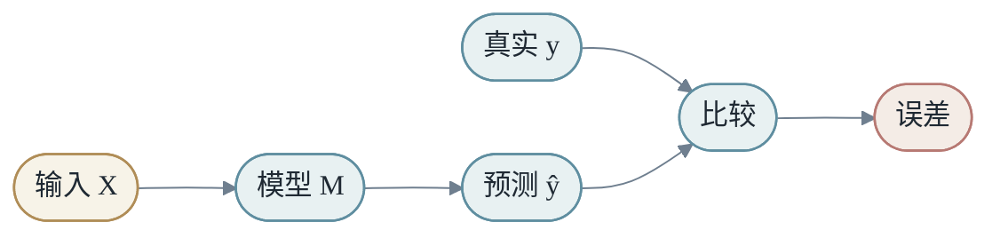
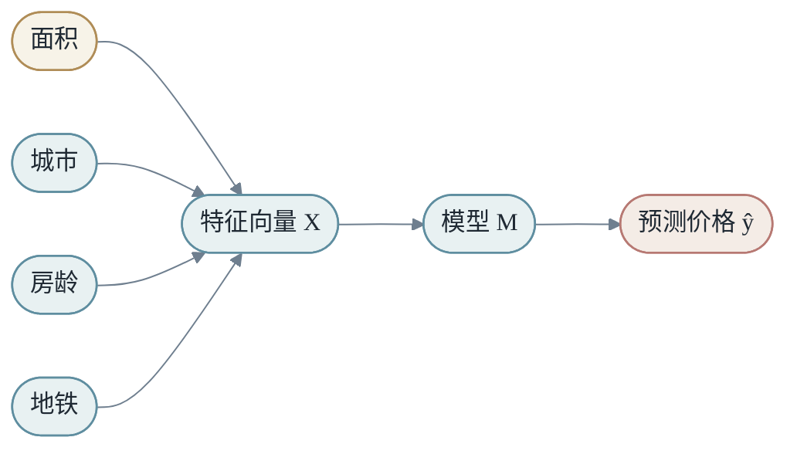
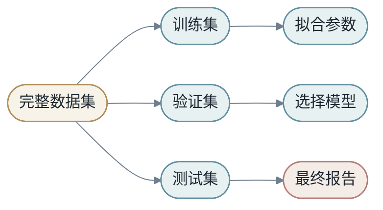
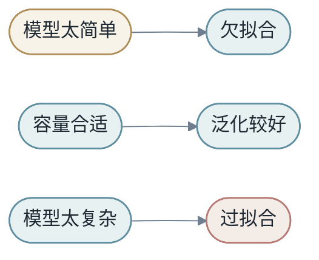
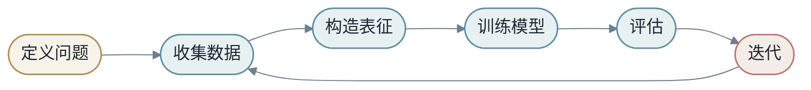
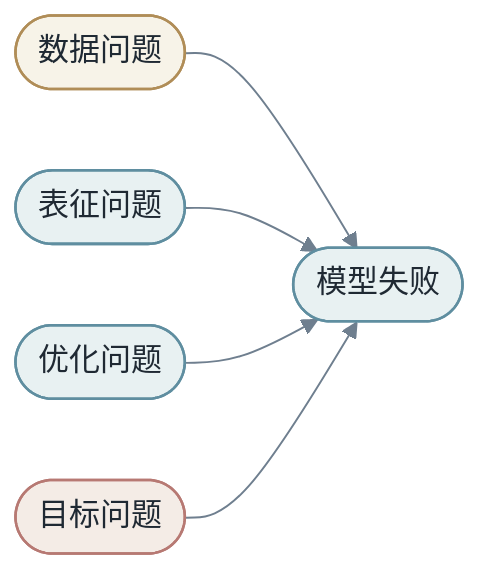

# 第一章：学习的本质

今天谈机器学习，很容易先听到一长串名字：图像识别、文字生成、推荐系统、广告排序、语音识别、自动驾驶、智能助手。它们看起来分属不同领域，输入不同，输出不同，模型也不同。光是记住这些名词，就已经够复杂了；更何况还要一个个理解它们，学习过程很容易变得困难而无趣。

可是，这些纷繁复杂的名字背后，到底有没有一个更简单的东西？本书想先建立的，就是这样一个统一的世界观：机器学习最核心的事情，是在有限数据中寻找一个能够泛化的变换。

最小表达是：

$$
X \xrightarrow{M} Y
$$

这里的 $X$ 是输入，$Y$ 是目标，$M$ 是模型。机器学习的核心问题，是如何从样本中找到一个足够好的 $M$。

## 第1节：从 X 到 Y，模型以及参数

如果把机器学习压缩成一句话，它不是“让机器像人一样思考”，而是：

> 从数据中学习一个变换，使输入 X 能够产生目标 Y。

房价预测是一个变换：

- <em>房屋特征 -&gt; 价格</em>

图像分类是一个变换：

- <em>图片像素 -&gt; 类别</em>

语言模型也是一个变换：

- <em>一段文字 -&gt; 下一个词元的概率分布</em>

它们的表面形式不同，但都可以写成：

$$
ŷ = M(x)
$$

这里最重要的概念是 $M$。$M$ 不是一个神秘的东西，它就是一个映射：给它一个输入 $x$，它产生一个输出 $ŷ$。

在最简单的数学例子里，如果我们写：

$$
y=x^2
$$

那么模型就是平方函数。输入一个数 $x$，模型输出 $x^2$。比如输入 3，输出 9；输入 -2，输出 4。这个模型很清楚，因为它的规则被我们完整写出来了。

现实问题通常没有这么干净。比如天气预报中，输入 $X$ 可能包含当前温度、湿度、气压、风速、地理位置、历史天气、雷达图和卫星图；输出 $Y$ 可能是明天的温度、降雨概率或风暴风险。这个时候，模型 $M$ 就是从这些观测信息到未来天气的映射：

- <em>当前天气状态 + 历史观测 + 地理信息 -&gt; 未来天气预测</em>

这个映射可以来自物理方程和数值模拟，也可以来自机器学习模型，或者两者结合。无论形式多复杂，它仍然是在回答同一个问题：给定输入 $X$，怎样得到目标 $Y$？

但还要注意一件事：在绝大多数情况下，一个好的模型只是近似，而不是真理。模型之所以有用，是因为在我们关心的范围内，它已经足够好地描述了 $x$ 和 $y$ 之间的关系。

例如真实关系可能是：

$$
y=e^x
$$

也可能是：

$$
y=\ln x
$$

这两个函数当然完全不同。$e^x$ 是指数增长，$\ln x$ 是缓慢增长。但在这里，我们只关心 $x$ 接近 1 的一小段范围。为了描述这段局部关系，我们可以先选用同一个二次模型形式：

$$
M(x)=ax^2+bx+c
$$

也就是说，模型的形式先固定下来，都是 $M(x)=ax^2+bx+c$。接下来，训练要做的事情，是根据给定数据去寻找不同的参数 $a$、$b$、$c$。如果数据来自 $e^x$ ，模型可能学到：

$$
M_e(x)=\frac{e}{2}x^2+0\cdot x+\frac{e}{2}
$$

这时对应的参数是：

$$
a=\frac{e}{2},\quad b=0,\quad c=\frac{e}{2}
$$

如果数据来自 $\ln x$ ，同样的模型，同样的学习过程，会学到完全不同的模型：

$$
M_{\ln}(x)=-\frac{1}{2}x^2+2x-\frac{3}{2}
$$

这时对应的参数是：

$$
a=-\frac{1}{2},\quad b=2,\quad c=-\frac{3}{2}
$$

你会发现，两个模型的形式完全一样，都是 $M(x)=ax^2+bx+c$。但是模型具有不同的是参数。第一组参数让它在局部范围内近似 $e^x$，第二组参数让它在局部范围内近似 $\ln x$。模型结构相同，参数不同，最后表达出来的数据关系也就不同。

所以，模型训练的过程可以这样理解：先选定一个模型形式，再用数据寻找合适的参数。模型形式决定了“可以选择哪些函数”，参数决定了“最后选中哪一个函数”。真实答案是 $y$，模型预测是 $ŷ$。训练的目标，是在我们关心的数据范围内，找到一组参数，让 $ŷ$ 尽可能接近 $y$。

上面两组 $a$、$b$、$c$，就是模型的参数。换一组参数，就会得到另一条二次曲线；选得好，它就在局部范围内贴近真实关系；选得不好，它就会偏离真实关系。至于这个模型能不能在范围之外继续有效，就是泛化问题。

### 1.1 学习不是记忆答案表

假设训练集中有很多样本：

$$
D = \{(x_1,y_1),(x_2,y_2),\dots,(x_N,y_N)\}
$$

最笨的模型可以把每个 $x_i$ 和 $y_i$ 记下来。训练集上它可能完美，但遇到新样本就不知道怎么办。

真正的学习要求模型能处理没见过的输入：

$$
x_{new} \notin \{x_1,x_2,\dots,x_N\}
$$

这叫泛化。泛化是机器学习中最重要也最困难的问题。

### 1.2 传统编程和机器学习

传统编程里，人写规则：

- <em>输入 + 人写的规则 -&gt; 输出</em>

机器学习里，人提供样本和学习方式：

- <em>输入 + 输出样本 -&gt; 学到规则</em>

学到规则之后，再用于新输入：

- <em>新输入 + 学到的模型 -&gt; 新输出</em>

这不是“机器突然自己懂了”，而是规则的来源发生了改变。规则不再完全由人手写，而是由模型在数据中拟合出来。

### 1.3 一个完整小例子：预测房价

假设我们要预测房价。输入 `X` 可以包含：

- <em>面积、城市、地段、房龄、楼层、是否靠近地铁</em>

输出 `Y` 是价格。模型 `M` 是从这些特征到价格的映射。

如果我们手写规则，可能写成：

- <em>价格 = 面积 * 每平米均价 + 地铁加成 - 房龄折扣</em>

这是一种人工模型。机器学习则让模型从历史成交数据中自己找到权重。

这个例子看似简单，却包含机器学习的全部要素：输入、输出、模型、数据、损失、优化、泛化。

### 1.4 什么叫“学到了”

如果模型只是记住某套房子的成交价，它没有真正学到房价规律。只有当它遇到一套没见过的房子，仍然能给出合理估价，我们才说它学到了某种结构。

这个结构不一定是人能完全说清楚的规则。它可能是许多弱信号的组合：地段、面积、交通、楼龄、周边学校、市场周期。机器学习擅长从大量样本中拟合这些组合关系。

神经网络为什么能表达复杂变换，会在第二章第 11 节用一个完整代码例子展开。第一章先停在更基础的层面：学习不是记住样本，而是在有限样本中寻找可以泛化的结构。

## 第2节：数据、样本和分布

训练集只是现实世界的一个采样。

我们真正关心的是一个未知分布：

$$
(x,y) \sim P_{data}
$$

但我们手里只有有限样本：

$$
D = \{(x_i,y_i)\}_{i=1}^{N}
$$

机器学习的根本张力在这里：我们用有限样本训练，却希望模型在整个分布上有效。

### 2.1 经验风险和真实风险

训练时我们能计算的是经验风险：

$$
R_{emp}(M)=\frac{1}{N}\sum_{i=1}^{N}L(M(x_i),y_i)
$$

真正想降低的是真实风险：

$$
R(M)=E_{(x,y)\sim P_{data}}[L(M(x),y)]
$$

经验风险可以直接算，真实风险不能直接算。训练集表现好，只说明经验风险低；模型是否真的好，还要看它在新数据上的表现。

### 2.2 训练集不是世界本身

如果训练集只包含白天的道路图像，自动驾驶模型可能在夜晚表现很差。如果语音识别训练集中缺少某种口音，它就可能对那类用户不公平。如果语言模型的训练数据偏向某些领域，它的知识和表达也会偏向那些领域。

数据不是中性的。数据决定模型看见什么，也决定模型没看见什么。

### 2.3 训练集、验证集和测试集

为了估计泛化能力，我们通常把数据拆成三部分：

- 训练集：用于更新模型参数。
- 验证集：用于选择模型和调超参数。
- 测试集：用于最终评估，尽量模拟未见数据。

如果测试集被反复用于调参，它就不再是干净测试集，而会逐渐变成另一个验证集。很多看似优秀的结果，其实是对 benchmark 的过拟合。

### 2.4 数据分布会变化

现实世界不是静止的。用户行为会变，市场会变，语言会变，攻击方式会变，设备会变。

训练时的数据分布和上线后的数据分布不同，叫 distribution shift。它会让原本表现良好的模型变差。

比如疫情前训练的出行需求模型，可能无法直接适应疫情期间的行为模式。一个只在英文数据上训练的模型，也不一定能自然处理低资源语言。

## 第3节：泛化，机器学习的核心承诺

泛化可以理解为：模型没有停留在样本表面，而是学到了某种可迁移结构。

一个只记住训练样本的模型，是把世界看成一张表。一个能泛化的模型，是把世界看成有规律的空间。

### 3.1 偏差与方差

模型太简单，可能欠拟合。它连训练集都学不好，这通常是偏差太高。

模型太灵活，可能过拟合。它把训练集里的偶然噪声也学进去，这通常是方差太高。

深度学习有趣的地方在于，它经常使用非常大的模型，却仍然可以在足够数据、正则化和优化条件下泛化。这个现象超出了许多传统直觉，也是现代学习理论仍在研究的问题。

### 3.2 欠拟合与过拟合的可观察信号

如果训练集和验证集表现都差，通常是欠拟合。模型太弱、feature 不足、训练不够、优化有问题，都可能造成欠拟合。

如果训练集表现很好，验证集表现差，通常是过拟合。模型记住了训练集细节，却没有学到可迁移结构。

- <em>训练差 + 验证差 -&gt; 欠拟合</em>
- <em>训练好 + 验证差 -&gt; 过拟合</em>
- <em>训练好 + 验证好 -&gt; 泛化较好</em>

### 3.3 泛化来自哪里

泛化可能来自多个来源：

- 数据覆盖了真实世界中的关键变化。
- 模型结构和任务结构匹配。
- Loss 引导模型学习有用规律。
- 优化过程偏向更简单或更稳定的解。
- 正则化限制模型过度记忆。

这也是为什么机器学习不是只换一个更大的模型就结束。数据、结构、目标和优化共同决定泛化。

## 第4节：端到端学习的第一层含义

端到端学习不是说系统没有中间过程，而是说中间过程可以被共同学习。

传统系统可能是：

- <em>图片 -&gt; 手工边缘 -&gt; 手工纹理 -&gt; 手工形状 -&gt; 分类器 -&gt; 类别</em>

端到端模型更像是：

- <em>图片 -&gt; 可学习的多层变换 -&gt; 类别</em>

中间层仍然存在，只是它们不再完全由人手工定义，而是在训练目标下自动形成。

### 4.1 端到端的收益

端到端学习最大的收益，是减少人工中间目标和最终目标之间的错位。

如果我们手工设计“边缘”“纹理”“形状”，这些中间特征未必正好服务于最终分类。端到端训练让模型直接围绕最终 loss 调整中间表示。

### 4.2 端到端的风险

端到端也有风险。

第一，需要更多数据。因为模型要自己学习中间表示。

第二，可解释性下降。中间表示不再是人手写的概念。

第三，调试更困难。系统出错时，不一定能直接定位是哪一步规则错了。

所以端到端不是万能答案。很多真实系统会把可学习模块和手写规则结合起来。

## 第5节：机器学习项目的最小闭环

一个最小机器学习项目可以分成六步：

### 5.1 定义问题

先明确 `X` 和 `Y`。很多项目失败，不是因为模型不够强，而是问题定义模糊。

例如“提升用户体验”不是直接可训练目标。需要进一步定义为点击、停留、满意度评分、投诉率、任务完成率，或者这些指标的组合。

### 5.2 收集数据

数据要覆盖目标场景。训练数据越接近真实使用场景，模型越可能泛化。

### 5.3 构造表征

决定模型能看到什么。对于表格任务是 feature engineering；对于文本任务是 tokenizer 和 embedding；对于图像任务是像素、patch 或视觉特征。

### 5.4 训练和评估

训练让模型拟合数据，评估检查模型是否泛化。没有可靠评估，训练只是让数字下降，不一定让系统变好。

### 5.5 迭代

机器学习项目很少一次成功。常见迭代方向包括：加数据、清洗标签、改特征、换模型、调 loss、改评估、优化系统。

## 第6节：为什么机器学习问题难

如果机器学习只是把 `X` 映射到 `Y`，听起来并不复杂。真正困难在于：我们永远只看到世界的一小部分。

训练数据有限，标签可能有噪声，未来分布可能变化，目标本身可能含糊，模型容量和计算资源也有限。机器学习不是在理想世界里寻找完美函数，而是在不完整信息中做可用近似。

可以把困难分成四类。

第一，数据困难。数据可能少、偏、脏、旧，甚至标签定义前后不一致。

第二，表征困难。现实对象中真正有用的信息，未必被输入 `X` 捕获。

第三，优化困难。即使存在好模型，训练过程也未必能稳定找到它。

第四，目标困难。loss 可以下降，但它未必等于最终想要的真实价值。

这四类困难会互相伪装。验证集表现差，可能是模型太弱，也可能是训练数据和验证数据分布不同；线上效果差，可能是模型问题，也可能是 feature 在推理时缺失。

因此机器学习工程的第一原则是：不要急着换模型。先把问题拆清楚。

## 第7节：Baseline，学习系统的第一根尺子

Baseline 是最简单、最可信的参考模型。它不一定强，但它告诉我们：复杂模型至少应该超过什么。

房价预测中，baseline 可以是“预测训练集平均价格”。文本分类中，baseline 可以是“总是预测多数类”。推荐系统中，baseline 可以是“推荐最热门商品”。

一个好 baseline 有三个作用。

第一，它暴露任务难度。如果简单规则已经很强，说明任务可能有明显信号；如果简单规则很差，说明需要更复杂表征或模型。

第二，它防止复杂模型自欺欺人。如果深度模型只比平均值预测好一点，就要怀疑数据、目标或训练过程。

第三，它帮助定位收益来源。每次改动都应该能回答：相比 baseline，提升来自哪里？

- <em>没有 baseline -&gt; 不知道模型好不好</em>
- <em>有 baseline -&gt; 至少知道复杂性是否值得</em>

Baseline 不是初学者工具，而是专业工程习惯。越复杂的系统，越需要简单参考点。

## 第8节：从样本到机制

机器学习从样本中学习，但我们希望它学到的不只是样本，而是某种机制。

例如模型看到许多房屋成交记录。它可以记住“某小区某户型卖多少钱”，也可以学到“地段、面积、楼龄、市场周期共同影响价格”。前者是样本记忆，后者更接近机制。

当然，机器学习中的“机制”不一定是因果机制。很多模型学到的是统计规律，而不是因果关系。看到冰淇淋销量和溺水事故同时上升，模型可能学到相关性，但真正原因可能是天气炎热。

这提醒我们区分三个层次：

| 层次 | 例子 | 风险 |
|------|------|------|
| 记忆 | 记住训练样本 | 无法泛化 |
| 相关 | 学到统计共现 | 分布变化时失效 |
| 因果 | 理解干预关系 | 难以从观察数据直接获得 |

大多数监督学习模型主要学习相关性。它们可以非常有用，但不应该被误认为自动理解因果。

## 第9节：学习系统的四个问题

看到任何机器学习项目，都可以先问四个问题。

第一，数据从哪里来？这决定了模型看到的世界。

第二，标签如何产生？这决定了模型追随的目标。

第三，模型在哪里使用？这决定了训练分布和推理分布是否一致。

第四，错误代价是什么？这决定了指标和阈值应该如何设计。

同样是分类任务，医疗误诊、垃圾邮件过滤、电影推荐和广告点击预测的错误代价完全不同。一个 false positive 在某个场景只是小烦恼，在另一个场景可能是严重风险。

因此机器学习不是抽象地追求 accuracy，而是要在具体场景中定义“好”。

## 第10节：任务定义的艺术

机器学习项目最容易被低估的部分，是任务定义。很多团队以为自己在训练模型，实际上还没有把问题说清楚。

“预测用户兴趣”听起来像一个任务，但它还不是可训练任务。兴趣是什么？点击算兴趣吗？停留算兴趣吗？收藏、购买、分享、评论分别代表什么？如果用户点击了标题但马上退出，这算正样本还是负样本？

任务定义要把模糊目标变成可观测目标。

- <em>模糊目标：提升用户体验</em>
- <em>可训练目标：预测用户是否会在 7 天内再次打开应用</em>
- <em>可评估目标：7 日留存、会话时长、投诉率、满意度评分</em>

这里有一个重要区别：可训练目标不一定等于最终目标。模型可以训练点击率，但产品真正关心长期满意度。点击率只是代理指标。代理指标越偏离真实目标，模型越可能学会“钻空子”。

例如标题党推荐系统可能提高点击率，但降低用户信任。广告系统可能提高短期收益，但损害用户体验。客服机器人可能减少人工转接，但让用户更沮丧。

所以任务定义必须同时包含三层：

| 层次 | 问题 | 例子 |
|------|------|------|
| 业务目标 | 我们真正想改善什么？ | 用户长期满意度 |
| 机器学习目标 | 可以用什么标签训练？ | 是否点击、是否购买 |
| 评估目标 | 用什么指标判断上线效果？ | 留存、转化、投诉、成本 |

如果这三层没有对齐，模型越强，偏离可能越大。

### 10.1 标签不是事实本身

标签经常被当作事实，但它只是某种观测或标注过程的结果。

用户点击不一定代表喜欢，可能只是误触。用户没有点击不一定代表不喜欢，可能是没有看到。人工标注也不一定绝对正确，标注员会有疲劳、偏见和理解差异。

在医学影像中，标签可能来自医生诊断，但不同医生之间也可能有分歧。在内容审核中，标签可能受政策变化影响。在搜索排序中，点击标签受到展示位置影响，排在第一的结果更容易被点击。

这说明标签也有生成机制。理解标签如何产生，是理解模型学到了什么的前提。

### 10.2 负样本也需要设计

很多任务中，正样本容易定义，负样本更难定义。

推荐系统中，用户没有点击一个商品，可能是不喜欢，也可能是没有看到。广告系统中，没有转化可能是广告不好，也可能是用户需要更长决策周期。问答系统中，一个回答没有被采纳，可能是错了，也可能是用户没有继续操作。

负样本如果定义粗糙，模型会学到错误边界。它可能把“未曝光”当作“不喜欢”，把“暂时没有行为”当作“负反馈”。

所以数据集构建不是简单收集正负样本，而是要理解样本背后的曝光、选择和反馈过程。

## 第11节：一个端到端项目的完整故事

假设我们要做一个文章推荐模型。目标是给用户推荐可能阅读的文章。

第一步不是选模型，而是定义问题。

- <em>X = 用户、文章、上下文的表征</em>
- <em>Y = 用户是否会认真阅读</em>
- <em>M = 推荐打分模型</em>

“认真阅读”需要进一步定义。可以用停留时长超过阈值，也可以用阅读完成率，也可以用点赞、收藏、分享的组合。不同定义会训练出不同行为的模型。

如果只优化点击，模型可能偏向标题刺激的文章。如果优化长阅读，模型可能偏向长文。如果优化分享，模型可能偏向情绪强烈的内容。

### 11.1 数据闭环

推荐系统的数据不是静态的。模型推荐什么，用户就更可能看到什么；用户看到什么，又决定未来训练数据中有什么。

这个反馈回路很强。如果模型一开始偏向某类内容，那类内容会获得更多曝光，未来数据会进一步强化偏向。推荐系统因此需要探索、去偏、分群评估和长期指标。

### 11.2 从 baseline 到深度模型

第一版 baseline 可以是热门文章。第二版可以按用户历史类目推荐。第三版可以用 logistic regression，把用户特征、文章特征和上下文特征组合起来。第四版再引入 embedding 和深度模型。

每一步都应该回答：相比上一版，增加复杂性带来了什么？

| 版本 | 方法 | 学到什么 | 风险 |
|------|------|----------|------|
| V0 | 热门文章 | 群体偏好 | 个性化弱 |
| V1 | 类目匹配 | 粗粒度兴趣 | 类目过粗 |
| V2 | 线性模型 | feature 权重 | 交叉关系弱 |
| V3 | embedding 模型 | 用户/文章相似性 | 冷启动和解释性 |
| V4 | 深度排序模型 | 复杂交互 | 调试和偏差更难 |

这个故事说明：端到端学习不是一步跳到最大模型，而是在可靠闭环上逐步增加可学习能力。

## 第12节：机器学习中的保守主义

初学者常常想直接使用最强模型。工程上更稳的路径是保守主义：先用最简单方法证明任务可学，再逐步增加复杂度。

保守不是不追求性能，而是控制不确定性。每增加一个复杂组件，就增加一个可能失败的地方。深度模型、复杂特征、在线服务、分布式训练、自动调参，每一项都可能带来收益，也可能带来不可解释的问题。

一个成熟项目通常遵循：

- <em>规则 baseline -&gt; 简单模型 -&gt; 强表征 -&gt; 深度模型 -&gt; 系统优化</em>

这条路径的好处是，每一步都能和上一版本比较。如果最后模型表现好，我们知道大概是什么带来了提升；如果表现差，也能退回到可工作的版本。

机器学习不是炫技比赛。真正的目标是构建可靠、可解释、可迭代的学习系统。

## 第13节：问题定义中的时间

很多机器学习任务看起来是静态映射，实际上都藏着时间。

预测用户是否会取消订阅，需要规定观察窗口和预测窗口：用过去多少天行为，预测未来多少天结果。预测房价，需要知道训练数据来自哪个市场周期。检测欺诈，需要考虑标签多久之后才确认。

如果时间定义不清楚，数据很容易泄漏未来信息。

- <em>错误做法：用用户取消订阅后的行为预测是否会取消订阅</em>
- <em>正确做法：只使用预测时刻之前可见的信息</em>

时间还影响评估。随机切分数据可能让未来样本进入训练集，从而高估效果。很多真实项目应该使用时间切分：用过去训练，用未来验证。

### 13.1 Observation Window 和 Prediction Window

一个严谨任务常写成：

- <em>用 T0 之前 30 天行为，预测 T0 之后 7 天是否发生 Y</em>

这样 `X` 和 `Y` 的边界清楚，训练和上线才能一致。

## 第14节：样本不是独立小岛

教材里常假设样本独立同分布。但真实系统中，样本之间常常相关。

同一个用户产生多条样本，同一个商品出现在多个请求中，同一场营销活动影响一批行为，同一时间段的流量受外部事件影响。

如果切分数据时不考虑这些相关性，训练集和测试集可能共享太多信息，评估结果虚高。

例如用户级推荐任务中，如果同一个用户的历史出现在训练集，而这个用户的未来行为出现在测试集，模型可能看起来泛化很好。但如果上线目标是服务新用户，这种评估就不可靠。

因此要根据目标选择切分方式：

- 预测未来：按时间切。
- 泛化到新用户：按用户切。
- 泛化到新商品：按商品切。
- 泛化到新地区：按地区切。

数据切分不是格式操作，而是实验假设。

## 第15节：反馈信号的质量

学习依赖反馈。反馈越接近真实目标，模型越容易学对；反馈越噪声、越延迟、越偏，模型越容易学歪。

点击是快速反馈，但不一定代表满意。购买是强反馈，但更稀疏。退款、投诉、留存是更长期信号，但延迟更大。

不同反馈可以组成多层目标：

- <em>短期：点击、打开、停留</em>
- <em>中期：收藏、购买、复访</em>
- <em>长期：留存、信任、满意度</em>
- <em>负向：投诉、退款、拉黑、卸载</em>

成熟系统不会只看一个反馈。它会同时监控短期收益和长期伤害。

### 15.1 反馈会被模型改变

上线后的模型会改变用户看到什么，也就改变未来反馈。推荐系统、搜索排序、广告排序尤其明显。

这意味着训练数据不是自然产生的，而是被过去模型塑造的。理解这一点，是理解线上学习系统的关键。

## 第16节：从因果问题看机器学习边界

机器学习擅长发现相关性，但产品决策常常需要因果判断。

模型发现“买过高端商品的用户更可能购买会员”，这不代表给用户展示高端商品就会提高会员购买率。相关性可能来自收入、兴趣或平台推荐策略。

因果问题问的是：如果我们改变某个行动，结果会怎样？

- <em>预测问题：谁更可能购买？</em>
- <em>因果问题：给谁发优惠券会真正增加购买？</em>

很多业务决策需要第二个问题。仅靠监督学习预测倾向，可能把资源花在本来就会购买的人身上。

因此机器学习项目要区分：我们是在预测、排序、分类，还是在评估一个行动的影响？

## 第17节：从第一性问题开始

面对新任务，可以先问一组第一性问题：

1. 如果不用机器学习，人会怎么解决？
2. 人解决时依赖哪些信息？
3. 这些信息在数据中是否可见？
4. 输出错误时会造成什么损失？
5. 模型做出的结果谁会使用？
6. 使用者能否纠正模型？
7. 失败是否可逆？

这些问题帮助我们判断任务是否适合学习系统。

如果人也无法根据输入判断 `Y`，模型通常也很难。如果关键证据不在数据里，模型只能猜。如果错误不可逆，就需要更强验证和人类责任。

### 本章小结

第一章建立了全书的主线：

- 学习是寻找 `X -> Y` 的变换 `M`。
- 训练集是现实分布的有限采样。
- 泛化是机器学习的核心承诺。
- 端到端学习的关键，是让中间表示也参与共同优化。
- 机器学习项目需要问题、数据、表征、训练、评估和迭代的闭环。
- Baseline、数据来源、标签定义和错误代价，是所有项目开始前必须确认的基础。

### 思考题

1. 如果一个模型训练集准确率 100%，测试集准确率很低，它到底学到了什么？
2. 为什么“更多数据”通常有助于泛化？有没有可能更多数据反而带来问题？
3. 传统编程和机器学习的边界是否绝对？规则系统和学习系统能否结合？
4. 为什么测试集不能被反复用于调参？
5. 对“预测用户是否会取消订阅”这个任务，分别定义可能的 X、Y、M 和 loss。
6. 端到端系统中如果出现错误，你会从数据、表征、模型、loss、系统哪几个方向排查？
7. 给一个任务设计两个 baseline：一个极简规则 baseline，一个简单机器学习 baseline。
8. 举一个相关性不等于因果的机器学习例子。
9. 对一个医疗分类系统，false positive 和 false negative 的代价分别是什么？
