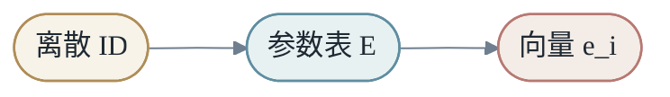
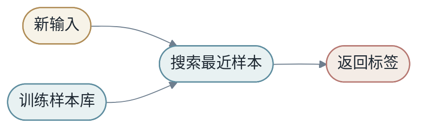

# 第二章：变换的语言


第一章把机器学习压缩为一个基本问题：在样本约束下，寻找从 `X` 到 `Y` 的变换 `M`。本章讨论 `M` 的形式。更准确地说，模型不是单个函数，而是一族候选变换，也就是一个假设空间：

$$
\mathcal{H}=\{M_\theta\mid \theta\in\Theta\}
$$

训练过程是在 $\mathcal{H}$ 中选择一个具体实例；模型设计则决定了这个空间中允许出现哪些变换。

沿着 `X -> Y` 这条主线，模型可以按照输出对象与变换机制分成六类：数值变换、决策变换、概率变换、表示变换、记忆与检索变换、组合变换。它们回答的是同一个问题的不同侧面：输入经过 `M` 之后，究竟变成了什么。

本章采用“例子到理论”的顺序展开。房价预测展示数值变换，垃圾邮件过滤展示决策变换，下一词预测展示概率变换，词向量展示表示变换，检索问答展示记忆与检索变换，图像识别展示组合变换。具体任务先给出直觉，随后再抽象出变换形式、归纳偏置和能力边界。

表 2-1 给出本章的分析坐标。

| 变换视角 | 输出对象 | 代表例子 | 抽象问题 |
|----------|----------|----------|----------|
| 数值变换 | value / score | 房价预测、广告点击率打分 | 如何把复杂输入压成可比较的量 |
| 决策变换 | class / decision | 垃圾邮件过滤、风险审批 | 如何把输入放到边界的一侧 |
| 概率变换 | distribution | 下一词预测、医学诊断置信度 | 如何保留多个可能答案及其不确定性 |
| 表示变换 | representation | 词向量、PCA、encoder | 如何把 `X` 换到更适合预测 `Y` 的空间 |
| 记忆与检索变换 | memory / context | kNN、embedding table、RAG | 如何从相似对象或外部知识中取回信息 |
| 组合变换 | composed representation / output | MLP、CNN、Transformer | 如何用简单变换复合出复杂关系 |

## 第1节：数值变换，X -> value / score

先看房价预测。输入 `X` 可以是一套房子的面积、位置、楼层、房龄、学区、装修情况；输出 `Y` 是一个价格。这个任务里的模型并不需要生成一段文字，也不需要判断一个类别，它只要把复杂输入压成一个数。

广告系统里也有类似问题。给定一次请求、一个用户、一个广告和上下文，模型输出点击率、转化率或预估收益。这个数未必是最终答案，但它可以排序、比较、进入后续决策。

这类模型完成的是数值变换：

- <em>X -&gt; value / score</em>

最简单的数值变换是线性函数：

$$
ŷ = wx + b
$$

如果 `x` 是房屋面积，`ŷ` 是房价预测，`w` 表示面积每增加一个单位，价格平均增加多少，`b` 是基础价格。

当输入是向量时：

$$
x = [x_1,x_2,\dots,x_d]
$$

线性模型写成：

$$
ŷ = w^Tx + b = \sum_{j=1}^{d}w_jx_j+b
$$

每个 $x_j$ 是一个 feature，每个 $w_j$ 是对应权重。

### 1.1 线性模型为什么重要

线性模型看似简单，却有三个优点。

第一，它容易解释。权重可以近似理解为 feature 的贡献。

第二，它容易优化。很多线性模型有凸优化性质，训练相对稳定。

第三，它是复杂模型的基本组件。神经网络中的线性层、本质上仍然是矩阵乘法。

### 1.2 线性模型的代码直觉

```python
import torch

B, D = 8, 4
x = torch.randn(B, D)
w = torch.randn(D, 1)
b = torch.randn(1)

y_hat = x @ w + b
```

这里 `x @ w` 对应公式中的 $w^T x$，只是 batch 版本。矩阵乘法让 8 个样本一次性完成预测。

### 1.3 线性不等于弱

线性模型在很多场景仍然很强，尤其是 feature 已经很好时。

如果 `x` 已经是一个强 embedding，简单线性分类器就可能表现很好。深度学习中常见的“linear probe”就是冻结表征模型，只训练一个线性层，用来测试表征质量。

## 第2节：表示变换，X -> representation

有些模型并不直接从 `X` 给出最终 `Y`，而是先把 `X` 改写成一个更有用的中间表示。词向量是最直观的例子：原始输入是一个 token ID，输出不是类别也不是分数，而是一个向量。这个向量把离散词放进连续语义空间，使得 `cat` 和 `dog` 可以比 `cat` 和 `car` 更近。

图像模型也一样。原始像素很难直接对应“猫”或“汽车”，但经过几层变换后，中间表示会逐渐保留边缘、纹理、部件和语义结构。此时模型真正学习的，是一个更适合预测 `Y` 的坐标系。

这类模型完成的是表示变换：

- <em>X -&gt; representation -&gt; Y</em>

当表示仍然是向量时，一个基础形式是：

$$
ŷ = Wx+b
$$

这里的矩阵 `W` 不只是数字表格，而是模型的变换规则。它把多个输入 feature 混合成多个输出 feature，可以表示旋转、缩放、投影、剪切，也可以表示神经网络中最常见的 feature mixing。


### 2.1 点的变换还是坐标系的变换

矩阵有两个互补视角。

第一，把向量看成空间中的点，矩阵就是移动这些点。

第二，把向量看成某个对象在坐标系中的坐标，矩阵就是换一个坐标系重新描述对象。

这两个视角都对。机器学习中我们常常在两者之间切换：一方面说模型改变了数据点的位置，另一方面也说模型学到了新的表征空间。

### 2.2 基向量视角

矩阵的列可以看成新基向量。二维矩阵：

$$
W=\begin{bmatrix}a & b \\ c & d\end{bmatrix}
$$

会把标准基向量 $e_1=[1,0]$ 和 $e_2=[0,1]$ 分别映射到矩阵的两列。

理解矩阵变换，一个实用方法是看它把基向量送到哪里。整个空间随后被这些新基向量拉伸和重排。

### 2.3 投影与压缩

如果 `W` 把高维向量映射到低维空间，它就是一种压缩：

$$
W \in R^{k \times d}, \quad k < d
$$

如果 `W` 把低维向量映射到高维空间，它就是一种展开：

$$
W \in R^{k \times d}, \quad k > d
$$

Embedding、特征投影、降维、注意力中的 Q/K/V 投影，都可以放在这个框架里理解。

### 2.4 投影模型的直觉

PCA 是一个投影模型例子。它寻找一组新坐标轴，让数据在前几个方向上保留最多变化。这里不需要把 PCA 当成线性代数专题，只要抓住一点：模型可以通过投影，把高维输入压缩成更有用的低维表示。


这和深度学习中的 learned projection 不同：PCA 是无监督的线性方法，神经网络中的投影矩阵通常由任务 loss 监督学习。但它们都体现了同一个思想：换一个空间，数据结构可能更清楚。

## 第3节：决策变换，X -> class / decision

再看垃圾邮件过滤。输入 `X` 是一封邮件：标题、正文、发件人、链接、历史行为。输出 `Y` 不是一个连续数，而是一个动作：放进收件箱，还是放进垃圾箱。

风控审批也是同类问题。输入是一笔交易或一个申请，输出是通过、拒绝、人工复核。系统内部可能先算风险分数，但用户和业务最终看到的是决策。

这类模型完成的是决策变换：

- <em>X -&gt; class / decision</em>

二分类线性模型可以写成：

$$
score=w^Tx+b
$$

然后通过阈值变成类别：

- <em>score &gt; 0 -&gt; 正类</em>
- <em>score &lt; 0 -&gt; 负类</em>

从 `X -> Y by M` 看，分类模型的 `M` 做了两步变换：先把输入变成分数，再把分数变成决策。

- <em>x -&gt; score -&gt; class</em>

这比“线性代数”更重要：分类模型告诉我们，模型可以把复杂对象压成一个可决策的方向。`w` 决定看什么方向，`b` 决定边界放在哪里。

### 3.1 决策边界

分类模型最终会在输入空间中形成决策边界。二分类线性模型的边界是：

$$
w^Tx+b=0
$$

边界一侧预测为正类，另一侧预测为负类。

非线性模型可以形成弯曲边界。神经网络通过多层非线性，把复杂边界拼出来。

理解边界有助于理解模型错误。如果两个类别在表征空间中高度重叠，再复杂的边界也难以稳定分开。如果某些训练点是噪声，过度弯曲边界去包住它们，就会导致过拟合。

## 第4节：概率变换，X -> distribution

语言模型是概率变换最清楚的例子。给定一句话的前文：

- <em>今天纽约的天气很</em>

模型并不是只输出一个确定词。它会给出一组可能续写，以及每个 token 的概率：

- <em>好: 0.31</em>
- <em>冷: 0.18</em>
- <em>热: 0.09</em>
- <em>差: 0.06</em>
- <em>...</em>

医学诊断也类似。同一张影像可能同时对应多种诊断可能，医生关心的不只是最可能疾病，也关心置信度和风险。

这类模型完成的是概率变换：

- <em>X -&gt; P(Y | X)</em>

模型输出的不是一个确定答案，而是一个概率分布。

分类模型输出：

$$
P(Y=c \mid X=x)
$$

语言模型输出：

$$
P(x_{t+1} \mid x_{≤t})
$$

这时 `M` 的作用不是直接给答案，而是把输入变成一个分布。预测只是从分布中选择或采样。

- <em>x -&gt; logits -&gt; probability distribution -&gt; decision / sample</em>

神经网络分类器通常先输出 logits：

- <em>z = [2.1, -0.3, 0.7]</em>

logits 不是概率，可以为负，也不要求和为 1。Softmax 把它们变成概率分布：

$$
p_i=\frac{exp(z_i)}{\sum_j exp(z_j)}
$$

概率模型重要，是因为现实中很多问题本来就不确定。同一段用户行为可能对应多种未来，同一句话可能有多个合理续写，同一张医学影像也可能需要表达诊断置信度。

### 4.1 校准

一个模型说“我有 90% 把握”时，真的应该在类似样本上大约 90% 正确。这叫校准。

准确率高的模型不一定校准好。它可能经常给出过度自信的概率。对搜索、推荐、医疗、金融这类系统，概率本身会进入决策，校准就很重要。

## 第5节：从 XOR 到非线性变换

线性模型只能表达线性边界。很多真实问题不是线性可分的，XOR 是最经典的小例子：

- <em>0 xor 0 = 0</em>
- <em>0 xor 1 = 1</em>
- <em>1 xor 0 = 1</em>
- <em>1 xor 1 = 0</em>

在二维平面上，两个正例位于对角线，两个负例位于另一条对角线。没有一条直线能把它们分开。

这个例子说明，决策变换和表示变换都会遇到同一个问题：如果原始空间中的结构本身不是线性的，只靠线性边界就不够。模型必须改变空间，或者让边界弯曲。

非线性模型允许：

$$
M(x)=f(Wx+b)
$$

这里的 `f` 让模型可以弯曲空间。


### 5.1 激活函数

神经网络中的非线性通常来自激活函数。

ReLU 是：

$$
ReLU(x)=\max(0,x)
$$

它只是一个折线函数，但大量 ReLU 组合起来，可以表达复杂的分段线性函数。

### 5.2 通过增加坐标解决 XOR

但如果增加非线性变换，例如加入特征 `x1 * x2`，问题就能变得线性可分。

这说明非线性不是装饰，而是表达某些结构的必要条件。

### 5.3 分段线性直觉

ReLU 网络虽然整体非线性，但在每个激活模式固定的区域内，它仍然是线性的。复杂性来自很多区域拼接在一起。

这给了我们一个很好的中间理解：神经网络不是完全不可理解的任意曲面，它是由大量局部简单片段组成的全局复杂变换。

## 第6节：记忆与检索变换，query -> memory / context

如果用户问：“这篇论文的核心贡献是什么？”模型可以只依赖参数中的压缩记忆，也可以先检索相关文档，再基于文档回答。后一种方式就是 RAG 的基本思想：输入不再只被送进模型计算，还会触发一次检索，把外部知识变成上下文。

推荐系统和最近邻分类也有同样结构。给定一个用户或样本，系统先找到相似用户、相似商品或相似训练样本，再把取回的信息用于预测。

这类模型完成的是记忆与检索变换：

- <em>query -&gt; retrieved memory / context -&gt; Y</em>

最简单的形式是查表函数。对于每个输入 ID，直接找到对应向量或答案。

Embedding table 就是一种查表：

$$
e_i = E[i]
$$

其中 `E` 是参数表。



查表不是低级方法。现代模型大量使用 embedding、KV Cache、检索库和外部记忆。关键问题不是能不能记，而是记忆如何参与泛化。

### 6.1 最近邻模型

最近邻是一种非常直观的查表式模型。新样本来了，找到训练集中最相似的样本，返回它的标签。



最近邻的关键是距离函数。如果距离函数好，它可以表现不错；如果距离函数不能表达任务相关相似性，结果会很差。

### 6.2 参数记忆和外部记忆

神经网络的参数可以看成压缩记忆。Embedding table 是显式记忆，语言模型参数是隐式记忆，向量数据库是外部记忆，KV Cache 是运行时记忆。

这几种记忆服务于不同目的：

| 类型 | 保存什么 | 何时更新 |
|------|----------|----------|
| 参数 | 长期统计规律 | 训练时 |
| Embedding table | 离散对象向量 | 训练时 |
| KV Cache | 当前上下文状态 | 推理时 |
| 向量数据库 | 外部文档/知识 | 数据更新时 |

## 第7节：表示变换的经典路线：SVM 与核方法

手写数字识别可以作为例子。原始像素空间里，数字 `3` 和 `8` 可能在很多局部笔画上相似；如果直接在像素空间中找线性边界，效果未必稳定。核方法的想法是：先把样本映射到另一个空间，再在那里寻找更简单的边界。

SVM 的基本分类边界是：

$$
w^Tx+b=0
$$

分类规则是：

$$
ŷ=sign(w^Tx+b)
$$

当原空间不可线性分时，可以先做特征映射：

$$
φ:x \mapsto φ(x)
$$

然后在新空间做线性分类。

核函数直接计算新空间内积：

$$
K(x_i,x_j)=φ(x_i)^Tφ(x_j)
$$


SVM 和核方法告诉我们：改变空间，问题就会改变。深度学习继承了这个思想，只是把特征映射也变成了可学习对象。

### 7.1 Margin 的直觉

SVM 不只想分对样本，还想让分类边界离最近样本尽量远。这个距离叫 margin。

大 margin 的直觉是：边界更稳。如果新样本有一点噪声或扰动，仍然不容易跨过边界。


### 7.2 Kernel Trick 为什么巧妙

如果显式构造高维 φ(x)，计算可能很贵。Kernel trick 只计算内积 $K(x_i,x_j)$，避免真正写出高维向量。

这在历史上非常漂亮：它说明有时我们可以在高维空间中工作，却不显式进入高维空间。

深度学习后来选择另一条路：直接学习一个多层 φ(x)，并用大规模数据和算力训练它。

## 第8节：表示变换的现代路线：从手工空间到可学习空间

第二章的故事可以这样收束：

- <em>线性模型：在原空间里找简单边界</em>
- <em>核方法：手工或隐式换到高维空间</em>
- <em>深度学习：学习一个适合任务的空间</em>

神经网络的中间层可以看作一系列学到的坐标变换。每层都把数据放到一个新空间里，让最终任务更容易。


这就是从传统机器学习走向深度学习的桥梁：不只是学习分类器，而是学习表示问题的空间。

## 第9节：组合变换，X -> M_n(...M_1(X)) -> Y

图像识别说明了为什么需要组合变换。原始输入是像素矩阵，最终输出是“猫”“狗”“车”这样的类别。中间不可能只靠一次简单映射完成：低层需要识别边缘和纹理，中层组合出局部部件，高层再形成语义对象。

语言模型也是组合变换。token 先进入 embedding 空间，随后经过 attention、MLP、残差连接和归一化，一层层重写上下文表示，最后输出下一个 token 的概率分布。

这类模型完成的是组合变换：

- <em>X -&gt; M1(X) -&gt; M2(M1(X)) -&gt; ... -&gt; Y</em>

神经网络的基本单元并不神秘，它就是一个小变换：先做线性组合，再做非线性处理。

$$
h=σ(w^Tx+b)
$$

一层网络是很多神经元并排：

$$
h=σ(Wx+b)
$$

多层网络则是这些变换的复合：

$$
M=f_L \circ f_{L-1} \circ ... \circ f_1
$$

- <em>输入 X -&gt; 线性混合 -&gt; 激活 -&gt; 线性混合 -&gt; 激活 -&gt; 输出 Y</em>

这里的重点不是“线性代数”，而是变换的分工：线性部分负责混合信息，激活函数负责制造非线性，层与层的复合负责把简单局部变换组合成复杂全局变换。

### 9.1 为什么多层线性还不够

如果没有激活函数，多层线性变换仍然等价于一层线性变换：

$$
W_2(W_1x+b_1)+b_2=(W_2W_1)x+(W_2b_1+b_2)
$$

所以深度网络真正的表达力，不来自“矩阵很多”，而来自“线性混合 + 非线性选择”的反复组合。

## 第10节：激活函数，给变换增加形状

激活函数决定每个神经元怎样把线性分数变成新的信号。常见激活函数可以从“它给变换增加什么形状”来理解。

Sigmoid 把任意实数压到 0 和 1 之间：

$$
sigmoid(x)=\frac{1}{1+e^{-x}}
$$

它适合表达概率、开关和饱和效应。早期神经网络理论常用 sigmoid，因为它连续、单调、有界，组合起来容易分析。

Tanh 把值压到 -1 和 1 之间：

$$
tanh(x) \in (-1,1)
$$

它和 sigmoid 类似，但中心在 0，常比 sigmoid 更适合作为中间表示。

ReLU 是：

$$
ReLU(x)=max(0,x)
$$

它不再有界，但简单、梯度传播更直接、计算便宜。ReLU 网络可以看作把空间切成许多线性区域，再把这些区域拼成复杂函数。

GELU、SiLU 等现代激活函数更平滑，常用于 Transformer 和大模型。它们不是为了炫技，而是在表达能力、优化稳定性和硬件效率之间做折中。

### 10.1 激活函数不是装饰

没有激活函数，网络再深也只是一个线性模型。有了激活函数，模型才能表达弯曲边界、饱和效应、门控关系和分段规则。

XOR 就是最简单的证据：原始二维空间里一条直线分不开，但加入非线性特征或非线性网络后，问题可以变得可分。

## 第11节：为什么神经网络能表达各种变换

这一节用一个完整代码例子来回答：为什么神经网络可以表达各种 `X -> Y` 变换？先看最简单的直线。训练数据来自 `x in [-100, 100]`，评估时把模型画到更大的 `[-500, 500]`。输入使用原始数值，不做 `x/100` 之类的缩放。

```python
x_train_raw = torch.linspace(-100, 100, 1000).reshape(-1, 1)
x_plot_raw = torch.linspace(-500, 500, 2000).reshape(-1, 1)


def line_y(x):
    return 2 * x + 8.0


y_train_line = line_y(x_train_raw)
y_plot_line = line_y(x_plot_raw)
```

我们比较两个参数量接近的网络。第一个是普通的一层 Sigmoid 网络：

- <em>1 -&gt; 200 -&gt; 1</em>

第二个是带 residual update 的网络：

- <em>1 -&gt; project(16) -&gt; res(16) -&gt; res(16) -&gt; 1</em>

这里每个 residual layer 只包含一个线性层，而不是两个线性层：

- <em>h = h + sigmoid(Linear(h))</em>

也就是说，`project` 只负责把一维输入放进 16 维隐藏空间；后面的两个 residual layer 在同一个隐藏空间里做增量更新；最后用输出层把隐藏表示变回一个数。

核心代码如下：

```python
class PlainSigmoidNet(torch.nn.Module):
    def __init__(self, hidden_size=200):
        super().__init__()
        self.net = torch.nn.Sequential(
            torch.nn.Linear(1, hidden_size),
            torch.nn.Sigmoid(),
            torch.nn.Linear(hidden_size, 1),
        )

    def forward(self, x):
        return self.net(x)


class ProjectResidualNet(torch.nn.Module):
    def __init__(self, width=16, residual_blocks=2):
        super().__init__()
        self.project = torch.nn.Linear(1, width)
        self.residual_layers = torch.nn.ModuleList(
            torch.nn.Linear(width, width) for _ in range(residual_blocks)
        )
        self.output = torch.nn.Linear(width, 1)

    def forward(self, x):
        h = self.project(x)
        for layer in self.residual_layers:
            h = h + torch.sigmoid(layer(h))
        return self.output(h)
```

这两个网络的参数量很接近：

| 网络 | 参数量 | 结构 |
|---|---:|---|
| 普通 Sigmoid | 601 | `1 -> 200 -> 1` |
| Residual Sigmoid | 593 | `1 -> project(16) -> res(16) -> res(16) -> 1` |

参数量的计算也很直接。普通网络是：

- <em>Linear(1, 200): 1*200 + 200 = 400</em>
- <em>Linear(200, 1): 200*1 + 1 = 201</em>
- <em>总参数: 400 + 201 = 601</em>

Residual 网络是：

- <em>project Linear(1, 16): 1*16 + 16 = 32</em>
- <em>res1 Linear(16, 16): 16*16 + 16 = 272</em>
- <em>res2 Linear(16, 16): 16*16 + 16 = 272</em>
- <em>output Linear(16, 1): 16*1 + 1 = 17</em>
- <em>总参数: 32 + 272 + 272 + 17 = 593</em>

现在用这两个网络学习直线：

$$
y=2x+8
$$


7 个随机 seed 的聚合结果如下：

| 网络 | 平均训练 MSE | 最好训练 MSE | 平均评估 MSE |
|---|---:|---:|---:|
| 普通 Sigmoid | 0.0000350 | 0.0000292 | 151488.52 |
| Residual Sigmoid | 0.000000468 | 0.000000148 | 0.2797 |

普通 Sigmoid 网络在训练区间里可以把直线拟合得很好，但区间外很快变成水平线。这种区间外水平化来自结构本身。普通 Sigmoid 网络的形式是：

$$
\sum_i a_i\sigma(w_ix+b_i)+c
$$

当 `x` 很大或很小时，每个 `sigmoid` 都会接近 0 或 1，于是整个输出会接近常数。

Residual 网络不同。它先用 `project(x)` 保留一条线性通道，再用 residual layer 做修正：

- <em>h = project(x)</em>
- <em>h = h + sigmoid(Linear(h))</em>
- <em>h = h + sigmoid(Linear(h))</em>
- <em>y = output(h)</em>

所以它不只是把输入压进 Sigmoid，而是在一个线性隐藏表示上叠加可学习的非线性修正。对直线任务，这个结构几乎学到了全局变换。

直线例子说明，网络不是记住 1000 个点，而是在参数里形成一个可计算的变换。接下来换一个目标函数。模型结构、参数量和训练代码都不变，只把训练数据换成上半圆上的点。

上半圆来自圆方程：

$$
y=400\sqrt{1-(x/400)^2}
$$

$$
x^2+y^2=400^2
$$

取上半部分后，每个 `x` 只对应一个 `y`，正好适合这个一维回归例子。半圆实验的训练数据取 `x in [-150, 150]`，评估仍然画到 `[-500, 500]`：

```python
x_train_semicircle = torch.linspace(-150, 150, 1000).reshape(-1, 1)
x_plot_raw = torch.linspace(-500, 500, 2000).reshape(-1, 1)


def semicircle_y(x):
    radius = 400.0
    inside = 1.0 - (x / radius) ** 2
    return radius * torch.sqrt(torch.clamp(inside, min=0.0))


y_train_semicircle = semicircle_y(x_train_semicircle)
y_plot_semicircle = semicircle_y(x_plot_raw)
```

真实半圆只在 `[-400, 400]` 内有定义，图中只画这个有效区间。


这次运行保存了 dense prediction 和模型参数，因此后续修改图形样式不需要重新训练。评估 MSE 只在真实半圆有效的 `[-400, 400]` 内计算：

| 网络 | 平均训练 MSE | 最好训练 MSE | 平均半圆评估 MSE |
|---|---:|---:|---:|
| 普通 Sigmoid | 0.0000219 | 0.0000219 | 6332.88 |
| Residual Sigmoid | 0.01228 | 0.00866 | 11136.63 |

这组结果说明了学习的另一个侧面。训练区间从 `[-100, 100]` 扩大到 `[-150, 150]` 后，模型看到了更多曲率，普通 Sigmoid 的半圆评估误差明显下降；但两个网络仍然只看过半圆顶部的一段，所以它们还不能可靠推出两侧应该快速下降到 0。

这并不是说 600 个参数学不了半圆。如果训练数据覆盖整个 `[-400, 400]`，这个参数量应该足够拟合得相当准确。这里的问题是：训练 loss 只约束了顶部这段曲线。半圆在这段里确实有曲率，所以它有代表性；但它没有告诉模型两个关键事实：第一，`x = -400` 和 `x = 400` 时 `y` 应该等于 0；第二，曲线两侧要越来越陡地下降。缺少这两个边界信息时，许多函数都能在 `[-100, 100]` 上拟合得很好，模型没有理由自动选择完整半圆。

换句话说，神经网络可以表达非常多的函数，但它从有限数据中学到哪一个函数，取决于数据范围、结构、优化过程和归纳偏置。

这就是神经网络强大的地方，也是危险的地方。强大之处在于：同一段代码、同一组参数结构，只要换训练目标，就可以学习直线，也可以学习半圆。危险之处在于：训练区间内拟合得好，不等于区间外一定正确。

万能逼近定理说的是“存在某组参数”可以在有限范围内逼近目标函数，不是说训练一定能找到，也不是说训练区间外一定正确。

这一区别很关键：

- <em>表达能力：模型族里有没有某个 M 能做到</em>
- <em>学习能力：优化和数据能不能找到这个 M</em>
- <em>泛化能力：找到的 M 能不能在新样本上继续有效</em>

直线和半圆的对比正好说明了这一点。同一个神经网络族有能力表达不同变换，但数据只覆盖一小段时，模型学到的是与这段数据、结构和优化过程共同匹配的函数。表达能力给了模型可能性，训练和泛化决定这种可能性能不能变成可靠能力。

这也自然引出下一章和第四章：有了可以表达复杂变换的模型，还必须讨论 `X` 如何表示、loss 如何定义、参数如何学习。

## 第12节：从模型变换回到优化

变换语言不只描述模型能表达什么，也影响模型如何学习。

线性模型的优化地形通常比较简单；查表模型容易记住样本但泛化依赖相似度；核方法通过换空间获得更强边界；神经网络表达力强，但参数空间更复杂，训练更依赖初始化、学习率、归一化和数据规模。

所以第二章只解决一个问题：`M` 可以是什么样的变换。第四章会继续问：当 `M` 足够复杂时，怎样从数据中学出好的参数 `θ`？

## 第13节：换个角度理解变换：点与坐标系

前面我们一直把模型写成：

$$
Y=M(X)
$$

这很自然，因为模型确实把输入点 `x` 映射成输出 `y`。但如果只用“点被搬到哪里”理解变换，就会漏掉机器学习里更深的一层：模型也在学习怎样重新描述这个世界。

同一个学习过程，可以同时有两个视角。

- <em>点的变换：给定 x，模型计算 M(x)</em>
- <em>坐标系的变换：模型学习一个新空间，让 X -&gt; Y 更容易</em>

点的变换，是模型计算的表面形式。坐标系的变换，是模型学习的深层效果。

### 13.1 线性模型：学一个新方向

二分类线性模型可以写成：

$$
score=w^Tx+b
$$

从点的变换看，每个输入点 $x$ 被映射成一个分数 $score$。分数大于阈值是一类，小于阈值是另一类。

但从坐标系视角看，模型学到的是一个方向 $w$。原来我们用 $x_1$、$x_2$、$x_3$ 这些原始 feature 看数据；训练后，模型告诉我们：和任务最相关的是 $w$ 这个组合方向。

- <em>原始坐标：[x1, x2, x3]</em>
- <em>任务方向：w1*x1 + w2*x2 + w3*x3</em>

所以线性模型不只是“算一个分数”。它是在当前坐标系中找出最能解释 `Y` 的方向。深度学习中的 linear probe 也利用了这一点：如果一个表征空间已经很好，只训练一个线性分类器就能分开类别。

### 13.2 XOR：增加一个坐标，问题变简单

XOR 在原始二维空间中不能被一条直线分开：

- <em>(0,0) -&gt; 0</em>
- <em>(1,1) -&gt; 0</em>
- <em>(0,1) -&gt; 1</em>
- <em>(1,0) -&gt; 1</em>

如果只看 `x1` 和 `x2`，这四个点交错分布。但如果增加一个新坐标：

- <em>z = x1 * x2</em>

输入就从：

- <em>[x1, x2]</em>

变成：

- <em>[x1, x2, x1*x2]</em>

原来二维平面里缠在一起的点，在新的三维表征空间中可以被平面分开。

从点的视角看，这是把每个点映射到更高维；从坐标系视角看，这是给问题补了一个关键坐标，让原本复杂的关系变得简单。

核方法和非线性网络都在延续这个想法：如果原空间不好，就换一个空间。

### 13.3 Embedding：学习语义坐标系

One-hot 表示中，`cat`、`dog`、`car` 彼此正交。`cat` 和 `dog` 并不天然比 `cat` 和 `car` 更近。

Embedding 学习后，离散对象进入连续空间：

- <em>cat -&gt; [0.8, 0.2, 0.1]</em>
- <em>dog -&gt; [0.7, 0.3, 0.1]</em>
- <em>car -&gt; [-0.2, 0.9, 0.6]</em>

这时 `cat` 和 `dog` 可能更接近，因为它们在训练任务中出现在相似上下文里。

从点的视角看，embedding 是 `token id -> vector`。从坐标系视角看，模型学到了一个语义空间。在这个空间中，“动物性”“交通工具性”“语法角色”“上下文相似性”等方向不是人手工指定的，而是模型为了降低 loss 自组织出来的。

### 13.4 深度网络：连续学习中间坐标系

深度学习的关键，不只是最后学一个分类器，而是学习一串中间表示：

- <em>X -&gt; h1 -&gt; h2 -&gt; h3 -&gt; Y</em>

也可以把它看成：

- <em>原始坐标 -&gt; 中间坐标 1 -&gt; 中间坐标 2 -&gt; 任务坐标</em>

CNN 中，像素空间逐步变成边缘、纹理、部件和语义空间。同一只猫换光照、背景、角度，原始像素点可能差很远；但在高层表征空间中，它们会靠近，因为模型学会忽略无关变化，保留任务相关结构。

Transformer 中，同一个 token 的坐标还会随上下文变化。`bank` 在 `river bank` 和 `bank account` 中不是同一个语义点。Self-attention 会根据上下文重写 token 表示，让同一个词在不同句子里进入不同的局部坐标系。

### 13.5 推理时也可以改变坐标系

坐标系变换不只发生在训练内部，也发生在推理时的输入构造中。

如果只问模型：

- <em>X = 用户问题</em>

模型只能依赖参数中的压缩记忆。如果加入检索证据：

- <em>X = 用户问题 + 相关文档</em>

同一个模型可能立刻回答得更准确。RAG 没有改变参数，却改变了输入空间：模型不再只在“问题语义”中寻找答案，而是在“问题 + 证据”的空间中定位答案。

这说明 `X -> Y by M` 中的 `X` 不是固定的。通过 prompt、上下文、检索、工具观察和约束，我们也在为模型选择一个更适合当前任务的坐标系。

### 13.6 这一节的核心观点

机器学习可以被理解为两件事同时发生：

- <em>点的变换：模型对单个输入做计算</em>
- <em>坐标系的变换：模型学习或构造更适合任务的表示空间</em>

传统机器学习常常在给定坐标系中学习变换；feature engineering 和核方法手工或隐式更换坐标系；深度学习把坐标系本身变成可学习对象；大模型和 RAG 又把上下文构造也纳入坐标系设计。

所以，学习不是只把点搬到答案附近，而是寻找一种坐标系。在这种坐标系里，原本复杂的关系变得简单，原本混乱的数据显出结构。

## 第14节：相似度模型，学习什么叫“近”

模型经常需要判断两个对象是否相似。相似度不是客观唯一的，而是由任务定义。

两篇文章可以因为主题相似，也可以因为写作风格相似，还可以因为读者群相似。哪一种相似重要，取决于任务。

常见相似度包括：

- 欧氏距离：关注绝对坐标差异。
- 余弦相似度：关注方向。
- 点积：同时受方向和长度影响。
- 学习到的距离：由模型根据任务塑造。

Embedding 空间中的“近”不是自然事实，而是训练目标塑造的结果。推荐模型中的近，可能表示行为相似；语言模型中的近，可能表示语义或上下文相似。

## 第15节：压缩变换，保留和丢弃什么

模型的中间表示不可能保留输入的所有细节，也不应该保留所有细节。好的表示会压缩无关信息，保留任务相关信息。

这可以用信息瓶颈的直觉理解：

- <em>X 中有大量信息 -&gt; h 保留与 Y 相关的信息 -&gt; 输出 Y</em>

如果压缩太强，任务需要的信息丢失，模型欠拟合。如果压缩太弱，噪声和偶然模式被保留，模型可能过拟合。

深度网络、embedding、pooling、attention、regularization 都可以从信息保留和信息压缩的角度理解。

## 第16节：不变性，哪些变化不该影响输出

很多任务中，某些变化不应该改变输出。

图片平移一点，类别通常不变。句子中某些同义表达变化，意图可能不变。推荐系统中，用户 ID 的内部编号变化，不应该影响预测。

这种“不该变”的性质叫不变性。模型架构可以显式利用不变性。CNN 利用平移局部性，数据增强让模型学会对旋转、裁剪、噪声更稳健。

同时，有些变化必须被保留。医学图像中的小阴影可能很重要，代码中的一个符号变化可能改变语义。

因此表征设计要区分：哪些变化应该忽略，哪些变化必须敏感。

### 本章小结

第二章建立了模型 `M` 的基本语言：

- 数值变换把复杂输入压成 value 或 score，例如房价预测和点击率打分。
- 决策变换把输入放到边界的一侧，例如垃圾邮件过滤和风控审批。
- 概率变换把输入变成 `P(Y | X)`，例如语言模型的下一 token 分布。
- 表示变换先把 `X` 改写成 representation，再让 `X -> Y` 更容易，例如词向量、PCA、核方法和深度网络中间层。
- 记忆与检索变换通过 key、query、相似度或外部知识取回信息，例如 embedding table、kNN、KV Cache 和 RAG。
- 组合变换把简单变换复合成复杂变换，例如 MLP、CNN 和 Transformer。
- 非线性、激活函数和万能逼近定理解释了为什么组合变换有能力表达复杂关系，但表达能力不等于自动学会，也不等于一定泛化。

### 思考题

1. 任选一个真实任务，先写出具体例子，再判断它主要属于哪一种 `X -> Y` 变换。
2. 房价预测和广告点击率打分都输出数值，它们的 `X`、`Y` 和 score 含义有什么不同？
3. 垃圾邮件过滤为什么可以看成 `X -> decision`，而不只是 `X -> score`？
4. 语言模型为什么必须输出分布，而不是只输出一个 token？
5. 用 XOR 解释为什么表示变换或非线性变换可以让问题变简单。
6. 如果 embedding 是查表，为什么它仍然能产生语义相似性？
7. 核方法和深度学习都在改变表示空间，它们最大的区别是什么？
8. 举例说明参数记忆、外部记忆和运行时记忆的区别。
9. 为什么 sigmoid、tanh、ReLU 都可以被看成给线性模型增加形状？
10. 万能逼近定理说明了什么？它没有说明什么？
11. 用组合变换的视角解释一个 Transformer block。
