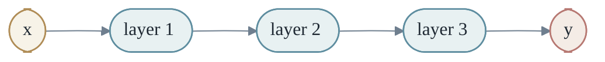
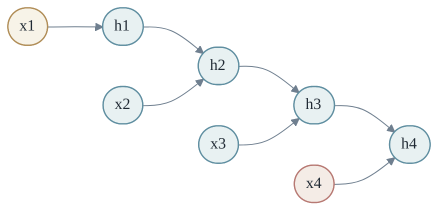
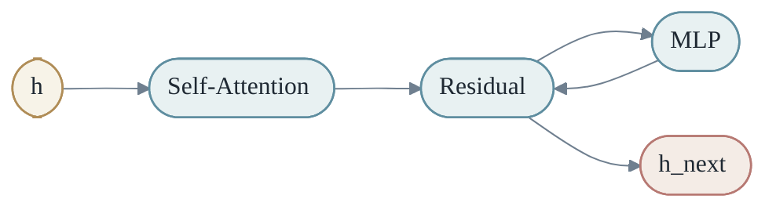
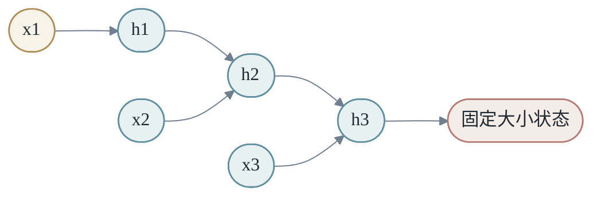
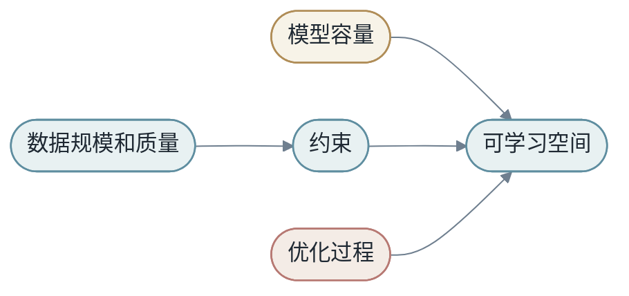

# 第五章：深度学习


深度学习的核心不是某一个单独算法，而是一个思想：把许多可学习变换复合起来，让模型自己形成中间表征。

## 第1节：神经网络是复合变换

一层神经网络可以写成：

$$
h_{l+1}=σ(W_lh_l+b_l)
$$

多层网络就是函数复合：

$$
M(x)=f_L(f_{L-1}(...f_1(x)))
$$

每层都做一个相对简单的变换，许多层组合后形成复杂函数。



这条链路里最重要的词是“复合”。深度学习不是找到一个巨大但扁平的公式，而是把很多小函数排成流水线。每个函数都改变一点表征，最后整体形成从输入到输出的复杂变换。

如果输入是一张图片，第一层可能只学到边缘、颜色变化和局部纹理；中间层把这些局部模式组合成眼睛、耳朵、轮廓；更高层再组合成“猫”或“狗”这样的语义概念。

如果输入是一句话，早期层可能处理词形和局部搭配，中间层处理短语关系，高层处理语义、指代和任务意图。

### 1.1 Shape 追踪

假设一个 batch 有 `B` 个样本，每个样本维度是 `D`。线性层把它变成 `H` 维：

- <em>X: [B, D]</em>
- <em>W: [D, H]</em>
- <em>b: [H]</em>
- <em>Y: [B, H]</em>

在程序中就是：

```python
Y = X @ W + b
```

深度学习代码里，shape 是最朴素的真相。很多模型错误不是理论错了，而是某个 tensor 的维度没有按你以为的方式流动。

## 第2节：为什么需要非线性

如果每一层都是线性变换，那么多层叠加仍然等价于一个线性变换。

非线性激活让模型可以弯曲空间。ReLU、GELU、tanh 都是让模型摆脱纯线性限制的入口。

更形式化地说，如果没有激活函数，两层线性网络是：

$$
y=W_2(W_1x+b_1)+b_2
$$

展开后仍然是：

$$
y=(W_2W_1)x+(W_2b_1+b_2)
$$

也就是说，叠再多层，本质上还是一个线性层。深度只有在非线性存在时才真正有意义。

ReLU 把空间切成许多区域：

$$
ReLU(x)=max(0,x)
$$

每个区域内模型近似线性，但整体可以由许多线性片段拼成复杂形状。这是理解神经网络表达能力的一个好入口：它不是处处神秘，而是许多简单片段的组合。

### 2.1 一个极小的 MLP

```python
import torch
import torch.nn as nn

model = nn.Sequential(
  nn.Linear(4, 16),
  nn.ReLU(),
  nn.Linear(16, 1),
)

x = torch.randn(8, 4)   # 8 samples, 4 features each
y = model(x)            # shape: [8, 1]
```

这个模型虽然很小，但已经包含深度学习的基本结构：线性变换、非线性激活、函数复合、batch 计算。

## 第3节：CNN 与图像

CNN 利用图像的局部性和平移共享。卷积核在图像上滑动，对不同位置使用同一组参数。

$$
y_{i,j}=\sum_{u,v}K_{u,v}x_{i+u,j+v}
$$

这说明深度学习不是完全放弃结构设计，而是把领域先验编码进模型架构。

CNN 的两个关键先验是：

- 局部性：相邻像素之间关系更强。
- 权重共享：同一种局部模式可以出现在图像不同位置。

如果用全连接层处理一张 `224 x 224 x 3` 的图像，参数量会非常大，而且完全不利用图像结构。卷积层通过小窗口和共享参数，把“寻找局部模式”这件事变得高效。

### 3.1 从变换观理解 CNN

CNN 不是只做分类。它在每一层把图像从一种空间变换到另一种空间：

- <em>像素空间 -&gt; 边缘/纹理空间 -&gt; 局部部件空间 -&gt; 对象语义空间</em>

每个 feature map 都是对原图的一种重新描述。深层 CNN 的本质，是逐步把低级视觉信号变成高级语义表征。

## 第4节：RNN 与序列

RNN 逐步读取序列，用隐藏状态保存历史：

$$
h_t=f(h_{t-1},x_t)
$$

它的直觉自然，但长序列中容易丢失早期信息，也难以充分并行。

RNN 的优势是状态递推非常符合人类对“读序列”的直觉：读到第 `t` 个 token 时，隐藏状态 $h_t$ 应该概括此前内容。

问题在于，这个状态向量必须承载所有历史信息。序列越长，压缩越困难。反向传播时，梯度也要沿时间链条一步步传回去，容易出现梯度消失或爆炸。

LSTM 和 GRU 引入门控机制，让模型更容易保留长期信息。但它们仍然很难像 Transformer 那样一次性并行处理整个序列。



## 第5节：Attention

Attention 让模型根据内容动态选择信息：

$$
Attention(Q,K,V)=softmax\left(\frac{QK^T}{\sqrt{d_k}}\right)V
$$

Attention 权重不是固定参数，而是由输入动态生成的混合矩阵。

从变换观来看，attention 是一种输入相关的动态变换。普通线性层用固定矩阵 `W` 混合信息；attention 则先根据当前输入生成权重矩阵 `A`，再用 `A` 混合 value。

$$
A=softmax(QK^T/\sqrt{d_k})
$$

$$
O=AV
$$

这意味着同一个模型在不同句子上会采用不同的信息流路径。一个 token 可以关注前面的主语，也可以关注很远处的定义、条件或代码变量。

### 5.1 Multi-head Attention

单个 attention head 只能用一种相似性方式匹配 token。Multi-head attention 同时使用多个 head：

- <em>head 1: 语法关系</em>
- <em>head 2: 指代关系</em>
- <em>head 3: 局部搭配</em>
- <em>head 4: 任务相关线索</em>

这只是直觉描述，不是每个 head 都一定这么清晰。但多个 head 的确给模型提供了多种并行的信息选择通道。

## 第6节：Transformer Block

Transformer block 交替执行两类变换：

- token 之间的信息交换：self-attention
- token 内部的非线性加工：MLP



更完整的 Transformer block 通常还包含 LayerNorm 和残差连接：

$$
h'=h+Attention(Norm(h))
$$

$$
h_{next}=h'+MLP(Norm(h'))
$$

残差连接让信息可以绕过复杂变换直接传递，缓解深层训练困难。LayerNorm 稳定每层输入尺度。MLP 则负责对每个 token 的内部表征进行非线性加工。

从这个角度看，一个 Transformer block 有两种基本动作：

- Attention：在 token 之间搬运信息。
- MLP：在 token 内部加工信息。

许多层 block 叠加后，模型就能在序列中反复交换、压缩、重写信息。

Transformer 之所以能统一很多任务，靠的不是某个神秘技巧，而是这个变换骨架足够通用。文本是 token 序列，图像可以切成 patch 序列，代码可以变成 token 序列，多模态输入也可以组织成不同类型 token 的组合。Attention 负责跨 token 通信，MLP 负责每个 token 内部加工，残差和归一化让深层训练稳定。

这种结构也有清楚的扩展方向。增加层数，模型可以进行更多轮通信和加工；增加 hidden size，每个 token 可以携带更多信息；增加 head 数，模型可以并行使用更多匹配方式；增加数据和计算，模型可以学习更多统计结构。它的缺点也同样清楚：标准 attention 的 `T x T` 复杂度让长上下文昂贵，KV Cache 让推理显存随上下文增长。正因为优点和代价都清楚，Transformer 才成为基础模型时代的核心架构。

### 6.1 Transformer 的最小伪代码

```python
def transformer_block(h):
  h = h + self_attention(layer_norm(h))
  h = h + mlp(layer_norm(h))
  return h
```

这个伪代码没有展示所有工程细节，但抓住了结构本质：残差路径上串联 attention 和 MLP。

## 第7节：从 shape 看懂 Transformer

Transformer 最容易让初学者迷路的地方，不是公式，而是 shape。

假设输入 hidden state 是：

- <em>h: [B, T, H]</em>

其中 `B` 是 batch size，`T` 是序列长度，`H` 是 hidden size。Q/K/V 投影后：

- <em>Q: [B, T, H]</em>
- <em>K: [B, T, H]</em>
- <em>V: [B, T, H]</em>

如果有 $n_{\text{heads}}$ 个 head，每个 head 维度是 $D = H / n_{\text{heads}}$，通常会 reshape 成：

- <em>Q: [B, n_heads, T, D]</em>
- <em>K: [B, n_heads, T, D]</em>
- <em>V: [B, n_heads, T, D]</em>

Attention score 的 shape 是：

- <em>Q @ K^T -&gt; [B, n_heads, T, T]</em>

最后乘以 V：

- <em>Attn @ V -&gt; [B, n_heads, T, D]</em>

再合并 head：

- <em>output -&gt; [B, T, H]</em>

这条 shape 链路就是 Transformer 的“骨架”。如果你能在纸上写清每一步 shape，Transformer 就不再是黑箱。

## 第8节：Attention Mask

Attention 并不是所有 token 都可以看所有 token。语言模型训练中，第 `t` 个位置不能看到未来 token，否则 next-token prediction 就泄漏答案。

Causal mask 的作用是遮住未来位置：

- <em>位置 i 只能看 j &lt;= i 的 token</em>

矩阵形式大致是：

- <em>1 0 0 0</em>
- <em>1 1 0 0</em>
- <em>1 1 1 0</em>
- <em>1 1 1 1</em>

这里 1 表示可见，0 表示不可见。实现中通常会把不可见位置的 score 加上一个极小值，让 softmax 后概率接近 0。

Mask 还有其他用途：padding mask 避免模型关注 padding token，segment mask 控制不同片段之间是否可见，retrieval mask 控制模型只访问特定外部记忆。

从变换观来看，mask 是对信息流的结构约束。它决定了 `M` 在序列内部允许哪些路径存在。

## 第9节：残差连接为什么重要

深层网络难训练，一个原因是信息和梯度要穿过太多非线性变换。残差连接提供了一条近似“直通路径”：

$$
h_{next}=h+F(h)
$$

如果某一层暂时没学好，模型至少可以通过 `h` 保留原信息。训练中，层可以学习“在原表示上做小修改”，而不是每层都重新构造全部表示。

这让很深的网络变得可训练。Transformer 中几乎所有主要子层都包在残差结构里：attention、MLP、甚至某些扩展模块。

可以把残差理解为一种保守更新：

- <em>新表示 = 旧表示 + 本层建议的修改</em>

这个视角和梯度下降很像。模型不是每层完全推翻前一层，而是逐步重写表征。

## 第10节：一个小模型的完整前向路径

一个最小语言模型可以写成：

- <em>token ids</em>
- <em>  -&gt; token embedding</em>
- <em>  -&gt; position embedding</em>
- <em>  -&gt; Transformer blocks</em>
- <em>  -&gt; final norm</em>
- <em>  -&gt; vocab projection</em>
- <em>  -&gt; logits</em>

对应到 `X -> Y by M`：

- `X` 是 token id 序列。
- `M` 是 embedding、Transformer blocks 和输出投影的复合。
- `Y` 是每个位置的 next-token logits。


理解这条路径之后，大模型只是把同样结构扩展到更多层、更大 hidden size、更多 head、更大数据和更复杂系统。

## 第11节：MLP 的表达能力

MLP 是最基本的深度网络。它看起来只是线性层和激活函数交替出现，但这种简单结构已经可以表达非常复杂的函数。

一个两层 MLP 可以写成：

$$
h=σ(W_1x+b_1)
$$

$$
y=W_2h+b_2
$$

第一层把输入投影到 hidden space，并用非线性切分空间。第二层把 hidden features 组合成输出。

可以把 hidden units 想成一组可学习探测器。每个 hidden unit 对输入空间中的某些方向敏感。ReLU 决定它是否激活。很多 hidden units 共同把空间切成许多区域。


MLP 的问题不是表达能力不够，而是没有利用数据结构。图像有局部结构，文本有顺序结构，图有邻接结构。MLP 把所有输入维度一视同仁，往往需要更多数据才能学到结构。

这解释了为什么 CNN、RNN、Transformer 不是取代 MLP 的“更复杂玩具”，而是把结构先验放进模型，让学习更高效。

## 第12节：CNN 的归纳偏置

CNN 的强大来自两个归纳偏置：局部连接和权重共享。

局部连接意味着模型先看小区域，而不是一开始就把整张图全部混合。权重共享意味着同一个卷积核在不同位置寻找同一种模式。

这很符合图像世界。边缘、角点、纹理可以出现在任何位置。一个“竖直边缘检测器”不应该只在左上角有效，也应该在右下角有效。

- <em>同一卷积核 + 不同位置 -&gt; 检测同一种局部模式</em>

深层 CNN 逐步扩大感受野。早期层看小区域，后期层通过多层叠加看到更大区域。这样模型从局部纹理走向全局对象。

### 12.1 池化和不变性

Pooling 曾经是 CNN 中非常常见的操作。它把局部区域压缩成一个值，例如 max pooling 取局部最大激活。

Pooling 的直觉是：我们不需要精确知道某个边缘出现在局部区域的哪个像素，只需要知道它大概存在。这提供了一点平移不变性。

现代架构中，stride convolution、attention 和 patch merging 也承担类似角色：逐步压缩空间分辨率，同时保留对任务有用的信息。

## 第13节：RNN 的状态瓶颈

RNN 把历史压缩到隐藏状态 $h_t$。这个设计很优雅，也带来瓶颈。

如果序列很短，隐藏状态足以携带历史。如果序列很长，所有历史都必须挤进一个固定维度向量。早期信息可能被覆盖，梯度也要沿时间反传很多步。



LSTM 和 GRU 用门控缓解这个问题。门决定哪些信息写入、保留或遗忘。但它们仍然是顺序计算，很难像 Transformer 那样并行处理所有 token。

Transformer 的突破之一，是不再把历史压缩进单一状态，而是让每个 token 直接访问其他 token 的表示。Attention 把“记忆”从一个隐藏向量扩展成一组可寻址的 token states。

## 第14节：LayerNorm 和训练稳定性

深层网络训练时，每层输入分布会随着参数更新不断变化。Normalization 的作用，是让每层看到的数值尺度更稳定。

LayerNorm 对每个 token 的 hidden dimension 做归一化。它不依赖 batch 内其他样本，因此非常适合序列模型和语言模型。

Transformer 中常见 pre-norm 结构：

```python
h = h + attention(layer_norm(h))
h = h + mlp(layer_norm(h))
```

Pre-norm 的好处是梯度更容易沿残差路径传播，深层模型训练更稳定。Post-norm 在早期 Transformer 中常见，但深层训练可能更难。

Normalization 看起来只是工程细节，实际是让大模型可训练的关键结构之一。

## 第15节：Dropout、残差和集成直觉

Dropout 训练时随机屏蔽一部分激活。它迫使模型不要过度依赖某几个神经元。

可以把 dropout 粗略理解为训练许多子网络的集成。每次前向都使用略微不同的网络，最终共享参数形成更稳健的模型。

残差连接则让模型学习增量修改。深层网络不必每层都重写表示，而是在原表示上叠加调整。

Dropout、残差、LayerNorm 都不是任务本身的一部分，却深刻影响模型是否能训练、是否能泛化、是否能扩展到很深。

这提醒我们：深度学习的成功不是单个公式，而是一整套结构、优化和系统技巧共同作用。

## 第16节：Attention 的信息流

Attention 最容易被误解为“看哪里”。更准确地说，它是在构造信息流。

每个 token 生成 query，去和其他 token 的 key 匹配，然后用匹配权重混合 value。这个过程决定了信息从哪些位置流向当前位置。

- <em>当前位置的问题：我需要什么信息？ -&gt; Query</em>
- <em>其他位置的标签：我提供什么信息？ -&gt; Key</em>
- <em>其他位置的内容：真正被搬运的信息 -&gt; Value</em>

这三个角色很重要。Query 和 Key 决定路由，Value 决定内容。Attention score 高，不代表某个 token “重要”于全部任务，只表示在当前 head、当前层、当前 token 的计算中，它被更多使用。

### 16.1 多层 Attention

第一层 attention 可能更多处理局部搭配，后面层可能处理更抽象关系。但这不是绝对规律。模型会根据任务和数据自组织。

多层 attention 的关键是反复通信。一个 token 第一层拿到邻近信息，第二层可以基于更新后的表示再访问更远信息。多层叠加后，信息可以沿序列传播和重组。

## 第17节：MLP 在 Transformer 中做什么

很多解释把 Transformer 的重点全放在 attention 上，但 MLP 同样重要。

Attention 负责 token 之间的信息交换。MLP 负责每个 token 内部的非线性变换。没有 MLP，模型只是不断线性混合 value，表达能力会受限。

Transformer MLP 通常先把 hidden dimension 扩大，再压回去：

- <em>[B, T, H] -&gt; [B, T, 4H] -&gt; [B, T, H]</em>

扩大的中间维度给模型更多非线性组合空间。GELU 或 ReLU 选择哪些中间特征激活，第二个线性层再把它们合成回 hidden space。

可以把 MLP 看成 token-wise computation，把 attention 看成 cross-token communication。Transformer 的力量来自两者交替。

## 第18节：为什么大模型需要很多层

层数代表多轮变换。每一层都可以交换信息、重写表示、提取结构。

浅层模型可能只能处理局部或简单关系。深层模型可以逐步构造抽象：从 token 到短语，从短语到句子，从句子到任务意图，从局部事实到多步推理。

当然，更多层不自动更好。深层训练需要残差、归一化、合适初始化、优化器和数据规模。没有这些支撑，深层网络可能训练不动。

层数还影响推理延迟。每层都要计算 attention 和 MLP。模型越深，单 token decode 越慢。因此生产系统常常在质量和延迟之间做选择。

## 第19节：模型容量和数据规模

模型容量太小，会欠拟合。容量太大而数据不足，会过拟合或记忆。现代大模型成功的关键之一，是容量和数据规模同时增长。

但“更多数据”也不是越多越好。低质量数据、重复数据、错误数据会消耗训练计算，甚至伤害模型。数据质量、去重、配比、课程顺序都会影响结果。

模型容量可以理解为能表达多少复杂函数。数据规模提供约束，让模型在巨大函数空间中找到有用规律。优化过程则是在这个空间中导航。



## 第20节：从小网络到基础模型

一个小 MLP 和一个大语言模型差别巨大，但它们共享同一条逻辑：可学习参数通过 loss 被数据塑造。

小网络让我们看清基本部件：线性层、激活、loss、梯度。基础模型把这些部件规模化，并引入更通用的数据、更强架构、更复杂系统。

理解小网络不是过时训练，而是理解大模型的显微镜。大模型的许多问题，如过拟合、分布漂移、优化不稳定、评估错位，在小模型中也有对应版本。

所以学习路径应该是：先看小模型的透明结构，再看大模型的规模效应。

## 第21节：训练深度网络时到底在发生什么

训练深度网络不是一次性找到答案，而是在高维参数空间中不断调整。每一步都很小，但累积起来改变了模型内部的表征。

从外部看，我们只看到 loss 下降。从内部看，模型在重新组织空间：原来混在一起的样本逐渐分开，原来不稳定的方向逐渐被压平，原来无意义的维度逐渐承载任务信息。

### 21.1 表征逐层变得更有任务性

一个未训练网络的中间层只是随机投影。训练后，中间层开始形成结构。

在图像任务里，同类图片的表示可能更接近。在文本任务里，语义相近的句子可能更接近。在推荐任务里，偏好相近的用户和商品可能在 embedding 空间中靠近。

这说明训练不只是调整最后分类头，而是在塑造整条变换链。

- <em>原始 X -&gt; 随机中间空间 -&gt; 任务相关中间空间 -&gt; Y</em>

### 21.2 Loss 曲线只是投影

Loss 曲线是一维数字，它把复杂训练过程压缩成一条线。它有用，但不完整。

训练 loss 下降，可能代表模型真正学到规律，也可能代表模型记住训练集。验证 loss 上升，可能代表过拟合，也可能代表验证集分布不同。生成样例变好，可能和 loss 一致，也可能只是局部改善。

所以训练观察应该包含多层信号：loss、metric、样例、分群、梯度范数、激活分布、学习率、吞吐和显存。

## 第22节：初始化为什么重要

深度网络训练开始时，参数通常是随机初始化。随机不代表随便。初始化尺度会影响信号在网络中的传播。

如果权重太大，激活和梯度可能逐层放大，最终爆炸。如果权重太小，信号可能逐层衰减，梯度接近 0。

好的初始化让前向信号和反向梯度在深层网络中保持合理尺度。

- <em>太小：信息消失</em>
- <em>太大：数值爆炸</em>
- <em>合适：信号可传播</em>

现代网络还依赖残差、归一化和优化器共同保持稳定。初始化不是唯一因素，但它决定训练起点是否健康。

## 第23节：归一化层的系统性作用

BatchNorm、LayerNorm、RMSNorm 等归一化层的共同目标，是让中间表示的尺度更稳定。

归一化让后续层看到更可控的输入。对优化器来说，这相当于让地形更平滑，减少某些方向过陡、某些方向过平的问题。

Transformer 中常用 LayerNorm，因为序列长度和 batch 结构变化较大，按 token 的 hidden dimension 归一化更适合语言模型。

### 23.1 Pre-Norm 和 Post-Norm

Transformer block 中，LayerNorm 可以放在子层前或子层后。

Pre-Norm：

- <em>h = h + sublayer(norm(h))</em>

Post-Norm：

- <em>h = norm(h + sublayer(h))</em>

大模型训练常偏向 Pre-Norm，因为残差路径更直接，梯度更容易穿过许多层。

## 第24节：Embedding 层也是模型记忆

Embedding 层常被初学者看作输入预处理。实际上，它是可学习参数，是模型记忆的一部分。

Token embedding 记录词或子词的初始表示。Position embedding 或 RoPE 记录位置信息。推荐系统中的 user embedding、item embedding 记录实体历史行为的压缩表示。

Embedding 的危险在于长尾。高频 token 或高频实体被充分训练，低频对象更新少，表示不稳定。新对象没有历史，必须依赖冷启动策略。

这也是为什么表征和模型不能分开看。Embedding 是 `X` 进入 `M` 的第一道可学习门。

## 第25节：深度学习的调试顺序

训练出问题时，不要先换大模型。更稳的调试顺序是从简单到复杂。

第一，确认数据能被读对。打印样本、标签、shape 和 mask。

第二，在很小数据集上过拟合。如果模型连 100 条样本都记不住，说明代码、loss 或优化过程有问题。

第三，检查 loss 是否按预期下降。随机标签时不应有真实泛化，真实标签时应明显优于 baseline。

第四，逐步增加复杂度：数据量、模型大小、正则化、增强、调度器。

第五，看错误样例，而不是只看平均指标。


这个顺序避免把简单 bug 伪装成深奥研究问题。

### 本章小结

深度学习把简单变换复合成复杂系统。CNN、RNN、Transformer 是不同数据结构上的变换设计：图像、序列、任意 token 关系。

### 练习题

1. 证明两层线性网络如果没有激活函数，等价于一层线性网络。
2. 对一个形状为 `[B, T, H]` 的 hidden state，写出经过 Q/K/V 投影后的 shape。
3. 用自己的话解释：attention 为什么是一种“动态变换”？
4. CNN 和 Transformer 分别利用了什么结构先验？它们在哪些场景下各自更自然？

