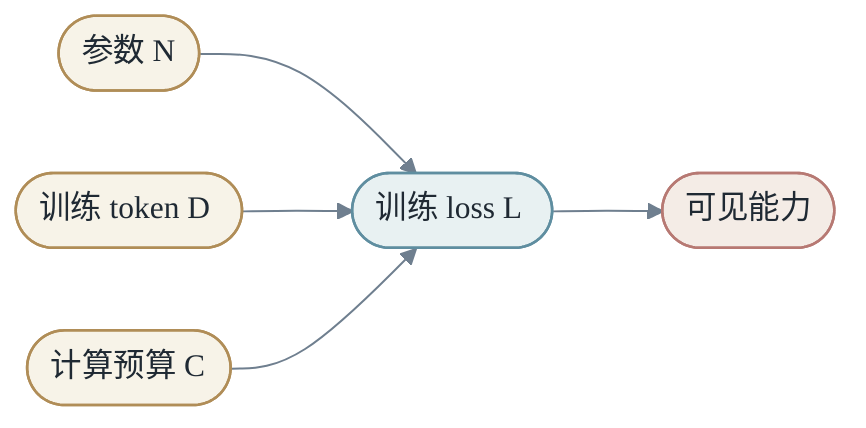

# 第六章：大模型时代的变换

大模型时代并没有改变 `X -> Y by M` 的主线，而是把 `M` 放大到前所未有的规模，并让它具备上下文、记忆、工具和系统行为。

这一章有一个提纲挈领的问题：大模型的能力到底从哪里来？

很多能力不是在小模型上清楚存在、然后被放大一点，而是在参数量、训练 token、计算量、数据多样性和后训练范式同时跨过某些门槛后，才变得稳定可见。zero-shot、few-shot、in-context learning、复杂指令遵循、代码生成、多步推理，都可以放在这个框架下理解：模型不是突然拥有魔法，而是在足够大的 `M_θ` 中压缩了足够多的世界统计和任务模式，并在后训练中学会把这些模式组织成面向用户的行为。

因此，本章不只介绍“大模型有什么功能”，而是讨论四个核心变量：

- **规模**：参数量、层数、宽度、专家数量决定模型容量和可表达的函数族。
- **数据**：训练 token 的数量、质量、覆盖面和去重策略决定模型能吸收什么世界结构。
- **计算**：训练 FLOPs、显存、通信和优化稳定性决定模型能否真正收敛。
- **范式**：预训练、指令微调、偏好学习、RL、蒸馏决定能力如何转化为可用行为。

DeepSeek 不是孤立技巧集合，而是一个很好的例子：MLA 在压缩推理状态，MoE 在扩大总容量但控制激活计算，FP8 和通信优化在降低训练成本，GRPO 和四阶段训练在把基础模型能力塑造成推理行为，蒸馏则把大模型行为转移给小模型。所有这些优化，都可以归纳为同一个方向：在给定资源约束下，让 `M` 更大、更会学、更便宜地运行。

## 第1节：语言模型

语言模型预测下一个 token：

$$
P(x_{t+1}\mid x_1,...,x_t)
$$

训练损失是所有位置的交叉熵：

$$
L=-\sum_t log P(x_{t+1}\mid x_{≤t})
$$

简单目标迫使模型学习语言、事实、风格和推理模式。

下一个 token 预测看起来很窄，但它实际连接了大量能力。为了预测一句话的下一个词，模型需要理解语法；为了补全一段代码，模型需要理解变量、作用域和 API；为了继续一段推理，模型需要保留前文假设和中间结论。

所以语言模型的训练目标虽然简单，但数据分布极其丰富。模型被迫在参数中压缩世界的大量统计结构。

### 1.1 从分类到生成

每一步 next-token prediction 本质上是一个分类问题：在词表 `V` 中选择下一个 token。

模型输出 logits：

$$
z \in R^V
$$

经过 softmax 得到概率：

$$
p_i=\frac{exp(z_i)}{\sum_j exp(z_j)}
$$

训练时最大化正确 token 的概率；推理时可以选择概率最高的 token，也可以按分布采样。

## 第2节：生成是反复应用同一个 M

生成文本时，模型每次产生一个 token，再把它放回上下文：

- <em>context -&gt; next token -&gt; longer context -&gt; next token</em>

一个静态模型通过循环调用，形成长文本和多步推理。

生成过程可以写成：

$$
x_{t+1}\sim P(\cdot\mid x_{≤t})
$$

然后把 $x_{t+1}$ 追加进上下文，继续下一步。

这解释了为什么早期错误可能影响后续输出。模型生成的 token 会变成自己的输入，错误会进入上下文，被后续步骤继续条件化。

### 2.1 温度和采样

如果总是选择最高概率 token，输出更稳定，但可能单调。如果按概率采样，输出更多样，但也更不确定。

温度 `τ` 调整分布尖锐程度：

$$
p_i=softmax(z_i/τ)
$$

低温度让模型更保守，高温度让模型更发散。

## 第3节：大模型能力从哪里来

语言模型的目标很简单：预测下一个 token。大模型真正令人惊讶的地方在于，当模型、数据和计算一起变大之后，这个简单目标会表现出许多新的能力。

这些能力包括 zero-shot、few-shot、in-context learning、代码生成、多步推理、复杂指令遵循和工具使用。它们看起来像突然出现，实际上可以从三层理解。

第一层是统计压缩。模型在海量文本中见过大量任务、格式、语义关系和推理痕迹。参数不是数据库，却压缩了数据分布中的结构。

第二层是表示容量。小模型即使见过相似模式，也可能没有足够容量同时保存语言、知识、代码、数学、对话和多领域任务结构。模型变大后，`M_θ` 能表达的变换族更丰富。

第三层是上下文选择。大模型不仅记住训练中的统计结构，还能根据当前 prompt 选择合适模式。few-shot 示例、系统指令、工具返回和检索证据，都会改变模型在参数空间中调用哪一部分能力。

所以，大模型能力不是一个单点开关，而是以下链条的结果：

- <em>语言建模目标 -&gt; 海量数据 -&gt; 大容量模型 -&gt; 充分训练 -&gt; 上下文触发 -&gt; 后训练塑形</em>

这条链条也解释了一个重要事实：后训练可以显著改变模型行为，但基础能力主要来自预训练阶段形成的容量和表示。没有足够规模和数据，后训练很难凭空创造稳定的 zero-shot 或复杂推理能力。

因此，大模型的提高大致可以归纳为三条主线。

第一，模型结构。让 `M` 能表达更复杂的变换，例如更深、更宽、更长上下文、MoE、MLA、多模态结构。

第二，计算和通信优化。让更大的 `M` 和更多的 `D` 真正可以训练、可以部署，例如混合精度、FP8、并行训练、KV Cache 管理、通信重叠。

第三，训练范式。让模型不只会预测文本，还能把能力组织成用户需要的行为，例如 SFT、偏好学习、RL、拒绝采样和蒸馏。

- <em>大模型进步 = 更强结构 + 更高效计算系统 + 更有效训练范式</em>

## 第4节：大模型需要什么：Scaling Law

Scaling Law 回答的是：如果想让模型更强，参数、数据和计算应该如何一起增长。

可以把大模型训练写成四个变量：

- <em>N = 参数量</em>
- <em>D = 训练 token / 数据量</em>
- <em>C = 训练计算量</em>
- <em>L = 训练后的 loss 或能力指标</em>

经验上，在相当宽的范围内，`N`、`D`、`C` 增加会让 loss 按较规律的方式下降。loss 下降不等于每个能力线性提升，但它说明模型对数据分布的预测更准确。许多看似高级的能力，往往是在 loss 降到足够低、表示足够丰富后变得稳定可见。

经典 scaling law 常用幂律形式表达。简化地说，loss 可以分解为不可约误差加上模型规模、数据规模、计算规模带来的可下降部分：

$$
L(N,D) \approx L_\infty + \frac{A}{N^\alpha} + \frac{B}{D^\beta}
$$

这里 `L∞` 表示数据分布本身的不可约难度，`A/N^α` 表示模型太小带来的误差，`B/D^β` 表示数据不够带来的误差。指数 `α`、`β` 通常小于 1，所以扩大规模有收益递减：模型从 1B 到 10B 的提升，通常不会简单等于从 10B 到 100B 的提升。

如果把训练计算也放进去，可以用更粗略的关系理解：

$$
C \propto N \cdot D
$$

也就是说，在 Transformer 预训练中，计算量大致随参数量和训练 token 数一起增长。给定固定计算预算 `C`，你不能同时无限增大 `N` 和 `D`；必须在“更大模型”和“更多 token”之间分配预算。

Scaling Law 的关键不是“越大越好”四个字，而是“匹配”。参数很多但 token 不够，模型会欠训练；token 很多但模型太小，容量吃不下；模型和数据都大但计算预算不足，训练无法充分收敛。

Chinchilla 一类工作带来的启发是：在固定计算预算下，参数量和训练 token 要配平。一个更小但训练得更充分的模型，可能比一个很大但 token 不足的模型更好。

这就是 compute-optimal training 的直觉。所谓最优，不是绝对最大模型，而是在给定计算预算下选择合适的 `N` 和 `D`，让 loss 降得最多。

- <em>参数太大、token 太少 -&gt; 欠训练</em>
- <em>参数太小、token 太多 -&gt; 容量不足</em>
- <em>参数和 token 配平 -&gt; 更接近 compute-optimal</em>

这里的 token 不只是数量。网页、书籍、代码、数学、对话、多语言、专业领域数据会塑造不同能力。代码数据会增强结构化生成，数学和解题数据会增强推理轨迹，对话数据会增强交互风格。大模型能力由 token 数、token 质量和 token 组成共同决定。

从入门角度看，Scaling Law 最重要的不是记住精确指数，而是形成三个判断。

第一，能力提升有统计规律，不完全靠玄学调参。

第二，规模扩大要和数据、计算匹配，否则会浪费资源。

第三，很多能力提升不是某个模块单独带来的，而是 loss、表示容量、数据覆盖和后训练共同推动的结果。

## 第5节：怎么增大模型

增大模型不是单纯把参数数字变大。Transformer 中有多条扩展路径，每条路径都改变 `M` 的表达能力，也带来不同训练和推理成本。

更准确地说，增大模型是在扩大函数族。小模型只能表达较简单的 `M`，大模型可以表达更多层级、更多子空间、更多专家路径和更长上下文依赖。参数量只是表面数字，背后是 `M_θ` 可以容纳多少不同模式。

第一，加深度。增加层数让信息经过更多变换步骤，提升组合抽象能力。深模型可以形成更层级化的表示，但也更依赖残差连接、归一化、初始化和学习率策略，否则训练容易不稳定。

第二，加宽度。增加 hidden dimension 或 FFN dimension，让每层有更大表示容量。宽模型通常更容易并行，但显存、矩阵乘法成本和通信量都会上升。

第三，增加 attention heads 或 head dimension。更多 heads 让模型在不同子空间中关注不同关系，但也会增加 attention 状态和 KV Cache 压力。

第四，扩大 FFN。Transformer 中大量参数在 FFN 层。Dense FFN 扩大后，每个 token 都要经过更多计算；MoE 则把 FFN 变成多个专家，让 token 只激活其中一部分。

第五，延长上下文。上下文越长，模型看到的 `X` 越完整，可以处理长文档、多轮对话、代码库和工具轨迹。但长上下文也放大 attention 计算、KV Cache、位置外推和信息选择问题。

第六，增加专家数量。MoE 让模型总参数很大，但每个 token 只激活少数专家。这条路可以提升总容量，同时控制激活计算，是现代大模型扩展的重要方向。

可以把这些方向概括为：

- <em>更深 -&gt; 更多变换步骤</em>
- <em>更宽 -&gt; 更大单层容量</em>
- <em>更多 heads -&gt; 更多关系子空间</em>
- <em>更大 FFN / MoE -&gt; 更多知识和模式容量</em>
- <em>更长上下文 -&gt; 更大的输入 X</em>

每一种“变大”，都会问同一个问题：模型能力提升是否值得训练成本、推理成本和系统复杂度的增加？

把这些方法放到三条主线里，可以得到一个更清楚的地图。

- <em>模型结构：深度、宽度、heads、FFN、MoE、长上下文、MLA</em>
- <em>计算/通信：混合精度、FP8、并行、通信重叠、KV 管理</em>
- <em>训练范式：预训练、SFT、RL、拒绝采样、蒸馏</em>

DeepSeek 的很多设计就落在这张地图上：MoE 和 MLA 属于模型结构，FP8 和通信优化属于计算/通信，GRPO 和四阶段训练属于训练范式。这样看，DeepSeek 不是一堆名词，而是一组围绕 scaling 的协同设计。

## 第6节：增大模型的挑战与解决方法

当模型变大，困难不会只出现在一个地方。训练更难收敛，显存更紧张，通信更昂贵，推理延迟更高，长上下文更难管理。KV Cache、MLA、MoE、FP8、并行训练这些技术，应该放在这个背景下理解。

### 6.1 挑战一：自回归推理的状态越来越大

自回归生成每一步都要依赖历史 token。为了避免反复计算历史前缀，推理系统会缓存每层 attention 的 key/value：

- <em>历史 token -&gt; K/V -&gt; KV Cache -&gt; 后续 decode 复用</em>

KV Cache 用显存换计算。模型越深、heads 越多、head dimension 越大、上下文越长，cache 越大。

一个数量级估算能说明问题。假设一个 72B 级别模型有 80 层、64 个 heads、每个 head 维度 128，并用 BF16 保存 K/V：

- <em>每 token cache = 2 * 80 * 64 * 128 * 2 bytes ≈ 2.62 MB</em>

batch size 为 1、上下文长度 2048 时，KV Cache 接近 5GB；batch size 为 32、上下文长度 4096 时，可以到数百 GB。此时瓶颈不只是算力，而是显存容量、显存带宽和缓存调度。

### 6.2 解法一：压缩和管理 KV 状态

MHA、GQA、MQA、MLA 可以看成一条连续谱：

- <em>MHA：每个 query head 有独立 K/V，表达强，cache 大</em>
- <em>GQA：一组 query heads 共享 K/V，折中</em>
- <em>MQA：所有 query heads 共享 K/V，cache 更小</em>
- <em>MLA：缓存低维 latent 状态，再恢复或组合 attention 信息</em>

这些方法的共同目标，是减少每个 token 必须长期保存的状态。MLA 的直觉尤其重要：历史上下文中需要保存的，不一定是完整高维 K/V，而可以是足够支持后续 attention 的压缩表示。

部署侧还会用 Paged Attention、KV cache 分页、CPU/GPU 分层缓存、量化、滑动窗口和 eviction policy 来管理长上下文推理。它们不是模型能力本身，却决定大模型能不能以可接受成本服务真实请求。

### 6.3 挑战二：总参数变大但每 token 计算不能无限变大

Dense 模型中，每个 token 使用同一组参数。模型越大，每个 token 的计算也越大。MoE 的思路是把总参数和激活计算解耦：

$$
y=\sum_{i\in S(x)}g_i(x)E_i(x)
$$

router 根据 token 选择少数专家。这样模型可以拥有很大的总容量，但每个 token 只走一小部分路径。

DeepSeekMoE 的设计可以归纳为三个直觉。

第一，细粒度专家切分。专家越细，router 的组合空间越丰富，模型越容易把不同知识和模式分配给不同专家。

第二，共享专家隔离。通用语言能力、基础语法和常见模式可以由共享专家承担，专门专家则学习更细分的知识，避免每个专家重复学习基础能力。

第三，负载均衡。MoE 如果训练不好，会出现少数专家过载、其他专家闲置。负载均衡不是工程细节，而是 MoE 能否高效收敛的核心。

### 6.4 挑战三：训练稳定性、精度和通信

模型变大后，训练不只是数学优化问题，也是系统工程问题。深度增加会放大梯度传播和归一化问题；宽度增加会提高显存和通信压力；MoE 会带来专家路由和跨机器 token 分发；长上下文会放大激活内存。

因此现代训练会同时使用混合精度、FP8、gradient checkpointing、数据并行、张量并行、流水线并行、专家并行和通信重叠。它们的共同目标不是改变任务定义，而是让更大的 `M` 能真正训练到收敛。

这里也有一个理论和工程之间的连接：Scaling Law 告诉我们扩大 `N`、`D`、`C` 往往会降低 loss，但系统现实决定了 `C` 能否被有效使用。如果 GPU 大量时间在等待通信，或者显存不足导致 batch 太小，名义上的计算预算并没有转化为有效训练。

所以计算/通信优化不是“底层细节”，而是 scaling law 能否落地的条件。更快的矩阵计算、更低精度但稳定的训练、更少的通信等待、更好的并行切分，都会让同样预算下模型看到更多 token、训练更久、或使用更大结构。

DeepSeek 的很多优化可以放在这里理解：MLA 降低推理状态，MoE 扩大容量但控制激活计算，FP8 和通信优化降低训练成本。这些不是孤立技巧，而是为了让 scaling law 中的 `N`、`D`、`C` 能继续向前推进。

## 第7节：怎么训练大模型

大模型训练通常不是一步完成，而是一个多阶段流程：

- <em>预训练 -&gt; 指令微调 -&gt; 偏好学习 / RL -&gt; 拒绝采样与再微调 -&gt; 蒸馏 -&gt; 产品反馈</em>

预训练阶段学习世界统计和通用模式。它用海量 token 做 next-token prediction，让模型形成语言、知识、代码和推理的基础表示。这个阶段决定模型能力边界的大部分。

预训练优化的是：在大规模数据分布上降低 next-token loss。它回答的是“模型能从世界文本中学到多少结构”。

指令微调阶段把“续写文本”转成“完成任务”。同一个基础模型，通过高质量指令数据，可以学会回答格式、语气、步骤、拒绝方式和任务边界。

指令微调优化的是：把已有能力映射到人类任务格式。它回答的是“模型能不能按用户意图组织输出”。

偏好学习和 RL 阶段把行为推向人类更想要的方向。RL 可以显著提高正确回答的概率，但要放在正确位置理解：它优化的是行为和输出分布，不是凭空创造基础知识。有效 RL 依赖好的数据源、能抗噪声奖励的算法，以及与真实目标一致的 reward function。

偏好学习和 RL 优化的是：在多个可能回答中更常选择好的行为。它回答的是“模型能不能把已有能力稳定地用在正确方向上”。

蒸馏优化的是：把强模型的行为轨迹压缩进更小模型。它回答的是“能不能用更低成本复现足够多的能力”。

### 7.1 DeepSeek-R1 的四阶段训练路线

DeepSeek-R1 的四阶段训练很适合作为本节主案例，因为它把“推理能力”拆成可训练流程，而不是把所有希望都压在一次 RL 上。

第一阶段是 cold start SFT。用少量高质量推理数据，让模型先学会可读的 CoT 格式、基本推理步骤和回答风格。这一步解决的是起点问题：如果直接 RL，模型可能找到有奖励但不可读、语言混杂、格式混乱的轨迹。

第二阶段是 reasoning-oriented RL。训练重点放在数学、代码、科学、逻辑等推理密集任务上，用奖励信号推动模型更常得到正确答案。这里强化的是推理行为，而基础知识和表示能力主要来自预训练和规模。

第三阶段是 rejection sampling + SFT。用较强模型生成大量候选轨迹，筛掉错误或低质量样本，再用通过筛选的数据继续监督微调。这个阶段把 RL 发现的好行为沉淀成稳定训练数据，也可以混入非推理任务数据，避免模型只会做少数推理任务。

第四阶段是 all-scenario RL。模型不仅要会解难题，还要能写作、问答、对话、遵守安全边界，并在多场景中保持可用。因此最后阶段把优化目标扩展到通用助手行为。

这四阶段说明，大模型能力不是一句“RL 让模型变聪明”能解释的。更准确地说：预训练提供能力基础，cold start SFT 提供可读轨道，推理 RL 强化高质量推理，拒绝采样把好轨迹转成数据，全场景 RL 再把模型拉回通用产品目标。

### 7.2 CoT、GRPO 和蒸馏

CoT 的价值在于把复杂问题拆成中间步骤。它既给模型更多生成轨迹，也给训练和筛选提供更细的材料。但 CoT 不是内部机制的完整解释；模型写出步骤，不代表每一步都真实可靠。

GRPO 这类方法可以理解为面向推理任务的策略优化方式。它试图在奖励噪声、训练成本和策略稳定性之间取得更好的平衡。对一本入门书来说，重要的不是记住算法名，而是理解：RL 阶段需要合适的比较基准、奖励设计和稳定训练方法。

当大模型能产生高质量推理轨迹后，蒸馏就变得重要。蒸馏让小模型学习大模型的输出、步骤和格式，用更低成本继承一部分大模型行为。小模型不会因此拥有同等容量，但在固定场景中可以获得很好的性价比。

这也是现代大模型生态的真实形态：最大模型探索能力边界，中等模型承担主力服务，小模型负责低延迟、低成本、边缘或专用任务。

## 第8节：把外部信息放进 X

前面讲的是如何扩大 `M`，但大模型时代还有另一条重要路线：不改模型参数，而是改变输入 `X`。

原始语言模型看到的输入只是前文 token：

- <em>X = prompt</em>

真实应用中的 `X` 往往更复杂：

- <em>X = 用户问题 + 指令 + 历史对话 + 检索证据 + 工具观察 + 输出约束</em>

这就是 RAG、上下文工程和工具调用值得保留的原因。它们不是本章的独立知识点，而是同一个问题的不同解法：当参数中的知识不够新、不够准、不够私有、不够可验证时，如何把额外信息放进 `X`，让同一个 `M` 产生更好的 `Y`。

RAG 的意义可以一句话概括：把“用户问题”扩展成“用户问题 + 证据”。模型参数不变，但输入空间改变了。

- <em>没有检索：M(问题) -&gt; 回答</em>
- <em>加入检索：M(问题, 证据) -&gt; 有依据的回答</em>

工具调用也是同样逻辑。计算器、搜索、数据库、代码执行器，本质上把模型看不到或算不准的信息转成新的观察，再放回上下文。工具不是让模型突然全知，而是让 `X` 多了一层来自外部世界的证据。

因此，上下文工程不应该被理解为“写 prompt 技巧”。它真正的问题是：哪些信息应该进入 `X`，以什么顺序进入，哪些信息可信，哪些信息过期，哪些信息会污染模型判断。

## 第9节：从一次变换到多步变换

大模型应用里常说 Agent，但如果只是介绍“观察、思考、行动”，很容易变成概念堆砌。放回本书主线，Agent 的本质是把一次 `X -> Y` 变成多步状态更新。

单次调用是：

- <em>Y = M(X)</em>

多步系统是：

- <em>C_0 = X</em>
- <em>C_{t+1} = update(C_t, M(C_t), observation_t)</em>
- <em>Y = final(C_T)</em>

这里 $C_t$ 是上下文状态，包含用户目标、已知证据、工具结果、中间结论和失败记录。模型每次不是直接产生最终答案，而是基于当前状态选择下一步。

这种形式的价值在于：有些任务无法一次完成。写代码需要读文件、修改、运行测试；做研究需要检索、比较、归纳；做数学题可能需要分解步骤。多步系统让模型把复杂 `Y` 拆成一串较小的中间目标。

但它的风险也来自同一个地方。状态错了，后面每一步都会错；工具结果误读了，错误会进入 $C_t$；没有停止条件，系统会循环。Agent 不是新魔法，而是 `M` 被放进一个控制流中。

所以本章只保留这一点：Agent 不是大模型能力的另一个列表项，而是 `X -> Y by M` 在运行时被展开成多步过程。

## 第10节：评估回到 Y 和 Loss

评估大模型不应该从 benchmark 名字开始，而应该回到本书最早的问题：`Y` 到底是什么？loss 或评价信号是否真的对应这个 `Y`？

如果任务是数学题，`Y` 可以接近明确答案，评估比较直接。如果任务是写作、建议、总结、规划，`Y` 往往不是单一字符串，而是一组要求：正确、清楚、有帮助、符合约束、成本可接受。

这就是为什么大模型评估容易变复杂。复杂不是因为大模型神秘，而是因为 `Y` 变复杂了。

- <em>训练 loss：预测下一个 token</em>
- <em>任务目标：解决用户问题</em>
- <em>产品目标：稳定、低成本、安全地解决用户问题</em>

这三者不完全相同。next-token loss 下降会提高基础能力，但不保证事实可靠；benchmark 分数提高会说明某类能力增强，但不保证产品体验；用户满意度提高也可能受界面、速度、成本和上下文设计影响。

指标不是目的，决策才是目的。Accuracy、F1、AUC、loss、P95 延迟、成本、转化率，这些数字都只是帮助我们判断下一步：上线、回滚、重训、改数据、改阈值、改产品，还是继续观察。一个好指标至少要和真实目标相关、能及时反映变化，并且能指导行动。

成熟的大模型系统会同时看多层指标：训练 loss、离线 benchmark、人工评估、线上代理指标、长期业务指标、系统健康指标和安全指标。它们共同定义了产品里的 `Y`，也把模型行为连接到可执行的工程决策。

因此，本书只强调一个评估原则：先定义目标 `Y`，再选择评估方法。不要反过来让某个现成指标替你定义目标。

## 第11节：大模型能力的边界

经过前面的讨论，可以更冷静地看大模型的边界。

第一，参数不是事实数据库。模型参数压缩了训练分布，但它不会自动知道哪些知识过时、哪些来源可信。事实性问题需要证据进入 `X`，而不是只期待更大的 `M`。

第二，长上下文不是无限记忆。上下文越长，成本越高，干扰越多，相关信息越容易被淹没。长上下文仍然需要摘要、索引、检索和结构化组织。

第三，后训练不是创造一切能力。SFT、RL、蒸馏主要塑造行为和输出分布，基础能力仍然依赖预训练规模、数据和计算。

第四，小模型仍然重要。最大模型探索能力边界，小模型和中等模型负责低成本、低延迟、专用任务。真正的系统常常不是一个模型，而是一组模型、检索、工具和规则的组合。

小模型也是理解大模型的入口。小模型同样会过拟合、欠拟合，也需要 feature、loss、优化器和 train/test gap。小 Transformer 同样有 embedding、attention、MLP、LayerNorm、残差和输出头。先在小模型中看清 tensor shape、梯度、错误案例和训练曲线，再理解大模型的涌现能力、系统复杂度和数据广度，会稳得多。

第五，多模态不是简单多接几个输入。图像、文本、音频有不同结构。多模态模型的核心仍然是表征对齐：不同形式的 `X` 如何进入共享或可交互的表示空间。

这些边界不是削弱大模型，而是帮助我们把大模型放回正确位置：它是强大的 `M`，但仍然受输入、目标、数据、计算和系统约束塑造。

### 本章小结

大模型不是一串概念名词，而是 `X -> Y by M` 在规模时代的展开。

语言模型从 next-token prediction 出发，通过更大的参数、更多 token、更多计算和更有效的训练范式，形成 zero-shot、few-shot、推理、代码和指令遵循等能力。Scaling Law 说明能力提升背后有统计规律，但模型、数据和计算必须配平。模型结构、计算/通信优化和训练范式，是推动大模型进步的三条主线。

外部知识、工具和多步执行也不应被看成孤立 buzzword。它们的本质分别是改变输入 `X`、把一次变换展开成多步状态更新、重新定义目标 `Y` 和评估信号。理解这一点，才能把大模型放回本书的主线，而不是迷失在术语列表里。

### 练习题

1. 为什么 next-token prediction 可以学习到比“补词”更复杂的能力？
2. 用 `N`、`D`、`C`、`L` 解释 Scaling Law 为什么强调模型、数据和计算的配平。
3. 增大模型可以从深度、宽度、FFN、MoE、上下文长度等方向进行。任选两个方向，说明它们分别提高了什么能力，又带来什么系统成本。
4. 为什么说 KV Cache、MLA、MoE、FP8 和通信优化都可以放在“让 scaling 落地”的框架下理解？
5. DeepSeek-R1 的四阶段训练分别解决了什么问题？为什么不能简单说“RL 创造了推理能力”？
6. 举一个例子说明：不改变模型参数，只改变输入 `X`，也可以显著改变输出 `Y`。
7. 为什么评估大模型时要先定义目标 `Y`，而不是直接套用一个通用 benchmark？

