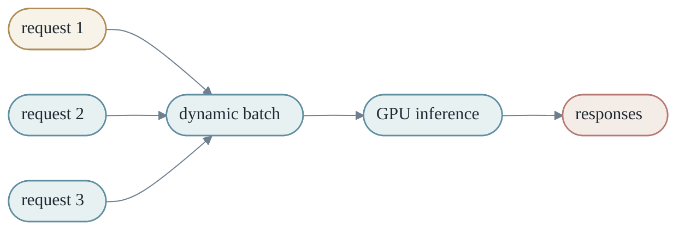
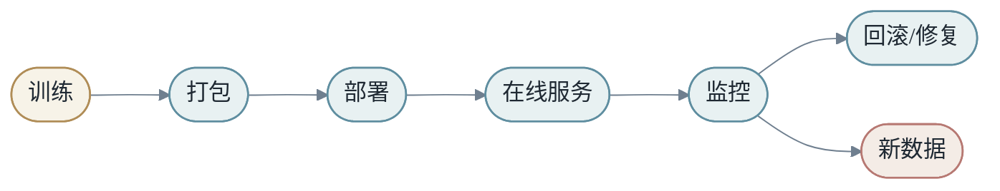
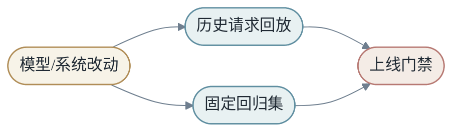

# 第七章：程序实现与计算系统


深度学习不是只存在于公式中。公式必须落到 tensor、kernel、显存、CPU/GPU 和分布式系统上。

## 第1节：Tensor

Tensor 是程序里的数学对象。语言模型 hidden states 常见形状是：

- <em>[batch, sequence, hidden]</em>

图像输入常见形状是：

- <em>[batch, channel, height, width]</em>

理解 shape，就是理解数据如何在模型中流动。

Tensor 有两个层面的含义。

第一，它是数学对象：向量、矩阵、高维数组。

第二，它是内存对象：一段连续或非连续的数据，加上 shape、stride、dtype、device 等元信息。

同一个 tensor 的逻辑形状和物理布局不一定一样。比如 transpose 可能只改变 stride，不真正复制数据。理解这一点，有助于理解为什么某些操作需要 `contiguous()`，也能解释很多性能差异。

### 1.1 dtype 和 device

深度学习中常见 dtype：

- FP32：训练稳定，但显存和带宽成本高。
- FP16/BF16：训练和推理常用，节省显存并提高吞吐。
- INT8/FP8/更低精度：常用于推理或特定训练优化。

Tensor 还在不同 device 上：CPU、GPU、甚至跨多 GPU。很多运行错误来自 tensor 不在同一个 device 上。

## 第2节：CPU 与 GPU

CPU 擅长通用控制流，GPU 擅长大规模并行数值计算。

矩阵乘法：

$$
C_{i,j}=\sum_k A_{i,k}B_{k,j}
$$

每个输出元素可以相对独立计算，因此非常适合 GPU。

GPU 的优势来自大量并行线程。它不擅长复杂分支和串行控制，但擅长让成千上万线程执行相似的数值操作。

深度学习中的高性能通常来自把计算组织成大块规则运算：矩阵乘法、卷积、attention。框架会调用底层库，例如 cuBLAS、cuDNN 或自定义 kernel。

### 2.1 Compute-bound 与 memory-bound

一个操作慢，可能因为计算太多，也可能因为数据搬运太多。

- Compute-bound：瓶颈是算术计算。
- Memory-bound：瓶颈是显存读写。

LayerNorm、激活函数、dropout 等操作有时计算不多，却需要读写大量数据，因此可能受内存带宽限制。矩阵乘法通常更容易吃满算力。

优化模型时，经常要问：我们是在等计算，还是在等数据？

## 第3节：Batch

Batch 把多个样本合并成大矩阵运算：

$$
Y=XW
$$

它提高硬件利用率，但也带来吞吐和延迟之间的权衡。

训练中，batch size 影响梯度估计。小 batch 噪声大，可能有助于泛化但训练不稳定；大 batch 利用率高，但可能需要调整学习率和优化策略。

推理中，batching 提高吞吐，却可能增加单个请求等待时间。在线服务常常需要动态 batching：在很短时间窗口内把多个请求合并，既提高 GPU 利用率，又控制延迟。



### 3.1 Padding 和 Mask

序列 batch 中，不同样本长度可能不同。为了组成同一个 tensor，通常需要 padding。

Padding token 不应该影响 attention 或 loss，因此需要 mask。Transformer 的很多细节，本质上都在处理“哪些位置可见，哪些位置应该忽略”。

## 第4节：训练系统

一次训练 step 包含：前向、反向、更新。


训练显存包括参数、梯度、优化器状态和中间激活。

以 Adam 为例，除了参数本身，还要保存一阶动量和二阶动量。粗略来说，一个参数可能对应多份状态。再加上梯度和激活，训练显存远大于模型权重文件大小。

### 4.1 混合精度训练

混合精度训练用较低精度执行大部分计算，同时保留必要的高精度状态以稳定训练。

好处是：

- 减少显存占用。
- 提高吞吐。
- 更好利用现代 GPU 的 tensor cores。

风险是数值稳定性。梯度太小可能下溢，loss scaling 等技术用于缓解这一点。

### 4.2 Gradient Checkpointing

反向传播需要前向中间激活。Gradient checkpointing 的思路是：不保存所有激活，只保存一部分，反向时重新计算缺失激活。

这是用计算换显存：

- <em>少存中间值 -&gt; 反向时重算 -&gt; 显存下降，计算增加</em>

## 第5节：推理系统

语言模型推理通常分为：

- Prefill：处理 prompt，建立 KV Cache
- Decode：逐 token 生成

推理系统关心延迟、吞吐、显存、batching、cache 管理和量化。

大模型推理的两个核心指标是：

- TTFT：time to first token，首 token 延迟。
- TPOT：time per output token，每个输出 token 的生成时间。

Prefill 主要影响 TTFT，decode 主要影响 TPOT。

### 5.1 量化

量化把权重或激活从高精度表示变成低精度表示，例如 FP16 到 INT8。

量化的收益：

- 权重更小，显存压力降低。
- 带宽压力降低。
- 某些硬件上吞吐更高。

代价是精度损失。好的量化方法要在质量、速度和工程复杂度之间平衡。

### 5.2 服务中的调度

真实服务中，请求长度不同，生成长度不同，用户优先级不同。调度系统需要决定哪些请求一起 batch，哪些 cache 保留，哪些请求可能被抢占或降级。

这说明大模型推理不是单纯调用 `model.generate()`，而是一个复杂在线系统。

## 第6节：分布式训练

当模型太大，单机装不下，就需要分布式。

数据并行复制模型，拆分 batch；模型并行拆分模型本身；流水线并行拆层；专家并行拆 MoE experts。

### 6.1 数据并行

每张 GPU 有完整模型副本，处理不同 mini-batch。反向后通过 AllReduce 同步梯度。

优点是简单。缺点是每张卡都要放完整模型。

### 6.2 张量并行

把单个矩阵乘法拆到多张 GPU 上。例如把大矩阵按列或按行切分。这样单层模型也可以超过单卡显存。

代价是每层之间需要通信。

### 6.3 流水线并行

把不同层放在不同 GPU 上，像工厂流水线一样处理 micro-batch。

优点是可以训练很深的模型。难点是 pipeline bubble 和调度复杂度。

### 6.4 专家并行

MoE 模型中，不同 expert 可以放在不同设备上。Router 把 token 发送到对应 expert。

这会引入 all-to-all 通信，系统设计非常关键。

## 第7节：从公式到工程的落差

论文里的公式常常很短：

$$
Y=softmax(QK^T)V
$$

工程实现却要考虑：

- tensor shape
- memory layout
- mask
- numerical stability
- kernel fusion
- mixed precision
- distributed communication
- cache 管理

真正的深度学习工程，是把数学变换映射到可靠、高效、可维护的计算系统。

## 第8节：Kernel Fusion

很多深度学习操作本身很小，但组合起来会产生大量内存读写。比如：

- <em>y = dropout(gelu(x @ W + b))</em>

如果每一步都单独写回显存，就会反复读写中间结果。Kernel fusion 的思想是把多个操作合成一个 kernel，减少中间 tensor 的 materialization。


Fusion 的收益通常来自减少 memory traffic，而不是减少数学计算。尤其在 memory-bound 操作中，少读写一次大 tensor 就可能带来明显速度提升。

这说明性能优化不能只数 FLOPs。两个 FLOPs 相同的实现，可能因为内存访问模式不同而速度差很多。

## 第9节：Attention 的工程实现

标准 attention 公式很短，但直接实现会产生巨大的 `T x T` score 矩阵。

当 `T` 很长时，score 矩阵不仅计算贵，也占显存。高性能 attention 实现通常会分块计算，避免把完整中间矩阵全部写入显存。

直觉上，它把 attention 变成流式分块过程：

- <em>读取一块 Q</em>
- <em>读取一块 K/V</em>
- <em>更新局部 softmax 统计</em>
- <em>累积输出</em>

关键难点是数值稳定。Softmax 需要处理指数，不能简单分块相加。高性能实现会维护每一行的最大值和归一化因子，让分块结果与完整 attention 等价或近似等价。

从系统角度看，FlashAttention 这类方法的意义是：不改变数学目标，却改变内存访问路径。

## 第10节：模型服务的生命周期

一个模型进入线上服务，通常会经历多个阶段：



每个阶段都有失败模式。

训练阶段可能数据污染、指标虚高。打包阶段可能 tokenizer、权重、配置不匹配。部署阶段可能显存不足、版本错误。服务阶段可能延迟超标、流量突增、cache 爆掉。监控阶段如果指标缺失，问题会在线上隐身。

因此生产系统需要版本化：数据版本、模型版本、tokenizer 版本、配置版本、代码版本、评估版本。没有版本化，就很难复现实验，也很难回滚线上问题。

## 第11节：监控和可观测性

模型服务需要同时监控机器指标、模型指标和业务指标。

机器指标包括 CPU、GPU 利用率、显存、网络、磁盘、错误率。模型指标包括输入长度、输出长度、TTFT、TPOT、cache 命中、拒答率、工具调用失败率。业务指标包括点击、转化、留存、满意度、人工反馈。

- <em>机器健康 -&gt; 模型健康 -&gt; 产品健康</em>

这三层可能不一致。GPU 利用率很高不代表产品体验好；模型离线指标很好不代表线上稳定；业务指标下降也不一定是模型本身坏了，可能是流量分布变化。

可观测性的目标，是在问题发生时快速回答：

- 哪些请求受影响？
- 从什么时候开始？
- 是否关联某个模型版本、配置或流量来源？
- 是数据问题、模型问题、系统问题还是产品问题？

这也是为什么机器学习系统需要日志、trace、指标和样本回放。没有可观测性，模型就像一个无法打开的生产机器。

## 第12节：GPU 利用率不是唯一目标

很多人优化推理系统时会盯着 GPU utilization。利用率高通常是好事，但它不是唯一目标。

如果为了提高 GPU 利用率，把请求等待时间拉得很长，用户体验可能变差。如果 batch 太大，吞吐上升但 P99 延迟恶化。在线系统需要同时平衡吞吐、延迟、成本和可靠性。

- <em>训练系统：更关心吞吐和总训练时间</em>
- <em>在线推理：同时关心 TTFT、TPOT、P95/P99、成本</em>

GPU 利用率还可能误导。一个 memory-bound kernel 可能让 GPU 看起来忙，但实际 tensor cores 没有充分工作。一个服务也可能因为 CPU tokenization、网络等待或调度锁而让 GPU 空转。

因此性能分析要分层：请求队列、CPU 预处理、GPU kernel、显存带宽、网络通信、后处理，每一层都可能是瓶颈。

## 第13节：成本模型

模型系统最终要面对成本。训练成本、推理成本、存储成本、工程维护成本都是真实约束。

大模型推理成本大致受几类因素影响：

- 模型参数量：影响权重显存和计算量。
- 输入长度：影响 prefill 计算和 KV Cache。
- 输出长度：影响 decode 步数。
- batch 策略：影响吞吐和延迟。
- 精度和量化：影响显存、带宽和质量。
- 硬件类型：影响单位 token 成本。

可以粗略理解为：

- <em>总成本 = 每 token 成本 * token 数量 + 固定系统开销</em>

但真实系统中，每 token 成本不是常数。短请求和长请求、prefill 和 decode、小 batch 和大 batch 的成本结构不同。

这就是为什么产品设计会反过来影响模型系统。限制最大上下文长度、控制输出长度、缓存常见结果、使用小模型处理简单请求，都可能显著降低成本。

## 第14节：模型版本和兼容性

模型不是单个文件。一个可运行模型通常包含权重、tokenizer、配置、代码、prompt 模板、后处理逻辑、量化参数和服务框架。

如果 tokenizer 和权重版本不匹配，模型可能直接输出异常。如果 prompt 模板改变，行为可能明显变化。如果后处理逻辑改了，线上指标可能变化但模型本身没变。

所以生产系统需要把这些一起版本化：

| 组件 | 为什么要版本化 |
|------|----------------|
| 权重 | 模型能力和行为来源 |
| tokenizer | token 边界影响输入输出 |
| 配置 | hidden size、层数、上下文长度 |
| prompt | 决定模型看到的任务格式 |
| 代码 | 决定执行路径 |
| 数据 | 决定训练和评估来源 |
| eval | 决定质量判断标准 |

版本化的目的，是让问题可复现、可比较、可回滚。

## 第15节：回放与回归测试

上线模型前，最好用历史请求回放。回放不是完美模拟线上，因为用户不会对新模型产生新的交互反馈，但它能发现很多明显问题：格式错误、延迟异常、拒答变化、工具调用失败、成本激增。

回归测试则用于防止旧能力被新模型破坏。每次模型、prompt、检索系统或服务代码变化，都跑一组固定测试集。



对于大模型产品，回归集应该包含典型任务、边界输入、失败案例、安全案例和高价值用户场景。它不是一次性构建，而是随着线上问题不断积累。

这让系统具备记忆。每次事故、每个 bug、每个坏案例，都可以变成未来防线的一部分。

## 第16节：数据系统是模型系统的一半

很多机器学习系统表面看是模型服务，底下其实是数据系统。

训练需要样本生成、去重、切分、标注、特征计算和版本管理。推理需要实时特征、检索索引、缓存、用户上下文和日志回写。评估需要固定数据集、线上抽样和人工审核。

如果数据系统不可靠，模型系统就不可靠。


这条闭环中，任何一处断裂都会影响学习：日志缺字段、标注延迟、样本重复、特征含义变化、索引过期、反馈无法归因。

## 第17节：在线特征和离线特征

训练时常用离线数据，因为它完整、便宜、可批量处理。上线时需要在线特征，因为请求必须实时响应。

这带来一个核心挑战：离线和在线是否一致。

例如训练时 `user_click_7d` 来自大数据批处理，推理时来自实时 key-value store。批处理可能按天更新，在线 store 可能按分钟更新；一个按自然日，一个按滚动窗口。字段名相同，数值分布可能不同。

减少偏差的方法包括：共享特征定义、使用同一套转换代码、对训练和推理 feature 做分布对比、记录在线样本用于回放。

## 第18节：数据漂移和概念漂移

数据漂移是输入分布变了。概念漂移是 `X` 到 `Y` 的关系变了。

例如用户设备从桌面变成移动端，这是数据漂移。用户对广告的点击偏好因为社会事件改变，这是概念漂移。

监控数据漂移可以看 feature 分布、缺失率、类别占比、输入长度、语言分布。监控概念漂移更难，因为需要新的标签或延迟反馈。

漂移不是一定坏。世界本来会变化。关键是系统能否发现变化，并决定是重训、调阈值、更新特征，还是改变产品策略。

## 第19节：安全、权限和审计

模型系统越来越多地连接真实工具：搜索、数据库、邮件、代码仓库、支付、配置系统。系统能力越强，权限管理越重要。

安全设计至少要问：

- 模型能访问哪些数据？
- 工具调用是否需要用户授权？
- 哪些操作有副作用？
- 是否记录了调用日志？
- 是否能追溯某个输出用了哪些证据？
- 用户数据是否被不当写入训练集？

大模型系统尤其要防 prompt injection。外部文档可能包含恶意指令，试图覆盖系统规则。系统不能把所有文本都当同等级指令。

## 第20节：从实验代码到生产代码

研究 notebook 可以快速试错，但生产系统需要可维护。二者目标不同。

实验代码追求探索速度。生产代码追求稳定、可测试、可观测、可回滚。

从实验走向生产时，需要补齐：配置管理、输入验证、错误处理、日志、指标、测试、版本化、部署脚本、回滚路径和文档。

- <em>notebook 成功 -&gt; pipeline 可复现 -&gt; 服务可部署 -&gt; 线上可观测</em>

很多项目卡在中间，不是因为模型不好，而是因为实验资产没有被工程化。

## 第21节：系统设计中的降级策略

一个可靠系统要假设依赖会失败。检索可能超时，工具可能报错，GPU 可能排队，模型可能返回格式错误。

降级策略包括：

- 使用缓存结果。
- 切换到小模型。
- 降低 top-k 或上下文长度。
- 返回部分结果并说明限制。
- 请求用户补充信息。
- 进入人工审核。

降级不是失败，而是控制失败范围。没有降级，局部故障会变成整体不可用。

### 本章小结

深度学习是数学，也是系统。很多架构创新最终都要接受硬件现实的检验：算力、带宽、显存、通信和调度。

### 练习题

1. 为什么训练显存通常远大于模型权重大小？
2. 什么情况下一个操作可能 memory-bound 而不是 compute-bound？
3. 动态 batching 为什么能提高吞吐？它为什么可能增加延迟？
4. KV Cache 对推理系统的显存管理提出了什么挑战？
5. 数据并行、张量并行和流水线并行分别解决什么问题？

## 整合补充：实现配方

这个附录把书中的概念改写成可落地的实现配方。代码是伪代码和 Python 风格混合，重点不是依赖某个框架，而是让读者看见一个端到端机器学习系统通常由哪些部件组成。

每个配方都遵循同一个骨架：定义输入、定义目标、构造数据、训练模型、评估结果、记录实验、准备上线。

## 配方一：最小监督学习流水线

```python
class Dataset:
    def __init__(self, rows, feature_columns, label_column):
        self.rows = rows
        self.feature_columns = feature_columns
        self.label_column = label_column

    def __len__(self):
        return len(self.rows)

    def __getitem__(self, index):
        row = self.rows[index]
        x = [row[name] for name in self.feature_columns]
        y = row[self.label_column]
        return x, y


def train(model, dataset, optimizer, loss_fn, epochs):
    for epoch in range(epochs):
        total_loss = 0.0
        for x, y in dataset:
            y_hat = model(x)
            loss = loss_fn(y_hat, y)
            optimizer.zero_grad()
            loss.backward()
            optimizer.step()
            total_loss += loss.item()
        print(epoch, total_loss / len(dataset))
```

这个最小流水线包含了本书反复讲的几个对象。`Dataset` 负责把现实记录变成 `X` 和 `Y`。`model` 是 `M`。`loss_fn` 衡量 `ŷ` 和 `y` 的差距。`optimizer` 根据梯度更新参数 `θ`。

实际项目会复杂得多，但复杂系统仍然离不开这个骨架。如果一个项目连这个骨架都说不清，就很难判断问题在数据、模型、loss 还是训练过程。

## 配方二：可复现的数据切分

```python
import hashlib


def stable_bucket(key, modulo=1000):
    digest = hashlib.md5(str(key).encode("utf-8")).hexdigest()
    return int(digest[:8], 16) % modulo


def split_row(row):
    bucket = stable_bucket(row["entity_id"])
    if bucket < 800:
        return "train"
    if bucket < 900:
        return "validation"
    return "test"


def split_dataset(rows):
    parts = {"train": [], "validation": [], "test": []}
    for row in rows:
        parts[split_row(row)].append(row)
    return parts
```

随机切分如果每次都变，会让实验结果难以比较。稳定切分使用实体 ID 的 hash，让同一个用户、商品或文档长期落在同一集合中。

时间序列任务不能使用这种普通随机切分。它应该按时间切：过去训练，未来验证，再更远的未来测试。切分策略必须反映上线时的信息条件。

## 配方三：Feature Schema

```python
FEATURE_SCHEMA = {
    "user_age": {
        "type": "float",
        "min": 0,
        "max": 120,
        "required": False,
        "default": None,
    },
    "country": {
        "type": "category",
        "allowed": "dynamic",
        "required": True,
        "default": "UNKNOWN",
    },
    "days_since_last_active": {
        "type": "float",
        "min": 0,
        "max": 3650,
        "required": True,
        "default": 3650,
    },
}


def validate_row(row, schema):
    errors = []
    for name, rule in schema.items():
        value = row.get(name)
        if value is None and rule["required"]:
            errors.append(f"missing required feature: {name}")
            continue
        if value is None:
            continue
        if rule["type"] == "float":
            if value < rule["min"] or value > rule["max"]:
                errors.append(f"feature out of range: {name}={value}")
    return errors
```

Feature schema 是训练服务一致性的基础。它说明每个 feature 的类型、范围、缺失含义和默认值。没有 schema，数据问题会在模型里变成难以解释的行为。

上线前，schema 应该同时用于训练数据检查和在线请求检查。如果训练接受 `country = UNKNOWN`，线上也应该同样处理；如果训练把缺失年龄当作 `None`，线上不能悄悄填成 `0`。

## 配方四：错误分析导出

```python
ERROR_COLUMNS = [
    "sample_id",
    "input_summary",
    "true_label",
    "predicted_label",
    "score",
    "confidence",
    "segment",
    "timestamp",
    "feature_missing_count",
    "error_bucket",
    "notes",
]


def collect_errors(model, dataset, threshold=0.5):
    rows = []
    for sample_id, x, y, metadata in dataset.iter_with_metadata():
        score = model.predict_score(x)
        pred = 1 if score >= threshold else 0
        if pred != y:
            rows.append({
                "sample_id": sample_id,
                "input_summary": metadata.get("summary"),
                "true_label": y,
                "predicted_label": pred,
                "score": score,
                "confidence": abs(score - threshold),
                "segment": metadata.get("segment"),
                "timestamp": metadata.get("timestamp"),
                "feature_missing_count": metadata.get("missing_count"),
                "error_bucket": "UNLABELED",
                "notes": "",
            })
    return rows
```

错误分析导出应该成为训练流水线的一部分。每次训练后，不只看 aggregate metric，还要导出高置信错误、低置信错误、关键 segment 错误和近期新增错误。

真正的模型改进常从这些表开始。你会发现标签错了、feature 缺了、某个用户群体被系统性误判、某类长文本被截断、某个上游字段在某天变成默认值。

## 配方五：训练循环中的指标记录

```python
class MetricLogger:
    def __init__(self):
        self.rows = []

    def log(self, step, split, metrics):
        record = {"step": step, "split": split}
        record.update(metrics)
        self.rows.append(record)

    def latest(self, split):
        items = [row for row in self.rows if row["split"] == split]
        return items[-1] if items else None


def evaluate(model, dataset, metric_fns):
    predictions = []
    labels = []
    for x, y in dataset:
        predictions.append(model(x))
        labels.append(y)
    return {name: fn(predictions, labels) for name, fn in metric_fns.items()}
```

训练日志至少要包含训练 loss、验证 loss、核心指标、学习率、batch size、数据版本、代码版本和模型版本。没有这些记录，实验会变成记忆游戏。

指标记录还要关注趋势。一次验证集提升可能只是随机波动，连续多个版本在同一类样本上提升才更可信。

## 配方六：配置化实验

```yaml
experiment:
  name: churn_model_v3
  owner: ml_team
  seed: 20260513

data:
  snapshot: customer_events_2026_05_01
  train_start: 2025-11-01
  train_end: 2026-04-01
  validation_start: 2026-04-01
  validation_end: 2026-05-01

model:
  type: gradient_boosted_trees
  max_depth: 6
  learning_rate: 0.05
  n_estimators: 500

metrics:
  primary: auc
  secondary:
    - precision_at_10_percent
    - recall_at_10_percent
    - calibration_error
```

配置化实验的好处是让每次训练可以被复现。不要把关键参数散落在脚本里。实验配置应该和训练结果一起保存。

当实验很多时，配置本身也要版本化。某次提升来自数据变化、feature 变化还是模型参数变化，必须能查清。

## 配方七：RAG 评估脚本

```python
def evaluate_rag(system, examples):
    results = []
    for ex in examples:
        question = ex["question"]
        gold_answer = ex["answer"]
        gold_docs = set(ex["evidence_doc_ids"])

        trace = system.run_with_trace(question)
        retrieved_docs = set(item.doc_id for item in trace.retrieved)
        answer = trace.answer

        retrieval_hit = len(gold_docs & retrieved_docs) > 0
        answer_contains_key_fact = contains_key_fact(answer, gold_answer)
        cites_evidence = any(doc_id in answer for doc_id in gold_docs)

        results.append({
            "question": question,
            "retrieval_hit": retrieval_hit,
            "answer_contains_key_fact": answer_contains_key_fact,
            "cites_evidence": cites_evidence,
            "answer": answer,
        })
    return results
```

RAG 评估要拆成检索、阅读和生成三层。只看最终答案，会把问题混在一起。检索没命中时，LLM 没有证据；检索命中但回答错，问题在阅读或 prompt；回答正确但引用错，问题在证据绑定。

评估集应该包含三类问题：文档中明确有答案的问题、文档中没有答案的问题、文档中有冲突证据的问题。这样才能测试系统是否会拒答、是否会处理冲突、是否会忠实引用。

## 配方八：在线推理服务骨架

```python
class PredictionService:
    def __init__(self, model, feature_builder, monitor):
        self.model = model
        self.feature_builder = feature_builder
        self.monitor = monitor

    def predict(self, request):
        start = now_ms()
        try:
            features = self.feature_builder.build(request)
            self.monitor.record_feature_stats(features)
            score = self.model.predict(features)
            response = self.format_response(score)
            self.monitor.record_success(now_ms() - start)
            return response
        except Exception as error:
            self.monitor.record_failure(type(error).__name__)
            return self.fallback_response(request)

    def format_response(self, score):
        return {
            "score": score,
            "decision": "positive" if score >= 0.5 else "negative",
            "model_version": self.model.version,
        }
```

上线服务必须考虑异常路径。特征构造可能失败，模型文件可能加载失败，依赖服务可能超时。没有 fallback，模型系统就会把局部故障放大成用户可见故障。

响应里最好带上模型版本和必要诊断信息。排查线上问题时，知道哪个版本做出这个决策非常重要。

## 配方九：监控指标定义

```yaml
monitoring:
  system:
    - request_count
    - error_rate
    - p50_latency_ms
    - p95_latency_ms
    - p99_latency_ms
    - gpu_memory_used
    - queue_depth
  data:
    - missing_feature_rate
    - categorical_unknown_rate
    - numeric_feature_min_max
    - input_length_distribution
  model:
    - score_distribution
    - confidence_distribution
    - calibration_error
    - prediction_positive_rate
  product:
    - click_rate
    - conversion_rate
    - complaint_rate
    - retention_delta
```

监控不是越多越好，而是要分层。系统指标告诉你服务是否健康。数据指标告诉你输入是否变化。模型指标告诉你输出是否异常。产品指标告诉你用户是否真的受益。

当事故发生时，分层指标能缩短定位时间。比如错误率正常但正类预测率突然翻倍，可能是数据分布或阈值问题；P99 延迟升高但模型分数正常，可能是服务或依赖问题。

## 配方十：A/B 实验记录

```yaml
ab_test:
  name: reranker_v2_launch
  hypothesis: reranker_v2 improves long-query satisfaction without increasing latency
  control: model_v1
  treatment: model_v2
  traffic: 5_percent
  start_time: 2026-05-13T00:00:00Z
  guardrail_metrics:
    - error_rate
    - p95_latency_ms
    - complaint_rate
  success_metrics:
    - satisfaction_rate
    - task_success_rate
    - long_query_success_rate
  rollback_conditions:
    - error_rate_increase_gt_0_5_percent
    - p95_latency_increase_gt_100_ms
    - complaint_rate_increase_gt_2_percent
```

A/B 实验不是把两个版本放出去等结果。它需要明确假设、流量、成功指标、护栏指标和回滚条件。没有预先定义的回滚条件，团队容易在事故中争论。

实验还要考虑样本污染。用户跨组、缓存共享、模型输出影响后续输入，都可能让实验不干净。

## 配方十一：Prompt 版本管理

- <em>prompt_version: support_summary_v4</em>
- <em>system_message: |</em>
- <em>  You summarize customer support tickets for internal agents.</em>
- <em>  Use only the provided ticket content.</em>
- <em>  If a field is missing, write "unknown".</em>
- <em>user_template: |</em>
- <em>  Ticket:</em>
- <em>  {ticket_text}</em>

- <em>  Return:</em>
- <em>  - issue</em>
- <em>  - user impact</em>
- <em>  - attempted fixes</em>
- <em>  - next action</em>

在 LLM 应用中，prompt 是系统行为的一部分，必须像代码一样版本化。prompt 改动可能改变语气、事实约束、格式、拒答行为和工具调用倾向。

评估 prompt 时，不要只看几个成功例子。要有固定问题集，覆盖短输入、长输入、缺失信息、冲突信息、恶意输入和格式边界。

## 配方十二：事故复盘模板

```markdown
# Incident Review

## Summary
- What happened:
- User impact:
- Start time:
- End time:
- Detection source:

## Timeline
- T0:
- T1:
- T2:

## Root Cause
- Data:
- Model:
- Serving:
- Evaluation:
- Monitoring:

## What Worked
- Detection:
- Rollback:
- Communication:

## What Failed
- Missing alert:
- Missing test:
- Missing owner:

## Action Items
- Prevent recurrence:
- Improve detection:
- Improve recovery:
```

事故复盘的价值不是追责，而是把系统盲点变成改进行动。好的复盘会指出为什么现有评估没有发现问题，为什么监控没有及时报警，为什么回滚不够快。

机器学习事故尤其要关注数据和评估。很多问题不是模型代码 bug，而是数据含义变化、标签延迟、评估集陈旧、线上分布迁移。

## 配方十三：端到端项目 README

```markdown
# Project Name

## Problem
Who is the user? What decision does the system support?

## X / Y / M
- X:
- Y:
- M:

## Data
- Source:
- Label generation:
- Freshness:
- Known bias:

## Baseline
- Rule baseline:
- Simple model:
- Current production:

## Training
- Data snapshot:
- Feature schema:
- Loss:
- Optimizer:

## Evaluation
- Offline metrics:
- Segment metrics:
- Human evaluation:
- Known gaps:

## Serving
- Latency target:
- Dependencies:
- Fallback:
- Rollback:

## Monitoring
- System:
- Data:
- Model:
- Product:
```

这个 README 模板可以作为任何机器学习项目的入口。它迫使团队把隐含假设写出来。很多项目的问题不在模型，而在没有人能回答“标签怎么来的”“上线后怎么知道坏了”“失败时怎么回滚”。

## 配方十四：从 Notebook 到 Production

Notebook 适合探索，但不适合长期运行。把 Notebook 变成生产系统时，要完成几步转化：

1. 把数据读取变成可配置输入。
2. 把特征处理封装成可测试函数。
3. 把训练参数放进配置。
4. 把评估输出变成稳定报告。
5. 把模型 artifact 保存到版本化位置。
6. 把推理逻辑和训练逻辑对齐。
7. 把监控和日志接入服务。
8. 把失败路径和回滚路径写清楚。

Notebook 的价值是快速学习，生产系统的价值是稳定复现。二者都重要，但不能混为一谈。

## 配方十五：质量门禁

```yaml
quality_gate:
  data_checks:
    - no_required_feature_missing
    - label_distribution_within_expected_range
    - no_future_timestamp_in_training
  model_checks:
    - validation_auc_above_baseline
    - no_segment_regression_gt_2_percent
    - calibration_error_below_threshold
  serving_checks:
    - p95_latency_below_target
    - model_artifact_loads_successfully
    - fallback_path_tested
  documentation_checks:
    - experiment_config_saved
    - model_card_updated
    - rollback_plan_exists
```

质量门禁把经验变成自动化。它不能保证模型一定好，但能阻止明显不合格的版本进入下一阶段。

门禁要区分硬失败和软警告。必需 feature 缺失是硬失败；某个长尾 segment 略有下降可能是软警告，需要人工判断。

## 结语

实现配方的目的，是把抽象概念变成工程动作。学会 `X -> Y by M` 之后，读者还需要学会把 `X` 做成数据，把 `Y` 做成标签，把 `M` 做成可训练、可评估、可服务、可监控的系统。

## 整合补充：调试手册

这个附录从故障排查角度重走全书。机器学习系统失败时，最危险的说法是“模型不行”。它太笼统，不能指导行动。更好的方式是沿着链条逐段拆：问题定义、数据、表征、标签、训练、评估、服务、监控、反馈。

每个 playbook 都包含症状、可能根因、排查顺序和修复方向。

## Playbook 1：训练集很好，验证集很差

### 症状

训练 loss 持续下降，训练指标很高，但验证指标很低。模型在训练样本上几乎完美，在新样本上明显失败。

### 可能根因

- 模型容量过大，记住训练样本。
- 训练数据太少或重复太多。
- 训练集和验证集分布不同。
- 验证集标签质量差。
- 数据切分按行随机，导致同一实体泄漏到训练和验证。

### 排查顺序

先检查切分方式。用户、商品、文档、会话等实体是否跨集合泄漏。再检查训练和验证的 feature 分布。然后抽样看验证错误，判断是标签噪声、长尾场景还是模型能力不足。

### 修复方向

减少模型复杂度、增加正则化、增加数据、按实体或时间重新切分、清理标签、做数据增强。不要在没有错误分析前盲目换模型。

## Playbook 2：离线指标提升，线上指标下降

### 症状

新模型在验证集上更好，但 A/B 实验或灰度上线后用户指标下降。

### 可能根因

- 离线指标和真实产品目标错位。
- 评估集陈旧，没有覆盖线上流量。
- 训练和服务 feature 不一致。
- 新模型改变了用户行为，导致反馈分布变化。
- 指标只看平均值，忽略关键 segment 退化。

### 排查顺序

先检查线上护栏：错误率、延迟、降级、依赖超时。系统正常后，再查数据分布和分数分布。然后按 segment 比较新旧模型，特别看高价值用户、长尾查询、冷启动对象和近期新增内容。

### 修复方向

更新评估集，加入线上困难样本，重新定义成功指标，修复 train-serve gap。必要时回滚，重新以小流量验证。

## Playbook 3：模型分数突然整体偏高

### 症状

正类预测率突然上升，业务报警，但模型版本没有变化。

### 可能根因

- 某个关键 feature 缺失后被填成高风险默认值。
- 上游枚举含义变化。
- 数据延迟导致近期行为为空。
- 归一化统计过期或加载失败。
- 阈值配置被误改。

### 排查顺序

先对比异常前后的输入 feature 分布。检查缺失率、默认值比例、类别 unknown 比例、数值 min/max。再检查模型 artifact、配置版本和阈值。最后抽样看高分样本是否合理。

### 修复方向

恢复上游数据、修正默认值、回滚配置、加 schema 校验和分布漂移报警。

## Playbook 4：RAG 回答流畅但事实错误

### 症状

回答语言自然，看起来可信，但引用不支持结论，或者答案和文档相反。

### 可能根因

- 检索没有命中正确文档。
- 正确文档在上下文中但位置太靠后。
- prompt 没有要求只使用证据。
- 文档之间有冲突，模型选择了错误证据。
- 模型使用预训练知识覆盖了私有文档。

### 排查顺序

看 trace。先看 query rewrite，再看 top-k 文档，再看 reranker 排序，再看 prompt 中证据位置，最后看生成输出。把“检索失败”和“生成失败”分开。

### 修复方向

改 chunk 策略、加入标题和元数据、训练或调整 reranker、缩短 prompt 噪声、要求引用证据、对无证据问题允许拒答。

## Playbook 5：Agent 陷入循环

### 症状

Agent 不断搜索、调用工具或重写计划，却迟迟不给最终答案。

### 可能根因

- 任务目标不明确。
- 没有停止条件。
- 工具结果解析失败。
- 中间状态太长，关键事实被淹没。
- 计划器把同一个子问题反复加入队列。

### 排查顺序

查看每一步 action 和 observation。标记重复工具调用，检查每次调用是否带来新信息。观察上下文是否越来越长但决策没有收敛。

### 修复方向

设置最大步数、明确完成条件、加入状态摘要、记录已尝试动作、让模型在继续前说明“下一步会带来什么新信息”。

## Playbook 6：长上下文任务漏掉关键信息

### 症状

答案引用了上下文前半部分或后半部分，却忽略中间某段关键事实。

### 可能根因

- 长上下文注意力不稳定。
- prompt 中关键信息位置不显著。
- 多个事实冲突，模型选择了更常见说法。
- 上下文包含太多无关内容。

### 排查顺序

把同一事实放在不同位置测试。减少上下文噪声，看答案是否恢复。用问答对直接测试模型是否能读取目标片段。

### 修复方向

使用检索和 rerank 缩短上下文，加入结构化摘要，把关键事实放在显著位置，分段读取后汇总。

## Playbook 7：训练 loss 变成 NaN

### 症状

训练到某一步后 loss 变成 NaN，之后无法恢复。

### 可能根因

- 学习率过大。
- 梯度爆炸。
- 输入包含 NaN 或 Inf。
- 标签超出范围。
- 混合精度溢出。
- loss 函数对极端值不稳定。

### 排查顺序

保存触发 NaN 的 batch。检查输入、标签、模型输出、loss 前后的值。降低学习率，关闭混合精度，开启梯度裁剪，逐层检查激活。

### 修复方向

清理数据、限制输入范围、使用稳定 loss 实现、调低学习率、加入 gradient clipping、修正初始化。

## Playbook 8：某个用户群体表现特别差

### 症状

整体指标可接受，但某个地区、语言、设备、年龄段或业务 segment 指标显著低。

### 可能根因

- 该群体训练样本不足。
- 标签标准在该群体上不同。
- feature 对该群体缺失更多。
- 模型学到多数群体规律，牺牲少数群体。
- 评估指标没有按群体报告。

### 排查顺序

按 segment 输出样本量、标签分布、feature 缺失率、分数分布和错误样本。确认问题是数据覆盖、标签、特征还是模型容量。

### 修复方向

补数据、重采样、加权 loss、segment-specific calibration、改 feature、引入公平性或可靠性指标。

## Playbook 9：模型太慢

### 症状

质量指标不错，但线上 P95 或 P99 延迟超标。

### 可能根因

- 模型太大。
- 输入太长。
- batch 策略不合适。
- 特征获取慢。
- 检索或 reranker 慢。
- GPU 利用率低或排队严重。
- 后处理串行执行。

### 排查顺序

做端到端 latency breakdown。区分排队、预处理、模型计算、后处理和网络。看 P50、P95、P99，不只看平均值。

### 修复方向

蒸馏、量化、缓存、动态 batching、模型级联、缩短上下文、并行化特征获取、优化后处理。

## Playbook 10：模型输出不稳定

### 症状

同一个输入多次得到不同答案，或者相似输入输出差异很大。

### 可能根因

- 解码温度过高。
- prompt 不够约束。
- 上下文检索结果不稳定。
- 模型对边界样本不确定。
- 非确定性服务配置。

### 排查顺序

固定 seed 和解码参数，重复运行同一输入。记录检索结果和 prompt。比较输出差异来自检索、prompt 还是模型采样。

### 修复方向

降低 temperature，使用结构化输出，固定检索排序，增加证据约束，对不确定样本输出置信度或请求人工确认。

## Playbook 11：模型过度拒答

### 症状

系统经常说不知道或无法回答，即使上下文中有答案。

### 可能根因

- 安全 prompt 太强。
- 检索证据没有被模型识别为足够。
- 评估中过度惩罚错误，导致模型学会保守。
- 任务指令和拒答指令冲突。

### 排查顺序

抽样拒答案例，判断是否真无证据。查看 prompt 中拒答规则位置和措辞。比较有无证据、弱证据、强证据三类问题的拒答率。

### 修复方向

细化拒答条件，要求引用证据后回答，调整 prompt 层级，加入“部分回答并说明不确定性”的选项。

## Playbook 12：模型编造引用

### 症状

答案中出现看似真实的文档名、链接或段落编号，但实际不存在。

### 可能根因

- 引用格式由模型自由生成。
- prompt 要求引用，但没有提供可引用 ID。
- 后处理没有校验引用。
- 模型把相似文档混在一起。

### 排查顺序

检查 prompt 是否把文档 ID 明确提供给模型。检查输出引用是否经过白名单校验。抽样看引用文本是否真的支持答案。

### 修复方向

引用必须从检索结果 ID 中选择，生成后做引用校验，不存在的引用直接拒绝或重试。

## Playbook 13：推荐系统越训越窄

### 症状

短期点击率提升，但内容多样性下降，用户长期留存下降。

### 可能根因

- 目标只优化短期点击。
- 反馈循环强化已有偏好。
- 探索不足。
- 多样性和新颖性没有进入指标。

### 排查顺序

看内容分布、曝光集中度、用户兴趣覆盖、长期指标。比较新老模型的推荐列表相似度。

### 修复方向

加入多目标排序、探索机制、多样性约束、长期满意度指标和反事实评估。

## Playbook 14：标签质量不稳定

### 症状

同类样本标签不一致，不同标注员分歧大，模型上限很低。

### 可能根因

- 标注指南模糊。
- 任务本身主观。
- 标注员背景不同。
- 样本缺少上下文。
- 标签体系太细或太粗。

### 排查顺序

计算标注一致性。抽样看高分歧样本。让专家复审。检查是否存在多标签或层级标签需求。

### 修复方向

改标注指南、增加示例、合并模糊类别、允许不确定标签、引入多标注投票或专家仲裁。

## Playbook 15：评估集失效

### 症状

模型在评估集上持续提升，但线上收益越来越小，甚至没有收益。

### 可能根因

- 评估集太旧。
- 团队反复根据评估集调参，造成过拟合。
- 评估集没有覆盖新场景。
- 指标和产品目标脱节。

### 排查顺序

检查评估集时间、来源、样本构成和与线上流量的差异。看最近线上错误是否出现在评估集中。

### 修复方向

滚动更新评估集，保留隐藏集，增加线上困难样本，按 segment 报告指标，引入人工评估。

## Playbook 16：部署后无法复现结果

### 症状

线上某个坏结果无法在离线环境复现。

### 可能根因

- 没有记录模型版本。
- prompt 或配置被覆盖。
- 检索索引版本不同。
- feature 快照不可追溯。
- 解码参数或随机性不同。

### 排查顺序

收集完整 trace：请求、时间、模型版本、配置版本、prompt、检索结果、特征值、解码参数、输出。缺哪个字段，就补哪个日志。

### 修复方向

版本化所有关键 artifact，建立 request replay 能力，保存可脱敏 trace，统一离线和线上推理路径。

## Playbook 17：成本突然上升

### 症状

请求量变化不大，但 GPU 成本、token 成本或服务成本上升。

### 可能根因

- 平均输入变长。
- 输出变长。
- 检索 top-k 增大。
- 更多请求升级到大模型。
- cache 命中率下降。
- batch 利用率下降。

### 排查顺序

分解成本：请求数、输入 token、输出 token、模型选择、cache 命中、GPU 利用率、重试率。按场景比较变化。

### 修复方向

限制上下文长度，优化 prompt，提升 cache，使用模型级联，减少重试，优化 batch 和路由。

## Playbook 18：安全过滤误伤

### 症状

系统拒绝了本应允许的请求，用户体验下降。

### 可能根因

- 安全分类器阈值太低。
- 规则关键词过宽。
- 上下文缺失导致误判。
- 多语言或行业术语被误识别。

### 排查顺序

收集误伤样本，按类别分桶。检查触发的是规则、分类器还是 LLM 拒答。比较不同语言、地区和场景。

### 修复方向

细化规则、调整阈值、增加上下文、为高风险和低风险场景使用不同策略，保留人工申诉路径。

## Playbook 19：模型更新后格式变乱

### 症状

答案内容还可以，但 JSON、表格或字段格式经常不合法。

### 可能根因

- prompt 对格式约束不够。
- 新模型更自由地改写格式。
- 输出没有 schema 校验。
- 示例不足。

### 排查顺序

统计格式失败率，保存失败输出。检查是否在长输入、边界输入或多语言输入上更常见。

### 修复方向

使用 structured output、schema validation、重试修复、更多格式示例、把自由文本和结构字段分开生成。

## Playbook 20：团队不知道下一步该优化什么

### 症状

模型项目进入平台期，大家不断尝试新模型和新参数，但指标没有稳定提升。

### 可能根因

- 没有错误分桶。
- 没有 segment 指标。
- 没有清楚的产品目标。
- 改动太多，无法归因。
- 评估集不再区分模型能力。

### 排查顺序

停止大改动，回到错误分析。列出 top 错误类型、最高价值 segment、用户最痛问题、系统最大成本。判断下一步是补数据、改目标、改模型、改服务还是改产品流程。

### 修复方向

建立实验路线图。每次只验证一个假设。把“试试更大模型”改成“减少某类错误 20%”。

## 总结：调试是一种端到端阅读能力

调试机器学习系统，不是只读代码，也不是只看模型指标。它要求你阅读数据、标签、模型、服务、日志、用户行为和业务目标。

当系统失败时，沿着 `X -> Y by M` 反向追问：`Y` 定义对吗？`X` 足够吗？`M` 适合吗？loss 对齐吗？评估真实吗？服务稳定吗？反馈可靠吗？

能这样追问，才算真正掌握 End to End Learning。

## 整合补充：模板和检查表

这个附录提供可以直接复制改写的模板。模板的价值不是替代思考，而是防止遗漏。机器学习项目最常见的问题，往往不是某个公式不会推，而是问题定义、数据版本、评估边界、上线回滚这些环节没有写清楚。

## 模板一：问题定义卡

```markdown
# Problem Definition Card

## User
- Who experiences the problem?
- Who makes the decision?
- Who is affected by a wrong decision?

## Decision
- What decision will the system support?
- Is the decision reversible?
- What is the cost of a false positive?
- What is the cost of a false negative?

## X / Y / M
- X:
- Y:
- M:

## Success
- Primary metric:
- Guardrail metrics:
- Minimum acceptable baseline:
- Human review requirement:

## Scope
- In scope:
- Out of scope:
- Known limitations:
```

使用这个模板时，最重要的是写清楚“谁会被错误影响”。如果错误只影响推荐排序，代价可能较低；如果错误影响医疗、金融或法律决策，就必须设计人工确认和审计。

## 模板二：数据集说明卡

```markdown
# Dataset Card

## Identity
- Dataset name:
- Version:
- Owner:
- Created at:
- Valid time range:

## Source
- Raw source:
- Collection method:
- Sampling method:
- Known missing groups:

## Schema
| Field | Type | Required | Meaning | Missing value | Owner |
|-------|------|----------|---------|---------------|-------|
|       |      |          |         |               |       |

## Label
- Label definition:
- Label source:
- Label delay:
- Human annotation guideline:
- Known ambiguity:

## Quality Checks
- Row count:
- Duplicate rate:
- Missing feature rate:
- Label distribution:
- Time coverage:
- Segment coverage:

## Risks
- Privacy risks:
- Bias risks:
- Leakage risks:
- Distribution shift risks:
```

数据集说明卡应该和数据一起版本化。半年后再看一个模型结果时，团队需要知道当时数据覆盖了哪些时间、哪些用户、哪些业务场景，以及哪些群体缺失。

## 模板三：实验记录

```markdown
# Experiment Record

## Summary
- Experiment name:
- Hypothesis:
- Owner:
- Date:

## Versions
- Code commit:
- Data snapshot:
- Feature schema:
- Model config:
- Prompt version:
- Evaluation set:

## Changes
- What changed from baseline:
- What stayed fixed:

## Metrics
| Metric | Baseline | New | Delta | Notes |
|--------|----------|-----|-------|-------|
|        |          |     |       |       |

## Segment Results
| Segment | Sample count | Baseline | New | Delta |
|---------|--------------|----------|-----|-------|
|         |              |          |     |       |

## Error Analysis
- Top error bucket 1:
- Top error bucket 2:
- Top error bucket 3:

## Decision
- Ship:
- Continue experiment:
- Roll back:
- Next action:
```

一个好的实验记录必须回答“这次提升来自哪里”。如果同时换了数据、feature、模型、loss 和 prompt，即使指标提升，也很难知道哪个因素有效。

## 模板四：模型卡

```markdown
# Model Card

## Model
- Name:
- Version:
- Type:
- Owner:
- Training date:

## Intended Use
- Intended users:
- Intended scenarios:
- Not intended for:

## Training Data
- Dataset:
- Time range:
- Sampling:
- Important exclusions:

## Evaluation
- Primary metric:
- Segment metrics:
- Stress tests:
- Human evaluation:

## Limitations
- Known weak scenarios:
- Sensitive inputs:
- Unsupported languages:
- Unsupported domains:

## Operational Notes
- Latency target:
- Cost estimate:
- Required features:
- Fallback behavior:
- Rollback version:
```

模型卡让模型从一个文件变成一个可理解的系统部件。它告诉使用者这个模型适合什么，不适合什么，出了问题应该联系谁。

## 模板五：RAG 系统卡

```markdown
# RAG System Card

## Corpus
- Document sources:
- Update frequency:
- Access control:
- Chunking strategy:

## Index
- Embedding model:
- Vector database:
- Metadata fields:
- Refresh process:

## Retrieval
- Query rewrite:
- Top-k:
- Filters:
- Reranker:

## Generation
- LLM:
- Prompt version:
- Citation rule:
- Refusal rule:

## Evaluation
| Layer | Metric | Dataset | Owner |
|-------|--------|---------|-------|
| Retrieval | recall@k | | |
| Reading | evidence use | | |
| Generation | faithfulness | | |
| Citation | citation accuracy | | |

## Failure Modes
- Missing document:
- Bad chunk:
- Bad retrieval:
- Bad synthesis:
- Hallucinated citation:
```

RAG 卡的核心是分层。检索、阅读、生成、引用分别评估，才能知道该修哪里。

## 模板六：Prompt 变更记录

```markdown
# Prompt Change Record

## Prompt Identity
- Prompt name:
- Old version:
- New version:
- Owner:

## Change Type
- Instruction wording:
- Output format:
- Safety behavior:
- Tool usage:
- Examples:

## Expected Effect
- What should improve:
- What might regress:

## Evaluation
- Fixed eval set:
- New edge cases:
- Format validation:
- Human review:

## Rollout
- Offline only:
- Shadow:
- Canary:
- Full rollout:

## Rollback
- Rollback version:
- Trigger condition:
```

Prompt 是代码。它会改变系统行为，也会引入回归。把 prompt 改动写成记录，是 LLM 应用走向工程化的必要步骤。

## 模板七：上线检查表

```markdown
# Launch Checklist

## Data
- [ ] Data snapshot is versioned.
- [ ] Feature schema is validated.
- [ ] Label definition is documented.
- [ ] Train/validation/test split is reproducible.

## Model
- [ ] Model artifact is versioned.
- [ ] Baseline comparison is complete.
- [ ] Segment metrics are reviewed.
- [ ] Error buckets are reviewed.

## Service
- [ ] Latency target is met.
- [ ] Fallback path is tested.
- [ ] Rollback artifact exists.
- [ ] Dependency failures are handled.

## Monitoring
- [ ] System metrics are live.
- [ ] Data drift metrics are live.
- [ ] Model output metrics are live.
- [ ] Product guardrails are live.

## Operations
- [ ] Owner is assigned.
- [ ] On-call path is known.
- [ ] Rollout plan is approved.
- [ ] Incident review template is ready.
```

上线检查表应该在每次发布前使用，而不是事故后才补。检查表不是官僚流程，而是把团队记忆固化下来。

## 模板八：事故时间线

```markdown
# Incident Timeline

| Time | Event | Evidence | Owner |
|------|-------|----------|-------|
| T0 | First bad signal | | |
| T1 | Alert fired | | |
| T2 | Triage started | | |
| T3 | Root cause suspected | | |
| T4 | Mitigation applied | | |
| T5 | Metrics recovered | | |

## Impact
- Users affected:
- Requests affected:
- Business impact:
- Duration:

## Detection
- Alert:
- User report:
- Manual observation:

## Mitigation
- Immediate action:
- Rollback:
- Data fix:
- Config fix:

## Follow-up
- Prevent:
- Detect:
- Recover:
```

时间线能避免复盘变成印象讨论。每个判断都应该有证据。机器学习系统尤其要记录数据版本和模型版本，因为根因常常藏在版本变化里。

## 模板九：评估集设计表

```markdown
# Evaluation Set Design

## Purpose
- What capability does this set measure?
- What decision will depend on this set?

## Composition
| Category | Count | Source | Why included |
|----------|-------|--------|--------------|
| Easy | | | |
| Normal | | | |
| Hard | | | |
| Adversarial | | | |
| Long tail | | | |

## Labels
- Who labels:
- Label guideline:
- Disagreement handling:
- Refresh cadence:

## Metrics
- Primary:
- Secondary:
- Segment:
- Human rubric:

## Anti-overfitting
- Hidden subset:
- Rotation plan:
- New failure cases:
```

评估集是模型项目的尺子。尺子弯了，所有测量都会错。评估集必须随着产品和用户变化而更新。

## 模板十：人工评审 Rubric

```markdown
# Human Evaluation Rubric

Score 5:
- Completely correct.
- Uses evidence accurately.
- Clear and concise.
- No unsupported claims.

Score 4:
- Mostly correct.
- Minor omission or wording issue.
- Evidence generally supports answer.

Score 3:
- Partially correct.
- Missing important nuance.
- Some unsupported statements.

Score 2:
- Major error.
- Uses wrong evidence.
- User would likely be misled.

Score 1:
- Completely wrong or unsafe.
- Fabricates facts.
- Fails task requirements.
```

人工评审要有清晰标准，否则评分只是偏好投票。对于生成式系统，最好同时评事实、完整性、引用、格式和安全。

## 模板十一：端到端复盘问题清单

- <em>1. 用户问题是否定义清楚？</em>
- <em>2. Y 是否真能代表用户价值？</em>
- <em>3. X 是否包含完成任务所需信息？</em>
- <em>4. 标签如何生成，是否延迟或有噪声？</em>
- <em>5. baseline 是否足够强？</em>
- <em>6. 复杂模型的收益来自哪里？</em>
- <em>7. 错误是否被分桶？</em>
- <em>8. 评估集是否覆盖线上场景？</em>
- <em>9. 训练和服务是否一致？</em>
- <em>10. 上线是否有灰度和回滚？</em>
- <em>11. 监控能否发现数据、模型、系统和业务问题？</em>
- <em>12. 用户反馈如何进入下一轮改进？</em>

这 12 个问题可以作为全书的压缩版。任何机器学习项目，只要认真回答它们，就已经超过了只讨论模型结构的层次。

## 模板十二：个人学习周报

```markdown
# Weekly Learning Report

## What I Built
- Artifact:
- Link:
- What works:
- What does not work:

## What I Learned
- Concept:
- Implementation detail:
- Debugging lesson:

## X / Y / M
- X:
- Y:
- M:

## Evidence
- Metric:
- Example output:
- Failure case:

## Next Week
- Improve:
- Test:
- Read:
```

学习机器学习最好的方式，是每周产出一个小系统。周报迫使学习者把“我懂了”变成“我做出了什么，证据是什么，失败在哪里”。

## 结语

这些模板可以直接用于项目，也可以作为读书时的检查工具。它们的共同目标，是把端到端思考变成习惯：不只问模型是什么，还问数据从哪里来、标签代表什么、评估是否真实、上线如何失败、反馈如何回流。
