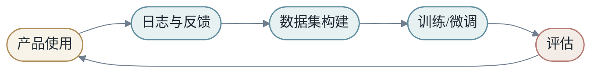
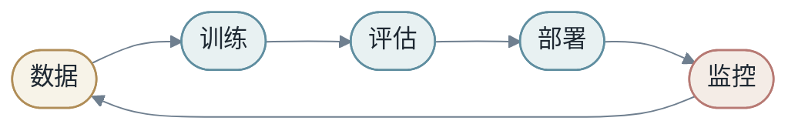
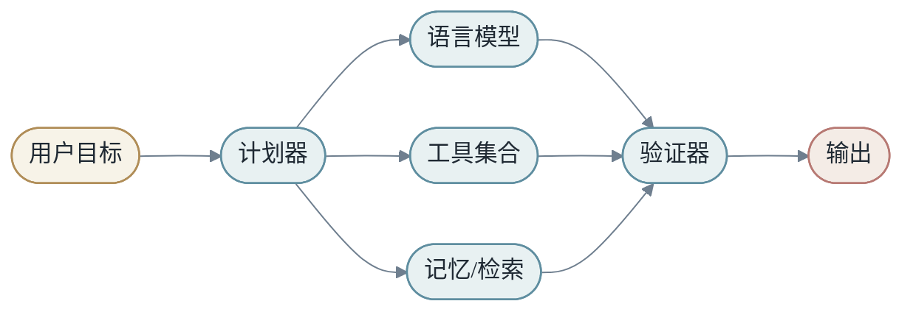
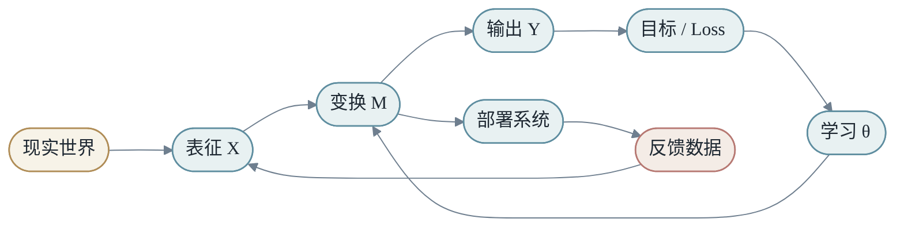
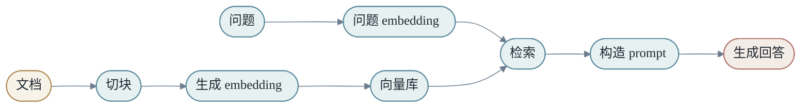
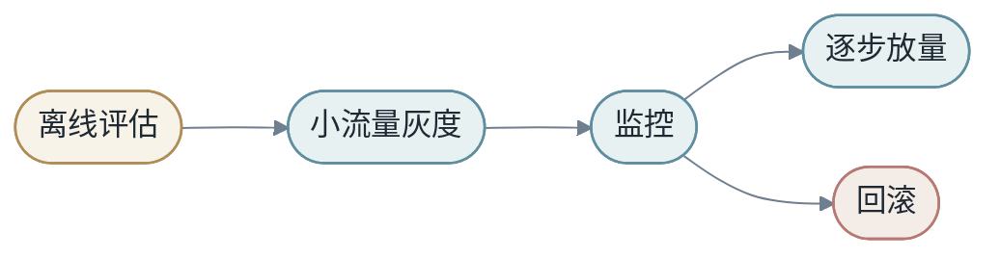

# 第八章：回到 End to End Learning

最后一部分把全书重新收束到一个问题：端到端学习到底改变了什么？

## 第1节：端到端不是没有结构

端到端学习容易被误解为“不需要设计”。实际情况相反。我们仍然设计架构、数据、loss、训练流程、推理系统和评估标准。

改变的是：更多中间步骤从手写规则变成可学习变换。

- <em>过去：人定义中间规则，模型学习最后一步</em>
- <em>现在：人定义可学习结构，模型学习大量中间表示</em>

端到端学习真正改变的是责任分配。

过去，人类工程师需要为每个中间阶段写出明确规则。现在，人类更多设计目标、结构和约束，让模型通过数据学习中间表示。

这不是人类退出系统，而是人类从“规则编写者”变成“学习系统设计者”。

### 1.1 模块仍然重要

端到端不等于单体黑盒。现代 AI 系统依然有模块：tokenizer、embedding、attention、MLP、router、retriever、tool executor、safety filter、serving scheduler。

区别在于，模块之间越来越多通过可学习信号连接，而不是通过完全手写的中间格式连接。

端到端与模块化不是非此即彼。很多系统是端到端目标加模块化执行：整体优化用户满意度，但内部仍然有检索、排序、生成、验证、服务等模块。真正重要的是目标信号能否影响关键决策，而不是系统表面上有没有模块。

## 第2节：可解释性

可解释性是在问：模型 `M` 到底怎样重排了输入空间？

小模型可以看权重，大模型需要从输入敏感性、隐藏表征、attention head、神经元行为和失败案例多个层次理解。

可解释性有两种需求。

第一种是科学需求：我们想知道模型内部到底形成了什么结构。

第二种是工程需求：模型出错时，我们需要定位原因、修复问题、建立信任。

### 2.1 从变换观解释模型

如果模型是 `M`，可解释性就是研究 `M` 如何改变空间：

- 哪些方向被放大？
- 哪些信息被压缩？
- 哪些输入被映射到相近位置？
- 哪些边界决定了输出变化？

这比只问“某个神经元是什么意思”更宽。一个模型的行为可能分布在许多参数和层中，不一定能被单个组件解释。

### 2.2 行为解释同样重要

对产品来说，行为层解释常常更有用：模型在哪类输入上失败？失败是否系统性偏向某些群体？提示词如何影响输出？加入检索后是否改善事实性？

解释模型，不只是看内部，也要看它和数据、用户、工具、环境的交互。

## 第3节：数据是学习的边界

模型从数据中学习。数据偏差会进入模型，数据缺口会变成模型盲点，标签噪声会影响模型目标。

训练集只是现实分布的采样，不是现实本身。

数据决定了模型可能学到什么，也决定了模型无法学到什么。

如果数据中某种模式从未出现，模型很难凭空掌握。如果数据中错误关联频繁出现，模型可能把它当成规律。如果数据分布随时间变化，旧模型会逐渐失效。

### 3.1 数据闭环

真实系统中的数据不是一次性静态资产，而是持续循环：

数据闭环可以让模型持续变好，也可能放大偏差。如果系统只学习自己已经偏好的数据，反馈回路会变窄。因此数据治理和评估同样重要。

## 第4节：从模型到产品

产品系统不是训练完模型就结束。它需要持续数据、评估、部署、监控和反馈。

模型上线不是终点，而是另一个学习过程的开始。

产品中的模型要面对训练集中没有的输入、用户误用、恶意攻击、环境变化、延迟要求、成本约束和安全边界。

### 4.1 一个可运行 AI 产品的最小闭环

一个实际系统至少需要：

- 数据管线：收集、清洗、标注、版本管理。
- 训练管线：可复现训练，记录配置和指标。
- 评估体系：离线指标、人工评估、回归测试。
- 部署机制：灰度、回滚、监控。
- 反馈机制：把线上问题转回数据和训练。

错误案例库比平均分更有生命力。平均分告诉我们总体表现，错误案例告诉我们系统如何失败。一个模型从 90 分提升到 91 分，可能掩盖了高价值用户或高风险场景的新错误；总体分数不变，但关键错误类型减少，也可能是重要进步。

错误案例应该记录输入、预期输出、模型输出、错误类型、严重程度、相关版本、可能根因、修复状态，以及是否进入回归集。每次线上事故都应该留下测试，每次人工审核发现系统性问题，都应该进入案例库。久而久之，案例库会成为系统记忆。

这就是为什么机器学习工程不只是写模型代码。模型是核心，但不是全部。

### 4.2 DeepSeek 作为系统化学习案例

DeepSeek 这类模型的价值，不只是某个单点技巧，而是把全书的主线压缩成一个现代案例。

从 `X` 看，训练输入不再只是普通文本，而是海量 token、代码、数学、指令、推理轨迹、偏好数据和产品场景数据。zero-shot、few-shot、CoT 这些能力，都依赖模型在足够大的数据分布中见过大量任务结构。

从 `M` 看，模型不再只是“更大的 Transformer”。MLA 压缩 KV 状态，MoE 扩大总容量但控制激活计算，FP8 和通信优化让训练可承受，长上下文机制改变模型能看到的输入范围。这些都是在资源约束下重新设计 `M`。

从 `Y` 看，目标也不只是 next-token prediction。四阶段训练把目标逐步塑形：先让模型会续写世界文本，再让它会遵循指令，再让它在推理任务中更常得到正确答案，再让它回到通用助手的多场景行为。

所以 DeepSeek 的启发不是“照抄某个结构”，而是理解大模型能力来自一组协同设计：规模、数据、训练范式、推理系统和蒸馏部署共同决定最终行为。

## 第5节：未来模型，从函数到系统

现代大模型不再只是一个函数。它有上下文、工具、检索、缓存、外部环境和多步交互。

可以粗略写成：

$$
Y=S(M_1,M_2,...,M_k,X,C,T)
$$

其中 `C` 是上下文，`T` 是工具，`S` 是调度策略。

未来模型可能越来越不像单一神经网络，而像一个由多个可学习组件、符号工具、检索系统和执行环境组成的复合系统。

它可能包括：

- 一个基础语言模型
- 一个检索系统
- 多个专门工具
- 一个长期记忆模块
- 一个计划与执行循环
- 一个安全与验证层

从这里看，深度学习正在从“学习函数”走向“学习系统行为”。

## 第6节：回到 X 到 Y

全书最后仍然回到：

$$
X \xrightarrow{M} Y
$$

看到任何模型，都可以问三个问题：

1. 这里的 `X` 是如何表示的？
2. 这里的 `M` 能表达什么变换？
3. 这里的 `Y` 和 loss 是否对应真正目标？

这三个问题，是理解机器学习和深度学习的最小工具箱。

读完整本书后，最好把概念放进自己的知识图谱，而不是背一串术语。一个简单图谱可以是：

- <em>表征 -&gt; 模型 -&gt; 目标 -&gt; 优化 -&gt; 系统</em>

遇到新概念时，先问它属于哪一层。Embedding 属于表征，也属于参数记忆；Attention 属于模型结构，也影响系统复杂度；Cross entropy 属于目标和优化；KV Cache 属于系统，也改变推理时的信息流；RAG 属于表征、系统和外部记忆。能把新概念放进这张图，就不会被名词牵着走。

### 6.1 全书的统一图景

这张图把整本书收束在一起：

- 表征决定模型看到什么。
- 模型决定可以表达什么变换。
- Loss 决定模型优化什么目标。
- 优化器决定参数如何变化。
- 系统决定模型能否高效可靠地运行。
- 反馈决定模型如何继续演化。

### 6.2 最后一条主线

机器学习不是魔法。深度学习也不是孤立公式。它是一套关于表征、变换、优化和系统的工程化学科。

当我们说 End to End Learning，我们说的不是“把所有东西丢给神经网络”。我们说的是：设计一个从输入到目标的可学习路径，让数据沿着目标信号塑造中间表示。

这条路径越清楚，模型越容易理解；目标越准确，学习越有方向；系统越稳，模型越能进入真实世界。

## 第7节：如何继续学习深度学习

读完这本书，读者应该拥有一张地图，但地图不是终点。深度学习真正的理解来自三种练习：推公式、写代码、看系统。

推公式是为了理解变换。比如手推线性回归梯度、softmax 交叉熵梯度、attention shape 和复杂度。公式训练的是“知道每个量从哪里来”。

写代码是为了理解执行。比如从零写一个 MLP、训练一个文本分类器、实现一个 tiny Transformer。代码训练的是“知道每个 tensor 如何流动”。

看系统是为了理解边界。比如观察 GPU 利用率、batching 延迟、KV Cache 显存、量化质量。系统训练的是“知道模型如何进入现实”。

三者缺一不可。只会公式，容易脱离工程；只会代码，容易把框架当魔法；只看系统，容易不知道问题的数学根源。

## 第8节：一条实践路线

可以按下面路线把本书内容转化成实践能力：

1. 用 NumPy 写线性回归和梯度下降。
2. 用 PyTorch 写 MLP 分类器。
3. 在真实小数据集上做 train/validation/test split。
4. 调一次过拟合和正则化。
5. 写一个 embedding 文本分类模型。
6. 从 shape 出发实现单头 attention。
7. 扩展到 multi-head attention 和 Transformer block。
8. 训练一个 tiny language model。
9. 加入 KV Cache 做简单 decode。
10. 做一个 RAG demo，把检索接进 prompt。
11. 记录延迟、显存、吞吐和错误案例。

这条路线的目的不是追求大模型规模，而是让读者把 `X`、`M`、`Y`、loss、优化、系统执行全部亲手走一遍。

## 第9节：本书的最终定义

End to End Learning 可以定义为：

> 在给定目标信号和系统约束下，设计一条从输入到输出的可学习路径，让数据塑造中间表示，并让模型在真实环境中持续接受评估和反馈。

这个定义包含四个关键词。

第一，目标信号。没有目标，学习没有方向。

第二，可学习路径。不是所有步骤都手写，也不是所有步骤都无约束，而是把可学习结构放在合适位置。

第三，中间表示。深度学习的强大，来自中间表示可以被数据塑造。

第四，真实环境。模型只有进入数据、用户、成本、延迟和安全约束构成的现实世界，才算完成闭环。

所以本书从 `X -> Y by M` 开始，也在这里结束。这个表达足够简单，可以放进第一章；也足够深，可以贯穿从线性回归到大模型系统的全部路径。

## 第10节：从读者到实践者

读懂机器学习和会做机器学习之间，还有一段距离。这段距离靠实践补齐。

实践者和读者的区别，不在于记住更多术语，而在于能把模糊问题变成可运行闭环。

面对一个新问题，实践者会自然地问：

- 这个任务的 `Y` 是否清楚？
- 训练数据是否代表未来使用场景？
- 有没有简单 baseline？
- 错误代价是否对称？
- 模型输出如何被产品使用？
- 上线后如何监控和回滚？

这些问题听起来不如复杂模型酷，但它们决定项目是否可靠。

## 第11节：一张最终检查表

可以把整本书浓缩成一张检查表。

### 问题层

- `X` 是什么？
- `Y` 是什么？
- 错误代价是什么？
- 目标是否可测量？

### 数据层

- 数据来自哪里？
- 标签如何产生？
- 是否有分布偏差？
- 是否存在泄漏？

### 表征层

- 输入是否包含任务需要的信息？
- 离散、连续、结构对象分别如何表示？
- 表征是否稳定？
- 是否有冷启动或长尾问题？

### 模型层

- 模型容量是否匹配任务？
- 是否有合适 baseline？
- loss 是否对应目标？
- 是否做过 ablation？

### 系统层

- 延迟和成本是否可接受？
- 是否可复现实验？
- 是否可监控？
- 是否可回滚？

这张表并不复杂，但它能防止很多常见失败。

## 第12节：为什么还要回到简单表达

本书用了大量章节讨论 Transformer、MoE、RAG、KV Cache、分布式训练和模型服务。最后仍然回到 `X -> Y by M`，不是因为这些细节不重要，而是因为细节需要一个中心来组织。

没有中心，知识会变成术语堆叠。今天是 CNN，明天是 Transformer，后天是 Agent。每个概念都像孤岛。

有了中心，我们就能问：这个新方法改变了 `X`、`M`、`Y`、loss、优化，还是系统执行？它解决了表达能力、数据效率、计算效率，还是产品闭环？

这就是统一框架的意义。它不是替代细节，而是让细节有位置。

End to End Learning 的精神，是把学习看成完整路径，而不是孤立模型。路径清楚，系统才清楚；系统清楚，改进才有方向。

## 第13节：如何阅读一篇机器学习论文

读论文时，不要先被方法名和图表淹没。可以用本书框架拆解。

第一，论文改变了什么？

- 改 `X`：新的输入表征、数据构造、增强方式。
- 改 `M`：新的模型结构、注意力机制、路由、模块。
- 改 `Y`：新的任务定义或输出格式。
- 改 loss：新的训练目标、正则项、偏好优化。
- 改 optimization：新的优化器、训练策略、并行方式。
- 改 system：新的推理、压缩、缓存或部署方法。

第二，论文解决什么瓶颈？是质量、数据效率、计算效率、长上下文、可控性、稳定性，还是成本？

第三，代价是什么？参数更多、训练更慢、推理更贵、实现更复杂、依赖更多数据，还是评估更困难？

第四，它的实验是否支持主张？有没有 ablation？有没有和强 baseline 比较？有没有分析失败案例？

这样读论文，会比只记住结论更稳。你会知道一个方法应该放在整张地图的哪个位置。

## 第14节：如何设计一个机器学习项目评审

如果你要评审一个机器学习项目，可以按本书结构提问。

### 问题定义

- 目标是否清楚？
- `Y` 是否可观测？
- 指标是否真的代表目标？

### 数据

- 数据是否覆盖目标场景？
- 标签是否可靠？
- 是否存在泄漏？
- 是否有分布漂移风险？

### 模型

- baseline 是什么？
- 为什么当前模型比 baseline 更合适？
- 是否做过 ablation？
- 错误案例是否被分析？

### 系统

- 延迟、成本和稳定性如何？
- 是否可监控？
- 是否可回滚？
- 线上失败时如何定位？

项目评审不是阻止创新，而是让创新进入可靠路径。

## 第15节：学习的边界

机器学习强大，但不是所有问题都应该交给学习系统。

有些规则非常明确，例如税率计算、权限校验、协议解析。用模型学习这些规则不仅没必要，还可能引入不确定性。

有些任务缺少反馈信号。没有可靠 `Y`，模型很难学习。还有些任务错误代价极高，需要确定性验证、人工审核或形式化方法。

学习系统适合处理复杂、模糊、难以手写规则但有足够数据反馈的问题。不适合替代所有逻辑。

- <em>规则清楚 -&gt; 写规则</em>
- <em>模式复杂且有数据 -&gt; 学模型</em>
- <em>高风险 -&gt; 模型 + 验证 + 人类责任</em>

成熟的 AI 系统往往不是纯模型，而是规则、模型、工具、验证和人类流程的组合。

## 第16节：从学习系统看职业能力

学习机器学习，最后不是为了背更多模型名字，而是形成一种解决问题的能力。

这种能力可以拆成几层。

第一层是问题建模。你能把一个模糊需求写成 `X -> Y by M`，能说清输入、输出、目标和约束。

第二层是数据判断。你能判断数据是否代表未来，标签是否可靠，特征是否泄漏，分布是否稳定。

第三层是模型选择。你知道什么时候用线性模型、树模型、深度网络、大模型、RAG 或规则系统。

第四层是训练和评估。你能设计 baseline、验证集、指标、ablation 和错误分析。

第五层是系统落地。你能考虑延迟、成本、监控、灰度、回滚和反馈闭环。

一个成熟实践者不一定记得每个公式细节，但一定能把问题放进这五层地图里。

## 第17节：如何把一个想法变成实验

机器学习项目经常从一个模糊想法开始：能不能预测用户流失？能不能让助手回答内部问题？能不能检测异常交易？

把想法变成实验，需要经过几个步骤。

第一，写出任务句子：给定什么，预测什么，为谁服务，在什么场景使用。

第二，定义最小可用 `Y`。如果真实目标很复杂，先找一个可观测代理目标，但要标明它的局限。

第三，收集第一版数据。不要一开始追求完美数据，而是构造能验证方向的小样本。

第四，建立 baseline。Baseline 可以很简单，但必须存在。

第五，跑第一个闭环：训练、评估、看错误、写结论。

第六，再决定是否扩大模型、扩大数据或重定义任务。

很多项目失败，是因为跳过了前几步，直接进入复杂模型。复杂模型会把问题掩盖起来，让团队更晚才发现 `Y` 不清楚或数据不可用。

## 第18节：如何写机器学习实验报告

实验报告不是流水账，而是让别人判断结论是否可信。

一份好的实验报告应该包含：

- 问题定义：`X`、`Y`、使用场景。
- 数据说明：来源、时间范围、切分方式、样本量、标签生成。
- Baseline：简单方法的结果。
- 方法：模型、特征、loss、训练配置。
- 指标：总体指标和关键分群指标。
- Ablation：哪些改动真正带来收益。
- 错误分析：典型失败案例和失败类型。
- 系统指标：延迟、成本、资源占用。
- 结论：是否建议上线，风险是什么，下一步做什么。

实验报告最重要的不是显得复杂，而是让读者知道：这个结论能不能信，能信到什么程度。

## 第19节：如何建立自己的机器学习知识库

读完一本书，如果不整理，知识会很快散掉。可以把机器学习知识库按本书结构组织。

- <em>01-learning-nature</em>
- <em>02-transformations</em>
- <em>03-representation</em>
- <em>04-training</em>
- <em>05-deep-learning</em>
- <em>06-large-models</em>
- <em>07-systems</em>
- <em>08-case-studies</em>

每读一篇论文、做一个项目、遇到一次线上问题，都放到其中一个位置。不要只收藏链接，要写下：它改变了什么？解决什么问题？代价是什么？失败在哪里？

这样的知识库会逐渐变成个人的实践地图。它不是百科全书，而是帮你做判断的工具。

## 第20节：未来十年的学习主线

未来模型会继续变大，也会继续变小。大模型负责通用能力，小模型负责低成本、低延迟、可控场景。二者不是替代关系，而是系统组合关系。

未来数据会更重要。高质量数据、反馈数据、合成数据、隐私保护数据、企业内部数据，都会决定模型能否进入真实场景。

未来系统会更复杂。模型会调用工具、读写记忆、执行计划、与人协作。学习系统会越来越像运行环境，而不是单个函数。

未来评估会更难。单一分数无法描述真实行为，多轮任务、工具使用、长期满意度、安全边界都需要新评估方式。

但不管形式如何变化，本书的主线仍然可用：看清 `X`，设计 `M`，定义 `Y`，理解 loss，掌握优化，落到系统，建立反馈。

### 本章小结

- 端到端不是无结构，而是可学习结构。
- 可解释性要同时看内部机制和外部行为。
- 数据是模型能力和偏差的边界。
- 产品化需要数据、训练、评估、部署、监控的闭环。
- 未来模型会从单一函数走向复合系统。
- 最终检查表把问题、数据、表征、模型和系统重新接回同一条路径。

### 练习题

1. 举一个传统系统被端到端学习替代的例子，并指出哪些中间步骤从手写变成了可学习。
2. 如果一个模型在线上表现变差，可能是数据问题、模型问题还是系统问题？分别举例。
3. 为什么说端到端学习不是把人类设计移除，而是把设计上移？
4. 对一个 RAG 系统，分别指出其中的 `X`、`M`、`Y`、`C` 和 `T`。
5. 如果要把本书继续扩展到 200 页，你认为最需要加案例的是哪一部分？
6. 用最终检查表评估一个你熟悉的 AI 产品。
7. 找一个新论文或新系统，说明它主要改变了 `X`、`M`、`Y`、loss 还是系统执行。

## 整合补充：案例研究

这个附录用几个完整案例把全书主线串起来。每个案例都按同一套问题展开：`X` 是什么，`Y` 是什么，`M` 是什么，loss 如何定义，系统如何运行，失败时该看哪里。

## 案例一：房价预测

### 问题定义

目标是根据房屋信息预测价格。

- <em>X = 房屋特征</em>
- <em>Y = 成交价格</em>
- <em>M = 回归模型</em>

表面上这是最简单的监督学习任务，但它包含机器学习的多数核心问题。

### 表征

可能的 feature 包括：面积、城市、区域、楼层、房龄、房型、是否近地铁、学区、装修状态、历史成交均价。

这些 feature 可以分成几类：

- 连续数值：面积、房龄、历史均价。
- 类别变量：城市、区域、房型。
- 布尔变量：是否近地铁、是否学区。
- 时间变量：成交月份、挂牌时长。

如果只输入面积，模型只能学到非常粗糙的规律。加入地段和时间后，模型才开始接近真实市场。

### 模型路径

一个最小模型是线性回归：

$$
ŷ=w^Tx+b
$$

更复杂一点，可以用树模型或 MLP。树模型擅长表格数据中的非线性分段，MLP 擅长把 embedding 和数值特征组合起来。

### 失败模式

房价预测最典型的失败是分布漂移。训练数据来自去年，预测对象来自今年；市场政策、利率、供需关系变了，旧规律不再稳定。

另一个失败是标签噪声。挂牌价不等于成交价，异常交易也会污染训练目标。

这个案例说明：机器学习不是只拟合函数，还要理解数据生成过程。

## 案例二：文本情感分类

### 问题定义

输入是一段评论，输出是正面或负面。

- <em>X = 评论文本的表征</em>
- <em>Y = 情感标签</em>
- <em>M = 文本分类模型</em>

### 三种实现

第一版可以用 bag-of-words 加线性分类器。它简单、可解释，适合小数据集。

第二版可以用 embedding 平均池化。它能学习词之间的相似性，但仍然很难处理复杂句法。

第三版可以用 Transformer encoder。它能建模上下文，理解 `not bad`、`hardly useful`、讽刺和长距离依赖。

### 评估

如果类别平衡，可以看 accuracy。如果正负样本不平衡，需要看 precision、recall、F1。产品中还可能关心“误杀正面评论”和“漏掉负面评论”的不同代价。

### 失败模式

讽刺和反语是常见难点：

- <em>"Great, another app that crashes every five minutes."</em>

表面有 `Great`，实际是负面。模型需要上下文和世界知识才能判断。

这个案例说明：表征决定模型能看到什么，loss 决定模型愿意优化什么。

## 案例三：Tiny Language Model

### 问题定义

给定前文 token，预测下一个 token。

- <em>X = token 序列前缀</em>
- <em>Y = 下一个 token</em>
- <em>M = Transformer language model</em>

训练数据可以是一小本文集。模型很小，但结构和大模型相同：embedding、position、Transformer block、vocab projection。

### 训练观察

训练早期，模型只学会高频 token 和简单搭配。训练继续，模型开始学会局部语法。数据太少时，它会背诵训练文本。模型太小，则 loss 下降到一定程度后停住。

可以观察三条曲线：训练 loss、验证 loss、生成样例质量。三者不总是一致。验证 loss 更可靠，但生成样例能暴露重复、崩坏和模式坍缩。

### 推理观察

temperature 改变输出分布。低温度更保守，高温度更多样。context length 改变模型可见历史，KV Cache 改变 decode 成本。

这个案例说明：语言模型不是魔法，它仍然是 `X -> Y by M`，只是 `Y` 是词表上的概率分布，而 `M` 被做得很大。

## 案例四：RAG 问答系统

### 问题定义

用户问一个需要私有文档知识的问题，模型需要基于文档回答。

- <em>X = 用户问题 + 检索证据</em>
- <em>Y = grounded answer</em>
- <em>M = retriever + prompt builder + LLM</em>

### 系统路径

### 关键设计

Chunk 太短，语义不完整；chunk 太长，检索不精确。Top-k 太小，可能漏证据；top-k 太大，prompt 被噪声淹没。Embedding 模型、reranker、prompt 模板都会影响最终质量。

### 失败模式

RAG 的错误常分三类：

1. 检索失败：相关文档没被找出来。
2. 阅读失败：文档在上下文中，但模型没用对。
3. 生成失败：模型编造或过度概括。

调试 RAG 时，要把这三步拆开看，而不是只看最终回答。

## 案例五：线上模型服务

### 问题定义

训练好的模型要服务真实用户。目标不只是预测准确，还要稳定、低延迟、可监控、可回滚。

- <em>X = 在线请求</em>
- <em>Y = 在线响应</em>
- <em>M = 模型 + 服务系统</em>

### 系统指标

需要同时看：

- 质量：accuracy、F1、人工评分、业务指标。
- 延迟：P50、P95、P99、TTFT、TPOT。
- 成本：GPU 时间、显存、吞吐、cache 命中率。
- 可靠性：错误率、超时率、回滚次数。

### 灰度发布

模型上线不应该一次性全量切换。常见流程是：离线评估通过，小流量灰度，监控关键指标，逐步放量，发现问题可回滚。

### 失败模式

线上失败不一定是模型质量问题。可能是 tokenizer 版本不一致、特征缺失、请求分布变化、batching 延迟过高、GPU 显存碎片、依赖服务超时。

这个案例说明：End to End Learning 的终点不是训练完成，而是模型在真实系统中形成可靠闭环。

## 案例总结

前五个案例看起来不同，但它们共享同一个骨架：

| 案例 | X | M | Y | 主要风险 |
|------|---|---|---|----------|
| 房价预测 | 表格特征 | 回归模型 | 价格 | 分布漂移 |
| 情感分类 | 文本表征 | 分类器 | 标签 | 语义和讽刺 |
| Tiny LM | token 前缀 | Transformer | 下一个 token | 过拟合和生成退化 |
| RAG | 问题 + 证据 | 检索 + LLM | grounded answer | 检索/阅读/生成失败 |
| 线上服务 | 在线请求 | 模型 + 系统 | 响应 | 延迟、成本、可靠性 |

掌握这张表，就能把抽象概念带回真实工程。

## 案例六：医疗筛查模型

医疗筛查是理解错误代价的好案例。输入可能是检查指标、影像、病史和人口统计信息，输出是某种疾病风险。

- <em>X = 医疗数据表征</em>
- <em>Y = 疾病风险或筛查结论</em>
- <em>M = 风险预测模型</em>

这个场景中，false negative 和 false positive 的代价不同。漏掉真正高风险患者可能延误治疗；误报则可能造成焦虑、额外检查和医疗成本。

因此阈值不能简单设为 0.5。不同疾病、不同筛查阶段、不同医疗资源条件下，阈值都可能不同。

医疗模型还特别重视校准。如果模型说风险是 20%，医生和患者需要这个概率有真实含义。一个排序能力强但概率不准的模型，可能不适合直接用于风险沟通。

### 数据问题

医疗数据常有缺失、偏差和机构差异。大医院数据训练出的模型，不一定适合基层医院。某个地区人群数据训练出的模型，不一定适合另一个地区。

### 系统问题

医疗 AI 不应该只给结论，还应该给证据、置信度、适用范围和建议下一步。高风险输出可能需要医生确认，而不是自动决定。

这个案例说明：模型输出不是终点，人的责任和流程设计仍然是系统的一部分。

## 案例七：代码补全模型

代码补全模型输入是当前代码上下文，输出是下一个 token、下一行或一个函数片段。

- <em>X = 当前文件、光标位置、相关上下文</em>
- <em>Y = 补全代码</em>
- <em>M = 代码语言模型</em>

代码任务和普通文本不同。代码有语法、类型、作用域、API、测试和运行结果。一个补全看起来合理，不代表能编译；能编译，也不代表逻辑正确。

### 表征

代码模型需要看到局部上下文，也可能需要看到项目级信息：import、类型定义、调用约定、测试文件。上下文不足时，模型会猜 API；上下文太多时，关键线索可能被淹没。

### 评估

代码补全可以用多层评估：

- 语法是否正确。
- 是否通过类型检查。
- 是否通过单元测试。
- 是否符合项目风格。
- 是否引入安全问题。

这比自然语言答案更容易自动验证，但也更容易出现“看起来对、实际错”的情况。

### 系统

代码补全还要求低延迟。用户在编辑器里等待几秒会打断思路。因此系统可能需要小模型、本地缓存、检索相关文件、增量上下文构造和快速取消。

这个案例说明：AI 产品的 `M` 经常是模型和工具链的组合，而不是裸模型。

## 案例八：推荐系统冷启动

### 问题定义

推荐系统要在用户和内容之间建立匹配。冷启动场景中，用户、商品或内容缺少历史行为，模型不能只依赖 ID embedding。

- <em>X = 用户上下文 + 内容属性 + 少量或没有历史行为</em>
- <em>Y = 点击、购买、停留或满意度</em>
- <em>M = 召回 + 排序 + 探索策略</em>

### 为什么冷启动困难

成熟用户和成熟商品有丰富历史。模型可以从点击、购买、浏览、收藏中学习偏好。新用户和新商品没有这种历史，ID embedding 还没有被充分训练。

如果系统只推荐历史表现好的内容，新内容永远拿不到曝光，也就永远没有数据。这会形成马太效应：强者更强，长尾更难被发现。

### 表征策略

冷启动需要更多内容特征和上下文特征。

对新商品，可以用标题、类目、价格、图片、商家、描述、品牌。对新用户，可以用注册来源、当前会话行为、地理位置、设备、入口页面。对新内容，可以用文本 embedding、图像 embedding、作者信息和主题标签。

这说明 ID embedding 很强，但不能是唯一表征。系统需要在“历史行为表征”和“内容语义表征”之间切换或融合。

### 探索与利用

冷启动不仅是预测问题，也是探索问题。系统需要给新对象一定曝光，收集反馈。但探索会牺牲短期指标，因为推荐不确定内容可能降低点击率。

因此推荐系统常常需要平衡 exploitation 和 exploration：

- <em>利用：推荐已知高质量对象</em>
- <em>探索：给未知对象收集数据</em>

### 失败模式

冷启动失败可能表现为新内容没有曝光，新用户看到泛化推荐，热门内容垄断，或者探索流量过大导致用户体验下降。

这个案例说明：学习系统不只是根据数据训练模型，还要主动设计数据产生机制。

## 案例九：欺诈检测

### 问题定义

欺诈检测要识别异常交易、异常注册、刷量、作弊点击或恶意行为。

- <em>X = 行为序列、账户信息、设备信息、网络特征</em>
- <em>Y = 是否欺诈或风险分数</em>
- <em>M = 异常检测 + 监督模型 + 规则系统</em>

### 标签延迟

欺诈标签通常来得很晚。一次交易是否欺诈，可能需要用户投诉、银行拒付、人工审核或后续行为才能确认。

这意味着训练数据天然滞后。模型学到的是过去攻击方式，而攻击者会适应系统。

### 类别不平衡

欺诈样本通常很少。Accuracy 在这里几乎没用，因为全预测正常也能得到很高 accuracy。更重要的是 precision、recall、PR-AUC、人工审核量和拦截收益。

阈值选择也非常敏感。阈值太低，误伤正常用户；阈值太高，漏掉风险。

### 对抗性

欺诈检测和普通分类不同。普通数据不会主动骗模型，欺诈者会。一旦某些特征被识别为风控信号，攻击者可能改变行为。

所以欺诈检测系统需要持续更新：规则、模型、图谱、人工审核、在线监控共同工作。

### 失败模式

常见失败包括：新攻击模式没被训练集覆盖；规则误伤新用户；模型过度依赖容易伪造的特征；人工审核反馈太慢；线上阈值没有随风险变化调整。

这个案例说明：有些学习问题是动态博弈，`M` 面对的不只是自然分布，还有会反应的对手。

## 案例十：企业知识助手

### 问题定义

企业知识助手帮助员工查询内部文档、项目记录、会议纪要、代码说明和流程规范。

- <em>X = 用户问题 + 权限范围内的企业知识</em>
- <em>Y = 可追溯、可执行、权限合规的回答</em>
- <em>M = RAG + LLM + 权限系统 + 引用验证</em>

### 权限是第一约束

企业场景里，最重要的问题不是模型能不能回答，而是模型是否应该回答。不同用户能看到的文档不同，检索系统必须在权限边界内工作。

如果检索先拿到所有文档再让模型过滤，风险很高。更合理的做法是在检索层就执行权限过滤。

### 来源和可追溯性

企业知识经常过时、冲突或有多个版本。助手回答时应该尽量给出来源，让用户知道答案来自哪个文档、什么时候更新、是否有 owner。

这和普通聊天不同。企业助手不是追求说得流畅，而是追求可验证。

### 失败模式

第一，检索到过时文档。第二，不同文档冲突，模型没有说明。第三，模型把无权限信息泄露给用户。第四，回答没有引用，用户无法信任。第五，工具调用失败但模型继续编造。

### 系统设计

企业知识助手需要：权限过滤、文档版本、引用、冲突检测、反馈入口、失败降级和审计日志。

这个案例说明：大模型进入组织系统后，正确性和权限一样重要。

## 扩展案例总览

| 案例 | 关键概念 | 最该检查的问题 |
|------|----------|----------------|
| 医疗筛查 | 错误代价、校准、人机协作 | 阈值和责任边界是否清楚 |
| 代码补全 | 上下文、可验证性、低延迟 | 是否编译、测试、符合项目约定 |
| 推荐冷启动 | 表征、探索、反馈闭环 | 新对象是否有机会获得数据 |
| 欺诈检测 | 类别不平衡、标签延迟、对抗性 | 模型是否只学到过时攻击模式 |
| 企业知识助手 | RAG、权限、引用 | 答案是否可追溯且权限合规 |

这些案例把本书的核心观点推到真实复杂度中：一个学习系统不是单个模型，而是一条从数据、目标、模型、系统到反馈的完整链路。

## 整合补充：逐步推演样例

这个附录给出一组可以逐步推演的完整样例。正文讲概念时常会压缩细节，而这里的目标相反：把一个问题从 `X`、`Y`、`M`、loss、训练、评估、部署一路拆开，让读者看到每个选择为什么会影响最后的系统。

这些样例不追求覆盖所有算法，而是反复练习同一个能力：看见一个现实问题时，能把它翻译成可学习的形式，同时也能看见这种翻译丢掉了什么。

## 样例一：从一维房价到多特征回归

最小问题是：只知道房屋面积，预测成交价格。

- <em>X = 面积</em>
- <em>Y = 成交价格</em>
- <em>M = 一条直线</em>

如果用线性模型，形式是：

$$
ŷ = wx + b
$$

这里 `w` 表示每增加一平方米，价格平均增加多少；`b` 表示当面积为零时模型给出的截距。真实世界里零平方米房屋没有意义，但截距仍然有数学作用，它让直线可以上下平移。

训练数据可能是：

| 面积 | 价格 |
|------|------|
| 50 | 300 万 |
| 70 | 410 万 |
| 90 | 520 万 |
| 110 | 660 万 |

如果模型预测 `ŷ` 和真实价格 `y` 的差距很大，就要调整 `w` 和 `b`。用均方误差时，loss 是：

$$
L = \frac{1}{N}\sum_i(ŷ_i-y_i)^2
$$

这个公式看起来简单，却已经包含了机器学习的核心：模型不是直接记住答案，而是找一组参数，让很多样本上的误差整体变小。

### 为什么一个特征不够

面积不是房价的全部。两个同样 90 平方米的房子，一个在核心城区，一个在远郊，价格可能差几倍。如果模型只看面积，它会把地段差异当成随机噪声。

于是我们把 `X` 扩展为向量：

- <em>X = [面积, 区域, 楼层, 房龄, 是否近地铁, 学区等级]</em>

模型变成：

$$
ŷ = w_1x_1+w_2x_2+\cdots+w_dx_d+b
$$

每个 feature 都对应一个权重。连续特征可以直接输入，类别特征要编码。区域可以 one-hot，也可以用 embedding。如果城市里有几百个片区，one-hot 会很稀疏；embedding 则允许模型学习片区之间的相似性。

### 错误分析

训练后，如果整体误差还可以，但某些区域总是预测偏低，说明模型可能缺少区域内部的细粒度信息。比如同一片区里，靠近地铁站和远离地铁站的价格不同；同一学区里，学校热度也不同。

错误分析的第一步不是换更大的模型，而是问：模型看见的 `X` 是否包含解释误差所需的信息？如果信息根本不在 `X` 里，再复杂的 `M` 也只能猜。

### 小练习

给定一个房价模型，如果它在新楼盘上系统性低估，在老小区上系统性高估，你应该先检查哪些 feature？为什么这可能不是优化器问题？

## 样例二：线性分类器如何画出决策边界

考虑一个二维分类任务。输入是两个特征：学习时长和练习题数量。输出是考试是否通过。

- <em>X = [学习时长, 练习题数量]</em>
- <em>Y = 通过 / 未通过</em>
- <em>M = 线性分类器</em>

模型可以先计算一个分数：

$$
s = w_1x_1+w_2x_2+b
$$

再通过 sigmoid 变成概率：

$$
p = \sigma(s)
$$

如果 `p > 0.5`，预测通过；否则预测未通过。

### 边界的意义

`p = 0.5` 时，sigmoid 的输入 `s = 0`。所以决策边界是：

$$
w_1x_1+w_2x_2+b=0
$$

在二维平面上，这是一条直线。直线一侧预测通过，另一侧预测未通过。训练的过程就是移动和旋转这条线，让它尽量把两类样本分开。

如果数据本身呈现非线性形状，例如学习时间太少不行，太多导致疲劳也不行，那么直线边界就不够。此时可以加特征，例如 $\text{学习时长}^2$，也可以换成更复杂的模型。

### 工程含义

很多业务系统的第一版模型都可以从线性分类器开始。它快、稳定、可解释，容易做错误分析。如果线性模型表现很差，至少能暴露两类问题：一是 feature 不够，二是任务本身边界复杂。

复杂模型不应该是起点，而应该是 baseline 被充分理解后的下一步。

## 样例三：文本情感分类中的表征选择

现在输入是一句话，输出是正面或负面。

- <em>X = 文本</em>
- <em>Y = 情感标签</em>
- <em>M = 分类模型</em>

问题的难点在于，模型不能直接处理原始字符串。我们必须把文本变成向量。

### Bag-of-Words

最简单的方法是统计词是否出现。

- <em>句子: this movie is not good</em>
- <em>表征: {this:1, movie:1, is:1, not:1, good:1}</em>

这种表示很容易让线性模型工作。如果 `good` 经常出现在正面评论中，它的权重会变正；如果 `bad` 经常出现在负面评论中，它的权重会变负。

问题是，bag-of-words 不理解顺序。`not good` 和 `good not` 在这种表示下几乎一样。它也不理解组合意义：`not bad` 可能是正面，`hardly good` 可能是负面。

### Embedding 平均

第二种方法是把每个词变成 embedding，然后平均。

- <em>X = average(embedding(token_1), ..., embedding(token_n))</em>

embedding 可以表达词之间的相似性。`good`、`great`、`excellent` 可能接近；`bad`、`terrible`、`awful` 可能接近。这样模型可以泛化到训练集中很少出现的词。

但平均仍然会丢失顺序。`dog bites man` 和 `man bites dog` 在平均后很接近，语义却完全不同。

### Transformer Encoder

第三种方法是让每个 token 在上下文中重新表示自己。`good` 在 `not good` 中的含义，和在 `very good` 中不同。Transformer 的 self-attention 正是用来做这种上下文重写。

此时 `X` 不再是固定词表统计，而是一组上下文相关向量。分类头只需要读取 `[CLS]` 或 pooled representation，就能判断整体情感。

### 读者要记住的点

表征不是预处理小事。表征决定模型能看见什么，模型能看见什么，又决定它能学到什么。

## 样例四：推荐系统中的负样本

推荐系统输入用户和物品，输出用户是否会点击、购买或停留。

- <em>X = 用户特征 + 物品特征 + 上下文</em>
- <em>Y = 点击或不点击</em>
- <em>M = 排序模型</em>

看起来这是二分类问题，但推荐系统的难点在于负样本。用户没有点击某个物品，不一定表示不喜欢。也许用户根本没看见它。

### 曝光负样本

如果一个物品被展示给用户，但用户没有点击，这可以作为相对可信的负样本。它说明在那个上下文下，用户至少有机会点击但没有点击。

### 未曝光负样本

如果一个物品没有展示，不能直接当负样本。把所有未曝光物品都当负样本，会让模型学到展示系统的偏差，而不是用户偏好。

### 训练目标

推荐模型常用 pointwise、pairwise 或 listwise 目标。pointwise 把每个样本看成独立分类；pairwise 学习正样本比负样本分数高；listwise 直接优化列表排序质量。

在 `X -> Y by M` 框架中，推荐系统提醒我们：`Y` 不是自然存在的纯标签，它往往由产品机制生成。标签生成过程本身也是系统的一部分。

## 样例五：图像分类从像素到层级特征

图像输入看起来是一个矩阵：

- <em>X = H x W x C 的像素张量</em>
- <em>Y = 类别</em>
- <em>M = CNN 或 Vision Transformer</em>

如果直接把所有像素展开，用线性模型分类，模型会非常脆弱。猫向右移动几个像素，展开后的向量就大变，但语义没有变。

### 卷积的归纳偏置

卷积利用了图像的局部性。同一个边缘检测器可以在图像不同位置使用，这叫参数共享。它让模型更少依赖绝对位置，更容易学习局部纹理和形状。

第一层可能学边缘，第二层组合成角点和纹理，更深层组合成部件，最后组合成对象。这不是人工规定每层必须学什么，而是任务和结构共同诱导出的层级表示。

### 错误分析

如果模型把狗误判成狼，可能是因为训练集中狼常出现在雪地背景，而狗很少在雪地。模型学到的不是动物本身，而是背景线索。

这类问题说明：高准确率不等于学到了正确概念。模型可能用捷径完成任务。

## 样例六：时间序列预测中的窗口

时间序列任务输入过去一段历史，输出未来值。

- <em>X = 过去 k 个时间点</em>
- <em>Y = 下一个时间点或未来窗口</em>
- <em>M = 序列模型</em>

窗口长度 `k` 是关键选择。太短，看不到季节性；太长，噪声和计算成本增加。

### 特征设计

除了原始数值，还可以加入小时、星期、节假日、促销、天气、事件等外生变量。很多时间序列错误不是模型不够强，而是缺少解释突变的外部信息。

### 评估方式

时间序列不能随机切分训练集和测试集。必须按时间切分，用过去训练，未来测试。否则未来信息会泄漏到训练中，离线指标虚高。

### 部署问题

线上预测时，某些外部特征可能延迟到达。训练时 feature 完整，线上时 feature 缺失，会造成训练服务偏差。时间序列系统要特别关注数据新鲜度。

## 样例七：RAG 中的检索失败

用户问：“我们系统如何处理长上下文的缓存？” 文档库里确实有答案，但系统答错了。

RAG 的 `M` 其实由几段组成：

- <em>M = query rewrite + retriever + reranker + prompt builder + LLM</em>

调试时不能只看最终回答。要逐段检查：

1. 改写后的 query 是否保留了原意。
2. 检索 top-k 是否包含相关 chunk。
3. reranker 是否把证据排到前面。
4. prompt 是否让模型使用证据。
5. 生成是否忠实于证据。

### 常见根因

如果检索不到，可能是 chunk 太大、chunk 太小、标题丢失、embedding 模型不适合领域术语，或者 query 和文档使用不同说法。

如果检索到了但没用，可能是 prompt 太长、证据冲突、答案位置太靠后，或者模型更相信预训练知识。

RAG 是最适合练习“拆系统”的例子。它让读者看到：一个 AI 应用不是一个模型，而是一串变换。

## 样例八：大语言模型的 next-token 训练

语言模型训练可以写成：

- <em>X = token_1 ... token_t</em>
- <em>Y = token_{t+1}</em>
- <em>M = Transformer</em>

模型输出整个词表上的概率分布。正确 token 的概率越高，loss 越低。

$$
L = -\log p(y \mid x)
$$

### 为什么这个目标强大

next-token 预测看起来很窄，却逼迫模型学习语言、事实、风格、推理模式和世界结构。因为要预测下一个 token，模型必须压缩前文中对未来有用的信息。

### 为什么这个目标也有限

模型学到的是“在训练分布中，下一个 token 通常是什么”。它不天然知道什么是真，也不天然知道什么时候应该拒绝回答。对齐、工具使用、检索、验证和评估，都是在基础目标之上补出来的系统能力。

### 生成中的控制

temperature、top-p、重复惩罚、系统提示词都会改变输出。它们不是训练，而是推理时对概率分布的再加工。理解这一点，才能区分“模型不会”和“解码策略不合适”。

## 样例九：MoE 路由的直觉

Mixture of Experts 把一个大模型拆成多个专家。每个 token 不必经过所有专家，而是由 router 选择少数几个。

- <em>X = token representation</em>
- <em>Y = transformed representation</em>
- <em>M = router + selected experts</em>

这样可以增加总参数量，同时控制每次推理的计算量。

### 路由风险

如果 router 总是选择少数专家，这些专家会过载，其他专家学不到东西。训练时需要负载均衡损失，让 token 分布更均匀。

### 系统风险

MoE 不只是算法问题。专家分布在不同设备上时，路由会引入通信。某些专家过热会拖慢整个 batch。模型看起来稀疏，系统却可能因为通信变复杂。

这个样例连接了第六章和第七章：模型结构和计算系统不能分开理解。

## 样例十：线上模型监控

模型上线后，训练并没有结束。线上请求形成新的数据流，系统要持续观察：

- <em>X_live = 在线输入</em>
- <em>Y_live = 用户反馈或延迟标签</em>
- <em>M_live = 正在服务的模型</em>

### 监控层次

第一层是系统指标：错误率、延迟、吞吐、资源使用。第二层是数据指标：feature 分布、缺失率、类别比例。第三层是模型指标：分数分布、校准、置信度。第四层是业务指标：点击、转化、留存、满意度。

如果业务指标下降，但系统指标正常，可能是数据分布变了。如果系统指标异常，模型质量再好也没有用。

### 回滚和实验

线上模型必须可回滚。发布新模型前要保存旧模型、旧特征配置、旧 tokenizer、旧后处理逻辑。否则出问题时很难恢复。

实验也要分层。离线指标好，不代表线上好；小流量好，不代表全量好；短期好，不代表长期好。

## 样例十一：代码补全的上下文选择

代码补全的输入不只是当前行。它可能包括当前文件、相邻文件、类型定义、测试、依赖版本和用户意图。

- <em>X = 代码上下文 + 光标位置 + 项目线索</em>
- <em>Y = 补全片段</em>
- <em>M = 代码模型</em>

### 上下文太少

如果模型只看当前函数，可能不知道项目里已有 helper，于是重复造轮子。它可能猜错 API 名称，或者用不存在的字段。

### 上下文太多

如果把整个仓库都塞进上下文，关键线索会被噪声淹没，成本也很高。更好的方式是检索相关文件、类型和测试，把上下文变成有选择的证据集合。

### 评估

代码补全不能只看文本相似度。更有意义的指标包括：能否编译、能否通过测试、是否符合项目风格、是否引入安全问题、是否减少用户编辑距离。

这个样例说明：对于实际 AI 工具，`Y` 往往不是单一答案，而是一段需要被环境验证的行为。

## 样例十二：从小模型到产品闭环

最后把所有样例合在一起。一个模型项目通常经历以下路径：

1. 明确用户问题。
2. 定义 `X` 和 `Y`。
3. 做最简单 baseline。
4. 分析错误。
5. 改进表征。
6. 改进模型。
7. 建立评估。
8. 部署服务。
9. 监控线上。
10. 用反馈重新改进。

每一步都可能失败。很多项目不是死在模型结构，而是死在问题定义、数据质量、评估错位或上线后无人监控。

End to End Learning 的核心不是“端到端就是不用思考”。恰恰相反，它要求我们把整个链条都看见：从现实对象如何变成 `X`，到系统如何产生 `Y`，再到人如何判断这个 `Y` 是否真的有用。

## 整合补充：课堂讲稿

这个附录把全书内容改写成可以直接讲给学生或团队成员听的课堂讲稿。它的语气比正文更口语，节奏更慢，适合用来备课、录课，或者做读书会主持稿。

每一讲都围绕三个问题：今天要建立什么直觉，为什么这个直觉会在后面反复出现，听众应该带走哪一个可操作的判断方法。

## 第一讲：学习不是背答案

开场可以先问一个简单问题：如果我们把所有见过的输入和输出都记在一张巨大表里，这算不算学习？

从训练集角度看，它似乎很好。每个见过的 `X` 都能查到对应的 `Y`。但一旦出现没见过的 `X`，系统就失效了。机器学习真正关心的不是记住旧问题，而是处理新问题。

这里要把“泛化”讲清楚。泛化不是玄学，它只是说模型从有限样本中抽出某种规律，然后把规律用于新样本。这个规律可能很简单，比如房价大致随面积增加；也可能很复杂，比如一句话的情感取决于词义、语气、上下文和世界知识。

课堂上可以画一个对比：

- <em>记忆表: 见过才会</em>
- <em>学习模型: 没见过也能猜</em>

然后告诉听众，整本书都在研究第二件事：怎么从数据里学到一个能泛化的变换 `M`。

### 讲解重点

不要一开始就讲神经网络。先让听众承认：如果目标是处理新样本，就必须在记忆之外建立某种抽象。模型就是这种抽象的载体。

可以用儿童识别猫的例子。孩子不是记住世界上每一只猫的照片，而是逐渐形成“猫”的概念。这个概念不是完美的，可能把玩具猫也认成猫，但它有泛化能力。

机器学习也是这样。区别在于，机器的概念通常由参数、结构和训练数据共同形成。

## 第二讲：X、Y、M 是最小地图

很多人学习机器学习时，被术语淹没：特征、标签、模型、参数、loss、优化、训练、验证。可以先把所有词收束到三个符号：`X`、`Y`、`M`。

`X` 是输入，是系统能够看见的东西。`Y` 是目标，是系统希望输出或预测的东西。`M` 是中间的变换，是从输入到输出的方法。

- <em>X -&gt; M -&gt; Y</em>

这个图非常小，但它是一张地图。任何复杂系统都可以先用这张地图定位。

### 课堂提问

给听众几个问题，让他们现场翻译：

- 垃圾邮件识别中，`X` 是什么？`Y` 是什么？
- 语音识别中，`X` 是什么？`Y` 是什么？
- 推荐系统中，`X` 是什么？`Y` 是什么？
- 代码补全中，`X` 是什么？`Y` 是什么？

这些问题的价值不在答案本身，而在让听众意识到：问题定义不是显然的。同一个系统可以有不同的 `Y`。推荐系统可以预测点击，也可以预测购买、停留、满意度或长期留存。`Y` 一变，整个系统都会变。

### 常见误区

初学者常以为模型是中心。实际上，`X` 和 `Y` 的定义往往更决定成败。一个错误的标签会把模型训练到错误方向；一个缺失关键信息的输入，会让模型无法学到真正规律。

## 第三讲：baseline 是学习的起点

讲到建模时，很多人会立刻问：用 Transformer 还是树模型？用多大网络？用什么优化器？更好的顺序是先问：最简单的 baseline 是什么？

baseline 有两个作用。第一，它给我们一个最低可接受水平。第二，它帮助我们理解数据。一个简单模型如果已经很好，说明任务可能不需要复杂模型；一个简单模型如果很差，错误分析能告诉我们下一步该补 feature、换目标，还是换模型。

### 可以讲的例子

房价预测中，baseline 可以是“总是预测训练集平均价格”。如果线性回归只比平均值好一点点，说明面积一个 feature 不够。如果加入区域后明显提升，说明地段信息重要。

文本分类中，baseline 可以是关键词规则。如果规则已经覆盖大量明显负面评论，复杂模型的价值就在于处理讽刺、隐含情绪和长文本依赖。

语言模型中，baseline 可以是 unigram 或 bigram。它们很弱，但能让读者看到：next-token 预测一开始可以非常简单，Transformer 是在这个目标上逐步增强上下文建模能力。

### 讲解重点

baseline 不是为了发表论文，而是为了建立判断。没有 baseline，就不知道复杂模型的收益来自哪里，也不知道失败是否真的值得大动干戈。

## 第四讲：表征决定模型能看见什么

这一讲要让听众记住一句话：模型无法利用自己看不见的信息。

如果房价模型没有地段 feature，它就无法真正理解地段。如果情感模型只看词频，它就很难处理否定和语序。如果 RAG 系统检索不到相关文档，LLM 再强也只能靠猜。

### 讲解路径

先从表格数据讲起。表格 feature 看起来朴素，但每一列都有含义。连续值要考虑尺度，类别值要编码，缺失值要处理，时间值要防止泄漏。

然后讲文本。文本需要 tokenization，需要 embedding，需要上下文表示。一个词的意思不是固定的，它会被上下文重写。

再讲图像。像素本身不是对象，卷积或 attention 要从局部模式中逐步形成更高层语义。

最后讲多模态。图片、文本、音频和结构化数据要进入同一个系统时，表征对齐成为核心问题。

### 课堂活动

给听众一个任务：预测一家餐厅下个月营业额。让他们列出可能的 `X`。多数人会想到历史销售额、位置、菜系、价格。继续追问，他们会想到天气、节假日、点评分数、附近活动、竞争对手、外卖平台曝光。

这个活动的目的，是让大家体会：表征不是技术细节，而是对现实问题的建模。

## 第五讲：loss 是价值观的数学化

loss 不是一个随便选的公式。它告诉模型什么叫错，错多少，以及哪种错更严重。

回归任务常用均方误差。它会放大大误差，因为误差被平方。分类任务常用交叉熵，它鼓励模型把概率质量放到正确类别上。排序任务可能用 pairwise loss，因为我们关心 A 是否排在 B 前面。

### 讲解重点

同一个任务可以有不同 loss。医疗筛查中，漏诊和误诊代价不同。金融风控中，放过坏样本和拒绝好用户代价不同。推荐系统中，短期点击和长期满意度可能冲突。

当业务目标和 loss 不一致时，模型会忠实优化 loss，然后在真实目标上失败。

### 课堂例子

假设一个模型用于检测欺诈交易。如果欺诈样本只有 1%，模型永远预测“不是欺诈”也有 99% accuracy。但这个模型毫无价值。此时要看 precision、recall、AUC、成本曲线，甚至要把不同错误的业务代价写进目标。

这一讲要让听众明白：评估指标和 loss 不是最后才补的，它们从一开始就决定学习方向。

## 第六讲：梯度下降是在参数空间里找路

现在可以进入训练。先不要急着推复杂公式，而是讲一个形象：参数是一组旋钮，loss 是仪表盘。训练就是不断调旋钮，让仪表盘上的 loss 下降。

梯度告诉我们，某个参数往哪个方向调会让 loss 增加最快。梯度下降反过来走，让 loss 降低。

$$
θ \leftarrow θ - η \nabla_θ L
$$

这里 `η` 是学习率。学习率太小，走得慢；太大，可能越过低谷甚至发散。

### 讲解重点

梯度下降不是保证找到全局最优的魔法。它是一个局部方法。深度学习之所以可行，不是因为优化问题简单，而是因为大模型、高维空间、随机梯度、归一化、残差结构和大量数据共同形成了可训练的路径。

### 课堂比喻

可以把训练比作在雾中下山。你看不见整座山，只能感知脚下坡度。每一步都根据局部坡度走。batch 就像你每次只摸到一小片地形，所以方向有噪声，但便宜、快速，并且噪声有时能帮助跳出坏位置。

## 第七讲：反向传播不是神秘仪式

很多学习者害怕反向传播，因为它看起来像一堆矩阵求导。课堂上可以先讲链式法则。

如果一个模型是多层函数复合：

$$
M = f_3 \circ f_2 \circ f_1
$$

输出误差要影响第一层参数，就必须沿着计算图往回传。反向传播只是高效地复用中间结果，逐层计算梯度。

### 讲解重点

反向传播不是一种新的学习哲学，它是计算梯度的算法。真正的学习目标仍然由 loss 定义，真正的模型能力仍然来自结构、数据和优化。

### 可以现场推的小例子

令：

$$
z = wx + b
$$

$$
L = (z-y)^2
$$

则：

$$
\frac{\partial L}{\partial w}=2(z-y)x
$$

这个例子足够小，却包含了反向传播的核心：误差先作用到输出，再通过 `z` 传到 `w`。

## 第八讲：深度学习是可学习变换的组合

深度学习的关键不是“深”这个字，而是多层可学习变换的组合。每一层都把表示改写一点，很多层叠起来，就能形成复杂映射。

- <em>X -&gt; layer 1 -&gt; layer 2 -&gt; ... -&gt; layer n -&gt; Y</em>

### 讲解 MLP

MLP 可以看成线性变换加非线性的重复。如果没有非线性，多层线性仍然等价于一层线性。非线性让模型可以表达弯曲边界。

### 讲解 CNN

CNN 把图像中的局部模式逐层组合。它的归纳偏置是局部性和平移共享。

### 讲解 RNN

RNN 用隐藏状态处理序列，但长距离依赖难学，训练也不容易并行。

### 讲解 Attention

Attention 允许每个位置直接读取其他位置的信息。它把序列建模从单一路径变成可学习的信息路由。

这一讲结束时，听众应该理解：不同网络结构不是名字之争，而是对数据结构的不同假设。

## 第九讲：Transformer 是信息路由机器

Transformer 可以从三个角度讲。

第一，embedding 把 token 变成向量。第二，self-attention 让 token 之间交换信息。第三，MLP 对每个位置做非线性变换。残差和 LayerNorm 让这些层可以稳定堆叠。

### 讲解 Attention

每个 token 产生 query、key、value。query 问“我需要什么信息”，key 表示“我有什么特征可被匹配”，value 是“如果被关注，我提供什么内容”。

Attention 权重不是人工规则，而是由数据训练出来的信息选择方式。

### 讲解残差

残差连接让层学习增量，而不是每层都重写全部表示。这让深层网络更容易训练，也让信息可以跨层流动。

### 讲解位置

Transformer 本身不天然知道顺序，所以需要位置编码或相对位置机制。语言中的顺序极其重要，位置机制决定模型如何理解先后关系和距离。

## 第十讲：大模型不是一个模型，而是一套系统

讲到大模型时，要避免神化。大模型仍然是 `X -> Y by M`。不同的是，`X` 可以很长，`M` 很大，`Y` 是复杂分布，系统外还包着检索、工具、缓存、评估和安全层。

### 讲解 KV Cache

生成时，每一步都要预测下一个 token。如果每次都重新计算全部历史，成本很高。KV Cache 保存历史 token 的 key/value，让后续 token 可以复用。

### 讲解 RAG

RAG 把外部文档加入上下文，让模型不只依赖参数记忆。它的关键不是“把文档塞进去”，而是检索、切块、排序、引用和忠实生成。

### 讲解 Agent

Agent 不是魔法人格，而是一个循环：观察、计划、调用工具、读取结果、继续决策。它的风险也来自循环：错误会累积，工具结果会被误读，目标可能漂移。

## 第十一讲：系统决定模型能不能被使用

训练出模型只是中点。真正的产品要处理延迟、成本、吞吐、稳定性、回滚、监控和隐私。

### 讲解延迟

用户感知的是端到端延迟。模型计算只是其中一部分。请求排队、网络、特征获取、检索、后处理都可能成为瓶颈。

### 讲解吞吐

batching 可以提高吞吐，但会增加等待。低延迟场景和高吞吐场景需要不同策略。

### 讲解成本

模型越大不一定越适合。一个略小但稳定、便宜、可监控的模型，可能比一个昂贵大模型更适合产品。

### 讲解监控

系统要监控的不只是错误率，还要监控输入分布、输出分布、分数校准、feature 缺失、数据延迟、业务指标和用户反馈。

## 第十二讲：End to End 不等于放弃设计

最后一讲要回到书名。End to End Learning 容易被误解为“什么都交给模型”。但真正成熟的端到端系统，反而需要更强的设计能力。

你要设计 `X` 如何进入系统，`Y` 如何定义，`M` 如何训练，loss 如何对齐目标，评估如何避免自欺，服务如何稳定运行，反馈如何回到下一轮训练。

端到端不是没有中间环节，而是让中间环节在同一个目标下协作。它不是把人的判断拿掉，而是把人的判断前置到问题定义、数据治理、评估设计和系统边界中。

### 结课问题

让听众选择一个自己熟悉的系统，写下：

1. 它的 `X` 是什么。
2. 它的 `Y` 是什么。
3. 它的 `M` 是什么。
4. 它的 loss 或评估指标是什么。
5. 它最可能在哪里失败。
6. 如果线上指标下降，第一步查什么。

如果能回答这六个问题，说明读者已经不是在背机器学习术语，而是在用机器学习思考。

## 整合补充：练习册

这个练习册按全书八章组织。每组练习都要求读者把概念放回 `X -> Y by M` 的框架里，而不是只背定义。题目分为三类：概念解释、建模判断、工程诊断。

答案不是唯一的。机器学习项目里，很多重要问题没有标准答案，只有更清楚的假设、更完整的证据和更可验证的决策。

## 第一章练习：学习的本质

### 练习 1：记忆表和模型的区别

给定一个客服 FAQ 系统，它保存了 10,000 个问题和标准答案。用户输入问题后，系统查找最相似的问题并返回答案。请回答：这个系统更像记忆表，还是学习模型？它在哪些条件下可以泛化？

参考思路：如果系统只是精确匹配，它更像记忆表。如果它用 embedding 表示问题，并能把不同表达方式映射到相近空间，就有一定泛化能力。但这种泛化仍然受限于已有答案库，遇到真正新问题时可能失败。

### 练习 2：定义 X 和 Y

把以下任务写成 `X`、`Y`、`M`：

1. 判断一张照片是否包含交通事故。
2. 预测用户明天是否会打开 App。
3. 给一段代码生成单元测试。
4. 根据会议记录生成摘要。

参考思路：不要只写“输入是图片”或“输出是结果”。要写清楚系统实际看见什么、目标如何产生、输出给谁使用。例如会议摘要任务中，`Y` 可以是短摘要、行动项、决策记录或风险清单，不同 `Y` 代表不同系统。

### 练习 3：泛化失败

一个模型在训练集上准确率 99%，测试集上只有 62%。列出至少五种可能原因，并说明你会如何排查。

参考思路：可能原因包括过拟合、训练测试分布不同、数据泄漏导致训练指标虚高、标签标准不一致、测试集太小、线上数据预处理不同。排查时先看切分方式，再看特征分布，再看错误样本，而不是直接换模型。

### 练习 4：baseline 设计

为“预测用户是否会取消订阅”设计三个 baseline：一个规则 baseline，一个简单模型 baseline，一个强模型 baseline。

参考思路：规则 baseline 可以是“过去 7 天没有使用则高风险”。简单模型可以是 logistic regression 或树模型。强模型可以加入序列行为、文本反馈和用户画像。每个 baseline 都要说明输入、输出和评估指标。

### 练习 5：问题定义改写

“提高用户满意度”不是一个直接可训练的 `Y`。请把它改写成三个可训练任务，并讨论每个任务的缺陷。

参考思路：可以预测评分、预测投诉、预测留存、预测复购、预测人工标注满意度。每个替代目标都只是满意度的代理，可能被优化到偏离真实体验。

## 第二章练习：变换的语言

### 练习 1：线性模型的可解释性

一个线性模型预测房价，面积权重为 4，房龄权重为 -2，近地铁权重为 30。请解释这些权重的含义，并说明为什么不能轻易把它们当作因果结论。

参考思路：权重描述在其他 feature 固定时，模型学到的平均关联。它不等于因果，因为 feature 之间可能相关，数据可能有选择偏差，模型也可能缺少关键变量。

### 练习 2：矩阵作为批量变换

给定 batch 输入矩阵 `X`，权重矩阵 `W`，输出 `Y = XW`。请说明 `W` 的每一列表示什么，为什么矩阵乘法适合 GPU。

参考思路：每一列可以看成一个输出维度的线性组合权重。矩阵乘法把大量相似操作组织成规则计算，适合并行执行和硬件优化。

### 练习 3：非线性的必要性

解释为什么没有非线性的多层神经网络仍然等价于一层线性模型。给出一个线性模型无法解决的二维分类例子。

参考思路：多个线性变换复合仍然是线性变换。XOR 是经典例子，单条直线无法分开两个对角类别。

### 练习 4：核方法和深度学习

核方法通过隐式高维特征解决非线性问题，深度学习通过学习表征解决非线性问题。请比较两者的不同。

参考思路：核方法通常预先定义相似度，训练时在固定特征空间中学习；深度学习让特征空间本身可学习。核方法在中小数据和清晰相似度下很好，深度学习在大数据和复杂结构中更灵活。

### 练习 5：查表函数

embedding 可以看成查表。为什么查表也可以学习？它和普通规则表有什么不同？

参考思路：embedding 表的每一行是参数，会通过梯度更新。普通规则表由人写死，embedding 表则在任务 loss 下学习，使相似对象在向量空间中接近。

## 第三章练习：表征 X

### 练习 1：泄漏特征

一个模型预测贷款是否违约，其中有一列 feature 叫 `collection_called`，表示催收团队是否联系过用户。训练时这个 feature 很有用，但上线后模型表现异常。为什么？

参考思路：这个 feature 很可能发生在违约风险已经显现之后，甚至是标签的后果。训练时它泄漏未来信息，线上预测时不可用或含义不同。

### 练习 2：类别特征编码

城市、用户 ID、商品 ID、职业、星期几都可以看成类别特征。哪些适合 one-hot，哪些适合 embedding？为什么？

参考思路：低基数、无复杂相似关系的类别适合 one-hot；高基数且有潜在相似性的 ID 类特征适合 embedding。但 embedding 需要足够数据，否则容易过拟合。

### 练习 3：文本切分

RAG 系统中，chunk 太大和太小分别有什么问题？如何设计一个实验比较不同 chunk 策略？

参考思路：太大导致检索不精确、上下文成本高；太小导致语义不完整。实验可以固定问题集，比较 recall@k、answer faithfulness、引用准确率和人工评分。

### 练习 4：图像增强

图像分类训练中使用随机裁剪、翻转、颜色扰动。这些增强背后的假设是什么？什么时候这些假设会错？

参考思路：假设类别对这些变化不敏感。例如猫左右翻转仍是猫。但医学影像或交通标志中，方向和颜色可能有真实含义，随意增强会破坏标签。

### 练习 5：表示质量诊断

你训练了一个用户 embedding，想知道它是否有用。请设计三种诊断方法。

参考思路：可以做最近邻检查，看相似用户是否合理；做下游任务 ablation，看加入 embedding 是否提升；看分群和业务指标是否对应；也可以检查冷启动用户表现。

## 第四章练习：学习模型

### 练习 1：学习率问题

训练 loss 一开始快速下降，然后突然变成 NaN。列出可能原因和排查顺序。

参考思路：学习率过大、梯度爆炸、数据异常、loss 计算溢出、混合精度设置不当。先复现最小 batch，检查输入范围和标签，再降低学习率，打开梯度范数监控。

### 练习 2：训练集和验证集

为什么不能一直根据验证集调参直到满意？如果这样做，验证集会发生什么问题？

参考思路：验证集会被间接过拟合。虽然模型没有直接训练在验证集上，但人的选择过程使用了验证指标，导致验证集不再是独立估计。最终需要保留测试集或线上实验。

### 练习 3：错误分析表

为一个分类模型设计错误分析表，至少包含十列信息。

参考思路：可以包含样本 ID、输入摘要、真实标签、预测标签、置信度、数据来源、用户群体、时间、feature 缺失、错误类型、可能根因、是否可修复。

### 练习 4：正则化

Dropout、weight decay、数据增强、早停都可以减少过拟合。它们分别从什么角度限制模型？

参考思路：Dropout 降低对单个路径依赖；weight decay 限制参数过大；数据增强扩大有效数据分布；早停阻止模型继续记忆训练噪声。

### 练习 5：实验记录

为什么机器学习项目需要实验记录？一个好的实验记录至少应该包含哪些内容？

参考思路：需要记录数据版本、代码版本、参数、模型结构、训练时长、随机种子、指标、错误分析和结论。否则无法复现，也无法判断改动是否真的有效。

## 第五章练习：深度学习

### 练习 1：MLP 的限制

为什么 MLP 可以处理图像，但通常不是图像任务的最佳第一选择？

参考思路：MLP 展平像素后丢失局部结构，参数量大，难以利用平移共享。CNN 或 ViT 更好地利用图像结构。

### 练习 2：CNN 的归纳偏置

卷积层的局部连接和参数共享分别带来什么好处？什么时候这些偏置可能不够？

参考思路：局部连接利用邻近像素相关性，参数共享提高样本效率。对于需要全局关系、长距离依赖或非网格结构的数据，单纯卷积可能不够。

### 练习 3：RNN 和 Attention

RNN 按顺序读入 token，Attention 让 token 直接互相读取。比较两者在长文本建模和并行计算上的差异。

参考思路：RNN 路径长，长距离信息难保留，训练难并行；Attention 路径短，任意两位置可以直接交互，但注意力矩阵成本随长度平方增长。

### 练习 4：残差连接

残差连接为什么能帮助训练深层网络？请用“学习增量”的语言解释。

参考思路：每层不必从头构造全新表示，只要学习对已有表示的修正。梯度也能沿残差路径更顺畅传播。

### 练习 5：LayerNorm

LayerNorm 在 Transformer 中有什么作用？如果去掉它，训练可能出现什么问题？

参考思路：LayerNorm 稳定激活分布，降低层间尺度漂移。去掉后深层模型可能训练不稳定、梯度异常、对学习率更敏感。

## 第六章练习：大模型

### 练习 1：next-token 的能力边界

为什么 next-token 预测能学到很多能力？为什么它又不能保证真实、可靠和有帮助？

参考思路：预测下一个 token 需要利用语言和世界模式，所以能学到丰富统计结构。但目标仍是拟合文本分布，不等于事实验证、价值对齐或任务成功。

### 练习 2：KV Cache

解释 KV Cache 为什么能降低自回归生成成本。它节省了什么，又没有节省什么？

参考思路：它保存历史 token 的 key/value，避免每步重复计算历史层表示。但新 token 仍要经过每层计算，也仍要与历史 key 做 attention。

### 练习 3：长上下文

长上下文窗口变大后，系统会遇到哪些新问题？

参考思路：计算和显存成本增加，注意力检索可能不稳定，重要信息可能被淹没，位置泛化困难，评估也更复杂。

### 练习 4：RAG 评估

设计一个 RAG 评估集，要求能区分检索失败、阅读失败和生成失败。

参考思路：每个问题要有标准证据文档、期望答案和引用要求。记录 top-k 是否命中证据、上下文中是否包含证据、答案是否忠实。

### 练习 5：Agent 失败

一个 Agent 反复调用搜索工具，却没有形成最终答案。请分析可能原因。

参考思路：目标不清、停止条件缺失、工具结果解析失败、计划循环、上下文过长、缺少中间状态压缩。需要设置步骤预算、反思机制和明确输出条件。

## 第七章练习：系统

### 练习 1：延迟分解

一个 LLM 服务 P95 延迟升高。列出你会检查的至少八个环节。

参考思路：入口排队、鉴权、检索、prompt 构造、tokenization、prefill、decode、网络、batching、GPU 利用率、KV cache、后处理、日志写入。

### 练习 2：吞吐和延迟权衡

为什么更大的 batch 能提高吞吐，却可能伤害延迟？在在线服务中如何选择 batch 策略？

参考思路：batch 提高硬件利用率，但请求要等待组 batch。可以使用动态 batching、最大等待时间、优先级队列和按场景拆服务。

### 练习 3：量化

量化为什么能降低成本？它可能伤害哪些能力？如何验证量化是否可接受？

参考思路：量化减少内存和带宽，提升吞吐。可能影响长尾 token、推理、校准和特定领域术语。验证要覆盖核心任务、边界样本和线上指标。

### 练习 4：数据新鲜度

推荐系统线上效果突然下降，模型和代码都没变。为什么要检查数据新鲜度？

参考思路：用户兴趣、商品库存、价格和活动变化很快。如果特征或索引延迟，模型会基于过期世界做决策。

### 练习 5：回滚设计

一个模型服务上线前应该准备哪些回滚条件和回滚材料？

参考思路：需要旧模型、旧配置、旧 tokenizer、特征 schema、服务镜像、阈值、路由规则和监控阈值。回滚条件包括错误率、延迟、业务指标和人工质量报警。

## 第八章练习：综合

### 练习 1：完整项目拆解

选择一个你熟悉的 AI 产品，把它拆成 `X`、`Y`、`M`、loss、评估、服务、监控、反馈八个部分。

参考思路：重点不是写得复杂，而是让每个部分可验证。模糊词要落地成数据、指标和流程。

### 练习 2：目标错位

举一个“模型指标提升但用户体验下降”的例子，并解释目标错位发生在哪里。

参考思路：推荐系统提高点击率但降低长期满意度，摘要系统提高压缩率但丢关键信息，客服机器人提高自动解决率但让用户更挫败。

### 练习 3：人机协作

哪些 AI 系统应该让人保留最终决策权？请从错误代价、可解释性和责任边界讨论。

参考思路：医疗、法律、金融风控、安全审核等高风险场景通常需要人工确认。模型可以辅助排序、提示风险、生成草稿，但不应无监督地做不可逆决策。

### 练习 4：从失败中学习

一个线上模型失败后，团队只说“模型不够好”。请设计一个复盘模板，迫使团队找到更具体的根因。

参考思路：模板应包含事件时间线、影响范围、输入分布、模型版本、数据版本、评估覆盖、监控缺口、回滚过程、根因分类和后续行动。

### 练习 5：个人学习路线

如果你要在三个月内学会构建一个小型端到端 AI 系统，请设计学习计划。

参考思路：第一个月学基础和 baseline，第二个月做模型和评估，第三个月做部署、监控和复盘。每周都要有可运行产物，而不是只读资料。

## 综合大作业

选择一个真实问题，完成一份 5 页项目设计文档。文档必须包含：

1. 问题背景和用户。
2. `X`、`Y`、`M` 的定义。
3. 数据来源和标签生成方式。
4. baseline 设计。
5. 模型候选方案。
6. loss 和评估指标。
7. 错误分析计划。
8. 部署和监控方案。
9. 风险和回滚策略。
10. 下一轮迭代计划。

这份作业的目的不是做出最强模型，而是证明你能把机器学习作为完整系统来思考。

## 整合补充：设计模式

这个附录总结机器学习和深度学习项目中反复出现的设计模式。所谓设计模式，不是固定答案，而是一种可复用的思考结构。看到新问题时，可以先问它像哪一种模式，再根据实际约束调整。

每个模式都用同一个格式描述：适用场景、`X`、`Y`、`M`、常见收益、常见风险、检查清单。

## 模式一：Baseline First

### 适用场景

任何新任务都应该先建立 baseline。尤其当团队一开始就想用复杂模型时，这个模式更重要。

### 结构

- <em>X = 最小可用输入</em>
- <em>Y = 明确定义的目标</em>
- <em>M = 最简单可解释模型或规则</em>

### 收益

baseline 让项目有坐标系。没有 baseline，模型提升没有参照，失败也无法定位。一个简单规则可能暴露标签问题，一个线性模型可能暴露 feature 缺失，一个小模型可能暴露评估集太容易。

### 风险

baseline 不能变成天花板。它是理解任务的工具，不是拒绝进步的理由。如果团队因为 baseline 可解释就永远不尝试更强模型，也会错过真实收益。

### 检查清单

- baseline 是否能在一天内跑通？
- baseline 是否使用了线上可获得的输入？
- baseline 是否有明确评估指标？
- baseline 的错误样本是否被人工看过？
- 后续复杂模型是否真的超过 baseline？

## 模式二：Feature Ablation

### 适用场景

当模型使用大量 feature，却没人知道哪些 feature 真正有用时，使用这个模式。

### 结构

逐组移除 feature，观察指标变化。

- <em>M_all = 使用全部 feature</em>
- <em>M_minus_group = 移除某组 feature</em>
- <em>贡献 = metric(M_all) - metric(M_minus_group)</em>

### 收益

它能发现冗余 feature、泄漏 feature 和维护成本高但收益低的 feature。对于线上系统，少一个 feature 可能意味着少一个依赖、少一个延迟来源、少一个数据质量风险。

### 风险

feature 之间可能互相替代。移除单个 feature 看似无影响，不代表它完全没用；多个 feature 一起移除可能才会显示影响。Ablation 结果也依赖评估集，如果评估集覆盖不足，会低估长尾 feature 的价值。

## 模式三：Error Bucket

### 适用场景

模型整体指标不够解释问题时，把错误样本分桶。

### 结构

每个错误样本至少记录：输入摘要、真实标签、预测标签、置信度、场景、用户群体、时间、可能根因。

### 收益

错误分桶把“模型不好”变成可行动问题。比如 40% 错误来自标签噪声，30% 来自某个场景缺少数据，20% 来自长文本截断，10% 来自模型能力不足。每一类根因对应不同行动。

### 风险

错误分桶需要人工判断，可能主观。解决方法是定义清晰标签，并让多人标注一小部分样本检查一致性。

## 模式四：Data Contract

### 适用场景

训练和服务由不同系统负责，或者 feature 来自多个上游团队时，需要数据契约。

### 结构

数据契约明确 schema、类型、范围、缺失含义、更新时间、延迟、负责人和回滚方式。

### 收益

很多线上事故不是模型变了，而是数据变了。字段含义变化、枚举新增、单位变化、延迟增加、默认值改变，都会让模型行为异常。数据契约让这些变化可见。

### 风险

契约如果只写在文档里，不接入自动检查，很快会失效。应该把 schema 校验、分布监控和新鲜度监控放进流水线。

## 模式五：Train-Serve Parity

### 适用场景

离线效果好，线上效果差时，优先检查训练服务一致性。

### 结构

训练时的 feature 生成逻辑、预处理、tokenizer、归一化、缺失值处理、后处理，都要和线上一致。

### 收益

这个模式能快速定位一大类隐蔽问题。比如训练使用完整历史特征，线上只能拿到延迟后的特征；训练 tokenizer 是新版本，线上仍是旧版本；训练把缺失填 0，线上把缺失填 -1。

### 风险

完全复用代码有时不现实。训练追求吞吐，线上追求低延迟。关键是语义一致，而不是实现完全相同。

## 模式六：Shadow Evaluation

### 适用场景

新模型上线前不确定是否稳定，可以先让它接收真实流量但不影响用户结果。

### 结构

线上请求同时送给旧模型和新模型。旧模型结果返回用户，新模型结果只记录用于分析。

### 收益

Shadow 模式能观察新模型在真实输入分布上的延迟、错误、输出分布和资源使用，不承担直接用户风险。

### 风险

它不能测量真实用户反馈，因为用户没有看到新模型结果。它适合验证系统行为和离线一致性，不适合替代 A/B 实验。

## 模式七：Canary Release

### 适用场景

模型或系统改动有风险，但需要真实用户反馈时，使用小流量灰度。

### 结构

先给 1% 或更小流量，再逐步扩大。每一步都检查关键指标。

### 收益

Canary 把风险限制在小范围内。它让团队有机会在全量前发现延迟、错误率、业务指标或用户体验问题。

### 风险

小流量可能没有覆盖长尾场景，也可能统计功效不足。灰度指标要区分系统红线和业务趋势。系统红线可以快速判断，业务趋势可能需要更长观察。

## 模式八：Human-in-the-Loop

### 适用场景

错误代价高、标签难定义、需要责任归属或需要持续改进数据时，保留人在环。

### 结构

模型给出建议、排序、草稿或风险评分，人做确认、修改或最终决定。

### 收益

人在环能降低高风险错误，也能产生高质量反馈数据。客服、医疗、法律、内容审核、代码生成都常用这种模式。

### 风险

如果人只是机械点击确认，系统会形成虚假的安全感。必须设计界面，让人能看见证据、置信度、替代方案和模型不确定性。

## 模式九：Retrieval Before Generation

### 适用场景

模型需要回答私有知识、最新知识或长尾事实时，先检索再生成。

### 结构

- <em>问题 -&gt; 检索证据 -&gt; 构造上下文 -&gt; 生成回答</em>

### 收益

检索让模型可以使用参数之外的信息，减少对记忆的依赖。它还能提供引用，方便用户验证。

### 风险

检索失败时，生成可能仍然流畅但错误。系统必须检测证据是否足够，并允许模型说“不知道”。RAG 的质量上限常常由检索和文档治理决定。

## 模式十：Model Cascade

### 适用场景

不是所有请求都需要最强模型时，用模型级联降低成本。

### 结构

简单请求由小模型处理，困难请求升级到大模型。升级条件可以由置信度、规则、场景或用户等级决定。

### 收益

级联能在质量和成本之间取得平衡。大量简单请求不必消耗昂贵资源，少量困难请求仍能得到强模型能力。

### 风险

路由错误会伤害质量。如果小模型过度自信，困难请求不会升级。需要监控升级率、拒答率、错误率和用户反馈。

## 模式十一：Feedback Loop

### 适用场景

系统上线后持续产生用户行为或人工反馈时，要设计反馈闭环。

### 结构

- <em>线上请求 -&gt; 模型输出 -&gt; 用户反馈 -&gt; 数据清洗 -&gt; 再训练 -&gt; 再上线</em>

### 收益

反馈闭环让系统适应变化。推荐、搜索、广告、客服、代码助手都依赖反馈持续改进。

### 风险

反馈可能有偏差。用户只反馈他们看见的结果，系统会强化已有曝光。负反馈也不总是表示模型错，可能是用户意图变化或界面问题。

## 模式十二：Metric Stack

### 适用场景

单一指标无法描述系统质量时，建立指标栈。

### 结构

指标栈通常包含：数据指标、模型指标、系统指标、产品指标和安全指标。

### 收益

指标栈能帮助定位问题。业务下降但系统正常，可能是模型或数据问题；模型指标正常但业务下降，可能是目标错位；系统延迟上升但业务暂时正常，也需要提前处理。

### 风险

指标太多会让团队失去焦点。需要区分红线指标、诊断指标和长期观察指标。

## 模式十三：Counterfactual Thinking

### 适用场景

需要判断模型是否真正使用了正确信号，而不是捷径时，引入反事实思考。

### 结构

改变输入中的某个因素，保持其他因素尽量不变，观察输出是否合理变化。

### 收益

它能发现模型依赖背景、模板、位置、长度、来源等伪线索。例如图像模型看到雪地就预测狼，文本模型看到某些关键词就预测负面。

### 风险

真实反事实很难构造。人工修改样本可能引入新伪影。反事实测试适合发现问题，但不一定能准确量化总体影响。

## 模式十四：Small Model as Lens

### 适用场景

大模型难解释、训练慢、实验成本高时，用小模型帮助理解任务。

### 结构

先训练一个小模型，观察错误、feature 权重、数据问题和评估缺口，再决定大模型方向。

### 收益

小模型迭代快，能暴露很多非模型问题。它像一盏手电，照亮数据和任务结构。

### 风险

小模型的失败不代表大模型也会失败。不要把小模型能力边界误认为任务边界。

## 模式十五：Evaluation Harness

### 适用场景

模型或 prompt 经常变化，需要快速判断新版本是否退化。

### 结构

建立固定评估集、自动运行脚本、结果报告、错误样本导出和版本对比。

### 收益

评估框架让迭代可控。没有评估框架，团队只能凭感觉判断模型是否变好。

### 风险

固定评估集会被过拟合。需要定期加入新样本，保留隐藏测试集，并结合线上实验。

## 模式十六：Graceful Degradation

### 适用场景

依赖外部服务、检索系统、工具调用或大模型 API 时，必须设计降级。

### 结构

当主路径失败时，系统切换到缓存、规则、小模型、简化回答或明确告知用户。

### 收益

降级让系统在部分故障时仍能提供可接受体验。它把“完全不可用”变成“能力降低但可控”。

### 风险

降级路径如果不常演练，真正故障时可能也坏。降级输出也要被监控，避免长期悄悄运行在低质量模式。

## 模式十七：Version Everything

### 适用场景

任何需要复现、回滚或审计的机器学习系统。

### 结构

版本化数据、代码、模型、配置、prompt、tokenizer、评估集和部署环境。

### 收益

版本化让团队能回答三个关键问题：这个结果从哪里来？这个版本和上个版本差在哪里？出问题时如何回去？

### 风险

版本系统太重会降低迭代速度。实践中可以先版本化最关键的东西：数据快照、模型 artifact、配置和评估结果。

## 模式十八：Decision Boundary Review

### 适用场景

模型输出分数后需要设阈值，尤其是风控、医疗、审核和告警系统。

### 结构

不要默认 0.5。根据成本、容量、风险和业务目标选择阈值。

### 收益

阈值把模型分数变成行动。不同阈值会改变 precision、recall、人工审核量和用户影响。

### 风险

阈值可能随时间失效。数据分布变化、模型校准变化、业务容量变化都会让旧阈值不再合适。

## 模式十九：Separation of Concerns

### 适用场景

AI 应用越来越复杂，模型、检索、工具、规则、监控混在一起难以维护时。

### 结构

把系统拆成清晰模块：输入解析、检索、模型调用、工具调用、验证、后处理、日志和反馈。

### 收益

职责分离让调试更容易。RAG 答错时，可以判断是检索错、阅读错、生成错还是引用错。Agent 失败时，可以判断是计划错、工具错还是状态管理错。

### 风险

过度拆分会增加系统复杂度和延迟。拆分的边界应该服务于调试和演进，而不是为了架构图好看。

## 模式二十：End-to-End Review

### 适用场景

项目上线前、重大事故后、或者模型效果长期停滞时，做端到端复盘。

### 结构

从用户问题开始，依次检查 `X`、`Y`、`M`、loss、数据、训练、评估、部署、监控和反馈。

### 收益

端到端复盘能避免团队只盯着模型。很多根因在模型之外：标签错、数据延迟、评估集偏、服务降级、产品目标变了、用户行为变了。

### 风险

复盘容易变成空泛讨论。必须用具体样本、具体指标、具体版本和具体时间线支撑判断。

## 总结：模式不是模板

这些模式的价值不在于让项目机械套用，而在于提供一套提问顺序。好的工程师看到问题时，会自然地问：有没有 baseline？错误在哪里？数据契约是否稳定？训练和服务是否一致？评估是否覆盖真实风险？上线后如何回滚？反馈如何回流？

当这些问题变成习惯，机器学习就不再是一堆孤立算法，而是一种完整的系统设计能力。

## 整合补充：场景库

这个附录提供更多可用于课堂、练习和项目讨论的场景。每个场景都可以让读者练习同一个动作：把现实问题翻译成 `X`、`Y`、`M`，再判断风险、评估和系统边界。

## 场景一：邮件优先级排序

用户每天收到大量邮件，系统需要判断哪些邮件应该放到优先收件箱。

- <em>X = 邮件内容 + 发件人 + 历史互动 + 时间上下文</em>
- <em>Y = 用户是否认为重要</em>
- <em>M = 排序模型</em>

难点在于，重要性不是邮件本身的固定属性。同一封邮件对不同用户重要性不同；同一用户在不同时间也不同。老板周一早上的邮件和广告系统周末推送的邮件，不能只靠关键词区分。

评估时可以看用户是否打开、是否回复、是否手动标记重要。但这些都是代理信号。用户没回复不一定不重要，可能只是已经线下处理。这个场景适合讨论标签噪声和个性化。

## 场景二：会议行动项提取

系统读取会议记录，输出行动项、负责人和截止时间。

- <em>X = 会议转写文本</em>
- <em>Y = 结构化行动项</em>
- <em>M = LLM + 结构化输出约束</em>

这个任务看起来像摘要，但其实更接近信息抽取。模型必须区分讨论、决定、建议和承诺。“我们应该下周看看这个问题”不一定是行动项，“Alice will send the report by Friday” 才是。

风险在于编造负责人或截止时间。系统应该允许字段为 unknown，而不是强行补全。评估时要分别看行动项召回、负责人准确率、日期准确率和幻觉率。

## 场景三：客服自动回复

系统根据用户问题生成回复。

- <em>X = 用户问题 + 账户上下文 + 知识库证据</em>
- <em>Y = 可发送回复</em>
- <em>M = RAG + LLM</em>

客服系统的核心不是生成漂亮文字，而是解决问题。它要知道哪些问题可以自动回答，哪些必须转人工。错误回答可能增加用户挫败，甚至造成经济损失。

这个场景适合讲 human-in-the-loop。模型可以生成草稿，让客服确认后发送。随着系统成熟，可以对低风险、高置信问题自动回复，对高风险问题保留人工审核。

## 场景四：代码审查助手

系统阅读 pull request，指出潜在 bug、测试缺口和风格问题。

- <em>X = 代码 diff + 上下文文件 + 测试 + 项目约定</em>
- <em>Y = review comments</em>
- <em>M = 代码模型 + 检索 + 静态分析</em>

难点在于，代码正确性依赖上下文。一个函数改动是否安全，可能取决于调用者、线程模型、数据约束和测试假设。模型如果只看 diff，很容易提出浅层建议。

评估时不能只看评论数量。好的 review 应该少而准。可以评估：是否发现真实 bug，是否误报，是否指出缺失测试，是否引用正确代码位置。

## 场景五：学习路径推荐

系统根据学生当前水平推荐下一节课或练习。

- <em>X = 学习历史 + 测验结果 + 目标 + 时间预算</em>
- <em>Y = 下一步学习内容</em>
- <em>M = 推荐模型 + 规则约束</em>

这个场景的 `Y` 很难定义。学生点击了某节课，不代表那是最适合他的内容。短期参与度和长期掌握程度可能冲突。

可以把系统设计成多目标：既考虑学生愿意学，也考虑知识结构上的先修关系。评估时除了点击，还要看后续测验提升、学习坚持率和知识点覆盖。

## 场景六：医疗分诊辅助

系统根据症状描述和基础信息，建议就医优先级。

- <em>X = 症状 + 年龄 + 病史 + 当前体征</em>
- <em>Y = 分诊等级</em>
- <em>M = 风险模型</em>

这是高风险场景。系统不能只追求平均准确率。漏掉危急患者的代价远高于多提醒一些患者就医。阈值选择、置信度、解释和人工流程都很重要。

这个场景适合讨论错误代价不对称。模型输出应被看作辅助信号，而不是最终诊断。

## 场景七：合同风险标注

系统阅读合同，标出潜在风险条款。

- <em>X = 合同文本 + 条款结构 + 公司政策</em>
- <em>Y = 风险条款和风险类型</em>
- <em>M = 文档理解模型</em>

合同语言长、结构复杂，风险常常依赖上下文。某个条款单独看可接受，和其他条款组合后可能有问题。

RAG 可以引入公司政策和历史案例。评估时要关注漏报，因为漏掉高风险条款可能造成重大损失。同时也要控制误报，否则法务人员会被无用提醒淹没。

## 场景八：广告创意质量预测

系统预测一个广告创意是否会有良好点击和转化。

- <em>X = 图片 + 文案 + 商品 + 受众 + 展示上下文</em>
- <em>Y = 点击率或转化率</em>
- <em>M = 多模态预测模型</em>

这个场景中，`Y` 会受到竞价、曝光位置、受众选择和季节因素影响。创意本身不是唯一原因。如果直接用历史点击作为标签，模型可能学到平台分发偏差。

需要区分“创意质量”和“历史表现”。可以使用随机探索流量、因果估计或分层评估减少偏差。

## 场景九：异常交易检测

系统判断一笔交易是否可能欺诈。

- <em>X = 交易金额 + 设备 + 地点 + 用户历史 + 商户信息</em>
- <em>Y = 欺诈风险</em>
- <em>M = 风险模型</em>

欺诈检测的正样本少，标签延迟长，对抗性强。欺诈者会适应系统，所以模型上线后分布会变化。

评估时不能只看 accuracy。更重要的是在固定人工审核量下抓到多少风险，误伤多少正常用户，以及欺诈损失是否下降。

## 场景十：工业设备故障预测

系统根据传感器数据预测设备是否会在未来一段时间故障。

- <em>X = 传感器时间序列 + 维护记录 + 环境数据</em>
- <em>Y = 未来故障风险</em>
- <em>M = 时间序列模型</em>

标签可能很稀疏，因为故障不常发生。很多传感器也会漂移、损坏或延迟上传。模型如果只看历史故障，可能无法识别新的故障模式。

这个场景适合讨论数据新鲜度、异常检测、提前量和误报成本。过早报警会浪费维护资源，过晚报警没有价值。

## 场景十一：新闻摘要

系统把长新闻压缩成短摘要。

- <em>X = 新闻全文</em>
- <em>Y = 摘要</em>
- <em>M = 生成模型</em>

摘要任务有两个目标：覆盖重要信息，避免编造。模型容易把背景知识和正文混在一起，生成看似合理但原文没有的细节。

评估时不应只看 ROUGE。需要人工评估事实一致性、重点覆盖、语言清晰度和是否遗漏关键条件。

## 场景十二：多语言搜索

用户用一种语言搜索，文档可能是另一种语言。

- <em>X = 查询 + 多语言文档集合</em>
- <em>Y = 相关文档排序</em>
- <em>M = 多语言 embedding + ranking</em>

难点在于跨语言语义对齐。一个中文查询可能对应英文文档，直译不一定保留领域术语。评估集要覆盖不同语言、地区和专业词汇。

这个场景适合讲 embedding 空间。好的多语言 embedding 会让不同语言中含义相近的句子靠近。

## 场景十三：智能写作改写

系统把用户草稿改得更清晰、更正式或更短。

- <em>X = 原文 + 改写目标 + 风格约束</em>
- <em>Y = 改写文本</em>
- <em>M = LLM</em>

风险在于改写改变事实、语气或责任边界。商务邮件、法律文本和学术写作对改写的容忍度不同。

评估时要看忠实度、风格符合度、长度控制和用户是否接受。系统应保留原文对照，方便用户确认。

## 场景十四：个人知识库问答

系统回答用户关于自己笔记、文件和历史记录的问题。

- <em>X = 用户问题 + 私有知识检索结果</em>
- <em>Y = 回答或引用</em>
- <em>M = 权限控制 RAG</em>

这个场景最重要的是权限和隐私。系统只能检索用户有权访问的内容，回答中也不能泄露不该展示的信息。

除了普通 RAG 评估，还要测试权限边界、删除后的文档是否仍被引用、共享文件是否按权限过滤。

## 场景十五：自动生成测试

系统根据代码生成单元测试。

- <em>X = 函数实现 + 类型信息 + 项目测试风格</em>
- <em>Y = 测试代码</em>
- <em>M = 代码生成模型</em>

测试生成的目标不是覆盖看起来多，而是发现行为约束。模型可能生成只验证当前实现的浅层测试，而没有覆盖边界条件。

评估可以看测试是否编译、是否通过、是否增加覆盖率、是否能杀死 mutation、是否符合项目风格。

## 场景十六：数据质量报警

系统监控数据流，发现异常分布变化。

- <em>X = 数据流统计 + 历史基线</em>
- <em>Y = 是否报警 + 异常类型</em>
- <em>M = 统计规则 + 异常检测模型</em>

报警系统的难点是控制噪声。误报太多，团队会忽略；漏报太多，事故无法及时发现。

这个场景适合讲阈值和分层指标。不同 feature 的自然波动不同，不能用同一个阈值。

## 场景十七：图像检索

用户上传一张图片，系统找相似商品。

- <em>X = 查询图片 + 商品图库</em>
- <em>Y = 相似商品排序</em>
- <em>M = 图像 embedding + nearest neighbor search</em>

图像相似不等于商品相同。颜色、形状、品牌、材质、价格都可能影响用户感知。系统需要定义“相似”到底服务于什么目标。

评估时可以用人工相关性、点击、购买和退货率。不同场景的相似标准不同：找同款、找替代品、找搭配品，都不是同一个任务。

## 场景十八：企业知识权限问答

员工问公司内部问题，系统基于企业文档回答。

- <em>X = 员工问题 + 权限过滤后的文档</em>
- <em>Y = 带引用的回答</em>
- <em>M = enterprise RAG</em>

除了回答正确，还要保证权限正确、引用可追溯、答案不过度扩散。系统要记录文档版本，因为企业政策会更新。

这个场景适合讨论系统边界：模型不知道权限，权限必须由检索和服务层强制执行。

## 场景十九：用户流失预测

系统预测哪些用户可能流失，并触发挽留策略。

- <em>X = 使用行为 + 订阅历史 + 支持记录</em>
- <em>Y = 是否流失</em>
- <em>M = 风险模型</em>

真正的问题不是预测流失，而是决定对谁采取什么行动。如果挽留优惠给了本来不会流失的人，就浪费成本；如果打扰了低风险用户，可能反而造成反感。

这个场景适合讲 uplift modeling。我们关心的是行动带来的增量效果，而不只是用户本身是否高风险。

## 场景二十：学习助手答疑

学生问一道题，系统给解释而不是直接给答案。

- <em>X = 学生问题 + 题目 + 学生水平</em>
- <em>Y = 分步提示</em>
- <em>M = 教学型 LLM</em>

教育场景中，最优答案不一定是最完整答案。系统应该根据学生水平给提示，引导思考，避免直接替学生完成学习。

评估时要看学生是否学会，而不只是答案是否正确。这个场景提醒我们：`Y` 的定义必须服务于真实目标。

## 场景二十一：销售线索评分

系统预测哪些潜在客户最值得销售跟进。

- <em>X = 公司信息 + 行为线索 + 历史互动</em>
- <em>Y = 转化概率或优先级</em>
- <em>M = lead scoring model</em>

标签可能受销售行为影响。被销售重点跟进的客户更容易转化，因此历史转化不完全代表客户自然意愿。

需要区分客户质量和销售资源分配偏差。评估时要看新增收益，而不是只看模型是否预测了历史转化。

## 场景二十二：内容审核辅助

系统判断内容是否违反政策。

- <em>X = 文本 / 图片 / 视频 + 上下文</em>
- <em>Y = 违规类型和处置建议</em>
- <em>M = 多模态审核模型</em>

审核系统要处理政策变化、上下文依赖、多语言和对抗规避。错误代价也不对称：误删伤害用户，漏放造成平台风险。

系统通常需要多级流程：自动通过、自动拦截、人工复审。模型输出应该包括理由、置信度和触发政策。

## 场景二十三：企业报表自动解读

系统读取业务仪表盘，生成自然语言解读。

- <em>X = 指标时间序列 + 维度切片 + 业务日历</em>
- <em>Y = 异常解释和摘要</em>
- <em>M = 统计分析 + LLM</em>

模型不能只描述“上升了”或“下降了”。它要识别异常是否显著，是否由某个维度贡献，是否与节假日、发布、活动或数据延迟有关。

这个场景适合讲工具使用。LLM 负责表达和组织，统计工具负责计算和验证。

## 场景二十四：智能日程安排

系统根据参与者日历、优先级和会议类型推荐时间。

- <em>X = 日历空闲时间 + 时区 + 会议约束</em>
- <em>Y = 推荐会议时间</em>
- <em>M = 约束优化 + 偏好模型</em>

这个任务不一定需要深度学习。很多部分是约束求解：不能冲突、要考虑时区、要满足会议时长。机器学习可以学习偏好，比如某些人不喜欢早会。

场景提醒读者：不是所有问题都要用大模型。正确工具比流行工具更重要。

## 场景二十五：模型文档生成

系统根据训练配置、评估结果和错误分析生成模型文档。

- <em>X = 实验记录 + 指标 + 错误样本 + 配置</em>
- <em>Y = model card 草稿</em>
- <em>M = 文档生成模型</em>

这个任务适合作为元项目：用 AI 帮助 AI 工程。风险在于模型可能美化结果，省略失败场景。prompt 必须要求列出限制、风险和未通过的评估。

评估时要看文档是否完整、是否忠实于实验数据、是否能帮助下游使用者做决策。

## 总结

这些场景覆盖文本、图像、表格、时间序列、代码、RAG、Agent、推荐、风控和系统监控。它们表面不同，但都能回到同一个问题：

- <em>现实对象如何变成 X？</em>
- <em>目标如何定义成 Y？</em>
- <em>什么样的 M 适合这个变换？</em>
- <em>错误会在哪里发生？</em>
- <em>系统如何知道自己错了？</em>

如果读者能用这五个问题分析新场景，就已经掌握了这本书的主线。
